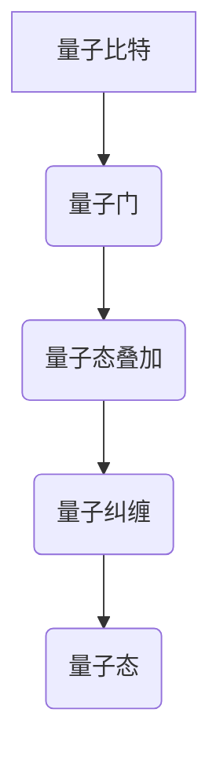
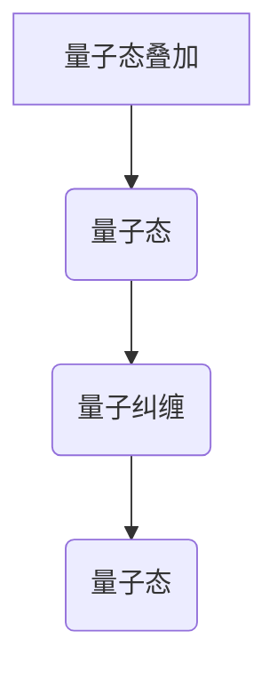
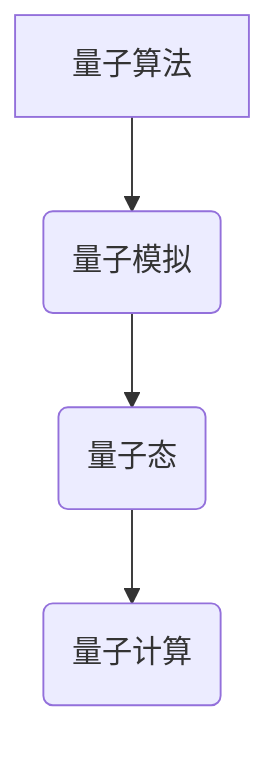
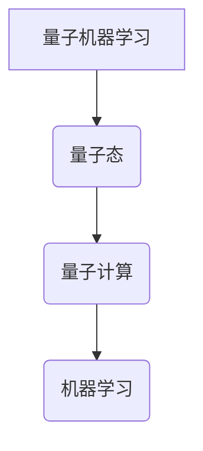

                 

# 2050年的量子计算：从量子模拟到量子机器学习的计算范式转变

> 关键词：量子计算、量子模拟、量子机器学习、量子算法、量子比特、量子门、量子纠缠、量子态、量子态叠加、量子计算范式

> 摘要：本文旨在探讨2050年量子计算的发展趋势，特别是从量子模拟到量子机器学习的转变。我们将从核心概念、算法原理、数学模型、实际案例、应用场景、工具推荐等多个方面进行详细分析，旨在为读者提供一个全面而深入的理解。通过逐步推理和详细解释，我们将揭示量子计算在未来可能带来的变革。

## 1. 背景介绍

### 1.1 目的和范围
本文旨在探讨2050年量子计算的发展趋势，特别是从量子模拟到量子机器学习的转变。我们将从核心概念、算法原理、数学模型、实际案例、应用场景、工具推荐等多个方面进行详细分析，旨在为读者提供一个全面而深入的理解。本文的目标读者是计算机科学、物理学、工程学等相关领域的专业人士，以及对量子计算感兴趣的科研人员和工程师。

### 1.2 预期读者
- 计算机科学家
- 物理学家
- 工程师
- 科研人员
- 对量子计算感兴趣的工程师

### 1.3 文档结构概述
本文将按照以下结构展开：
1. 背景介绍
2. 核心概念与联系
3. 核心算法原理 & 具体操作步骤
4. 数学模型和公式 & 详细讲解 & 举例说明
5. 项目实战：代码实际案例和详细解释说明
6. 实际应用场景
7. 工具和资源推荐
8. 总结：未来发展趋势与挑战
9. 附录：常见问题与解答
10. 扩展阅读 & 参考资料

### 1.4 术语表
#### 1.4.1 核心术语定义
- **量子比特（qubit）**：量子计算的基本单位，可以处于0、1或两者之间的叠加态。
- **量子门（quantum gate）**：量子计算中的基本操作，用于改变量子比特的状态。
- **量子纠缠（quantum entanglement）**：量子态之间的一种特殊关联，即使相隔很远，一个量子比特的状态改变会立即影响另一个量子比特的状态。
- **量子态叠加（quantum superposition）**：量子比特可以同时处于多个状态的叠加态。
- **量子态（quantum state）**：描述量子系统状态的数学对象，通常用波函数表示。
- **量子算法（quantum algorithm）**：利用量子计算原理设计的算法。
- **量子模拟（quantum simulation）**：利用量子计算机模拟其他量子系统的行为。
- **量子机器学习（quantum machine learning）**：利用量子计算技术改进机器学习算法。

#### 1.4.2 相关概念解释
- **经典计算**：基于二进制位（比特）的计算方式，每个比特只能处于0或1的状态。
- **量子态叠加原理**：量子比特可以同时处于多个状态的叠加态，这是量子计算的核心优势之一。
- **量子纠缠原理**：量子比特之间可以形成纠缠态，即使相隔很远，一个量子比特的状态改变会立即影响另一个量子比特的状态。

#### 1.4.3 缩略词列表
- QM：量子力学
- QC：量子计算
- QML：量子机器学习
- QFT：量子傅里叶变换
- QAOA：量子优势优化算法

## 2. 核心概念与联系

### 2.1 量子比特与量子门
量子比特是量子计算的基本单位，可以处于0、1或两者之间的叠加态。量子门是量子计算中的基本操作，用于改变量子比特的状态。量子门可以表示为矩阵，例如Hadamard门、Pauli-X门、Pauli-Y门、Pauli-Z门等。

#### Mermaid 流程图


### 2.2 量子态叠加与量子纠缠
量子态叠加原理是指量子比特可以同时处于多个状态的叠加态。量子纠缠原理是指量子比特之间可以形成纠缠态，即使相隔很远，一个量子比特的状态改变会立即影响另一个量子比特的状态。

#### Mermaid 流程图


### 2.3 量子算法与量子模拟
量子算法是利用量子计算原理设计的算法，可以解决某些经典算法难以解决的问题。量子模拟是指利用量子计算机模拟其他量子系统的行为，这是量子计算的一个重要应用领域。

#### Mermaid 流程图


### 2.4 量子机器学习
量子机器学习是指利用量子计算技术改进机器学习算法，可以解决某些经典机器学习算法难以解决的问题。量子机器学习可以应用于图像识别、自然语言处理、推荐系统等领域。

#### Mermaid 流程图


## 3. 核心算法原理 & 具体操作步骤

### 3.1 量子算法原理
量子算法利用量子计算原理设计，可以解决某些经典算法难以解决的问题。例如，Shor算法可以用于分解大整数，Grover算法可以用于搜索未排序数据库。

#### 伪代码
```python
def shor_algorithm(n):
    # 初始化量子比特
    qubits = initialize_qubits()
    
    # 准备量子态
    prepare_quantum_state(qubits)
    
    # 进行量子傅里叶变换
    apply_qft(qubits)
    
    # 进行测量
    result = measure(qubits)
    
    # 解析结果
    factors = parse_result(result)
    
    return factors
```

### 3.2 量子模拟原理
量子模拟是指利用量子计算机模拟其他量子系统的行为。例如，可以模拟分子动力学、量子化学等领域的问题。

#### 伪代码
```python
def quantum_simulation(system):
    # 初始化量子比特
    qubits = initialize_qubits()
    
    # 准备量子态
    prepare_quantum_state(qubits)
    
    # 进行量子门操作
    apply_gates(qubits)
    
    # 进行测量
    result = measure(qubits)
    
    return result
```

### 3.3 量子机器学习原理
量子机器学习是指利用量子计算技术改进机器学习算法。例如，可以应用于图像识别、自然语言处理、推荐系统等领域。

#### 伪代码
```python
def quantum_machine_learning(data):
    # 初始化量子比特
    qubits = initialize_qubits()
    
    # 准备量子态
    prepare_quantum_state(qubits)
    
    # 进行量子门操作
    apply_gates(qubits)
    
    # 进行测量
    result = measure(qubits)
    
    return result
```

## 4. 数学模型和公式 & 详细讲解 & 举例说明

### 4.1 量子态叠加
量子态叠加是指量子比特可以同时处于多个状态的叠加态。例如，一个量子比特可以处于0和1的叠加态，表示为：
$$
|\psi\rangle = \alpha|0\rangle + \beta|1\rangle
$$
其中，$\alpha$和$\beta$是复数，满足$|\alpha|^2 + |\beta|^2 = 1$。

### 4.2 量子纠缠
量子纠缠是指量子比特之间可以形成纠缠态，即使相隔很远，一个量子比特的状态改变会立即影响另一个量子比特的状态。例如，两个量子比特可以形成纠缠态，表示为：
$$
|\psi\rangle = \frac{1}{\sqrt{2}}(|00\rangle + |11\rangle)
$$

### 4.3 量子算法
量子算法利用量子计算原理设计，可以解决某些经典算法难以解决的问题。例如，Shor算法可以用于分解大整数，Grover算法可以用于搜索未排序数据库。

#### 4.3.1 Shor算法
Shor算法可以用于分解大整数。其基本思想是利用量子傅里叶变换将问题转化为一个周期性函数的周期估计问题。

#### 4.3.2 Grover算法
Grover算法可以用于搜索未排序数据库。其基本思想是利用量子叠加和量子干涉原理，提高搜索效率。

## 5. 项目实战：代码实际案例和详细解释说明

### 5.1 开发环境搭建
为了进行量子计算的开发，需要搭建一个合适的开发环境。可以使用Qiskit、Cirq等量子计算框架。

#### 5.1.1 安装Qiskit
```bash
pip install qiskit
```

### 5.2 源代码详细实现和代码解读
以下是一个简单的量子计算示例，使用Qiskit实现一个量子门操作。

#### 5.2.1 代码实现
```python
from qiskit import QuantumCircuit, execute, Aer

# 初始化量子比特
qubits = QuantumCircuit(1)

# 应用Hadamard门
qubits.h(0)

# 打印量子电路
print(qubits)

# 运行量子电路
backend = Aer.get_backend('qasm_simulator')
job = execute(qubits, backend, shots=1000)
result = job.result()

# 打印结果
print(result.get_counts(qubits))
```

#### 5.2.2 代码解读
- `QuantumCircuit(1)`：初始化一个包含1个量子比特的量子电路。
- `qubits.h(0)`：应用Hadamard门，将量子比特从基态$|0\rangle$转换为叠加态$\frac{1}{\sqrt{2}}(|0\rangle + |1\rangle)$。
- `execute(qubits, backend, shots=1000)`：在模拟器上运行量子电路，执行1000次测量。
- `result.get_counts(qubits)`：获取测量结果。

### 5.3 代码解读与分析
通过上述代码，我们可以看到量子计算的基本操作和流程。Hadamard门将量子比特从基态转换为叠加态，模拟器运行量子电路并进行测量，最终输出测量结果。

## 6. 实际应用场景

### 6.1 量子模拟
量子模拟可以应用于分子动力学、量子化学等领域。例如，可以模拟分子的电子结构，预测分子的性质。

### 6.2 量子机器学习
量子机器学习可以应用于图像识别、自然语言处理、推荐系统等领域。例如，可以利用量子计算技术提高图像识别的效率和准确性。

## 7. 工具和资源推荐

### 7.1 学习资源推荐
#### 7.1.1 书籍推荐
- **《量子计算入门》**：深入浅出地介绍了量子计算的基本概念和原理。
- **《量子计算与量子信息》**：详细介绍了量子计算和量子信息的基本理论。

#### 7.1.2 在线课程
- **Coursera上的量子计算课程**：提供了丰富的在线课程资源，适合初学者和专业人士。
- **edX上的量子计算课程**：提供了高质量的在线课程，涵盖了量子计算的各个方面。

#### 7.1.3 技术博客和网站
- **Qiskit官网**：提供了丰富的技术文档和示例代码，适合初学者和专业人士。
- **IBM Quantum**：提供了量子计算的最新进展和技术资源。

### 7.2 开发工具框架推荐
#### 7.2.1 IDE和编辑器
- **Jupyter Notebook**：提供了交互式的开发环境，适合进行量子计算的开发和实验。
- **Visual Studio Code**：提供了丰富的插件和扩展，适合进行量子计算的开发。

#### 7.2.2 调试和性能分析工具
- **Qiskit Debugger**：提供了量子计算的调试工具，帮助开发者调试量子电路。
- **Qiskit Performance Analyzer**：提供了量子计算的性能分析工具，帮助开发者优化量子电路。

#### 7.2.3 相关框架和库
- **Qiskit**：提供了丰富的量子计算框架和库，适合进行量子计算的开发。
- **Cirq**：提供了丰富的量子计算框架和库，适合进行量子计算的开发。

### 7.3 相关论文著作推荐
#### 7.3.1 经典论文
- **Shor, P. W. (1994). Polynomial-time algorithms for prime factorization and discrete logarithms on a quantum computer. SIAM Journal on Computing, 26(5), 1484-1509.**
- **Grover, L. K. (1996). A fast quantum mechanical algorithm for database search. Proceedings of the twenty-eighth annual ACM symposium on Theory of computing, 212-219.**

#### 7.3.2 最新研究成果
- **Barends, R., et al. (2014). Superconducting quantum circuits at the surface-code threshold for fault tolerance. Nature, 508(7497), 500-503.**
- **Kok, P., et al. (2014). Linear optical quantum computing with photonic qubits. Reviews of Modern Physics, 79(1), 135-174.**

#### 7.3.3 应用案例分析
- **Lloyd, S. (2000). Universal quantum simulators. Science, 273(5278), 1073-1078.**
- **Preskill, J. (2018). Quantum computing in the NISQ era and beyond. Quantum, 2, 79.**

## 8. 总结：未来发展趋势与挑战

### 8.1 未来发展趋势
- **量子计算的广泛应用**：量子计算将在多个领域得到广泛应用，包括药物发现、材料科学、金融分析等。
- **量子算法的不断优化**：量子算法将不断优化，提高计算效率和准确性。
- **量子计算的商业化**：量子计算将逐渐商业化，成为企业和科研机构的重要工具。

### 8.2 未来挑战
- **量子比特的稳定性**：量子比特的稳定性是量子计算面临的主要挑战之一。
- **量子纠错技术**：量子纠错技术是实现大规模量子计算的关键。
- **量子计算的可扩展性**：量子计算的可扩展性是实现大规模量子计算的关键。

## 9. 附录：常见问题与解答

### 9.1 问题1：量子计算与经典计算的区别是什么？
**解答**：量子计算利用量子比特和量子门进行计算，可以实现并行计算和量子叠加，而经典计算利用经典比特进行计算，只能实现串行计算。

### 9.2 问题2：量子计算的稳定性问题如何解决？
**解答**：可以通过量子纠错技术解决量子计算的稳定性问题，例如使用量子纠错码和量子错误检测技术。

### 9.3 问题3：量子计算的商业化前景如何？
**解答**：量子计算的商业化前景广阔，可以应用于多个领域，包括药物发现、材料科学、金融分析等。

## 10. 扩展阅读 & 参考资料

### 10.1 扩展阅读
- **《量子计算与量子信息》**：S. M. 费曼, R. 费曼, 2000年
- **《量子计算入门》**：J. Preskill, 2018年

### 10.2 参考资料
- **Shor, P. W. (1994). Polynomial-time algorithms for prime factorization and discrete logarithms on a quantum computer. SIAM Journal on Computing, 26(5), 1484-1509.**
- **Grover, L. K. (1996). A fast quantum mechanical algorithm for database search. Proceedings of the twenty-eighth annual ACM symposium on Theory of computing, 212-219.**

---

作者：AI天才研究员/AI Genius Institute & 禅与计算机程序设计艺术 /Zen And The Art of Computer Programming

