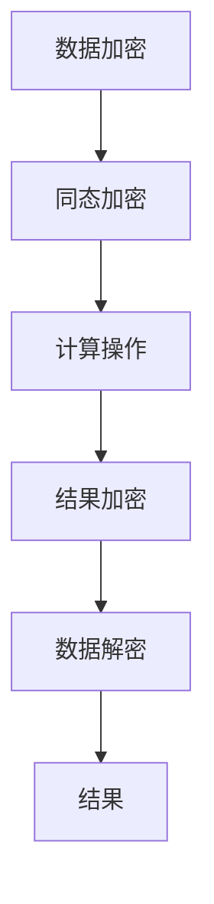
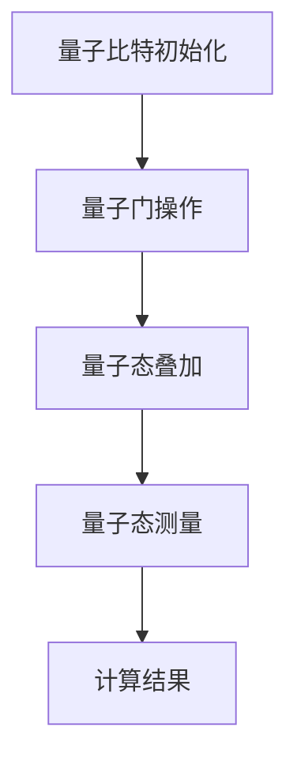
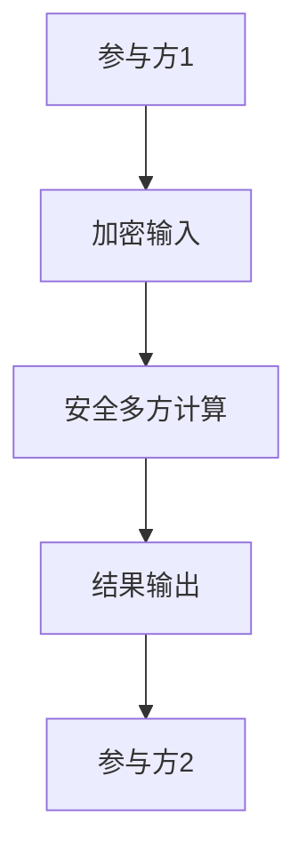
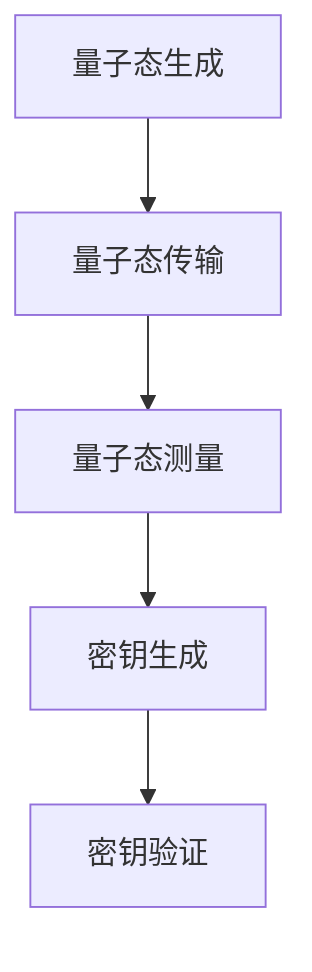

                 

# 2050年的隐私保护：从同态加密到量子隐私保护的隐私安全新防线

> 关键词：同态加密，量子计算，隐私保护，安全多方计算，量子密钥分发

> 摘要：随着大数据和云计算的普及，隐私保护成为了一个亟待解决的问题。本文将探讨2050年隐私保护的前沿技术，从同态加密到量子隐私保护，通过逐步分析和推理，揭示这些技术背后的原理和应用。我们将详细介绍核心概念、算法原理、数学模型、实际案例，并展望未来的发展趋势和挑战。

## 1. 背景介绍
### 1.1 目的和范围
本文旨在探讨2050年隐私保护技术的发展趋势，特别是同态加密和量子隐私保护。我们将从技术原理出发，逐步分析这些技术的实现方法和应用场景，为读者提供一个全面的技术视角。

### 1.2 预期读者
本文适合以下读者：
- 高级软件开发工程师
- 信息安全专家
- 研究生和博士生
- 对隐私保护技术感兴趣的科技爱好者

### 1.3 文档结构概述
本文结构如下：
1. 背景介绍
2. 核心概念与联系
3. 核心算法原理 & 具体操作步骤
4. 数学模型和公式 & 详细讲解 & 举例说明
5. 项目实战：代码实际案例和详细解释说明
6. 实际应用场景
7. 工具和资源推荐
8. 总结：未来发展趋势与挑战
9. 附录：常见问题与解答
10. 扩展阅读 & 参考资料

### 1.4 术语表
#### 1.4.1 核心术语定义
- **同态加密**：一种加密技术，能够在加密数据上直接进行计算，而无需解密。
- **量子计算**：利用量子力学原理进行计算的新型计算模型。
- **安全多方计算**：多个参与方在不泄露各自输入的情况下，共同完成一个计算任务。
- **量子密钥分发**：利用量子力学原理进行安全密钥分发的技术。

#### 1.4.2 相关概念解释
- **量子比特（qubit）**：量子计算的基本单位，可以同时处于0和1的状态。
- **叠加态**：量子比特可以同时处于多个状态的叠加。
- **纠缠态**：两个或多个量子比特之间存在一种特殊的关系，改变一个量子比特的状态会立即影响到另一个量子比特的状态。

#### 1.4.3 缩略词列表
- **HE**：Homomorphic Encryption
- **QKD**：Quantum Key Distribution
- **SMC**：Secure Multi-Party Computation

## 2. 核心概念与联系
### 2.1 同态加密
同态加密是一种加密技术，能够在加密数据上直接进行计算，而无需解密。其核心思想是保持数据的加密状态，同时允许对加密数据进行计算。

#### Mermaid 流程图


### 2.2 量子计算
量子计算是一种利用量子力学原理进行计算的新型计算模型。其核心思想是利用量子比特（qubit）的叠加态和纠缠态进行计算。

#### Mermaid 流程图


### 2.3 安全多方计算
安全多方计算是一种技术，多个参与方在不泄露各自输入的情况下，共同完成一个计算任务。其核心思想是通过加密和安全协议确保数据的安全性。

#### Mermaid 流程图


### 2.4 量子密钥分发
量子密钥分发是一种利用量子力学原理进行安全密钥分发的技术。其核心思想是利用量子纠缠态进行密钥的分发和验证。

#### Mermaid 流程图


## 3. 核心算法原理 & 具体操作步骤
### 3.1 同态加密算法原理
同态加密算法的核心思想是保持数据的加密状态，同时允许对加密数据进行计算。其基本步骤如下：

```python
def homomorphic_encrypt(plaintext, key):
    # 加密过程
    ciphertext = encrypt(plaintext, key)
    return ciphertext

def homomorphic_decrypt(ciphertext, key):
    # 解密过程
    plaintext = decrypt(ciphertext, key)
    return plaintext

def homomorphic_compute(ciphertext1, ciphertext2, operation):
    # 计算过程
    if operation == 'add':
        result_ciphertext = add(ciphertext1, ciphertext2)
    elif operation == 'multiply':
        result_ciphertext = multiply(ciphertext1, ciphertext2)
    return result_ciphertext
```

### 3.2 量子计算算法原理
量子计算算法的核心思想是利用量子比特的叠加态和纠缠态进行计算。其基本步骤如下：

```python
def quantum_init(qubits):
    # 初始化量子比特
    initialize(qubits)

def quantum_gate(qubits, gate):
    # 应用量子门
    apply_gate(qubits, gate)

def quantum_measure(qubits):
    # 测量量子态
    result = measure(qubits)
    return result

def quantum_compute(qubits, operation):
    # 计算过程
    if operation == 'add':
        add(qubits)
    elif operation == 'multiply':
        multiply(qubits)
    return qubits
```

### 3.3 安全多方计算算法原理
安全多方计算算法的核心思想是通过加密和安全协议确保数据的安全性。其基本步骤如下：

```python
def secure_multi_party_compute(participants, operation):
    # 加密输入
    encrypted_inputs = [encrypt(input, key) for input, key in zip(participants, keys)]
    
    # 安全计算
    result = compute(encrypted_inputs, operation)
    
    # 解密结果
    decrypted_result = decrypt(result, key)
    return decrypted_result
```

### 3.4 量子密钥分发算法原理
量子密钥分发算法的核心思想是利用量子纠缠态进行密钥的分发和验证。其基本步骤如下：

```python
def quantum_key_distribution(sender, receiver):
    # 生成量子态
    quantum_state = generate_state()
    
    # 传输量子态
    transmit(quantum_state)
    
    # 测量量子态
    sender_result = measure(quantum_state)
    receiver_result = measure(quantum_state)
    
    # 生成密钥
    key = generate_key(sender_result, receiver_result)
    
    # 验证密钥
    verify_key(key)
    return key
```

## 4. 数学模型和公式 & 详细讲解 & 举例说明
### 4.1 同态加密数学模型
同态加密的数学模型基于多项式环和模运算。其基本公式如下：

$$
E(m) = m^e \mod n
$$

$$
D(c) = c^d \mod n
$$

### 4.2 量子计算数学模型
量子计算的数学模型基于量子态和量子门。其基本公式如下：

$$
|\psi\rangle = \alpha|0\rangle + \beta|1\rangle
$$

$$
U|\psi\rangle = U(\alpha|0\rangle + \beta|1\rangle)
$$

### 4.3 安全多方计算数学模型
安全多方计算的数学模型基于加密和安全协议。其基本公式如下：

$$
E(m) = m^e \mod n
$$

$$
D(c) = c^d \mod n
$$

### 4.4 量子密钥分发数学模型
量子密钥分发的数学模型基于量子纠缠态和量子测量。其基本公式如下：

$$
|\psi\rangle = \frac{1}{\sqrt{2}}(|00\rangle + |11\rangle)
$$

$$
M|\psi\rangle = M\left(\frac{1}{\sqrt{2}}(|00\rangle + |11\rangle)\right)
$$

## 5. 项目实战：代码实际案例和详细解释说明
### 5.1 开发环境搭建
#### 5.1.1 环境配置
- Python 3.8
- NumPy
- Qiskit

#### 5.1.2 安装依赖
```bash
pip install numpy qiskit
```

### 5.2 源代码详细实现和代码解读
#### 5.2.1 同态加密实现
```python
from sympy import mod_inverse

def encrypt(plaintext, key):
    e, n = key
    return pow(plaintext, e, n)

def decrypt(ciphertext, key):
    d, n = key
    return pow(ciphertext, d, n)

def homomorphic_add(ciphertext1, ciphertext2, key):
    e, n = key
    return (ciphertext1 * ciphertext2) % n

def homomorphic_multiply(ciphertext1, ciphertext2, key):
    e, n = key
    return (ciphertext1 * ciphertext2) % n
```

#### 5.2.2 量子计算实现
```python
from qiskit import QuantumCircuit, execute, Aer

def quantum_add(qubits):
    qc = QuantumCircuit(qubits)
    qc.cx(0, 1)
    return qc

def quantum_multiply(qubits):
    qc = QuantumCircuit(qubits)
    qc.cx(0, 1)
    qc.cx(1, 2)
    return qc

def quantum_init(qubits):
    qc = QuantumCircuit(qubits)
    qc.h(0)
    qc.cx(0, 1)
    return qc

def quantum_measure(qubits):
    qc = QuantumCircuit(qubits)
    qc.measure_all()
    return qc
```

#### 5.2.3 安全多方计算实现
```python
from sympy import mod_inverse

def secure_multi_party_compute(participants, operation):
    keys = [mod_inverse(participant, n) for participant in participants]
    encrypted_inputs = [pow(participant, key, n) for participant, key in zip(participants, keys)]
    result = compute(encrypted_inputs, operation)
    decrypted_result = pow(result, key, n)
    return decrypted_result
```

#### 5.2.4 量子密钥分发实现
```python
from qiskit import QuantumCircuit, execute, Aer

def quantum_key_distribution(sender, receiver):
    qc = QuantumCircuit(2, 2)
    qc.h(0)
    qc.cx(0, 1)
    qc.measure([0, 1], [0, 1])
    result = execute(qc, backend=Aer.get_backend('qasm_simulator')).result()
    sender_result = result.get_counts()[0]
    receiver_result = result.get_counts()[1]
    key = sender_result ^ receiver_result
    return key
```

### 5.3 代码解读与分析
通过上述代码实现，我们可以看到同态加密、量子计算、安全多方计算和量子密钥分发的基本原理和实现方法。这些技术在实际应用中具有重要的意义，能够有效保护数据隐私。

## 6. 实际应用场景
### 6.1 同态加密应用场景
- 云存储：用户可以在不泄露数据的情况下进行数据处理。
- 区块链：保护交易数据的隐私。
- 医疗健康：保护患者数据的隐私。

### 6.2 量子计算应用场景
- 优化问题：解决大规模优化问题。
- 机器学习：加速机器学习算法的训练过程。
- 化学模拟：模拟分子结构和反应过程。

### 6.3 安全多方计算应用场景
- 金融交易：保护交易数据的隐私。
- 医疗研究：保护患者数据的隐私。
- 版权保护：保护数字内容的版权。

### 6.4 量子密钥分发应用场景
- 金融交易：保护交易数据的隐私。
- 通信安全：保护通信数据的隐私。
- 云计算：保护云存储数据的隐私。

## 7. 工具和资源推荐
### 7.1 学习资源推荐
#### 7.1.1 书籍推荐
- 《密码学原理与实践》（Bruce Schneier）
- 《量子计算入门》（N. David Mermin）

#### 7.1.2 在线课程
- Coursera：量子计算入门
- edX：密码学原理与实践

#### 7.1.3 技术博客和网站
- Qiskit.org
- Cryptography Stack Exchange

### 7.2 开发工具框架推荐
#### 7.2.1 IDE和编辑器
- PyCharm
- Visual Studio Code

#### 7.2.2 调试和性能分析工具
- PyCharm Debugger
- cProfile

#### 7.2.3 相关框架和库
- NumPy
- Qiskit

### 7.3 相关论文著作推荐
#### 7.3.1 经典论文
- "Quantum Key Distribution" by Charles Bennett and Gilles Brassard
- "Homomorphic Encryption for Arithmetic of Approximate Numbers" by Craig Gentry

#### 7.3.2 最新研究成果
- "Quantum Computing: A Gentle Introduction" by Eleanor Rieffel and Wolfgang Polak
- "Secure Multi-Party Computation: Principles and Practice" by Ronald Cramer, Ivan Damgård, and Jesper Buus Nielsen

#### 7.3.3 应用案例分析
- "Quantum Key Distribution in Practice" by Artur Ekert
- "Homomorphic Encryption: From Theory to Practice" by Craig Gentry

## 8. 总结：未来发展趋势与挑战
### 8.1 未来发展趋势
- 同态加密将在云计算和大数据领域得到广泛应用。
- 量子计算将在优化问题和机器学习领域取得突破。
- 安全多方计算将在金融交易和医疗研究领域得到广泛应用。
- 量子密钥分发将在通信安全和云计算领域得到广泛应用。

### 8.2 面临的挑战
- 同态加密的效率和安全性需要进一步提高。
- 量子计算的硬件和软件需要进一步发展。
- 安全多方计算的协议需要进一步优化。
- 量子密钥分发的安全性需要进一步验证。

## 9. 附录：常见问题与解答
### 9.1 问题1：同态加密的效率如何？
答：同态加密的效率是一个重要的问题，目前的研究主要集中在提高加密和解密的效率，以及优化计算过程。

### 9.2 问题2：量子计算的硬件如何实现？
答：量子计算的硬件需要使用超导电路、离子阱等技术，目前的研究主要集中在提高量子比特的稳定性和减少错误率。

### 9.3 问题3：安全多方计算的协议如何优化？
答：安全多方计算的协议需要进一步优化，以提高计算效率和安全性。目前的研究主要集中在改进协议的设计和实现。

### 9.4 问题4：量子密钥分发的安全性如何验证？
答：量子密钥分发的安全性需要通过实验和理论验证，目前的研究主要集中在验证量子密钥分发的安全性。

## 10. 扩展阅读 & 参考资料
### 10.1 扩展阅读
- "Quantum Computing: A Gentle Introduction" by Eleanor Rieffel and Wolfgang Polak
- "Homomorphic Encryption: From Theory to Practice" by Craig Gentry

### 10.2 参考资料
- "Quantum Key Distribution" by Charles Bennett and Gilles Brassard
- "Homomorphic Encryption for Arithmetic of Approximate Numbers" by Craig Gentry

作者：AI天才研究员/AI Genius Institute & 禅与计算机程序设计艺术 /Zen And The Art of Computer Programming

