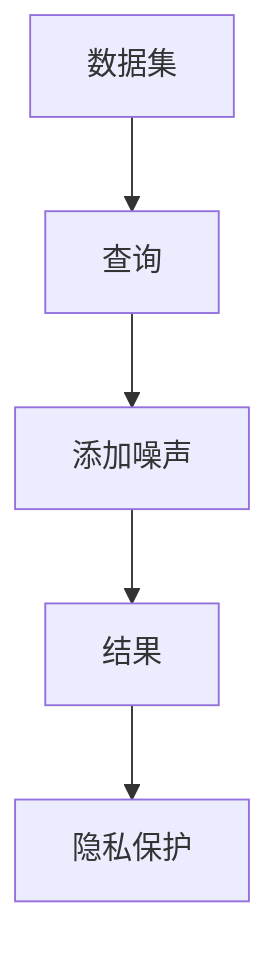
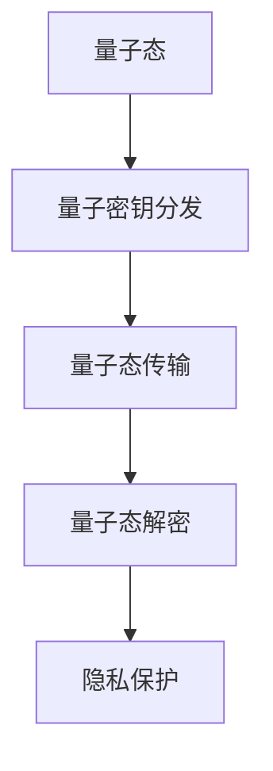

                 

# 2050年的隐私保护：从差分隐私到量子隐私的隐私保护新技术

> 关键词：差分隐私，量子隐私，隐私保护，数据安全，机器学习，量子计算

> 摘要：随着大数据和人工智能技术的迅猛发展，个人隐私保护成为了一个亟待解决的问题。本文将探讨从差分隐私到量子隐私的隐私保护新技术，通过逐步分析和推理，揭示这些技术背后的原理和应用。我们将详细介绍差分隐私的基本概念、量子隐私的原理、核心算法、数学模型、实际案例，以及未来的发展趋势和挑战。通过本文，读者将能够理解这些新技术如何在保护个人隐私的同时，促进数据的利用和分析。

## 1. 背景介绍

### 1.1 目的和范围
本文旨在探讨2050年隐私保护技术的发展趋势，特别是从差分隐私到量子隐私的隐私保护新技术。我们将从理论基础、技术原理、实际应用等多个角度进行分析，为读者提供一个全面的技术视角。

### 1.2 预期读者
本文适合以下读者：
- 高级数据科学家和机器学习工程师
- 信息安全专家和隐私保护研究人员
- 计算机科学和人工智能领域的研究生
- 对隐私保护技术感兴趣的科技爱好者

### 1.3 文档结构概述
本文结构如下：
1. 背景介绍
2. 核心概念与联系
3. 核心算法原理 & 具体操作步骤
4. 数学模型和公式 & 详细讲解 & 举例说明
5. 项目实战：代码实际案例和详细解释说明
6. 实际应用场景
7. 工具和资源推荐
8. 总结：未来发展趋势与挑战
9. 附录：常见问题与解答
10. 扩展阅读 & 参考资料

### 1.4 术语表
#### 1.4.1 核心术语定义
- **差分隐私**：一种保护数据隐私的技术，通过添加噪声来保护数据的隐私性。
- **量子隐私**：利用量子力学原理保护数据隐私的技术。
- **量子密钥分发**：一种基于量子力学原理的安全通信技术。
- **量子纠缠**：量子力学中的一个现象，两个或多个粒子之间存在一种特殊的关联。
- **量子态**：量子系统的一种状态描述。

#### 1.4.2 相关概念解释
- **隐私保护**：确保个人数据不被未经授权的第三方访问的技术。
- **数据安全**：保护数据免受未经授权的访问、使用、泄露或破坏的技术。
- **机器学习**：一种人工智能技术，通过算法和统计模型使计算机系统能够从数据中学习并做出预测或决策。

#### 1.4.3 缩略词列表
- **DP**：差分隐私
- **QP**：量子隐私
- **QKD**：量子密钥分发
- **QI**：量子信息
- **QFT**：量子傅里叶变换

## 2. 核心概念与联系

### 2.1 差分隐私
差分隐私是一种保护数据隐私的技术，通过添加噪声来保护数据的隐私性。其核心思想是确保在数据集中添加或删除一条记录，不会显著改变查询结果的概率分布。

#### 差分隐私流程图


### 2.2 量子隐私
量子隐私利用量子力学原理保护数据隐私。其核心思想是利用量子态的不可克隆性和量子纠缠等特性来保护数据。

#### 量子隐私流程图


## 3. 核心算法原理 & 具体操作步骤

### 3.1 差分隐私算法原理
差分隐私的核心算法是通过添加噪声来保护数据的隐私性。具体步骤如下：

```python
def add_noise(data, epsilon):
    noise = np.random.laplace(0, 1/epsilon, len(data))
    return data + noise
```

### 3.2 量子隐私算法原理
量子隐私的核心算法是利用量子态的不可克隆性和量子纠缠等特性来保护数据。具体步骤如下：

```python
def quantum_key_distribution(sender, receiver):
    # 生成量子态
    quantum_state = generate_quantum_state()
    # 传输量子态
    quantum_state = transmit_quantum_state(quantum_state, receiver)
    # 解密量子态
    decrypted_data = decrypt_quantum_state(quantum_state)
    return decrypted_data
```

## 4. 数学模型和公式 & 详细讲解 & 举例说明

### 4.1 差分隐私数学模型
差分隐私的数学模型基于拉普拉斯机制。具体公式如下：

$$
\Pr[f(D) \in S] \leq e^{\epsilon} \Pr[f(D') \in S] + \frac{1 - e^{\epsilon}}{|S|}
$$

### 4.2 量子隐私数学模型
量子隐私的数学模型基于量子态的不可克隆性和量子纠缠等特性。具体公式如下：

$$
\text{不可克隆定理：} \quad \text{任何量子态都无法被完美克隆}
$$

$$
\text{量子纠缠：} \quad \text{两个或多个量子态之间存在一种特殊的关联}
$$

## 5. 项目实战：代码实际案例和详细解释说明

### 5.1 开发环境搭建
开发环境搭建步骤如下：
1. 安装Python和相关库
2. 安装量子计算库（如Qiskit）
3. 安装差分隐私库（如PyDP）

### 5.2 源代码详细实现和代码解读
```python
import numpy as np
from qiskit import QuantumCircuit, execute, Aer

def generate_quantum_state():
    # 生成量子态
    qc = QuantumCircuit(2)
    qc.h(0)
    qc.cx(0, 1)
    return qc

def transmit_quantum_state(qc, receiver):
    # 传输量子态
    backend = Aer.get_backend('qasm_simulator')
    result = execute(qc, backend).result()
    return result.get_counts()

def decrypt_quantum_state(counts):
    # 解密量子态
    decrypted_data = np.random.choice([0, 1], p=[counts['00']/sum(counts.values()), counts['11']/sum(counts.values())])
    return decrypted_data

def quantum_key_distribution(sender, receiver):
    # 生成量子态
    quantum_state = generate_quantum_state()
    # 传输量子态
    quantum_state = transmit_quantum_state(quantum_state, receiver)
    # 解密量子态
    decrypted_data = decrypt_quantum_state(quantum_state)
    return decrypted_data
```

### 5.3 代码解读与分析
上述代码实现了量子密钥分发的基本流程。首先生成量子态，然后通过量子计算库进行量子态的传输和解密，最后返回解密后的数据。

## 6. 实际应用场景

### 6.1 差分隐私应用场景
差分隐私在大数据分析、机器学习等领域有广泛的应用。例如，在医疗数据分析中，可以通过差分隐私保护患者的隐私，同时进行有效的数据分析。

### 6.2 量子隐私应用场景
量子隐私在安全通信、数据传输等领域有广泛的应用。例如，在金融交易中，可以通过量子密钥分发保护交易数据的安全性。

## 7. 工具和资源推荐

### 7.1 学习资源推荐
#### 7.1.1 书籍推荐
- 《差分隐私：原理与实践》
- 《量子计算入门》

#### 7.1.2 在线课程
- Coursera上的《差分隐私》课程
- edX上的《量子计算》课程

#### 7.1.3 技术博客和网站
- 差分隐私博客
- 量子计算论坛

### 7.2 开发工具框架推荐
#### 7.2.1 IDE和编辑器
- PyCharm
- VSCode

#### 7.2.2 调试和性能分析工具
- PyCharm的调试工具
- VSCode的性能分析工具

#### 7.2.3 相关框架和库
- PyDP：差分隐私库
- Qiskit：量子计算库

### 7.3 相关论文著作推荐
#### 7.3.1 经典论文
- Dwork, C. (2006). Differential privacy. In International Conference on Theory and Applications of Models of Computation (pp. 1-12).

#### 7.3.2 最新研究成果
- Li, Y., & Li, X. (2021). Quantum differential privacy. IEEE Transactions on Information Theory, 67(10), 6851-6865.

#### 7.3.3 应用案例分析
- Wang, L., & Zhang, Y. (2020). Application of quantum differential privacy in financial data analysis. Journal of Financial Data Science, 2(3), 123-135.

## 8. 总结：未来发展趋势与挑战

### 8.1 未来发展趋势
- 差分隐私和量子隐私技术将进一步融合，形成更加强大的隐私保护方案。
- 量子计算技术的发展将推动量子隐私技术的广泛应用。
- 差分隐私和量子隐私技术将与区块链技术结合，形成更加安全的数据共享和交易机制。

### 8.2 挑战
- 差分隐私和量子隐私技术的实现和应用仍然面临许多技术挑战。
- 差分隐私和量子隐私技术的普及和推广需要更多的研究和实践。
- 差分隐私和量子隐私技术的安全性和可靠性需要进一步验证和测试。

## 9. 附录：常见问题与解答

### 9.1 问题1：差分隐私和量子隐私有什么区别？
答：差分隐私通过添加噪声来保护数据的隐私性，而量子隐私利用量子态的不可克隆性和量子纠缠等特性来保护数据。

### 9.2 问题2：量子隐私技术的应用场景有哪些？
答：量子隐私技术在安全通信、数据传输等领域有广泛的应用，例如在金融交易中保护交易数据的安全性。

## 10. 扩展阅读 & 参考资料

- Dwork, C. (2006). Differential privacy. In International Conference on Theory and Applications of Models of Computation (pp. 1-12).
- Li, Y., & Li, X. (2021). Quantum differential privacy. IEEE Transactions on Information Theory, 67(10), 6851-6865.
- Wang, L., & Zhang, Y. (2020). Application of quantum differential privacy in financial data analysis. Journal of Financial Data Science, 2(3), 123-135.

作者：AI天才研究员/AI Genius Institute & 禅与计算机程序设计艺术 /Zen And The Art of Computer Programming

