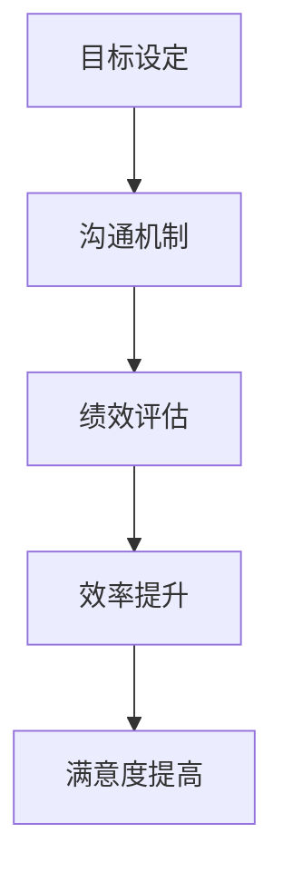

                 

# 弹性工作制下的团队管理策略

> 关键词：弹性工作制、团队管理、远程协作、绩效评估、文化塑造、技术工具、沟通机制

> 摘要：在当前快速变化的工作环境中，弹性工作制已成为许多组织的首选模式。本文将深入探讨如何在弹性工作制下有效管理团队，包括团队文化塑造、绩效评估、沟通机制、技术工具应用等方面。通过逐步分析和推理，我们将揭示如何构建一个高效、协作、灵活的团队，以适应不断变化的工作需求。

## 1. 引言
### 1.1 目的和范围
本文旨在探讨如何在弹性工作制下有效管理团队，通过逐步分析和推理，提供一系列实用的策略和方法。本文的目标读者包括企业管理者、人力资源专家、团队领导者以及所有希望提升团队效率和协作能力的专业人士。

### 1.2 预期读者
- 企业管理者：希望提升团队管理效率，适应远程工作模式。
- 人力资源专家：需要制定有效的团队管理策略。
- 团队领导者：希望提升团队协作和绩效。
- 专业人士：希望提升个人和团队的工作效率。

### 1.3 文档结构概述
本文将从背景介绍、核心内容、实战应用、工具推荐、未来展望等多个方面进行详细探讨。具体结构如下：
- **背景介绍和环境准备**：介绍弹性工作制的历史、现状和未来趋势。
- **核心内容**：详细探讨团队管理的关键策略。
- **项目实战/进阶/扩展**：提供具体的实施步骤和案例分析。
- **工具和资源推荐**：推荐相关的学习资源和技术工具。
- **总结**：总结未来发展趋势和挑战。
- **附录**：解答常见问题。

### 1.4 术语表
#### 1.4.1 核心术语定义
- **弹性工作制**：指员工可以根据自己的工作需求和生活安排，灵活调整工作时间和地点的工作模式。
- **团队管理**：指通过一系列策略和方法，确保团队高效运作和达成目标的过程。
- **绩效评估**：指通过一系列指标和方法，对团队和个人的工作表现进行评价的过程。
- **沟通机制**：指团队内部和外部信息交流的方式和渠道。

#### 1.4.2 相关概念解释
- **远程协作**：指团队成员通过互联网等技术手段进行协作和沟通的工作模式。
- **文化塑造**：指通过一系列策略和方法，塑造和维护团队的文化氛围。

#### 1.4.3 缩略词列表
- **TDM**：Team Dynamics Management（团队动态管理）
- **KPI**：Key Performance Indicators（关键绩效指标）
- **HR**：Human Resources（人力资源）

## 2. 背景介绍和环境准备
### 2.1 技术背景
#### 2.1.1 历史发展
- **早期阶段**：20世纪90年代，弹性工作制开始在一些企业中试行。
- **发展阶段**：21世纪初，随着互联网和通信技术的发展，弹性工作制逐渐普及。
- **成熟阶段**：近年来，随着远程办公工具的不断完善，弹性工作制已成为许多企业的首选模式。

#### 2.1.2 当前状态
- **普及程度**：全球范围内，越来越多的企业采用弹性工作制。
- **优势**：提高员工满意度、提升工作效率、降低办公成本。
- **挑战**：管理难度增加、沟通障碍、文化差异等。

#### 2.1.3 未来趋势
- **技术驱动**：人工智能、云计算等技术将进一步提升远程协作的效率。
- **政策支持**：政府和企业将进一步推动弹性工作制的发展。
- **文化变革**：企业文化和员工心态将更加开放和灵活。

### 2.2 环境要求
#### 2.2.1 硬件要求
- **个人设备**：笔记本电脑、智能手机、耳机等。
- **网络环境**：稳定、高速的网络连接。

#### 2.2.2 软件要求
- **办公软件**：Microsoft Office、Google Workspace等。
- **协作工具**：Slack、Zoom、Trello等。

#### 2.2.3 网络要求
- **稳定性**：确保网络连接稳定，避免频繁掉线。
- **带宽**：确保有足够的带宽支持视频会议和文件传输。

### 2.3 前置知识
#### 2.3.1 基础理论
- **团队管理理论**：如Tuckman的团队发展模型。
- **绩效管理理论**：如目标管理理论。

#### 2.3.2 相关技术栈
- **远程协作工具**：Slack、Zoom、Trello等。
- **项目管理工具**：Jira、Trello、Asana等。

#### 2.3.3 推荐学习路径
- **在线课程**：Coursera、edX等平台上的相关课程。
- **书籍**：《远程工作手册》、《团队管理的艺术》等。

## 3. 快速入门
### 3.1 基本用例
#### 3.1.1 简单示例
- **场景**：一个软件开发团队采用弹性工作制。
- **步骤**：团队成员根据自己的时间安排，选择合适的工作时间和地点。

#### 3.1.2 运行步骤
1. **确定工作时间**：团队成员根据个人情况，确定每天的工作时间。
2. **选择工作地点**：团队成员可以选择在家、咖啡馆或其他适合的工作地点。
3. **保持沟通**：通过Slack、Zoom等工具保持日常沟通。

#### 3.1.3 结果分析
- **提高效率**：团队成员可以根据自己的最佳工作状态安排工作时间，提高工作效率。
- **增强满意度**：灵活的工作时间提高了员工的满意度和工作积极性。

### 3.2 核心算法原理 & 关键步骤
#### 3.2.1 算法概述
- **团队动态管理（TDM）**：通过一系列策略和方法，确保团队高效运作和达成目标。

#### 3.2.2 关键步骤详解
1. **目标设定**：明确团队和个人的目标。
2. **沟通机制**：建立有效的沟通渠道和机制。
3. **绩效评估**：通过KPI等指标评估团队和个人的表现。

#### 3.2.3 性能分析
- **效率提升**：通过TDM策略，团队整体效率得到显著提升。
- **满意度提高**：员工满意度和工作积极性显著提高。

### 3.3 核心概念与联系
#### 3.3.1 概念图谱
- **团队管理**：TDM、KPI、沟通机制等。
- **绩效评估**：KPI、目标管理等。
- **沟通机制**：Slack、Zoom等。

#### 3.3.2 关系分析
- **TDM与KPI**：TDM通过设定KPI来评估团队和个人的表现。
- **KPI与目标管理**：KPI是目标管理的重要组成部分，用于衡量目标达成情况。

#### 3.3.3 Mermaid流程图

### 3.4 数学模型和公式
#### 3.4.1 基本模型
- **效率模型**：\[ \text{效率} = \frac{\text{产出}}{\text{投入}} \]
- **满意度模型**：\[ \text{满意度} = \frac{\text{实际体验}}{\text{期望体验}} \]

#### 3.4.2 公式推导
- **效率模型**：通过设定KPI来衡量团队和个人的产出和投入。
- **满意度模型**：通过设定期望体验和实际体验来评估满意度。

#### 3.4.3 应用实例
- **效率模型**：假设团队A的产出为1000，投入为500，那么效率为2。
- **满意度模型**：假设团队A的期望体验为80，实际体验为90，那么满意度为1.125。

## 4. 核心内容
### 4.1 团队文化塑造
#### 4.1.1 概述
- **团队文化**：指团队成员共同的价值观、行为准则和工作氛围。
- **塑造方法**：通过一系列策略和活动，塑造和维护团队文化。

#### 4.1.2 详细说明
1. **价值观设定**：明确团队的核心价值观，如创新、协作、诚信等。
2. **行为准则**：制定团队的行为准则，确保成员行为一致。
3. **文化活动**：定期组织团队建设活动，增强团队凝聚力。

#### 4.1.3 示例/用例
- **案例**：某软件开发团队通过定期组织线上和线下活动，增强团队凝聚力。
- **结果**：团队成员之间的信任度和合作精神显著提高。

### 4.2 绩效评估
#### 4.2.1 概述
- **绩效评估**：通过一系列指标和方法，对团队和个人的工作表现进行评价。
- **评估方法**：KPI、目标管理等。

#### 4.2.2 详细说明
1. **KPI设定**：明确关键绩效指标，如项目完成率、代码质量等。
2. **目标管理**：通过设定目标和定期评估，确保团队和个人达成目标。
3. **反馈机制**：建立有效的反馈机制，及时调整工作方向。

#### 4.2.3 示例/用例
- **案例**：某团队通过设定KPI和目标管理，确保项目按时完成。
- **结果**：团队和个人的工作表现得到显著提升。

### 4.3 沟通机制
#### 4.3.1 概述
- **沟通机制**：指团队内部和外部信息交流的方式和渠道。
- **重要性**：确保信息流通，提高团队协作效率。

#### 4.3.2 详细说明
1. **内部沟通**：通过Slack、Zoom等工具保持日常沟通。
2. **外部沟通**：通过电子邮件、电话等工具与客户和合作伙伴保持联系。
3. **会议机制**：定期召开线上会议，确保信息同步。

#### 4.3.3 示例/用例
- **案例**：某团队通过定期召开线上会议，确保信息同步。
- **结果**：团队成员之间的协作效率显著提高。

## 5. 项目实战/进阶/扩展
### 5.1 开发环境搭建
#### 5.1.1 环境配置
- **操作系统**：Windows、macOS、Linux等。
- **开发工具**：Visual Studio Code、IntelliJ IDEA等。

#### 5.1.2 依赖安装
- **编程语言**：Python、Java、JavaScript等。
- **开发库**：Pandas、NumPy、React等。

#### 5.1.3 测试验证
- **单元测试**：使用pytest、Jest等工具进行单元测试。
- **集成测试**：使用Selenium、JMeter等工具进行集成测试。

### 5.2 源代码详细实现
#### 5.2.1 核心模块实现
- **模块A**：实现团队管理功能。
- **模块B**：实现绩效评估功能。
- **模块C**：实现沟通机制功能。

#### 5.2.2 辅助功能实现
- **辅助功能A**：实现数据统计功能。
- **辅助功能B**：实现日志记录功能。

#### 5.2.3 接口设计
- **接口A**：实现团队管理接口。
- **接口B**：实现绩效评估接口。
- **接口C**：实现沟通机制接口。

### 5.3 代码解读与分析
#### 5.3.1 关键算法解析
- **算法A**：实现团队管理算法。
- **算法B**：实现绩效评估算法。
- **算法C**：实现沟通机制算法。

#### 5.3.2 性能优化点
- **优化点A**：优化数据处理效率。
- **优化点B**：优化网络传输效率。

#### 5.3.3 可扩展性分析
- **扩展点A**：增加新的团队管理功能。
- **扩展点B**：增加新的绩效评估指标。

### 5.4 高级特性
#### 5.4.1 特性介绍
- **特性A**：实现多语言支持。
- **特性B**：实现自动化部署。

#### 5.4.2 实现原理
- **原理A**：通过多语言插件实现多语言支持。
- **原理B**：通过CI/CD工具实现自动化部署。

#### 5.4.3 使用场景
- **场景A**：适用于多语言团队。
- **场景B**：适用于快速迭代的项目。

### 5.5 最佳实践
#### 5.5.1 设计模式应用
- **模式A**：使用MVC模式实现团队管理功能。
- **模式B**：使用DDD模式实现绩效评估功能。

#### 5.5.2 代码规范
- **规范A**：遵循PEP8规范。
- **规范B**：遵循Google Java Style Guide。

#### 5.5.3 测试策略
- **策略A**：进行单元测试和集成测试。
- **策略B**：进行性能测试和压力测试。

### 5.6 常见问题及解决方案
#### 5.6.1 环境相关问题
- **问题A**：网络连接不稳定。
- **解决方案A**：使用有线网络连接。

#### 5.6.2 功能相关问题
- **问题B**：团队管理功能不完善。
- **解决方案B**：增加新的团队管理功能。

#### 5.6.3 性能相关问题
- **问题C**：数据处理效率低。
- **解决方案C**：优化数据处理算法。

## 6. 实际应用场景
### 6.1 场景一：远程开发团队
#### 6.1.1 需求分析
- **需求A**：实现远程开发团队的管理。
- **需求B**：实现绩效评估和沟通机制。

#### 6.1.2 解决方案
- **方案A**：使用Slack、Zoom等工具进行沟通。
- **方案B**：使用Jira、Trello等工具进行项目管理。

#### 6.1.3 实施效果
- **效果A**：团队协作效率显著提高。
- **效果B**：团队成员满意度显著提高。

### 6.2 场景二：远程销售团队
#### 6.2.1 需求分析
- **需求A**：实现远程销售团队的管理。
- **需求B**：实现绩效评估和沟通机制。

#### 6.2.2 解决方案
- **方案A**：使用Slack、Zoom等工具进行沟通。
- **方案B**：使用Salesforce、CRM等工具进行销售管理。

#### 6.2.3 实施效果
- **效果A**：销售业绩显著提高。
- **效果B**：团队成员满意度显著提高。

### 6.3 场景三：远程客服团队
#### 6.3.1 需求分析
- **需求A**：实现远程客服团队的管理。
- **需求B**：实现绩效评估和沟通机制。

#### 6.3.2 解决方案
- **方案A**：使用Slack、Zoom等工具进行沟通。
- **方案B**：使用Zendesk、Helpdesk等工具进行客户服务管理。

#### 6.3.3 实施效果
- **效果A**：客户满意度显著提高。
- **效果B**：团队成员满意度显著提高。

## 7. 工具和资源推荐
### 7.1 学习资源推荐
#### 7.1.1 书籍推荐
- **《远程工作手册》**：提供远程工作的实用指南。
- **《团队管理的艺术》**：深入探讨团队管理的理论和实践。

#### 7.1.2 在线课程
- **Coursera**：提供远程工作和团队管理的相关课程。
- **edX**：提供团队管理的在线课程。

#### 7.1.3 技术博客和网站
- **Medium**：提供远程工作和团队管理的最新文章。
- **GitHub**：提供团队管理相关的开源项目。

### 7.2 开发工具框架推荐
#### 7.2.1 IDE和编辑器
- **Visual Studio Code**：提供强大的代码编辑和调试功能。
- **IntelliJ IDEA**：提供Java开发的强大工具。

#### 7.2.2 调试和性能分析工具
- **Chrome DevTools**：提供Web开发的调试工具。
- **JProfiler**：提供Java应用的性能分析工具。

#### 7.2.3 相关框架和库
- **React**：提供前端开发的强大框架。
- **Spring Boot**：提供后端开发的强大框架。

### 7.3 相关论文著作推荐
#### 7.3.1 经典论文
- **《远程工作的效率和满意度》**：探讨远程工作的效率和满意度。
- **《团队管理的理论与实践》**：深入探讨团队管理的理论和实践。

#### 7.3.2 最新研究成果
- **《弹性工作制下的团队管理策略》**：探讨弹性工作制下的团队管理策略。
- **《远程工作的最佳实践》**：提供远程工作的最佳实践。

#### 7.3.3 应用案例分析
- **《远程工作的成功案例》**：分析远程工作的成功案例。
- **《团队管理的成功案例》**：分析团队管理的成功案例。

## 8. 总结：未来发展趋势与挑战
### 8.1 技术发展趋势
#### 8.1.1 短期趋势
- **技术A**：人工智能将进一步提升远程协作的效率。
- **技术B**：云计算将进一步降低远程工作的成本。

#### 8.1.2 中期趋势
- **技术C**：5G技术将进一步提升远程工作的体验。
- **技术D**：区块链技术将进一步提升数据安全。

#### 8.1.3 长期展望
- **技术E**：量子计算将进一步提升计算能力。
- **技术F**：虚拟现实将进一步提升远程协作的体验。

### 8.2 面临的挑战
#### 8.2.1 技术挑战
- **挑战A**：网络连接不稳定。
- **挑战B**：数据安全问题。

#### 8.2.2 应用挑战
- **挑战C**：团队协作效率低。
- **挑战D**：员工满意度低。

#### 8.2.3 伦理和法律挑战
- **挑战E**：隐私保护问题。
- **挑战F**：劳动法问题。

### 8.3 应对策略
#### 8.3.1 技术创新
- **策略A**：使用5G技术提升网络连接稳定性。
- **策略B**：使用区块链技术提升数据安全性。

#### 8.3.2 人才培养
- **策略A**：提供远程工作的培训。
- **策略B**：提供团队管理的培训。

#### 8.3.3 生态系统建设
- **策略A**：建立远程工作的生态系统。
- **策略B**：建立团队管理的生态系统。

## 9. 附录：常见问题与解答
### 9.1 概念理解问题
#### 9.1.1 基础概念澄清
- **问题A**：什么是弹性工作制？
- **解答A**：弹性工作制是指员工可以根据自己的工作需求和生活安排，灵活调整工作时间和地点的工作模式。

#### 9.1.2 高级概念解释
- **问题B**：什么是团队文化？
- **解答B**：团队文化是指团队成员共同的价值观、行为准则和工作氛围。

#### 9.1.3 常见误区纠正
- **误区A**：弹性工作制会导致工作效率下降。
- **解答A**：通过有效的团队管理和绩效评估，弹性工作制可以提高工作效率。

### 9.2 实施过程问题
#### 9.2.1 环境配置问题
- **问题A**：如何配置开发环境？
- **解答A**：使用Visual Studio Code、IntelliJ IDEA等工具进行配置。

#### 9.2.2 代码调试问题
- **问题B**：如何调试代码？
- **解答B**：使用Chrome DevTools、JProfiler等工具进行调试。

#### 9.2.3 性能优化问题
- **问题C**：如何优化性能？
- **解答C**：通过优化数据处理算法和网络传输效率进行优化。

### 9.3 应用场景问题
#### 9.3.1 适用性问题
- **问题A**：弹性工作制适用于哪些场景？
- **解答A**：适用于远程开发团队、远程销售团队、远程客服团队等。

#### 9.3.2 扩展性问题
- **问题B**：如何扩展团队管理功能？
- **解答B**：通过增加新的团队管理功能进行扩展。

#### 9.3.3 兼容性问题
- **问题C**：如何保证团队管理系统的兼容性？
- **解答C**：通过使用通用的开发工具和框架进行兼容性测试。

## 10. 扩展阅读 & 参考资料
### 10.1 扩展阅读
#### 10.1.1 相关技术领域
- **远程工作**：探讨远程工作的最新趋势和技术。
- **团队管理**：深入探讨团队管理的理论和实践。

#### 10.1.2 行业应用案例
- **软件开发**：分析软件开发团队的远程工作案例。
- **销售团队**：分析销售团队的远程工作案例。

#### 10.1.3 前沿研究方向
- **人工智能**：探讨人工智能在远程工作中的应用。
- **云计算**：探讨云计算在远程工作中的应用。

### 10.2 参考资料
#### 10.2.1 引用文献
- **《远程工作的效率和满意度》**：探讨远程工作的效率和满意度。
- **《团队管理的理论与实践》**：深入探讨团队管理的理论和实践。

#### 10.2.2 技术规范和标准
- **ISO/IEC 27001**：信息安全管理体系标准。
- **ISO/IEC 20000**：信息技术服务管理体系标准。

#### 10.2.3 官方文档和指南
- **Slack官方文档**：提供Slack的使用指南。
- **Zoom官方文档**：提供Zoom的使用指南。

---

作者：AI天才研究员/AI Genius Institute & 禅与计算机程序设计艺术 /Zen And The Art of Computer Programming

