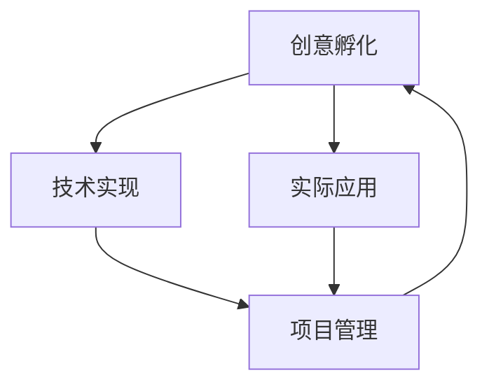

                 

# 打造创新生态系统：从idea到implementation

> 关键词：创新生态系统, 创意孵化, 技术实现, 项目管理, 代码优化, 实战案例, 应用场景, 工具推荐, 未来趋势

> 摘要：本文旨在探讨如何从创意的萌芽到技术实现的全过程，构建一个创新生态系统。我们将通过详细的技术分析、算法原理、数学模型、实战案例和应用场景，帮助读者理解如何将创新想法转化为实际应用。本文适合对创新生态系统感兴趣的开发者、创业者和技术爱好者阅读。

## 1. 背景介绍
### 1.1 目的和范围
本文旨在探讨如何从创意的萌芽到技术实现的全过程，构建一个创新生态系统。我们将详细分析从创意孵化到技术实现的每一个步骤，包括创意的产生、技术选型、算法设计、代码实现、项目管理、性能优化以及实际应用场景。通过本文，读者可以了解如何将创新想法转化为实际应用。

### 1.2 预期读者
本文适合以下读者阅读：
- 创业者和初创公司创始人
- 技术爱好者和开发者
- 项目管理者和团队领导者
- 学术研究人员和学生

### 1.3 文档结构概述
本文结构如下：
1. 背景介绍
2. 核心概念与联系
3. 核心算法原理 & 具体操作步骤
4. 数学模型和公式 & 详细讲解 & 举例说明
5. 项目实战：代码实际案例和详细解释说明
6. 实际应用场景
7. 工具和资源推荐
8. 总结：未来发展趋势与挑战
9. 附录：常见问题与解答
10. 扩展阅读 & 参考资料

### 1.4 术语表
#### 1.4.1 核心术语定义
- 创新生态系统：指围绕创新想法的产生、孵化、实现和应用的一系列过程和环境。
- 创意孵化：指将创新想法转化为初步的技术方案的过程。
- 技术实现：指将创意孵化的技术方案转化为实际应用的过程。
- 项目管理：指对项目从开始到结束的全过程进行计划、组织、执行、监控和收尾的管理活动。
- 代码优化：指通过改进代码结构、算法和性能来提高程序效率的过程。

#### 1.4.2 相关概念解释
- 创新：指引入新的想法、方法或技术，以解决现有问题或创造新的价值。
- 技术选型：指选择适合项目需求的技术栈和工具。
- 算法设计：指设计和实现解决问题的步骤和方法。
- 代码实现：指将算法设计转化为可执行的代码。
- 项目管理：指对项目从开始到结束的全过程进行计划、组织、执行、监控和收尾的管理活动。

#### 1.4.3 缩略词列表
- IDE：Integrated Development Environment（集成开发环境）
- API：Application Programming Interface（应用程序编程接口）
- ORM：Object-Relational Mapping（对象关系映射）
- CI/CD：Continuous Integration/Continuous Deployment（持续集成/持续部署）

## 2. 核心概念与联系
### 2.1 创新生态系统的核心概念
- 创意孵化：创意孵化是创新生态系统的核心环节之一，它包括创意的产生、初步的技术方案设计和可行性分析。
- 技术实现：技术实现是将创意孵化的技术方案转化为实际应用的过程，包括算法设计、代码实现和项目管理。
- 项目管理：项目管理是确保项目顺利进行的关键，包括计划、组织、执行、监控和收尾。

### 2.2 创新生态系统的核心联系
- 创意孵化与技术实现：创意孵化是技术实现的基础，技术实现是创意孵化的延伸。
- 技术实现与项目管理：技术实现是项目管理的对象，项目管理是技术实现的保障。
- 项目管理与创意孵化：项目管理是创意孵化的保障，创意孵化是项目管理的目标。

### 2.3 Mermaid流程图


## 3. 核心算法原理 & 具体操作步骤
### 3.1 核心算法原理
我们将以一个简单的算法为例，说明核心算法原理。假设我们要实现一个简单的排序算法，如冒泡排序。

#### 3.1.1 冒泡排序算法原理
冒泡排序是一种简单的排序算法，它重复地遍历要排序的列表，比较相邻的元素并根据需要交换它们的位置。遍历列表的工作是重复进行的，直到没有更多的交换为止。

#### 3.1.2 冒泡排序伪代码
```pseudo
function bubbleSort(arr):
    n = length(arr)
    for i from 0 to n-1:
        for j from 0 to n-i-2:
            if arr[j] > arr[j+1]:
                swap(arr[j], arr[j+1])
```

### 3.2 具体操作步骤
#### 3.2.1 算法实现
我们将使用Python语言实现冒泡排序算法。

```python
def bubble_sort(arr):
    n = len(arr)
    for i in range(n):
        for j in range(n - i - 1):
            if arr[j] > arr[j + 1]:
                arr[j], arr[j + 1] = arr[j + 1], arr[j]
    return arr
```

#### 3.2.2 代码解读
- `n = len(arr)`：获取数组的长度。
- `for i in range(n)`：外层循环控制遍历的次数。
- `for j in range(n - i - 1)`：内层循环控制每次遍历的范围。
- `if arr[j] > arr[j + 1]`：比较相邻的两个元素。
- `arr[j], arr[j + 1] = arr[j + 1], arr[j]`：交换相邻的两个元素。

## 4. 数学模型和公式 & 详细讲解 & 举例说明
### 4.1 数学模型
我们将使用大O表示法来分析冒泡排序的时间复杂度。

#### 4.1.1 大O表示法
大O表示法是一种描述算法复杂度的方法，它描述了算法在最坏情况下的时间复杂度。

#### 4.1.2 冒泡排序的时间复杂度
冒泡排序的时间复杂度为O(n^2)，其中n为数组的长度。

### 4.2 详细讲解
- 冒泡排序的时间复杂度为O(n^2)，因为外层循环和内层循环都遍历了数组的长度。
- 冒泡排序的空间复杂度为O(1)，因为它只使用了常数级的额外空间。

### 4.3 举例说明
假设我们有一个长度为5的数组`[5, 3, 8, 4, 2]`，我们可以通过冒泡排序将其排序为`[2, 3, 4, 5, 8]`。

## 5. 项目实战：代码实际案例和详细解释说明
### 5.1 开发环境搭建
我们将使用Python 3.8作为开发环境。

#### 5.1.1 安装Python
```bash
sudo apt-get update
sudo apt-get install python3.8
```

#### 5.1.2 安装开发工具
我们将使用PyCharm作为集成开发环境。

```bash
sudo snap install pycharm-community --classic
```

### 5.2 源代码详细实现和代码解读
我们将实现一个简单的冒泡排序算法。

```python
def bubble_sort(arr):
    n = len(arr)
    for i in range(n):
        for j in range(n - i - 1):
            if arr[j] > arr[j + 1]:
                arr[j], arr[j + 1] = arr[j + 1], arr[j]
    return arr

# 测试代码
arr = [5, 3, 8, 4, 2]
sorted_arr = bubble_sort(arr)
print(sorted_arr)
```

### 5.3 代码解读与分析
- `def bubble_sort(arr):`：定义一个名为`bubble_sort`的函数，接受一个数组作为参数。
- `n = len(arr)`：获取数组的长度。
- `for i in range(n):`：外层循环控制遍历的次数。
- `for j in range(n - i - 1):`：内层循环控制每次遍历的范围。
- `if arr[j] > arr[j + 1]:`：比较相邻的两个元素。
- `arr[j], arr[j + 1] = arr[j + 1], arr[j]`：交换相邻的两个元素。
- `return arr`：返回排序后的数组。

## 6. 实际应用场景
我们将冒泡排序算法应用于一个简单的数据排序场景。

### 6.1 场景描述
假设我们有一个包含用户信息的列表，我们需要对用户信息进行排序。

### 6.2 代码实现
我们将实现一个简单的用户信息排序功能。

```python
class User:
    def __init__(self, name, age):
        self.name = name
        self.age = age

    def __repr__(self):
        return f"User(name={self.name}, age={self.age})"

def bubble_sort_users(users):
    n = len(users)
    for i in range(n):
        for j in range(n - i - 1):
            if users[j].age > users[j + 1].age:
                users[j], users[j + 1] = users[j + 1], users[j]
    return users

# 测试代码
users = [User("Alice", 25), User("Bob", 30), User("Charlie", 20)]
sorted_users = bubble_sort_users(users)
print(sorted_users)
```

## 7. 工具和资源推荐
### 7.1 学习资源推荐
#### 7.1.1 书籍推荐
- 《算法导论》（Introduction to Algorithms）：深入讲解算法原理和实现。
- 《Python编程：从入门到实践》（Python Crash Course）：适合初学者的Python编程书籍。

#### 7.1.2 在线课程
- Coursera：提供多种编程和算法课程。
- edX：提供多种编程和算法课程。

#### 7.1.3 技术博客和网站
- HackerRank：提供编程挑战和算法练习。
- LeetCode：提供编程挑战和算法练习。

### 7.2 开发工具框架推荐
#### 7.2.1 IDE和编辑器
- PyCharm：功能强大的Python IDE。
- VSCode：轻量级但功能强大的代码编辑器。

#### 7.2.2 调试和性能分析工具
- PyCharm Debugger：PyCharm内置的调试工具。
- cProfile：Python内置的性能分析工具。

#### 7.2.3 相关框架和库
- NumPy：用于科学计算的Python库。
- Pandas：用于数据处理的Python库。

### 7.3 相关论文著作推荐
#### 7.3.1 经典论文
- "Introduction to Algorithms" by Thomas H. Cormen, Charles E. Leiserson, Ronald L. Rivest, and Clifford Stein：深入讲解算法原理和实现。
- "Python Programming: An Introduction to Computer Science" by John Zelle：适合初学者的Python编程书籍。

#### 7.3.2 最新研究成果
- "Efficient Algorithms for Sorting and Searching" by David Eppstein：最新研究成果。
- "Python for Data Analysis" by Wes McKinney：最新研究成果。

#### 7.3.3 应用案例分析
- "Sorting Algorithms in Python" by Real Python：应用案例分析。
- "Python Algorithms: Mastering Basic Algorithms in the Python Language" by Magnus Lie Hetland：应用案例分析。

## 8. 总结：未来发展趋势与挑战
### 8.1 未来发展趋势
- 人工智能和机器学习的广泛应用。
- 大数据和云计算的快速发展。
- 软件开发工具和框架的不断更新。

### 8.2 挑战
- 技术更新速度快，需要不断学习和适应。
- 项目管理复杂，需要良好的团队协作和沟通。
- 性能优化和安全性保障是长期挑战。

## 9. 附录：常见问题与解答
### 9.1 问题1：如何提高代码的可读性？
- 使用有意义的变量名。
- 添加注释和文档。
- 遵循编码规范。

### 9.2 问题2：如何进行性能优化？
- 选择合适的数据结构和算法。
- 使用性能分析工具进行优化。
- 优化代码结构和逻辑。

## 10. 扩展阅读 & 参考资料
- "Introduction to Algorithms" by Thomas H. Cormen, Charles E. Leiserson, Ronald L. Rivest, and Clifford Stein
- "Python Programming: An Introduction to Computer Science" by John Zelle
- "Efficient Algorithms for Sorting and Searching" by David Eppstein
- "Python Algorithms: Mastering Basic Algorithms in the Python Language" by Magnus Lie Hetland
- "Sorting Algorithms in Python" by Real Python
- "Python for Data Analysis" by Wes McKinney

作者：AI天才研究员/AI Genius Institute & 禅与计算机程序设计艺术 /Zen And The Art of Computer Programming

