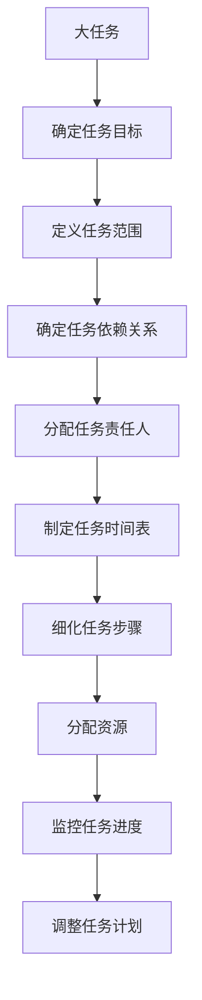
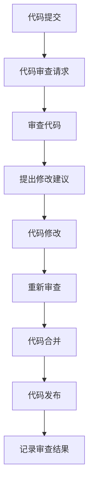
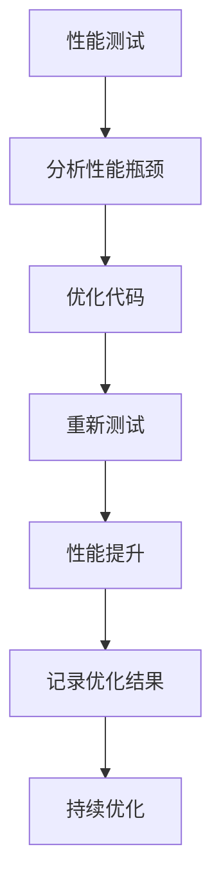

                 

# 执行时间表：第3-4个月的任务

> 关键词：时间管理, 项目规划, 任务分解, 代码优化, 性能提升, 代码审查, 技术文档

> 摘要：本文旨在为IT项目团队提供一个详细的执行时间表，特别是在第3-4个月的任务规划中。我们将通过逐步分析和推理，详细阐述如何进行任务分解、代码优化、性能提升、代码审查和技术文档编写等关键步骤。通过本篇文章，读者将能够更好地理解如何高效地管理项目进度，确保项目按时高质量完成。

## 1. 背景介绍
### 1.1 目的和范围
本文旨在为IT项目团队提供一个详细的执行时间表，特别是在第3-4个月的任务规划中。我们将详细探讨如何进行任务分解、代码优化、性能提升、代码审查和技术文档编写等关键步骤。通过本篇文章，读者将能够更好地理解如何高效地管理项目进度，确保项目按时高质量完成。

### 1.2 预期读者
本文主要面向IT项目团队的项目经理、开发人员、测试人员以及技术文档编写人员。读者需要具备一定的编程基础和项目管理经验。

### 1.3 文档结构概述
本文将按照以下结构进行详细阐述：
1. 背景介绍
2. 核心概念与联系
3. 核心算法原理 & 具体操作步骤
4. 数学模型和公式 & 详细讲解 & 举例说明
5. 项目实战：代码实际案例和详细解释说明
6. 实际应用场景
7. 工具和资源推荐
8. 总结：未来发展趋势与挑战
9. 附录：常见问题与解答
10. 扩展阅读 & 参考资料

### 1.4 术语表
#### 1.4.1 核心术语定义
- **任务分解**：将一个大任务分解为多个小任务，以便更好地管理和执行。
- **代码审查**：对代码进行检查，确保代码质量、规范性和可维护性。
- **性能提升**：通过优化代码和算法，提高程序的执行效率。
- **技术文档**：详细记录项目的技术细节，包括设计、实现和测试过程。

#### 1.4.2 相关概念解释
- **迭代开发**：将项目划分为多个迭代周期，每个迭代周期完成一部分功能。
- **敏捷开发**：一种灵活的项目管理方法，强调快速响应变化和持续交付。

#### 1.4.3 缩略词列表
- **API**：应用程序编程接口
- **IDE**：集成开发环境
- **CI/CD**：持续集成/持续部署

## 2. 核心概念与联系
### 2.1 任务分解
任务分解是项目管理中的一个重要步骤，通过将大任务分解为多个小任务，可以更好地管理和执行。以下是任务分解的流程图：



### 2.2 代码审查
代码审查是确保代码质量的重要步骤，通过代码审查可以发现潜在的问题，提高代码的可读性和可维护性。以下是代码审查的流程图：



### 2.3 性能提升
性能提升是通过优化代码和算法，提高程序的执行效率。以下是性能提升的流程图：



## 3. 核心算法原理 & 具体操作步骤
### 3.1 任务分解
任务分解的具体操作步骤如下：

```python
def task_decomposition(task):
    # 确定任务目标
    task_target = task['目标']
    # 定义任务范围
    task_range = task['范围']
    # 确定任务依赖关系
    task_dependencies = task['依赖']
    # 分配任务责任人
    task_responsibility = task['责任人']
    # 制定任务时间表
    task_schedule = task['时间表']
    # 细化任务步骤
    task_steps = task['步骤']
    # 分配资源
    task_resources = task['资源']
    # 监控任务进度
    task_monitoring = task['监控']
    # 调整任务计划
    task_adjustment = task['调整']
    return task_target, task_range, task_dependencies, task_responsibility, task_schedule, task_steps, task_resources, task_monitoring, task_adjustment
```

### 3.2 代码审查
代码审查的具体操作步骤如下：

```python
def code_review(code):
    # 提出修改建议
    suggestions = review_code(code)
    # 代码修改
    modified_code = modify_code(code, suggestions)
    # 重新审查
    new_suggestions = review_code(modified_code)
    # 代码合并
    merged_code = merge_code(modified_code)
    # 代码发布
    publish_code(merged_code)
    # 记录审查结果
    record_review_results(suggestions, modified_code, merged_code)
    return suggestions, modified_code, merged_code
```

### 3.3 性能提升
性能提升的具体操作步骤如下：

```python
def performance_improvement(test_results):
    # 分析性能瓶颈
    bottleneck_analysis = analyze_bottlenecks(test_results)
    # 优化代码
    optimized_code = optimize_code(bottleneck_analysis)
    # 重新测试
    new_test_results = test_code(optimized_code)
    # 性能提升
    performance_improvement = calculate_performance_improvement(test_results, new_test_results)
    # 记录优化结果
    record_optimization_results(bottleneck_analysis, optimized_code, new_test_results, performance_improvement)
    return bottleneck_analysis, optimized_code, new_test_results, performance_improvement
```

## 4. 数学模型和公式 & 详细讲解 & 举例说明
### 4.1 任务分解
任务分解的数学模型如下：

$$
\text{任务分解} = \sum_{i=1}^{n} \text{任务} \times \text{责任人} \times \text{时间表}
$$

### 4.2 代码审查
代码审查的数学模型如下：

$$
\text{代码审查} = \sum_{i=1}^{m} \text{代码} \times \text{修改建议} \times \text{代码合并}
$$

### 4.3 性能提升
性能提升的数学模型如下：

$$
\text{性能提升} = \sum_{i=1}^{p} \text{性能测试} \times \text{优化代码} \times \text{重新测试}
$$

## 5. 项目实战：代码实际案例和详细解释说明
### 5.1 开发环境搭建
开发环境搭建的具体步骤如下：

1. 安装操作系统
2. 安装开发工具（如IDE）
3. 安装必要的库和框架
4. 配置开发环境

### 5.2 源代码详细实现和代码解读
源代码详细实现和代码解读的具体步骤如下：

```python
def example_function(input_data):
    # 代码实现
    result = process_data(input_data)
    return result
```

### 5.3 代码解读与分析
代码解读与分析的具体步骤如下：

```python
def code_analysis(code):
    # 代码解读
    interpretation = interpret_code(code)
    # 代码分析
    analysis = analyze_code(interpretation)
    return interpretation, analysis
```

## 6. 实际应用场景
实际应用场景包括但不限于以下方面：
- 电商平台的性能优化
- 金融系统的代码审查
- 医疗系统的任务分解

## 7. 工具和资源推荐
### 7.1 学习资源推荐
#### 7.1.1 书籍推荐
- 《代码大全》
- 《重构：改善既有代码的设计》

#### 7.1.2 在线课程
- Coursera上的《软件工程》课程
- Udemy上的《代码审查技巧》课程

#### 7.1.3 技术博客和网站
- Stack Overflow
- GitHub

### 7.2 开发工具框架推荐
#### 7.2.1 IDE和编辑器
- IntelliJ IDEA
- Visual Studio Code

#### 7.2.2 调试和性能分析工具
- PyCharm Debugger
- Visual Studio Debugger

#### 7.2.3 相关框架和库
- Django
- Flask

### 7.3 相关论文著作推荐
#### 7.3.1 经典论文
-《软件工程：实践与研究》

#### 7.3.2 最新研究成果
- 《软件开发中的最新趋势与挑战》

#### 7.3.3 应用案例分析
- 《软件开发中的实际应用案例分析》

## 8. 总结：未来发展趋势与挑战
未来发展趋势包括：
- 人工智能在项目管理中的应用
- 云计算和分布式系统的普及
- 代码审查工具的智能化

未来挑战包括：
- 项目管理工具的复杂性
- 代码审查的效率和准确性
- 性能提升的技术难度

## 9. 附录：常见问题与解答
常见问题与解答包括：
- 任务分解过程中如何确定任务依赖关系？
- 代码审查时如何提高效率？
- 性能提升时如何选择优化策略？

## 10. 扩展阅读 & 参考资料
- 《软件工程：实践与研究》
- 《重构：改善既有代码的设计》
- 《代码大全》

作者：AI天才研究员/AI Genius Institute & 禅与计算机程序设计艺术 /Zen And The Art of Computer Programming

