                 

# 技术人如何进行有效的创业项目管理

> 关键词：项目管理, 创业, 技术人, 项目生命周期, 敏捷开发, 风险管理, 沟通, 团队协作, 项目规划

> 摘要：本文旨在为技术人提供一套系统化的创业项目管理方法，通过详细分析项目管理的核心概念、流程、工具和最佳实践，帮助技术人更好地规划和执行创业项目，提高项目成功率。本文将从项目管理的基本概念出发，逐步深入到项目规划、风险管理、团队协作等多个方面，结合实际案例进行详细讲解。

## 1. 背景介绍
### 1.1 目的和范围
本文旨在为技术人提供一套系统化的创业项目管理方法，帮助他们在创业过程中更好地规划和执行项目，提高项目成功率。本文将涵盖项目管理的核心概念、流程、工具和最佳实践，旨在为技术人提供实用的指导。

### 1.2 预期读者
本文的预期读者是技术人，特别是那些正在或计划创业的技术人。读者应具备一定的技术背景，了解软件开发的基本流程和方法。本文将帮助读者更好地管理创业项目，提高项目的成功率。

### 1.3 文档结构概述
本文将按照以下结构展开：
1. 项目管理的核心概念
2. 项目规划与执行
3. 风险管理
4. 团队协作
5. 项目实战案例
6. 实际应用场景
7. 工具和资源推荐
8. 总结与未来发展趋势
9. 附录：常见问题与解答

### 1.4 术语表
#### 1.4.1 核心术语定义
- **项目管理**：指在有限的时间、预算和资源内，通过计划、组织、领导和控制项目活动，以实现项目目标的过程。
- **敏捷开发**：一种迭代和增量的软件开发方法，强调快速响应变化、持续交付和团队协作。
- **风险管理**：识别、评估和控制项目中的风险，以减少负面影响和增加正面影响。
- **团队协作**：团队成员之间有效沟通和合作，以实现共同目标的过程。

#### 1.4.2 相关概念解释
- **项目生命周期**：项目从启动到结束的整个过程，包括启动、规划、执行、监控和收尾五个阶段。
- **关键路径**：项目中最长的路径，决定了项目的最短完成时间。
- **甘特图**：一种用于展示项目进度的图表，显示任务的开始和结束时间。

#### 1.4.3 缩略词列表
- **PM**：Project Management（项目管理）
- **AGILE**：Agile Development（敏捷开发）
- **RISK**：Risk Management（风险管理）
- **TEAM**：Team Collaboration（团队协作）

## 2. 核心概念与联系
### 2.1 项目管理的核心概念
项目管理的核心概念包括项目生命周期、关键路径、甘特图等。这些概念帮助我们更好地理解项目的整体流程和关键节点。

#### 项目生命周期
项目生命周期分为五个阶段：启动、规划、执行、监控和收尾。每个阶段都有其特定的目标和任务。

#### 关键路径
关键路径是指项目中最长的路径，决定了项目的最短完成时间。关键路径上的任务对项目的完成时间有直接影响。

#### 甘特图
甘特图是一种用于展示项目进度的图表，显示任务的开始和结束时间。甘特图有助于可视化项目进度和关键任务。

### 2.2 核心概念之间的联系
项目生命周期、关键路径和甘特图之间存在密切联系。项目生命周期定义了项目的整体流程，关键路径确定了项目的最短完成时间，而甘特图则提供了可视化的项目进度。

## 3. 核心算法原理 & 具体操作步骤
### 3.1 项目规划
项目规划是项目管理的重要环节，主要包括需求分析、范围定义、资源分配和时间表制定。

#### 需求分析
需求分析是确定项目目标和功能需求的过程。通过与客户和利益相关者进行沟通，收集需求并进行分析。

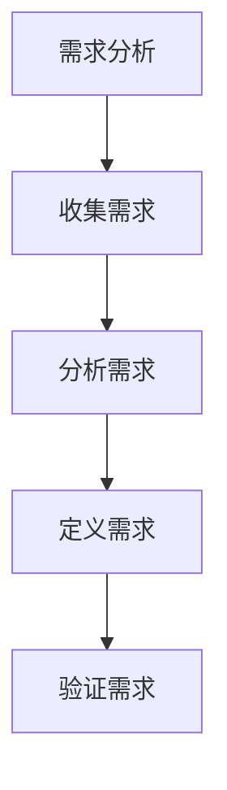

#### 范围定义
范围定义是确定项目范围的过程，包括功能范围和非功能范围。功能范围定义项目需要实现的功能，非功能范围定义项目需要满足的性能要求。

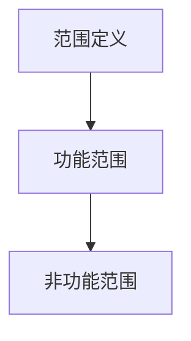

#### 资源分配
资源分配是确定项目所需资源的过程，包括人力、物力和财力。资源分配需要考虑项目的规模和复杂性。

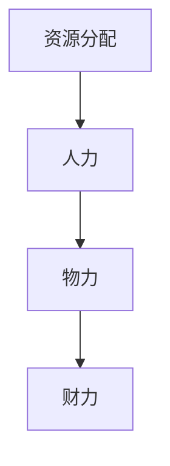

#### 时间表制定
时间表制定是确定项目各阶段的时间安排的过程。时间表需要考虑项目的规模和复杂性，以及关键路径上的任务。

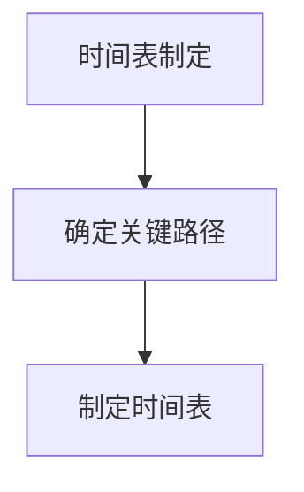

### 3.2 项目执行
项目执行是项目管理的重要环节，主要包括任务分配、进度跟踪和质量控制。

#### 任务分配
任务分配是将项目任务分配给团队成员的过程。任务分配需要考虑团队成员的能力和经验。

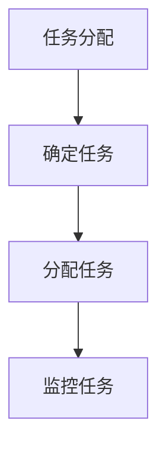

#### 进度跟踪
进度跟踪是监控项目进度的过程。进度跟踪需要定期检查项目进度，确保项目按计划进行。

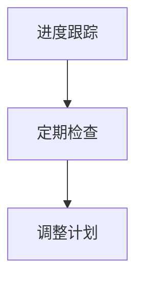

#### 质量控制
质量控制是确保项目质量的过程。质量控制需要定期检查项目质量，确保项目满足需求和标准。

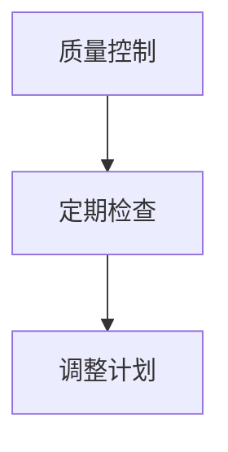

## 4. 数学模型和公式 & 详细讲解 & 举例说明
### 4.1 项目进度模型
项目进度模型是用于预测项目进度的数学模型。项目进度模型可以使用线性回归模型进行预测。

$$
\hat{y} = \beta_0 + \beta_1 x_1 + \beta_2 x_2 + \cdots + \beta_n x_n
$$

其中，$\hat{y}$ 是预测的项目进度，$x_1, x_2, \cdots, x_n$ 是影响项目进度的变量，$\beta_0, \beta_1, \cdots, \beta_n$ 是模型的参数。

### 4.2 项目风险模型
项目风险模型是用于评估项目风险的数学模型。项目风险模型可以使用贝叶斯网络进行评估。

$$
P(A|B) = \frac{P(B|A)P(A)}{P(B)}
$$

其中，$P(A|B)$ 是在给定条件B的情况下事件A的概率，$P(B|A)$ 是在给定条件A的情况下事件B的概率，$P(A)$ 是事件A的概率，$P(B)$ 是事件B的概率。

## 5. 项目实战：代码实际案例和详细解释说明
### 5.1 开发环境搭建
开发环境搭建是项目管理的重要环节，主要包括操作系统选择、开发工具安装和环境配置。

#### 操作系统选择
操作系统选择是选择适合项目的操作系统的过程。操作系统选择需要考虑项目的规模和复杂性。

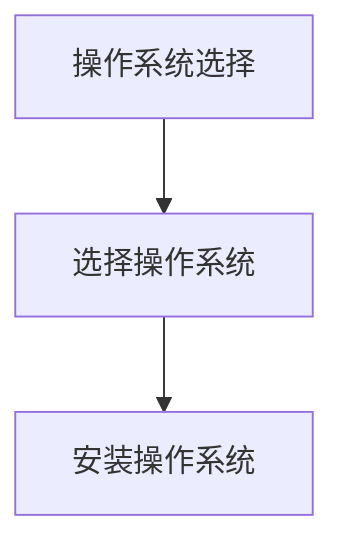

#### 开发工具安装
开发工具安装是安装适合项目的开发工具的过程。开发工具安装需要考虑项目的规模和复杂性。

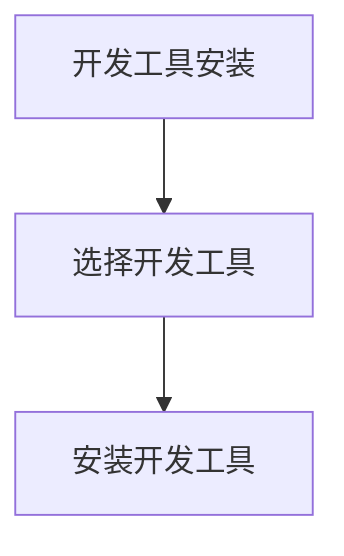

#### 环境配置
环境配置是配置开发环境的过程。环境配置需要考虑项目的规模和复杂性。

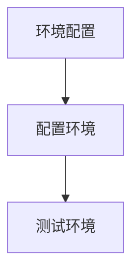

### 5.2 源代码详细实现和代码解读
源代码详细实现是项目管理的重要环节，主要包括代码编写、代码审查和代码测试。

#### 代码编写
代码编写是编写项目代码的过程。代码编写需要遵循编码规范和设计模式。

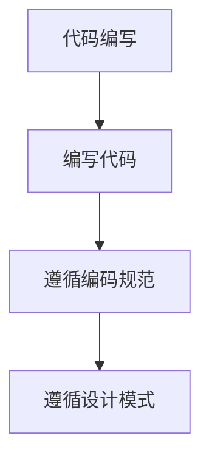

#### 代码审查
代码审查是审查项目代码的过程。代码审查需要遵循代码审查标准和流程。

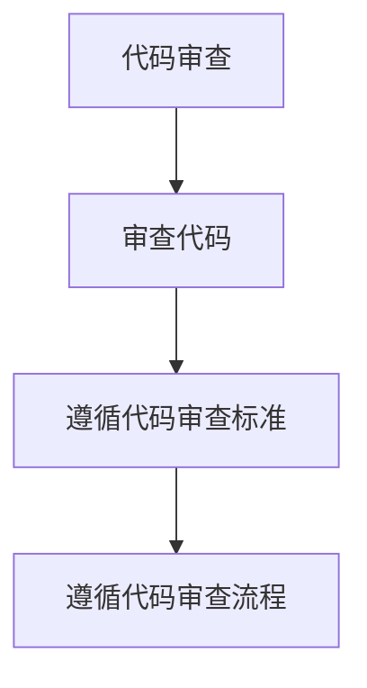

#### 代码测试
代码测试是测试项目代码的过程。代码测试需要遵循测试标准和流程。

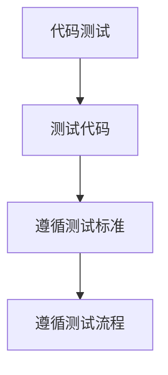

### 5.3 代码解读与分析
代码解读与分析是项目管理的重要环节，主要包括代码解读和代码分析。

#### 代码解读
代码解读是解读项目代码的过程。代码解读需要遵循代码解读标准和流程。

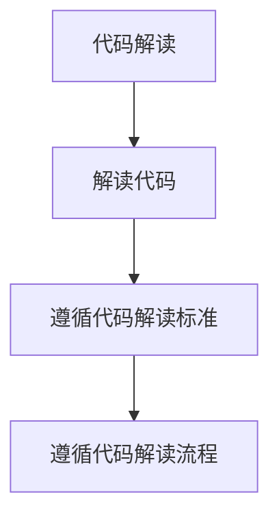

#### 代码分析
代码分析是分析项目代码的过程。代码分析需要遵循代码分析标准和流程。

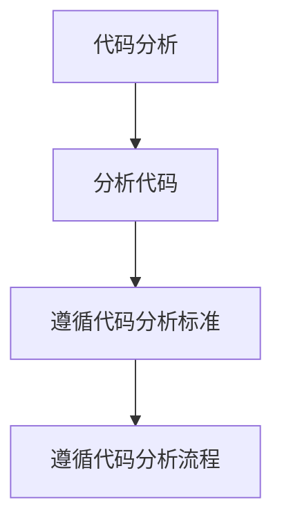

## 6. 实际应用场景
### 6.1 项目管理在创业中的应用
项目管理在创业中的应用可以帮助创业者更好地规划和执行项目，提高项目的成功率。项目管理可以帮助创业者更好地管理资源、时间、风险和团队，确保项目按计划进行。

### 6.2 项目管理在软件开发中的应用
项目管理在软件开发中的应用可以帮助开发者更好地规划和执行项目，提高项目的成功率。项目管理可以帮助开发者更好地管理资源、时间、风险和团队，确保项目按计划进行。

## 7. 工具和资源推荐
### 7.1 学习资源推荐
#### 7.1.1 书籍推荐
- 《项目管理知识体系指南》（PMBOK Guide）
- 《敏捷软件开发》（Agile Software Development）
- 《软件项目管理》（Software Project Management）

#### 7.1.2 在线课程
- Coursera：《项目管理专业证书》（Professional Certificate in Project Management）
- Udemy：《敏捷开发与项目管理》（Agile Development and Project Management）

#### 7.1.3 技术博客和网站
- Medium：《项目管理与敏捷开发》（Project Management and Agile Development）
- Stack Overflow：《项目管理与敏捷开发》（Project Management and Agile Development）

### 7.2 开发工具框架推荐
#### 7.2.1 IDE和编辑器
- IntelliJ IDEA
- Visual Studio Code
- Eclipse

#### 7.2.2 调试和性能分析工具
- JUnit
- PyCharm
- Visual Studio

#### 7.2.3 相关框架和库
- Spring
- Hibernate
- React

### 7.3 相关论文著作推荐
#### 7.3.1 经典论文
-《项目管理知识体系指南》（PMBOK Guide）
-《敏捷软件开发》（Agile Software Development）

#### 7.3.2 最新研究成果
-《软件项目管理》（Software Project Management）

#### 7.3.3 应用案例分析
-《项目管理与敏捷开发》（Project Management and Agile Development）

## 8. 总结：未来发展趋势与挑战
### 8.1 未来发展趋势
未来项目管理的发展趋势包括：
- 项目管理工具的智能化
- 项目管理方法的多样化
- 项目管理的全球化

### 8.2 未来挑战
未来项目管理面临的挑战包括：
- 项目管理工具的复杂性
- 项目管理方法的适应性
- 项目管理的国际化

## 9. 附录：常见问题与解答
### 9.1 问题与解答
#### 9.1.1 问题：如何选择合适的项目管理工具？
- 答案：选择合适的项目管理工具需要考虑项目的规模和复杂性，以及团队的需求和偏好。可以参考相关书籍和在线课程，了解各种项目管理工具的特点和优缺点。

#### 9.1.2 问题：如何进行有效的项目规划？
- 答案：进行有效的项目规划需要遵循项目管理的基本原则和方法，包括需求分析、范围定义、资源分配和时间表制定。可以参考相关书籍和在线课程，了解项目规划的最佳实践。

## 10. 扩展阅读 & 参考资料
### 10.1 扩展阅读
- 《项目管理知识体系指南》（PMBOK Guide）
- 《敏捷软件开发》（Agile Software Development）
- 《软件项目管理》（Software Project Management）

### 10.2 参考资料
- Coursera：《项目管理专业证书》（Professional Certificate in Project Management）
- Udemy：《敏捷开发与项目管理》（Agile Development and Project Management）
- Medium：《项目管理与敏捷开发》（Project Management and Agile Development）
- Stack Overflow：《项目管理与敏捷开发》（Project Management and Agile Development）

---

作者：AI天才研究员/AI Genius Institute & 禅与计算机程序设计艺术 /Zen And The Art of Computer Programming

