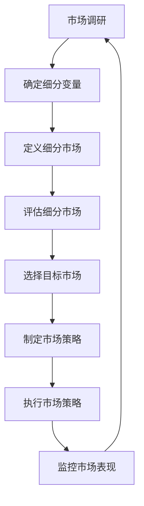

                 

# 技术人如何进行有效的市场细分和目标市场选择

> 关键词：市场细分、目标市场、用户画像、需求分析、市场调研、竞争分析、产品定位

> 摘要：本文旨在为技术人提供一套系统的方法论，帮助他们在复杂多变的市场环境中进行有效的市场细分和目标市场选择。通过深入分析市场细分的核心概念、算法原理、数学模型、实战案例以及实际应用场景，本文将帮助读者掌握如何构建精准的目标市场策略，从而在激烈的市场竞争中脱颖而出。

## 1. 背景介绍
### 1.1 目的和范围
本文旨在为技术人提供一套系统的方法论，帮助他们在复杂多变的市场环境中进行有效的市场细分和目标市场选择。通过深入分析市场细分的核心概念、算法原理、数学模型、实战案例以及实际应用场景，本文将帮助读者掌握如何构建精准的目标市场策略，从而在激烈的市场竞争中脱颖而出。

### 1.2 预期读者
本文预期读者为技术人，包括但不限于人工智能专家、程序员、软件架构师、CTO、技术作家等。读者需要具备一定的技术背景和市场分析能力，以便更好地理解和应用本文中的方法论。

### 1.3 文档结构概述
本文结构如下：
1. 背景介绍
2. 核心概念与联系
3. 核心算法原理 & 具体操作步骤
4. 数学模型和公式 & 详细讲解 & 举例说明
5. 项目实战：代码实际案例和详细解释说明
6. 实际应用场景
7. 工具和资源推荐
8. 总结：未来发展趋势与挑战
9. 附录：常见问题与解答
10. 扩展阅读 & 参考资料

### 1.4 术语表
#### 1.4.1 核心术语定义
- **市场细分**：将一个大市场划分为若干个子市场，每个子市场具有相似的需求和特征。
- **目标市场**：选择一个或多个细分市场作为企业的目标市场。
- **用户画像**：对目标用户群体进行详细描述，包括年龄、性别、职业、兴趣爱好等。
- **需求分析**：对目标市场的需求进行深入分析，了解用户的具体需求。
- **市场调研**：通过各种手段收集市场信息，了解市场趋势和用户需求。
- **竞争分析**：分析竞争对手的优势和劣势，了解市场格局。
- **产品定位**：根据目标市场的需求和竞争环境，确定产品的市场定位。

#### 1.4.2 相关概念解释
- **市场细分**：是市场调研的重要步骤之一，通过市场细分可以更好地理解目标市场的需求和特征。
- **目标市场选择**：是市场细分的后续步骤，通过选择合适的目标市场，企业可以更精准地满足用户需求。
- **用户画像**：是市场细分的重要工具之一，通过构建用户画像，可以更准确地描述目标用户群体。

#### 1.4.3 缩略词列表
- **B2B**：Business to Business，企业对企业
- **B2C**：Business to Consumer，企业对消费者
- **C2C**：Consumer to Consumer，消费者对消费者
- **SaaS**：Software as a Service，软件即服务

## 2. 核心概念与联系
### 2.1 市场细分的核心概念
市场细分是将一个大市场划分为若干个子市场，每个子市场具有相似的需求和特征。市场细分的核心概念包括：
- **可衡量性**：细分市场必须是可以衡量的，可以通过市场调研收集数据。
- **可进入性**：企业必须能够进入细分市场，提供产品或服务。
- **可盈利性**：细分市场必须具有一定的盈利潜力。
- **差异性**：细分市场之间必须存在明显的差异，以便企业能够提供差异化的产品或服务。

### 2.2 市场细分的流程图


## 3. 核心算法原理 & 具体操作步骤
### 3.1 市场细分的算法原理
市场细分的算法原理主要包括以下几个步骤：
1. **确定细分变量**：选择能够区分不同用户群体的变量，如年龄、性别、职业、收入等。
2. **定义细分市场**：根据细分变量将市场划分为若干个子市场。
3. **评估细分市场**：评估每个细分市场的可衡量性、可进入性、可盈利性和差异性。
4. **选择目标市场**：根据评估结果选择一个或多个细分市场作为目标市场。
5. **制定市场策略**：根据目标市场的需求和竞争环境，制定相应的市场策略。
6. **执行市场策略**：将市场策略付诸实践，提供产品或服务。
7. **监控市场表现**：监控市场表现，根据反馈调整市场策略。

### 3.2 具体操作步骤


## 4. 数学模型和公式 & 详细讲解 & 举例说明
### 4.1 市场细分的数学模型
市场细分的数学模型主要包括以下几个方面：
1. **聚类分析**：通过聚类算法将用户群体划分为若干个子市场。
2. **因子分析**：通过因子分析确定影响用户需求的关键因素。
3. **主成分分析**：通过主成分分析确定影响用户需求的主要变量。

### 4.2 举例说明
假设我们有一个电商平台，需要进行市场细分。我们可以使用聚类分析将用户群体划分为若干个子市场。具体步骤如下：
1. **数据收集**：收集用户的基本信息，如年龄、性别、职业、收入等。
2. **数据预处理**：对数据进行清洗和标准化处理。
3. **聚类分析**：使用K-means算法将用户群体划分为若干个子市场。
4. **评估细分市场**：评估每个细分市场的可衡量性、可进入性、可盈利性和差异性。
5. **选择目标市场**：根据评估结果选择一个或多个细分市场作为目标市场。
6. **制定市场策略**：根据目标市场的需求和竞争环境，制定相应的市场策略。
7. **执行市场策略**：将市场策略付诸实践，提供产品或服务。
8. **监控市场表现**：监控市场表现，根据反馈调整市场策略。

## 5. 项目实战：代码实际案例和详细解释说明
### 5.1 开发环境搭建
为了进行市场细分，我们需要搭建一个开发环境。具体步骤如下：
1. **安装Python**：安装Python 3.8及以上版本。
2. **安装依赖库**：安装NumPy、Pandas、Scikit-learn等依赖库。
3. **安装Jupyter Notebook**：安装Jupyter Notebook，方便进行数据分析和可视化。

### 5.2 源代码详细实现和代码解读
```python
# 导入依赖库
import numpy as np
import pandas as pd
from sklearn.cluster import KMeans
from sklearn.preprocessing import StandardScaler

# 读取数据
data = pd.read_csv('user_data.csv')

# 数据预处理
scaler = StandardScaler()
data_scaled = scaler.fit_transform(data)

# 聚类分析
kmeans = KMeans(n_clusters=3)
kmeans.fit(data_scaled)

# 获取聚类结果
labels = kmeans.labels_

# 输出聚类结果
print(labels)
```

### 5.3 代码解读与分析
1. **导入依赖库**：导入NumPy、Pandas和Scikit-learn等依赖库。
2. **读取数据**：使用Pandas读取用户数据。
3. **数据预处理**：使用StandardScaler对数据进行标准化处理。
4. **聚类分析**：使用KMeans算法将用户群体划分为3个子市场。
5. **获取聚类结果**：获取聚类结果，输出聚类标签。

## 6. 实际应用场景
市场细分在实际应用场景中具有广泛的应用，如：
1. **电商平台**：通过市场细分，电商平台可以更好地了解用户需求，提供个性化的产品和服务。
2. **社交媒体**：通过市场细分，社交媒体平台可以更好地了解用户兴趣，提供个性化的内容推荐。
3. **金融行业**：通过市场细分，金融机构可以更好地了解客户需求，提供个性化的金融产品和服务。

## 7. 工具和资源推荐
### 7.1 学习资源推荐
#### 7.1.1 书籍推荐
- **《市场细分：理论与实践》**：深入讲解市场细分的理论和实践方法。
- **《数据挖掘：概念与技术》**：详细讲解数据挖掘的概念和技术，包括聚类分析、因子分析等。

#### 7.1.2 在线课程
- **Coursera**：提供多门关于市场细分和数据挖掘的在线课程。
- **edX**：提供多门关于市场细分和数据挖掘的在线课程。

#### 7.1.3 技术博客和网站
- **Medium**：提供多篇关于市场细分和数据挖掘的技术博客。
- **Kaggle**：提供多篇关于市场细分和数据挖掘的技术博客。

### 7.2 开发工具框架推荐
#### 7.2.1 IDE和编辑器
- **PyCharm**：功能强大的Python IDE，支持代码高亮、自动补全等功能。
- **Jupyter Notebook**：支持代码和文档的混合编辑，方便进行数据分析和可视化。

#### 7.2.2 调试和性能分析工具
- **PyCharm Debugger**：PyCharm内置的调试工具，支持断点调试、变量查看等功能。
- **LineProfiler**：用于分析Python代码的性能瓶颈。

#### 7.2.3 相关框架和库
- **Scikit-learn**：提供多种机器学习算法，包括聚类分析、因子分析等。
- **Pandas**：提供数据处理和分析功能，支持数据清洗、标准化处理等功能。

### 7.3 相关论文著作推荐
#### 7.3.1 经典论文
- **《市场细分：理论与实践》**：深入讲解市场细分的理论和实践方法。
- **《数据挖掘：概念与技术》**：详细讲解数据挖掘的概念和技术，包括聚类分析、因子分析等。

#### 7.3.2 最新研究成果
- **《市场细分的新方法》**：介绍最新的市场细分方法和技术。
- **《数据挖掘的新技术》**：介绍最新的数据挖掘技术和应用。

#### 7.3.3 应用案例分析
- **《市场细分在电商平台的应用》**：介绍市场细分在电商平台的应用案例。
- **《市场细分在社交媒体的应用》**：介绍市场细分在社交媒体的应用案例。

## 8. 总结：未来发展趋势与挑战
市场细分在未来的发展趋势和挑战主要包括：
1. **技术进步**：随着大数据、人工智能等技术的发展，市场细分的方法和技术将更加先进。
2. **市场需求变化**：市场需求的变化将推动市场细分方法和技术的不断更新。
3. **竞争加剧**：市场竞争的加剧将促使企业更加注重市场细分，以更好地满足用户需求。

## 9. 附录：常见问题与解答
### 9.1 常见问题
1. **如何选择合适的细分变量？**
   - 选择能够区分不同用户群体的变量，如年龄、性别、职业、收入等。
2. **如何评估细分市场的可衡量性、可进入性、可盈利性和差异性？**
   - 通过市场调研收集数据，评估每个细分市场的可衡量性、可进入性、可盈利性和差异性。
3. **如何选择目标市场？**
   - 根据评估结果选择一个或多个细分市场作为目标市场。

### 9.2 解答
1. **如何选择合适的细分变量？**
   - 选择能够区分不同用户群体的变量，如年龄、性别、职业、收入等。
2. **如何评估细分市场的可衡量性、可进入性、可盈利性和差异性？**
   - 通过市场调研收集数据，评估每个细分市场的可衡量性、可进入性、可盈利性和差异性。
3. **如何选择目标市场？**
   - 根据评估结果选择一个或多个细分市场作为目标市场。

## 10. 扩展阅读 & 参考资料
- **《市场细分：理论与实践》**：深入讲解市场细分的理论和实践方法。
- **《数据挖掘：概念与技术》**：详细讲解数据挖掘的概念和技术，包括聚类分析、因子分析等。
- **《市场细分的新方法》**：介绍最新的市场细分方法和技术。
- **《数据挖掘的新技术》**：介绍最新的数据挖掘技术和应用。

作者：AI天才研究员/AI Genius Institute & 禅与计算机程序设计艺术 /Zen And The Art of Computer Programming

