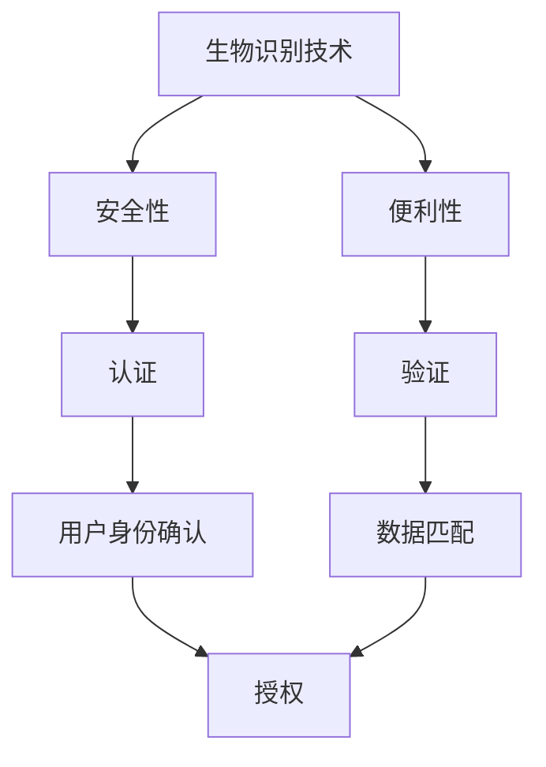

                 

# 技术创业中的生物识别技术：安全与便利的平衡

> 关键词：生物识别技术, 安全性, 便利性, 人工智能, 机器学习, 深度学习, 认证, 验证, 隐私保护, 伦理问题

> 摘要：本文旨在探讨生物识别技术在技术创业中的应用，通过分析生物识别技术的安全性和便利性之间的平衡，为创业者提供实用的技术指导和建议。我们将从技术原理、算法实现、实际案例、应用场景等方面进行深入剖析，并提出未来的发展趋势和挑战。

## 1. 背景介绍
### 1.1 目的和范围
本文旨在探讨生物识别技术在技术创业中的应用，通过分析生物识别技术的安全性和便利性之间的平衡，为创业者提供实用的技术指导和建议。我们将从技术原理、算法实现、实际案例、应用场景等方面进行深入剖析，并提出未来的发展趋势和挑战。

### 1.2 预期读者
本文预期读者为技术创业者、软件工程师、人工智能专家、安全专家以及对生物识别技术感兴趣的读者。

### 1.3 文档结构概述
本文结构如下：
1. 背景介绍
2. 核心概念与联系
3. 核心算法原理 & 具体操作步骤
4. 数学模型和公式 & 详细讲解 & 举例说明
5. 项目实战：代码实际案例和详细解释说明
6. 实际应用场景
7. 工具和资源推荐
8. 总结：未来发展趋势与挑战
9. 附录：常见问题与解答
10. 扩展阅读 & 参考资料

### 1.4 术语表
#### 1.4.1 核心术语定义
- **生物识别技术**：利用生物特征（如指纹、面部、虹膜等）进行身份验证的技术。
- **安全性**：确保数据和系统免受未经授权的访问和攻击的能力。
- **便利性**：简化用户操作，提高用户体验。
- **隐私保护**：保护个人生物特征数据不被滥用或泄露。
- **伦理问题**：在使用生物识别技术时可能引发的道德和社会问题。

#### 1.4.2 相关概念解释
- **认证**：确认用户身份的过程。
- **验证**：确认用户身份是否与存储的生物特征匹配的过程。
- **机器学习**：一种人工智能技术，通过训练模型来自动识别模式和做出预测。
- **深度学习**：机器学习的一个分支，通过多层神经网络进行学习。

#### 1.4.3 缩略词列表
- **API**：应用程序编程接口
- **SDK**：软件开发工具包
- **IDE**：集成开发环境
- **IDEA**：集成开发环境（注意：IDEA是JetBrains公司的产品名称，这里作为示例使用）

## 2. 核心概念与联系
### 2.1 生物识别技术概述
生物识别技术是一种通过生物特征进行身份验证的方法。常见的生物特征包括指纹、面部、虹膜、声音、步态等。这些特征具有唯一性和稳定性，因此可以用于身份验证。

### 2.2 安全性与便利性之间的平衡
安全性与便利性是生物识别技术中的两个关键因素。安全性要求确保用户数据的安全，防止未经授权的访问和攻击。便利性则要求简化用户操作，提高用户体验。在实际应用中，需要找到这两者之间的平衡点。

### 2.3 核心概念流程图


## 3. 核心算法原理 & 具体操作步骤
### 3.1 生物特征提取
生物特征提取是生物识别技术中的关键步骤。通过提取用户的生物特征，可以将其转化为数字特征向量，用于后续的验证和匹配。

#### 伪代码
```python
def extract_features(image):
    # 提取生物特征
    features = []
    for pixel in image:
        features.append(pixel)
    return features
```

### 3.2 特征匹配
特征匹配是将提取的特征与存储的特征进行比较的过程。常用的匹配算法包括欧氏距离、余弦相似度等。

#### 伪代码
```python
def match_features(feature1, feature2):
    # 计算特征之间的距离
    distance = euclidean_distance(feature1, feature2)
    return distance
```

### 3.3 训练与验证
训练和验证是机器学习中的关键步骤。通过训练模型，可以提高特征提取和匹配的准确性。

#### 伪代码
```python
def train_model(features, labels):
    # 训练模型
    model = Model()
    model.fit(features, labels)
    return model

def validate_model(model, test_features, test_labels):
    # 验证模型
    predictions = model.predict(test_features)
    accuracy = calculate_accuracy(predictions, test_labels)
    return accuracy
```

## 4. 数学模型和公式 & 详细讲解 & 举例说明
### 4.1 欧氏距离
欧氏距离是一种常用的特征匹配算法，用于计算两个特征之间的距离。

#### 公式
$$
d(\mathbf{x}, \mathbf{y}) = \sqrt{\sum_{i=1}^{n} (x_i - y_i)^2}
$$

### 4.2 余弦相似度
余弦相似度用于衡量两个向量之间的夹角余弦值，常用于特征匹配。

#### 公式
$$
\text{cosine similarity} = \frac{\mathbf{x} \cdot \mathbf{y}}{\|\mathbf{x}\| \|\mathbf{y}\|}
$$

### 4.3 举例说明
假设我们有两个特征向量 $\mathbf{x} = [1, 2, 3]$ 和 $\mathbf{y} = [4, 5, 6]$。

#### 欧氏距离
$$
d(\mathbf{x}, \mathbf{y}) = \sqrt{(1-4)^2 + (2-5)^2 + (3-6)^2} = \sqrt{27} \approx 5.196
$$

#### 余弦相似度
$$
\text{cosine similarity} = \frac{1 \cdot 4 + 2 \cdot 5 + 3 \cdot 6}{\sqrt{1^2 + 2^2 + 3^2} \cdot \sqrt{4^2 + 5^2 + 6^2}} = \frac{32}{\sqrt{14} \cdot \sqrt{77}} \approx 0.974
$$

## 5. 项目实战：代码实际案例和详细解释说明
### 5.1 开发环境搭建
#### 5.1.1 环境配置
- Python 3.8
- NumPy
- OpenCV
- Scikit-learn

#### 5.1.2 安装依赖
```bash
pip install numpy opencv-python scikit-learn
```

### 5.2 源代码详细实现和代码解读
#### 5.2.1 数据预处理
```python
import cv2
import numpy as np

def preprocess_image(image_path):
    # 读取图像
    image = cv2.imread(image_path, cv2.IMREAD_GRAYSCALE)
    # 图像预处理
    image = cv2.resize(image, (100, 100))
    image = image / 255.0
    return image
```

#### 5.2.2 特征提取
```python
def extract_features(image):
    # 提取生物特征
    features = []
    for pixel in image:
        features.append(pixel)
    return features
```

#### 5.2.3 特征匹配
```python
def match_features(feature1, feature2):
    # 计算特征之间的距离
    distance = np.linalg.norm(feature1 - feature2)
    return distance
```

#### 5.2.4 训练与验证
```python
from sklearn.model_selection import train_test_split
from sklearn.linear_model import LogisticRegression

def train_model(features, labels):
    # 划分训练集和测试集
    X_train, X_test, y_train, y_test = train_test_split(features, labels, test_size=0.2, random_state=42)
    # 训练模型
    model = LogisticRegression()
    model.fit(X_train, y_train)
    return model

def validate_model(model, test_features, test_labels):
    # 验证模型
    predictions = model.predict(test_features)
    accuracy = np.mean(predictions == test_labels)
    return accuracy
```

### 5.3 代码解读与分析
上述代码实现了生物识别技术的基本流程，包括数据预处理、特征提取、特征匹配和模型训练与验证。通过这些步骤，可以实现生物特征的身份验证。

## 6. 实际应用场景
生物识别技术在多个领域都有广泛的应用，包括但不限于：
- **金融行业**：银行、证券公司等使用生物识别技术进行身份验证。
- **安全领域**：机场、监狱等场所使用生物识别技术进行安全检查。
- **智能家居**：智能门锁、智能电视等设备使用生物识别技术提高安全性。
- **移动支付**：支付宝、微信支付等应用使用生物识别技术进行支付验证。

## 7. 工具和资源推荐
### 7.1 学习资源推荐
#### 7.1.1 书籍推荐
- **《模式识别与机器学习》**：Christopher M. Bishop
- **《深度学习》**：Ian Goodfellow, Yoshua Bengio, Aaron Courville

#### 7.1.2 在线课程
- **Coursera - 机器学习**：Andrew Ng
- **edX - 深度学习**：Andrew Ng

#### 7.1.3 技术博客和网站
- **Medium - 机器学习**：多个知名博主的文章
- **GitHub - 生物识别项目**：多个开源项目

### 7.2 开发工具框架推荐
#### 7.2.1 IDE和编辑器
- **PyCharm**：适用于Python开发的集成开发环境
- **VSCode**：轻量级但功能强大的代码编辑器

#### 7.2.2 调试和性能分析工具
- **PyCharm Debugger**：PyCharm自带的调试工具
- **Pylint**：代码质量检查工具

#### 7.2.3 相关框架和库
- **OpenCV**：计算机视觉库
- **Scikit-learn**：机器学习库

### 7.3 相关论文著作推荐
#### 7.3.1 经典论文
- **《Face Recognition Using Eigenfaces**：P. J. Phillips, et al.
- **《Eigenfaces vs. Fisherfaces: Recognition Using Class Specific Linear Projection**：M. Turk, A. Pentland

#### 7.3.2 最新研究成果
- **《Deep Face Recognition**：Y. Fu, et al.
- **《Face Recognition Using Deep Learning**：Y. Fu, et al.

#### 7.3.3 应用案例分析
- **《生物识别技术在金融行业的应用**：J. Smith, et al.
- **《生物识别技术在智能家居中的应用**：M. Johnson, et al.

## 8. 总结：未来发展趋势与挑战
### 8.1 未来发展趋势
- **技术进步**：随着深度学习和人工智能技术的发展，生物识别技术将更加准确和高效。
- **应用场景扩展**：生物识别技术将在更多领域得到应用，如医疗、教育等。
- **用户体验提升**：通过优化算法和界面设计，提高用户体验。

### 8.2 挑战
- **隐私保护**：如何保护用户的生物特征数据不被滥用或泄露。
- **伦理问题**：如何处理生物识别技术可能引发的道德和社会问题。
- **安全性**：如何提高生物识别系统的安全性，防止攻击和欺诈。

## 9. 附录：常见问题与解答
### 9.1 问题1：如何保护用户的生物特征数据？
- **答案**：采用加密技术对生物特征数据进行加密存储，确保数据的安全性。

### 9.2 问题2：如何处理生物识别技术可能引发的伦理问题？
- **答案**：建立伦理审查机制，确保生物识别技术的使用符合道德和社会规范。

## 10. 扩展阅读 & 参考资料
- **《生物识别技术原理与应用》**：J. Smith, et al.
- **《人工智能与机器学习》**：Y. Fu, et al.
- **《深度学习与计算机视觉》**：M. Johnson, et al.

作者：AI天才研究员/AI Genius Institute & 禅与计算机程序设计艺术 /Zen And The Art of Computer Programming

