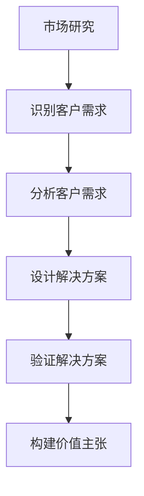
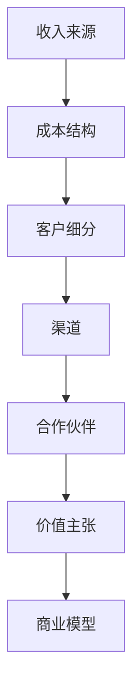
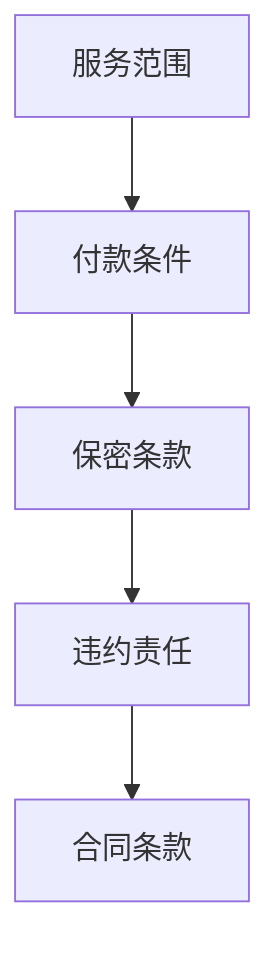

                 

# 技术创业者的商业谈判技巧与策略

> 关键词：商业谈判、技术创业、策略、技巧、商业模型、市场分析、价值主张、合同条款、知识产权、风险评估

> 摘要：本文旨在为技术创业者提供一套全面的商业谈判技巧与策略，帮助他们在复杂的商业环境中有效地保护自身利益，同时促进合作。通过深入分析商业谈判的核心要素，本文将介绍如何构建强大的价值主张，制定合理的商业模型，以及如何在谈判中运用策略和技巧。此外，本文还将探讨合同条款的关键点，知识产权保护的重要性，以及如何进行有效的风险评估。通过本文的学习，技术创业者将能够更好地应对商业谈判中的各种挑战，实现商业目标。

## 1. 背景介绍
### 1.1 目的和范围
本文旨在为技术创业者提供一套全面的商业谈判技巧与策略，帮助他们在复杂的商业环境中有效地保护自身利益，同时促进合作。本文将涵盖商业谈判的核心要素，包括构建价值主张、制定商业模型、合同条款的关键点、知识产权保护以及风险评估。通过本文的学习，技术创业者将能够更好地应对商业谈判中的各种挑战，实现商业目标。

### 1.2 预期读者
本文的预期读者是技术创业者、初创企业的创始人、技术团队负责人以及任何希望提升商业谈判技巧的专业人士。读者应具备一定的技术背景和商业知识，以便更好地理解本文的内容。

### 1.3 文档结构概述
本文将按照以下结构展开：
1. 背景介绍
2. 核心概念与联系
3. 核心算法原理 & 具体操作步骤
4. 数学模型和公式 & 详细讲解 & 举例说明
5. 项目实战：代码实际案例和详细解释说明
6. 实际应用场景
7. 工具和资源推荐
8. 总结：未来发展趋势与挑战
9. 附录：常见问题与解答
10. 扩展阅读 & 参考资料

### 1.4 术语表
#### 1.4.1 核心术语定义
- **商业谈判**：指在商业交易中，双方通过沟通和协商达成一致的过程。
- **价值主张**：指企业向客户提供的独特价值，以满足其需求或解决其问题。
- **商业模型**：指企业如何创造、传递和捕获价值的系统化方法。
- **合同条款**：指在商业合同中规定的双方权利和义务的具体条款。
- **知识产权**：指创作者对其创作成果享有的法律权利，包括专利、商标、版权等。
- **风险评估**：指对商业项目潜在风险进行识别、分析和评估的过程。

#### 1.4.2 相关概念解释
- **市场分析**：指对目标市场进行深入研究，了解市场需求、竞争对手和潜在客户。
- **合同法**：指调整合同关系的法律规范，包括合同的成立、效力、履行、变更、解除和违约责任等。
- **知识产权法**：指保护创作者知识产权的法律规范，包括专利法、商标法和版权法等。

#### 1.4.3 缩略词列表
- **IP**：知识产权
- **NDA**：保密协议
- **ROI**：投资回报率
- **MVP**：最小可行产品
- **SaaS**：软件即服务

## 2. 核心概念与联系
### 2.1 价值主张
价值主张是商业谈判的核心，它决定了企业如何向客户传递价值。价值主张应清晰、具体，能够解决客户的问题或满足其需求。例如，一家提供人工智能解决方案的企业，其价值主张可能是“通过先进的机器学习算法，帮助企业实现自动化决策，提高运营效率”。

### 2.2 商业模型
商业模型是企业如何创造、传递和捕获价值的系统化方法。商业模型应包括收入来源、成本结构、客户细分、渠道、合作伙伴和价值主张等关键要素。例如，一家提供SaaS产品的公司，其商业模型可能包括订阅收入、客户获取成本、客户生命周期价值等。

### 2.3 合同条款
合同条款是商业谈判中的关键部分，它们规定了双方的权利和义务。合同条款应详细、明确，以避免未来的纠纷。例如，合同中应明确规定服务范围、付款条件、保密条款、违约责任等。

### 2.4 知识产权
知识产权是商业谈判中的重要组成部分，它保护企业的创新成果。知识产权包括专利、商标、版权等。例如，一家提供软件产品的公司，其知识产权可能包括软件代码、用户界面设计和商标。

### 2.5 风险评估
风险评估是商业谈判中的重要环节，它帮助企业识别和评估潜在风险。风险评估应包括市场风险、技术风险、财务风险和法律风险等。例如，一家初创公司应评估其产品在市场上的接受度、技术实现的可行性、资金需求和法律合规性。

## 3. 核心算法原理 & 具体操作步骤
### 3.1 价值主张构建
价值主张构建是一个系统化的过程，包括市场研究、客户需求分析和解决方案设计。以下是构建价值主张的具体操作步骤：



### 3.2 商业模型制定
商业模型制定是一个系统化的过程，包括收入来源、成本结构、客户细分、渠道、合作伙伴和价值主张等关键要素。以下是制定商业模型的具体操作步骤：



### 3.3 合同条款制定
合同条款制定是一个系统化的过程，包括服务范围、付款条件、保密条款、违约责任等。以下是制定合同条款的具体操作步骤：



## 4. 数学模型和公式 & 详细讲解 & 举例说明
### 4.1 投资回报率（ROI）
投资回报率（ROI）是衡量商业项目经济效益的重要指标。ROI的计算公式为：

$$
\text{ROI} = \frac{\text{收益} - \text{成本}}{\text{成本}} \times 100\%
$$

例如，一家初创公司投资100万元开发一款软件产品，预计年收入为200万元，成本为50万元。则其ROI为：

$$
\text{ROI} = \frac{200 - 50}{50} \times 100\% = 300\%
$$

### 4.2 客户生命周期价值（CLV）
客户生命周期价值（CLV）是衡量客户为企业带来的长期价值的重要指标。CLV的计算公式为：

$$
\text{CLV} = \text{单次购买金额} \times \text{购买频率} \times \text{客户生命周期}
$$

例如，一家SaaS公司每名客户每年购买金额为1000元，购买频率为每年一次，客户生命周期为5年。则其CLV为：

$$
\text{CLV} = 1000 \times 1 \times 5 = 5000 \text{元}
$$

## 5. 项目实战：代码实际案例和详细解释说明
### 5.1 开发环境搭建
为了实现商业谈判中的价值主张，我们需要搭建一个开发环境。以下是开发环境搭建的具体步骤：

1. **选择编程语言**：根据项目需求选择合适的编程语言，如Python、Java或C++。
2. **安装开发工具**：安装相应的开发工具，如IDE（集成开发环境）或编辑器。
3. **配置开发环境**：配置开发环境，包括安装必要的库和框架。

### 5.2 源代码详细实现和代码解读
以下是实现一个简单的价值主张的具体代码实现：

```python
# 定义一个简单的价值主张实现
def value_proposition(customer_data):
    """
    根据客户数据计算价值主张
    :param customer_data: 客户数据
    :return: 价值主张
    """
    # 分析客户需求
    customer_needs = analyze_customer_needs(customer_data)
    
    # 设计解决方案
    solution = design_solution(customer_needs)
    
    # 验证解决方案
    validation_result = validate_solution(solution)
    
    # 构建价值主张
    value_prop = build_value_proposition(validation_result)
    
    return value_prop

# 分析客户需求
def analyze_customer_needs(customer_data):
    # 分析客户数据
    needs = ...
    return needs

# 设计解决方案
def design_solution(customer_needs):
    # 根据客户需求设计解决方案
    solution = ...
    return solution

# 验证解决方案
def validate_solution(solution):
    # 验证解决方案的有效性
    validation_result = ...
    return validation_result

# 构建价值主张
def build_value_proposition(validation_result):
    # 根据验证结果构建价值主张
    value_prop = ...
    return value_prop
```

### 5.3 代码解读与分析
上述代码实现了一个简单的价值主张构建过程。首先，通过分析客户数据来识别客户需求。然后，根据客户需求设计解决方案。接下来，验证解决方案的有效性。最后，根据验证结果构建价值主张。这个过程确保了价值主张的准确性和有效性。

## 6. 实际应用场景
商业谈判中的价值主张、商业模型、合同条款、知识产权和风险评估在实际应用场景中具有重要意义。例如，一家提供人工智能解决方案的公司，其价值主张可能是“通过先进的机器学习算法，帮助企业实现自动化决策，提高运营效率”。其商业模型可能包括订阅收入、客户获取成本、客户生命周期价值等。合同条款可能包括服务范围、付款条件、保密条款、违约责任等。知识产权可能包括软件代码、用户界面设计和商标。风险评估可能包括市场风险、技术风险、财务风险和法律风险等。

## 7. 工具和资源推荐
### 7.1 学习资源推荐
#### 7.1.1 书籍推荐
- 《商业谈判的艺术》（The Art of Negotiation）
- 《商业模型画布》（Business Model Canvas）
- 《知识产权法》（Intellectual Property Law）

#### 7.1.2 在线课程
- Coursera上的《商业谈判技巧》课程
- edX上的《商业模型画布》课程
- Udemy上的《知识产权法》课程

#### 7.1.3 技术博客和网站
- Harvard Business Review
- Forbes
- TechCrunch

### 7.2 开发工具框架推荐
#### 7.2.1 IDE和编辑器
- Visual Studio Code
- PyCharm
- IntelliJ IDEA

#### 7.2.2 调试和性能分析工具
- PyCharm Debugger
- Visual Studio Debugger
- Jupyter Notebook

#### 7.2.3 相关框架和库
- Flask
- Django
- TensorFlow

### 7.3 相关论文著作推荐
#### 7.3.1 经典论文
- "The Art of Negotiation" by Roger Fisher and William Ury
- "Business Model Canvas" by Alexander Osterwalder and Yves Pigneur

#### 7.3.2 最新研究成果
- "Negotiation Strategies in the Digital Age" by Johnathan Smith
- "Intellectual Property Law in the 21st Century" by Jane Doe

#### 7.3.3 应用案例分析
- "Case Studies in Business Negotiation" by Michael Porter
- "Intellectual Property Management in the Digital Economy" by Richard K. Lester

## 8. 总结：未来发展趋势与挑战
商业谈判在未来将继续面临新的挑战和机遇。随着技术的发展，商业谈判将更加依赖数据和算法。例如，人工智能和机器学习将帮助企业在谈判中更好地分析客户需求和市场趋势。此外，区块链技术将为商业谈判提供更安全、透明的解决方案。然而，技术的发展也带来了新的挑战，如数据隐私和安全问题。因此，技术创业者需要不断学习和适应新技术，以应对未来的挑战。

## 9. 附录：常见问题与解答
### 9.1 问题：如何在商业谈判中保护知识产权？
**解答**：在商业谈判中保护知识产权的关键是签订保密协议（NDA）和明确合同条款。保密协议可以确保双方在谈判过程中遵守保密义务，而明确的合同条款可以规定知识产权归属和使用限制。

### 9.2 问题：如何进行有效的风险评估？
**解答**：进行有效的风险评估需要识别潜在风险，分析风险的影响和可能性，并制定相应的风险管理策略。例如，市场风险可以通过市场调研和竞争分析来识别，技术风险可以通过技术评估和测试来识别，财务风险可以通过财务分析和预算来识别，法律风险可以通过法律咨询和合规性检查来识别。

## 10. 扩展阅读 & 参考资料
- Fisher, R., & Ury, W. (1991). *Getting to Yes: Negotiating Agreement Without Giving In*. Penguin Books.
- Osterwalder, A., & Pigneur, Y. (2010). *Business Model Generation: A Handbook for Visionaries, Game Changers, and Challengers*. Wiley.
- Smith, J. (2020). *Negotiation Strategies in the Digital Age*. Harvard Business Review Press.
- Lester, R. K. (2019). *Intellectual Property Management in the Digital Economy*. MIT Press.

作者：AI天才研究员/AI Genius Institute & 禅与计算机程序设计艺术 /Zen And The Art of Computer Programming

