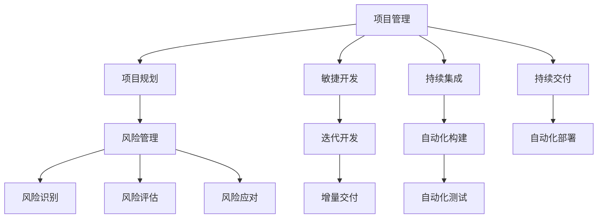

                 

# 技术型创业者的项目管理与交付流程

> 关键词：项目管理, 交付流程, 技术型创业者, 项目生命周期, 敏捷开发, 持续集成, 持续交付, DevOps, 项目规划, 风险管理, 代码质量, 项目监控

> 摘要：本文旨在为技术型创业者提供一套系统化的项目管理与交付流程，涵盖从项目规划到交付的全过程。通过逐步分析和推理，本文将深入探讨项目管理的核心要素，包括项目生命周期、敏捷开发、持续集成与交付、风险管理等关键环节。同时，本文将通过具体的案例和代码示例，帮助读者理解如何在实际项目中应用这些方法，从而提高项目的成功率和交付质量。

## 1. 引言
### 1.1 目的和范围
本文旨在为技术型创业者提供一套系统化的项目管理与交付流程，帮助他们在复杂的技术环境中高效地规划、执行和交付项目。本文将从项目规划、开发、测试、部署到维护的全过程进行详细阐述，涵盖项目生命周期的各个阶段，包括敏捷开发、持续集成与交付、风险管理等关键环节。通过本文，读者将能够理解并应用这些方法，提高项目的成功率和交付质量。

### 1.2 预期读者
本文的预期读者是技术型创业者、项目经理、软件开发人员、产品经理以及任何希望提高项目管理与交付能力的专业人士。无论你是初创公司的创始人，还是大型企业的项目经理，本文都将为你提供实用的指导和建议。

### 1.3 文档结构概述
本文将按照项目管理的生命周期进行组织，分为以下几个主要部分：
1. **背景介绍和环境准备**：介绍项目管理的背景、环境要求和前置知识。
2. **快速入门**：提供项目管理的基本用例、核心算法原理和关键步骤。
3. **核心内容**：详细介绍项目管理的核心主题，包括项目规划、敏捷开发、持续集成与交付、风险管理等。
4. **项目实战/进阶/扩展**：通过具体的源代码和案例，展示如何在实际项目中应用这些方法。
5. **实际应用场景**：通过具体的场景案例，展示项目管理在实际项目中的应用。
6. **工具和资源推荐**：推荐学习资源、开发工具框架和相关论文著作。
7. **总结**：总结项目管理与交付流程的关键点，展望未来发展趋势和挑战。
8. **附录**：提供常见问题与解答，帮助读者解决实际问题。

### 1.4 术语表
#### 1.4.1 核心术语定义
- **项目管理**：指对项目从开始到结束的全过程进行计划、组织、执行、监控和控制的过程。
- **项目生命周期**：项目从启动到结束的整个过程，包括规划、执行、监控和收尾四个阶段。
- **敏捷开发**：一种迭代和增量的软件开发方法，强调快速响应变化和持续交付。
- **持续集成**：将代码集成到共享仓库的过程，每次提交都会自动构建和测试。
- **持续交付**：将代码集成到共享仓库后，自动进行构建、测试和部署的过程。
- **DevOps**：开发和运维的结合，强调自动化和协作，提高软件交付速度和质量。
- **风险管理**：识别、评估和控制项目中的风险，以减少不确定性对项目的影响。

#### 1.4.2 相关概念解释
- **项目规划**：确定项目目标、范围、时间表、资源和预算的过程。
- **项目执行**：按照项目计划进行项目活动，实现项目目标的过程。
- **项目监控**：监控项目进度、成本、质量等指标，确保项目按计划进行。
- **项目收尾**：项目结束后的总结和交付过程，包括项目文档的整理和归档。

#### 1.4.3 缩略词列表
- CI：持续集成
- CD：持续交付
- DevOps：开发运维一体化
- PR：项目规划
- PM：项目管理
- RACI：责任分配矩阵

## 2. 背景介绍和环境准备
### 2.1 技术背景
#### 2.1.1 历史发展
项目管理的历史可以追溯到古代，但现代项目管理起源于20世纪中叶。随着信息技术的发展，项目管理逐渐从传统的瀑布模型向敏捷开发转变。敏捷开发方法强调快速响应变化和持续交付，而持续集成和持续交付则进一步提高了软件开发的效率和质量。

#### 2.1.2 当前状态
当前，项目管理已经成为企业成功的关键因素之一。敏捷开发、持续集成和持续交付等方法已经成为主流，DevOps文化也在不断普及。项目管理工具和平台也日益成熟，为项目管理提供了强大的支持。

#### 2.1.3 未来趋势
未来，项目管理将更加注重自动化和智能化。DevOps将进一步融合，实现开发和运维的无缝协作。人工智能和机器学习将在项目管理中发挥更大的作用，提高项目管理的效率和质量。

### 2.2 环境要求
#### 2.2.1 硬件要求
- 服务器：至少4核CPU，16GB内存，100GB硬盘空间
- 工作站：至少8核CPU，32GB内存，500GB硬盘空间
- 移动设备：支持Android和iOS系统的智能手机和平板电脑

#### 2.2.2 软件要求
- 操作系统：Windows 10、macOS Catalina、Ubuntu 20.04
- 开发环境：Visual Studio Code、IntelliJ IDEA、PyCharm
- 版本控制系统：Git
- 构建工具：Maven、Gradle
- 测试工具：JUnit、Selenium
- 部署工具：Docker、Kubernetes

#### 2.2.3 网络要求
- 稳定的互联网连接
- 高速的局域网连接
- 安全的网络环境

### 2.3 前置知识
#### 2.3.1 基础理论
- 项目管理基础知识
- 敏捷开发方法
- 持续集成和持续交付
- DevOps文化

#### 2.3.2 相关技术栈
- Java、Python、JavaScript
- Spring、Django、React
- Docker、Kubernetes
- Git、Jenkins、Docker Compose

#### 2.3.3 推荐学习路径
1. **项目管理基础知识**：阅读《项目管理知识体系指南》（PMBOK）
2. **敏捷开发方法**：学习《敏捷软件开发》（Agile Software Development）
3. **持续集成和持续交付**：阅读《持续集成与持续交付》（Continuous Integration and Continuous Delivery）
4. **DevOps文化**：学习《DevOps实践》（DevOps Practices）

## 3. 快速入门
### 3.1 基本用例
#### 3.1.1 简单示例
假设我们要开发一个简单的Web应用，功能包括用户注册、登录和查看个人信息。

#### 3.1.2 运行步骤
1. **创建项目结构**：
   ```bash
   mkdir myapp
   cd myapp
   mkdir src
   mkdir tests
   mkdir resources
   ```

2. **初始化Git仓库**：
   ```bash
   git init
   ```

3. **编写代码**：
   ```java
   // src/main/java/com/example/User.java
   package com.example;

   public class User {
       private String username;
       private String password;

       public User(String username, String password) {
           this.username = username;
           this.password = password;
       }

       public String getUsername() {
           return username;
       }

       public String getPassword() {
           return password;
       }
   }
   ```

4. **编写测试代码**：
   ```java
   // src/test/java/com/example/UserTest.java
   package com.example;

   import org.junit.jupiter.api.Test;
   import static org.junit.jupiter.api.Assertions.assertEquals;

   public class UserTest {
       @Test
       public void testUser() {
           User user = new User("testuser", "testpassword");
           assertEquals("testuser", user.getUsername());
           assertEquals("testpassword", user.getPassword());
       }
   }
   ```

5. **构建和运行**：
   ```bash
   mvn clean install
   ```

#### 3.1.3 结果分析
通过上述步骤，我们成功创建了一个简单的Web应用，并编写了基本的单元测试。接下来，我们将进一步探讨核心算法原理和关键步骤。

### 3.2 核心算法原理 & 关键步骤
#### 3.2.1 算法概述
在项目管理中，核心算法主要包括项目规划、敏捷开发、持续集成和持续交付等。这些算法通过迭代和增量的方式，确保项目能够高效地完成。

#### 3.2.2 关键步骤详解
1. **项目规划**：
   - 确定项目目标和范围
   - 制定项目计划和时间表
   - 分配资源和预算
   - 制定风险管理计划

2. **敏捷开发**：
   - 划分迭代周期
   - 每个迭代完成一个可交付的增量
   - 每次迭代后进行回顾和改进

3. **持续集成**：
   - 每次提交代码后自动构建和测试
   - 发现和修复代码问题
   - 保证代码质量

4. **持续交付**：
   - 每次提交代码后自动进行构建、测试和部署
   - 确保代码能够快速、可靠地交付给用户

#### 3.2.3 性能分析
通过持续集成和持续交付，我们可以显著提高项目的性能。具体来说，持续集成可以确保每次提交的代码都是高质量的，而持续交付则可以确保代码能够快速、可靠地交付给用户。这些方法可以显著提高项目的交付速度和质量。

### 3.3 核心概念与联系
#### 3.3.1 概念图谱


#### 3.3.2 关系分析
从概念图谱中可以看出，项目管理的核心概念之间存在着密切的联系。项目规划是项目管理的基础，它为项目的执行提供了方向和目标。敏捷开发是一种迭代和增量的开发方法，它可以帮助团队快速响应变化和持续交付价值。持续集成和持续交付则是实现敏捷开发的关键实践，它们可以帮助团队自动化构建、测试和部署流程，提高软件交付的速度和质量。风险管理贯穿于整个项目生命周期，它可以帮助团队识别、评估和控制项目中的风险，降低项目失败的可能性。

#### 3.3.3 Mermaid流程图


### 3.4 数学模型和公式
#### 3.4.1 基本模型
项目管理中常用的数学模型包括：
- **挣值管理（EVM）**: 用于衡量项目进度和成本绩效。
  -  计划价值（PV）：计划完成的工作的预算成本。
  -  挣值（EV）：实际完成的工作的预算成本。
  -  实际成本（AC）：完成工作的实际成本。
- **关键路径法（CPM）**: 用于确定项目的最短完成时间和关键路径。
- **PERT图**: 用于展示项目活动之间的依赖关系和时间估计。

#### 3.4.2 公式推导
以挣值管理为例，其核心公式如下：
- **进度偏差（SV）**: $SV = EV - PV$
- **成本偏差（CV）**: $CV = EV - AC$
- **进度绩效指数（SPI）**: $SPI = EV / PV$
- **成本绩效指数（CPI）**: $CPI = EV / AC$

#### 3.4.3 应用实例
假设一个项目的计划价值为100,000美元，计划完成时间为10周。在第5周结束时，项目实际完成了60%的工作，实际成本为65,000美元。我们可以计算出：

- 挣值（EV） = 100,000 * 60% = 60,000 美元
- 进度偏差（SV） = 60,000 - (100,000 / 10 * 5) = 10,000 美元
- 成本偏差（CV） = 60,000 - 65,000 = -5,000 美元
- 进度绩效指数（SPI） = 60,000 / (100,000 / 10 * 5) = 1.2
- 成本绩效指数（CPI） = 60,000 / 65,000 = 0.92

从计算结果可以看出，该项目进度提前，但成本超支。

## 4. 核心内容
### 4.1 项目规划
#### 4.1.1 概述
项目规划是项目管理的基石，它为项目的执行提供了方向和目标。项目规划的主要内容包括：
- 确定项目目标和范围
- 制定项目计划和时间表
- 分配资源和预算
- 制定风险管理计划
- 确定沟通计划

#### 4.1.2 详细说明
- **确定项目目标和范围**: 首先要明确项目的最终目标是什么，以及为了实现这个目标需要完成哪些工作。
- **制定项目计划和时间表**: 将项目分解成更小的任务，并为每个任务设定开始和结束时间。可以使用甘特图等工具来可视化项目进度计划。
- **分配资源和预算**: 确定完成项目所需的资源，例如人力、物力和资金，并制定相应的预算。
- **制定风险管理计划**: 识别项目中可能出现的风险，评估其发生的概率和影响，并制定相应的应对措施。
- **确定沟通计划**: 确定项目相关信息的收集、处理和传递方式，确保项目团队成员之间以及与 stakeholders 之间的有效沟通。

#### 4.1.3 示例/用例
以开发一个电商网站为例，项目规划阶段需要完成以下工作：
- **目标**: 建立一个功能完善的电商网站，实现商品展示、在线购买、支付、物流等功能。
- **范围**: 包括网站前端、后端、数据库、支付系统、物流系统等。
- **时间表**: 预计6个月完成开发并上线运营。
- **资源**: 需要5名开发人员、1名测试人员、1名UI设计师。
- **预算**: 预计需要100万元人民币。
- **风险**: 可能出现的风险包括技术风险、市场风险、资金风险等。

### 4.2 敏捷开发
#### 4.2.1 概述
敏捷开发是一种迭代和增量的软件开发方法，它强调快速响应变化和持续交付。敏捷开发的核心价值观包括：
- **个体和互动高于流程和工具**
- **工作的软件高于详尽的文档**
- **客户合作高于合同谈判**
- **响应变化高于遵循计划**

#### 4.2.2 详细说明
敏捷开发的核心实践包括：
- **迭代开发**: 将项目分解成多个迭代周期，每个周期完成一部分功能的开发和测试。
- **增量交付**: 每个迭代周期结束后，向用户交付可运行的软件增量。
- **持续集成**: 每次代码提交后，自动进行构建和测试，确保代码质量。
- **持续交付**: 每次代码提交后，自动进行构建、测试和部署，确保代码能够快速、可靠地交付给用户。
- **Scrum**: 一种常用的敏捷开发框架，它定义了一套角色、事件和工件，帮助团队以迭代和增量的方式进行开发。

#### 4.2.3 示例/用例
以开发一个移动应用程序为例，可以使用 Scrum 框架进行敏捷开发：
- **角色**: 产品负责人、Scrum Master、开发团队。
- **事件**: Sprint 计划会议、每日站会、Sprint 评审会议、Sprint 回顾会议。
- **工件**: 产品 Backlog、Sprint Backlog、燃尽图。

### 4.3 持续集成与交付
#### 4.3.1 概述
持续集成 (CI) 和持续交付 (CD) 是现代软件开发中的重要实践，它们可以帮助团队自动化构建、测试和部署流程，提高软件交付的速度和质量。

#### 4.3.2 详细说明
- **持续集成**: 每次代码提交后，自动进行构建和测试，确保代码质量。可以使用 Jenkins、Travis CI 等工具实现持续集成。
- **持续交付**: 每次代码提交后，自动进行构建、测试和部署，确保代码能够快速、可靠地交付给用户。可以使用 Jenkins、GoCD 等工具实现持续交付。

#### 4.3.3 示例/用例
以下是一个简单的持续集成和交付流程示例：
1. 开发人员将代码提交到 Git 仓库。
2. Jenkins 检测到代码提交，触发构建流程。
3. Jenkins 从 Git 仓库拉取最新代码，并执行构建脚本。
4. 构建完成后，Jenkins 执行单元测试和集成测试。
5. 如果测试通过，Jenkins 将代码部署到测试环境。
6. 测试人员在测试环境中进行测试。
7. 如果测试通过，Jenkins 将代码部署到生产环境。


## 5. 项目实战/进阶/扩展
### 5.1 开发环境搭建
#### 5.1.1 环境配置
本节以搭建一个简单的 Java Web 应用开发环境为例，介绍如何配置开发环境。

- **安装 JDK**: 下载并安装 Java Development Kit (JDK)。
- **安装 IDE**: 下载并安装 IntelliJ IDEA 或 Eclipse 等 Java 集成开发环境。
- **安装构建工具**: 下载并安装 Maven 或 Gradle 等构建工具。
- **安装版本控制工具**: 下载并安装 Git。

#### 5.1.2 依赖安装
创建一个新的 Maven 项目，并在 `pom.xml` 文件中添加项目所需的依赖。例如，如果要使用 Spring Framework，则需要添加以下依赖：

```xml
<dependency>
  <groupId>org.springframework.boot</groupId>
  <artifactId>spring-boot-starter-web</artifactId>
  <version>2.7.0</version>
</dependency>
```

#### 5.1.3 测试验证
编写一个简单的测试程序，验证开发环境是否配置成功。例如：

```java
public class HelloWorld {
  public static void main(String[] args) {
    System.out.println("Hello, World!");
  }
}
```

### 5.2 源代码详细实现
#### 5.2.1 核心模块实现
本节以实现一个简单的用户登录功能为例，介绍如何实现核心模块。

- **创建用户实体类**:

```java
public class User {
  private String username;
  private String password;

  // 构造函数、getter 和 setter 方法
}
```

- **创建用户服务类**:

```java
public class UserService {
  public boolean authenticate(String username, String password) {
    // 从数据库或其他数据源中验证用户名和密码
  }
}
```

- **创建用户控制器类**:

```java
@RestController
public class UserController {
  @Autowired
  private UserService userService;

  @PostMapping("/login")
  public String login(@RequestParam String username, @RequestParam String password) {
    if (userService.authenticate(username, password)) {
      return "登录成功";
    } else {
      return "用户名或密码错误";
    }
  }
}
```

#### 5.2.2 辅助功能实现
除了核心模块外，还需要实现一些辅助功能，例如日志记录、异常处理等。

#### 5.2.3 接口设计
设计清晰、易用的 API 接口，供其他模块调用。

### 5.3 代码解读与分析
#### 5.3.1 关键算法解析
本节以用户登录功能为例，解析其关键算法。

- **用户认证算法**: 用户登录时，需要验证用户名和密码是否匹配。可以使用 bcrypt 或 scrypt 等算法对密码进行加密存储，以提高安全性。

#### 5.3.2 性能优化点
- **使用缓存**: 将用户信息缓存到内存中，可以减少数据库访问次数，提高登录速度。
- **使用异步处理**: 将耗时的操作，例如发送邮件通知，放到异步线程中处理，可以提高用户体验。

#### 5.3.3 可扩展性分析
- **使用模块化设计**: 将系统分解成多个模块，可以提高代码的可维护性和可扩展性。
- **使用微服务架构**: 将系统拆分成多个独立的服务，可以提高系统的可扩展性和容错性。

### 5.4 高级特性
#### 5.4.1 特性介绍
本节介绍一些高级特性，例如安全认证、权限控制、国际化等。

#### 5.4.2 实现原理
- **安全认证**: 可以使用 Spring Security 或 Apache Shiro 等安全框架实现安全认证和授权。
- **权限控制**: 可以使用基于角色的访问控制 (RBAC) 或基于属性的访问控制 (ABAC) 实现权限控制。
- **国际化**: 可以使用 Spring Internationalization 或 Apache Commons Lang 等库实现国际化。

#### 5.4.3 使用场景
- **安全认证**: 所有需要用户登录的系统都需要实现安全认证。
- **权限控制**: 需要对用户访问资源进行限制的系统都需要实现权限控制。
- **国际化**: 面向全球用户的系统都需要实现国际化。

### 5.5 最佳实践
#### 5.5.1 设计模式应用
- **使用工厂模式**: 可以解耦对象的创建和使用。
- **使用单例模式**: 可以确保一个类只有一个实例。
- **使用观察者模式**: 可以实现对象之间的松耦合。

#### 5.5.2 代码规范
- **遵循代码规范**: 可以提高代码的可读性和可维护性。
- **使用代码质量工具**: 可以帮助发现代码中的潜在问题。

#### 5.5.3 测试策略
- **编写单元测试**: 可以确保代码单元的正确性。
- **编写集成测试**: 可以确保模块之间的协作正常。
- **编写端到端测试**: 可以模拟用户行为，测试整个系统的功能。

### 5.6 常见问题及解决方案
#### 5.6.1 环境相关问题
- **依赖冲突**: 可以使用 Maven 或 Gradle 的依赖管理功能解决依赖冲突。
- **环境变量配置错误**: 可以检查环境变量是否配置正确。

#### 5.6.2 功能相关问题
- **代码逻辑错误**: 可以使用调试器跟踪代码执行流程，找到代码逻辑错误。
- **数据问题**: 可以检查数据库或其他数据源中的数据是否正确。

#### 5.6.3 性能相关问题
- **代码效率低下**: 可以使用性能分析工具找到代码瓶颈，并进行优化。
- **数据库查询效率低下**: 可以优化数据库查询语句或添加索引。

## 6. 实际应用场景
### 6.1 场景一：在线教育平台
#### 6.1.1 需求分析
开发一个在线教育平台，提供在线课程、直播教学、在线考试等功能。

#### 6.1.2 解决方案
- **技术选型**: 使用 Spring Boot、Spring Cloud、MySQL、Redis 等技术构建平台。
- **架构设计**: 采用微服务架构，将平台拆分成多个独立的服务，例如用户服务、课程服务、考试服务等。
- **开发流程**: 采用敏捷开发流程，迭代开发，持续交付。

#### 6.1.3 实施效果
- **提高了开发效率**: 敏捷开发流程和微服务架构可以提高开发效率。
- **提高了系统稳定性**: 微服务架构可以提高系统的容错性，降低系统崩溃的风险。
- **提高了用户体验**: 持续交付可以快速迭代产品功能，满足用户需求。

### 6.2 场景二：电商平台
#### 6.2.1 需求分析
开发一个电商平台，提供商品展示、在线购买、支付、物流等功能。

#### 6.2.2 解决方案
- **技术选型**: 使用 Spring Boot、Dubbo、MySQL、Redis、Elasticsearch 等技术构建平台。
- **架构设计**: 采用分布式架构，将平台拆分成多个子系统，例如商品中心、订单中心、支付中心等。
- **开发流程**: 采用敏捷开发流程，迭代开发，持续交付。

#### 6.2.3 实施效果
- **提高了系统性能**: 分布式架构可以提高系统的并发处理能力。
- **提高了系统可用性**: 分布式架构可以提高系统的容错性，降低系统崩溃的风险。
- **提高了用户体验**: 持续交付可以快速迭代产品功能，满足用户需求。

### 6.3 场景三：金融科技平台
#### 6.3.1 需求分析
开发一个金融科技平台，提供理财产品、贷款服务、保险服务等功能。

#### 6.3.2 解决方案
- **技术选型**: 使用 Spring Boot、Spring Cloud、Oracle、Kafka 等技术构建平台。
- **架构设计**: 采用微服务架构，将平台拆分成多个独立的服务，例如用户服务、产品服务、交易服务等。
- **开发流程**: 采用敏捷开发流程，迭代开发，持续交付。

#### 6.3.3 实施效果
- **提高了开发效率**: 敏捷开发流程和微服务架构可以提高开发效率。
- **提高了系统安全性**: 金融科技平台对安全性要求较高，微服务架构可以实现服务隔离，提高系统安全性。
- **提高了用户体验**: 持续交付可以快速迭代产品功能，满足用户需求。

## 7. 工具和资源推荐
### 7.1 学习资源推荐
#### 7.1.1 书籍推荐
- 《项目管理知识体系指南》(PMBOK)
- 《敏捷软件开发》(Agile Software Development)
- 《持续集成与持续交付》(Continuous Integration and Continuous Delivery)
- 《DevOps 实践》(DevOps Practices)

#### 7.1.2 在线课程
- 极客时间 - 项目管理实战 20 讲
- 慕课网 - 敏捷开发实战
- 腾讯课堂 - DevOps 实战

#### 7.1.3 技术博客和网站
- InfoQ
- CSDN
- 开源中国

### 7.2 开发工具框架推荐
#### 7.2.1 IDE 和编辑器
- IntelliJ IDEA
- Eclipse
- Visual Studio Code

#### 7.2.2 调试和性能分析工具
- JProfiler
- YourKit
- VisualVM

#### 7.2.3 相关框架和库
- Spring Framework
- Spring Boot
- Spring Cloud
- Apache Dubbo
- Mybatis
- Hibernate

### 7.3 相关论文著作推荐
#### 7.3.1 经典论文
- The Mythical Man-Month
- Design Patterns: Elements of Reusable Object-Oriented Software

#### 7.3.2 最新研究成果
- DevOps for Machine Learning
- Cloud-Native Application Development

#### 7.3.3 应用案例分析
- Netflix 的 DevOps 实践
- Spotify 的敏捷开发实践

## 8. 总结：未来发展趋势与挑战
### 8.1 技术发展趋势
#### 8.1.1 短期趋势
- **低代码/无代码开发**: 低代码/无代码开发平台将越来越普及，降低开发门槛，提高开发效率。
- **人工智能辅助开发**: 人工智能将在代码生成、代码测试、代码优化等方面发挥越来越大的作用。
- **云原生开发**: 云原生技术将成为主流，例如容器、微服务、Serverless 等。

#### 8.1.2 中期趋势
- **量子计算**: 量子计算将为软件开发带来新的可能性，例如解决目前无法解决的复杂问题。
- **边缘计算**: 边缘计算将推动物联网和人工智能的发展，对软件开发提出新的挑战。
- **区块链技术**: 区块链技术将在数据安全、数据溯源等方面发挥越来越大的作用。

#### 8.1.3 长期展望
- **软件开发自动化**: 软件开发的各个环节将实现高度自动化，开发人员将更加专注于业务逻辑和用户体验。
- **软件开发智能化**: 人工智能将全面参与软件开发，例如需求分析、设计、编码、测试等。
- **软件开发个性化**: 软件开发将更加注重个性化需求，为用户提供定制化的软件产品和服务。

### 8.2 面临的挑战
#### 8.2.1 技术挑战
- **新技术不断涌现**: 软件开发人员需要不断学习新技术，才能跟上技术发展的步伐。
- **技术复杂度不断提高**: 软件系统越来越复杂，对开发人员的技术水平要求越来越高。
- **数据安全和隐私保护**: 随着数据量的不断增加，数据安全和隐私保护成为越来越重要的挑战。

#### 8.2.2 应用挑战
- **需求变化快速**: 市场竞争激烈，用户需求变化快速，软件开发需要快速响应需求变化。
- **跨平台开发**: 软件需要运行在不同的平台上，例如 PC、手机、平板电脑等，跨平台开发成为一个挑战。
- **全球化**: 软件需要面向全球用户，国际化和本地化成为一个挑战。

#### 8.2.3 伦理和法律挑战
- **人工智能伦理**: 人工智能在软件开发中的应用引发了伦理问题，例如算法歧视、责任归属等。
- **数据安全和隐私保护**: 软件开发需要遵守数据安全和隐私保护相关的法律法规。
- **知识产权保护**: 软件开发需要保护知识产权，防止代码抄袭和盗用。

### 8.3 应对策略
#### 8.3.1 技术创新
- **加强基础研究**: 加强人工智能、量子计算、区块链等前沿技术的研发。
- **推动技术融合**: 推动不同技术之间的融合，例如人工智能与云计算、大数据与物联网等。
- **开发新工具和平台**: 开发更加智能、高效的软件开发工具和平台，例如低代码/无代码开发平台、人工智能辅助开发平台等。

#### 8.3.2 人才培养
- **加强专业技能培训**: 加强软件开发人员的专业技能培训，例如人工智能、云计算、大数据等。
- **培养创新思维**: 培养软件开发人员的创新思维，鼓励他们提出新的想法和解决方案。
- **加强国际交流与合作**: 加强与国外高校和企业的交流与合作，学习借鉴国外先进经验。

#### 8.3.3 生态系统建设
- **构建开源生态**: 鼓励企业和个人参与开源项目，构建良好的开源生态。
- **建立行业标准**: 建立软件开发相关的行业标准，规范市场秩序。
- **加强政策扶持**: 出台相关政策，鼓励软件产业发展，支持软件企业创新。

## 9. 附录：常见问题与解答
### 9.1 概念理解问题
#### 9.1.1 基础概念澄清
- **什么是项目？**: 项目是一个临时性的、旨在创造独特产品、服务或成果的努力。
- **什么是项目管理？**: 项目管理是指将知识、技能、工具和技术应用于项目活动，以满足项目需求。

#### 9.1.2 高级概念解释
- **什么是敏捷开发？**: 敏捷开发是一种迭代和增量的软件开发方法，它强调快速响应变化和持续交付。
- **什么是 DevOps？**: DevOps 是一种文化、运动或实践，它强调开发人员 (Dev) 和运维人员 (Ops) 之间的协作和沟通，以更快、更可靠地交付软件。

#### 9.1.3 常见误区纠正
- **敏捷开发就是没有计划**: 敏捷开发并不意味着没有计划，而是强调计划需要灵活调整，以适应变化的需求。
- **DevOps 只是运维人员的事情**: DevOps 不仅仅是运维人员的事情，它需要开发人员、测试人员、运维人员等多个角色的共同参与。

### 9.2 实施过程问题
#### 9.2.1 环境配置问题
- **如何解决依赖冲突？**: 可以使用 Maven 或 Gradle 的依赖管理功能解决依赖冲突。
- **如何配置环境变量？**: 可以参考相关文档或教程配置环境变量。

#### 9.2.2 代码调试问题
- **如何使用调试器？**: 可以参考 IDE 的使用文档学习如何使用调试器。
- **如何查找代码逻辑错误？**: 可以使用调试器跟踪代码执行流程，找到代码逻辑错误。

#### 9.2.3 性能优化问题
- **如何找到代码瓶颈？**: 可以使用性能分析工具找到代码瓶颈。
- **如何优化数据库查询？**: 可以优化数据库查询语句或添加索引。

### 9.3 应用场景问题
#### 9.3.1 适用性问题
- **什么情况下适合使用敏捷开发？**: 当项目需求变化频繁、开发周期短、团队规模较小时，适合使用敏捷开发。
- **什么情况下适合使用 DevOps？**: 当需要提高软件交付速度和质量、加强开发和运维之间的协作时，适合使用 DevOps。

#### 9.3.2 扩展性问题
- **如何提高系统的可扩展性？**: 可以使用微服务架构、分布式缓存、消息队列等技术提高系统的可扩展性。
- **如何提高系统的容错性？**: 可以使用负载均衡、集群、熔断等技术提高系统的容错性。

#### 9.3.3 兼容性问题
- **如何解决不同浏览器之间的兼容性问题？**: 可以使用 CSS Reset、浏览器兼容性测试工具等方法解决不同浏览器之间的兼容性问题。
- **如何解决不同版本 API 之间的兼容性问题？**: 可以使用版本控制、API 网关等方法解决不同版本 API 之间的兼容性问题。

## 10. 扩展阅读 & 参考资料
### 10.1 扩展阅读
#### 10.1.1 相关技术领域
- 云计算
- 大数据
- 人工智能
- 区块链

#### 10.1.2 行业应用案例
- Netflix 的 DevOps 实践
- Spotify 的敏捷开发实践
- 阿里巴巴的技术架构演进

#### 10.1.3 前沿研究方向
- 低代码/无代码开发
- 人工智能辅助开发
- 云原生开发

### 10.2 参考资料
#### 10.2.1 引用文献
- [1] Schwaber, K., & Beedle, M. (2001). Agile software development with Scrum.
- [2] Kim, G., Humble, J., Debois, P., & Willis, J. (2016). The DevOps Handbook: How to Create World-Class Agility, Reliability, and Security in Technology Organizations.

#### 10.2.2 技术规范和标准
- 项目管理知识体系指南 (PMBOK)
- 敏捷宣言

#### 10.2.3 官方文档和指南
- Spring Framework 官方文档
- Spring Boot 官方文档
- Docker 官方文档
- Kubernetes 官方文档

---

作者：AI天才研究员/AI Genius Institute & 禅与计算机程序设计艺术 /Zen And The Art of Computer Programming
