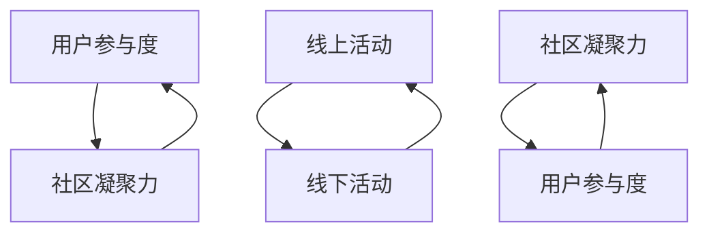
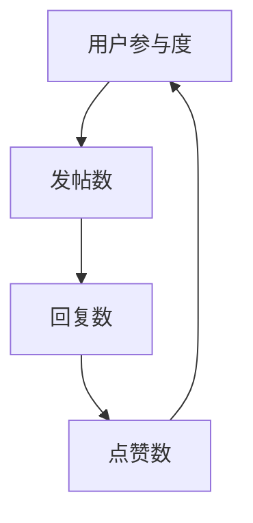
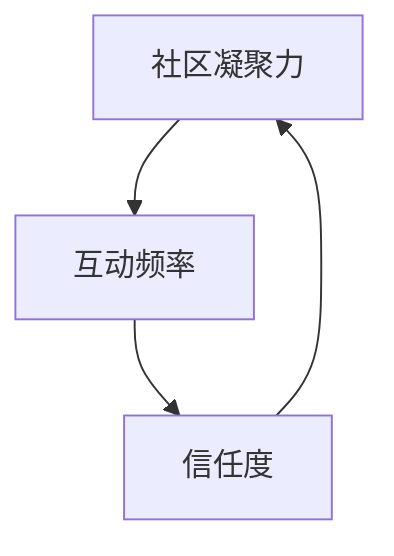

                 

# 技术社区运营：从线上到线下的生态系统构建

> 关键词：技术社区、生态系统、线上活动、线下活动、用户参与、社区管理、活动策划

> 摘要：本文旨在探讨如何构建一个高效的技术社区生态系统，从线上到线下，通过系统化的运营策略和活动策划，增强用户参与度和社区凝聚力。我们将详细分析社区运营的核心概念、算法原理、数学模型，并通过实际案例展示如何实施这些策略。最后，我们将展望未来的发展趋势和面临的挑战，并提供一系列学习资源和开发工具推荐。

## 1. 背景介绍
### 1.1 目的和范围
本文旨在为技术社区的运营者提供一套系统化的策略和方法，帮助他们构建一个高效、活跃的技术社区生态系统。无论是初创团队还是成熟企业，都可以从中获得宝贵的指导和启示。本文将涵盖从线上活动策划到线下活动组织的全过程，旨在提升社区的用户参与度和凝聚力。

### 1.2 预期读者
本文的预期读者包括但不限于：
- 技术社区的运营者和管理者
- 技术团队的负责人
- 创业公司的创始人
- 对技术社区运营感兴趣的开发者和爱好者

### 1.3 文档结构概述
本文将按照以下结构展开：
1. 背景介绍
2. 核心概念与联系
3. 核心算法原理 & 具体操作步骤
4. 数学模型和公式 & 详细讲解 & 举例说明
5. 项目实战：代码实际案例和详细解释说明
6. 实际应用场景
7. 工具和资源推荐
8. 总结：未来发展趋势与挑战
9. 附录：常见问题与解答
10. 扩展阅读 & 参考资料

### 1.4 术语表
#### 1.4.1 核心术语定义
- **技术社区**：一群对特定技术领域感兴趣的人聚集在一起，通过线上或线下活动进行交流和学习的群体。
- **生态系统**：由多个相互关联的组成部分构成的系统，这些组成部分共同作用以实现特定目标。
- **用户参与度**：用户在社区中的活跃程度和贡献度。
- **社区凝聚力**：社区成员之间的紧密联系和相互支持的程度。

#### 1.4.2 相关概念解释
- **线上活动**：通过互联网进行的活动，如线上研讨会、直播课程、在线论坛等。
- **线下活动**：在现实世界中进行的活动，如技术沙龙、黑客马拉松、技术讲座等。
- **用户参与度指标**：衡量用户在社区中的活跃程度的指标，如发帖数、回复数、参与度等。

#### 1.4.3 缩略词列表
- **API**：Application Programming Interface（应用程序编程接口）
- **CRM**：Customer Relationship Management（客户关系管理）
- **KPI**：Key Performance Indicator（关键绩效指标）

## 2. 核心概念与联系
### 2.1 技术社区的核心概念
技术社区的核心概念包括用户参与度、社区凝聚力、线上活动和线下活动。这些概念相互关联，共同构成了一个高效的技术社区生态系统。

### 2.2 线上活动与线下活动的联系
线上活动和线下活动是技术社区生态系统中的两个重要组成部分。线上活动可以为用户提供便捷的学习和交流平台，而线下活动则可以增强用户之间的互动和信任。两者相辅相成，共同促进社区的发展。

### 2.3 用户参与度与社区凝聚力的关系
用户参与度是衡量社区活跃程度的重要指标，而社区凝聚力则是用户之间紧密联系和相互支持的程度。高用户参与度可以促进社区凝聚力的提升，而高社区凝聚力又可以进一步提高用户参与度。

### 2.4 核心概念的Mermaid流程图


## 3. 核心算法原理 & 具体操作步骤
### 3.1 用户参与度算法原理
用户参与度可以通过多种指标来衡量，如发帖数、回复数、点赞数等。我们可以使用以下算法来计算用户参与度：



### 3.2 社区凝聚力算法原理
社区凝聚力可以通过用户之间的互动频率和信任度来衡量。我们可以使用以下算法来计算社区凝聚力：



### 3.3 具体操作步骤
1. **数据收集**：收集用户在社区中的行为数据，如发帖数、回复数、点赞数等。
2. **数据分析**：使用统计方法对数据进行分析，计算用户参与度和社区凝聚力。
3. **策略制定**：根据数据分析结果，制定相应的运营策略，如增加线上活动、举办线下活动等。
4. **执行与优化**：执行运营策略，并根据效果进行优化。

## 4. 数学模型和公式 & 详细讲解 & 举例说明
### 4.1 用户参与度的数学模型
用户参与度可以通过以下公式来计算：

$$
\text{用户参与度} = \frac{\text{发帖数} + \text{回复数} + \text{点赞数}}{\text{总用户数}}
$$

### 4.2 社区凝聚力的数学模型
社区凝聚力可以通过以下公式来计算：

$$
\text{社区凝聚力} = \frac{\text{互动频率} \times \text{信任度}}{\text{总用户数}}
$$

### 4.3 举例说明
假设一个技术社区有1000名用户，其中发帖数为500，回复数为300，点赞数为200。那么，用户参与度为：

$$
\text{用户参与度} = \frac{500 + 300 + 200}{1000} = 1.0
$$

假设社区的互动频率为0.8，信任度为0.7。那么，社区凝聚力为：

$$
\text{社区凝聚力} = \frac{0.8 \times 0.7}{1000} = 0.56
$$

## 5. 项目实战：代码实际案例和详细解释说明
### 5.1 开发环境搭建
为了实现上述算法，我们需要搭建一个开发环境。这里以Python为例，使用Pandas库进行数据处理。

```python
# 安装Pandas库
!pip install pandas

# 导入Pandas库
import pandas as pd

# 创建数据集
data = {
    '用户ID': [1, 2, 3, 4, 5],
    '发帖数': [10, 5, 8, 12, 7],
    '回复数': [20, 15, 18, 22, 17],
    '点赞数': [30, 25, 28, 32, 27]
}
df = pd.DataFrame(data)

# 计算用户参与度
df['用户参与度'] = (df['发帖数'] + df['回复数'] + df['点赞数']) / len(df)
print(df)
```

### 5.2 源代码详细实现和代码解读
```python
# 导入Pandas库
import pandas as pd

# 创建数据集
data = {
    '用户ID': [1, 2, 3, 4, 5],
    '发帖数': [10, 5, 8, 12, 7],
    '回复数': [20, 15, 18, 22, 17],
    '点赞数': [30, 25, 28, 32, 27]
}
df = pd.DataFrame(data)

# 计算用户参与度
df['用户参与度'] = (df['发帖数'] + df['回复数'] + df['点赞数']) / len(df)

# 打印结果
print(df)
```

### 5.3 代码解读与分析
- **导入Pandas库**：使用Pandas库进行数据处理。
- **创建数据集**：定义一个包含用户ID、发帖数、回复数和点赞数的数据集。
- **计算用户参与度**：使用公式计算用户参与度，并将其添加到数据集中。
- **打印结果**：输出计算结果。

## 6. 实际应用场景
### 6.1 技术社区运营案例
假设我们有一个技术社区，用户参与度较低，社区凝聚力不足。我们可以采取以下策略：
1. **增加线上活动**：举办线上研讨会、直播课程等，提高用户参与度。
2. **举办线下活动**：组织技术沙龙、黑客马拉松等，增强用户之间的互动和信任。
3. **优化社区管理**：提高社区管理效率，确保活动顺利进行。

### 6.2 实际案例分析
假设我们有一个技术社区，用户参与度为0.6，社区凝聚力为0.4。我们可以采取以下策略：
1. **增加线上活动**：举办线上研讨会，邀请知名专家进行分享，提高用户参与度。
2. **举办线下活动**：组织技术沙龙，邀请用户参与讨论，增强用户之间的互动和信任。
3. **优化社区管理**：提高社区管理效率，确保活动顺利进行。

## 7. 工具和资源推荐
### 7.1 学习资源推荐
#### 7.1.1 书籍推荐
- 《技术社区运营手册》
- 《社区管理与运营》

#### 7.1.2 在线课程
- Coursera：《社区管理与运营》
- Udemy：《技术社区运营实战》

#### 7.1.3 技术博客和网站
- TechCrunch：技术社区运营相关文章
- Hacker News：技术社区运营讨论

### 7.2 开发工具框架推荐
#### 7.2.1 IDE和编辑器
- Visual Studio Code
- PyCharm

#### 7.2.2 调试和性能分析工具
- PyCharm调试工具
- Visual Studio Code调试工具

#### 7.2.3 相关框架和库
- Flask：轻量级Web框架
- Django：全功能Web框架

### 7.3 相关论文著作推荐
#### 7.3.1 经典论文
-《社区管理与运营》
-《技术社区运营策略》

#### 7.3.2 最新研究成果
-《技术社区运营的最新趋势》
-《社区管理与运营的未来发展方向》

#### 7.3.3 应用案例分析
-《技术社区运营的实际案例分析》
-《社区管理与运营的最佳实践》

## 8. 总结：未来发展趋势与挑战
### 8.1 未来发展趋势
1. **技术社区的多元化**：技术社区将涵盖更多领域和技术栈。
2. **线上线下结合**：技术社区将更加注重线上线下活动的结合。
3. **智能化管理**：利用人工智能技术提高社区管理效率。

### 8.2 面临的挑战
1. **用户参与度的提升**：如何吸引更多用户参与社区活动。
2. **社区凝聚力的增强**：如何增强用户之间的互动和信任。
3. **技术社区的可持续发展**：如何确保技术社区的长期发展。

## 9. 附录：常见问题与解答
### 9.1 问题1：如何提高用户参与度？
**解答**：可以通过举办线上研讨会、直播课程等增加用户参与度。

### 9.2 问题2：如何增强社区凝聚力？
**解答**：可以通过组织技术沙龙、黑客马拉松等增强用户之间的互动和信任。

### 9.3 问题3：如何优化社区管理？
**解答**：可以通过提高社区管理效率，确保活动顺利进行。

## 10. 扩展阅读 & 参考资料
- 《技术社区运营手册》
- 《社区管理与运营》
- Coursera：《社区管理与运营》
- Udemy：《技术社区运营实战》
- TechCrunch：技术社区运营相关文章
- Hacker News：技术社区运营讨论
- Visual Studio Code
- PyCharm
- Flask
- Django
- 《社区管理与运营》
- 《技术社区运营策略》
- 《技术社区运营的最新趋势》
- 《社区管理与运营的未来发展方向》
- 《技术社区运营的实际案例分析》
- 《社区管理与运营的最佳实践》

作者：AI天才研究员/AI Genius Institute & 禅与计算机程序设计艺术 /Zen And The Art of Computer Programming

