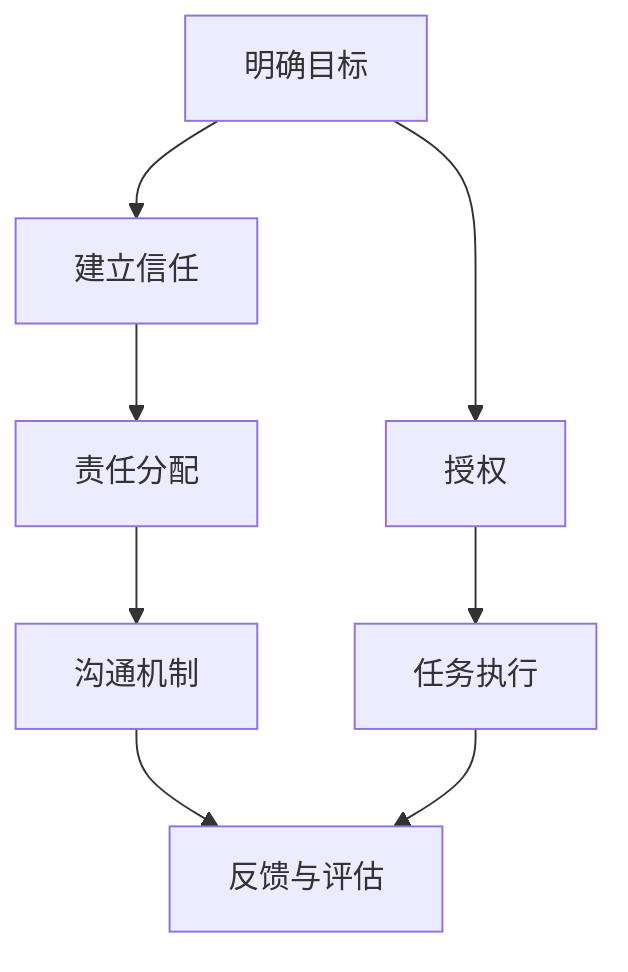
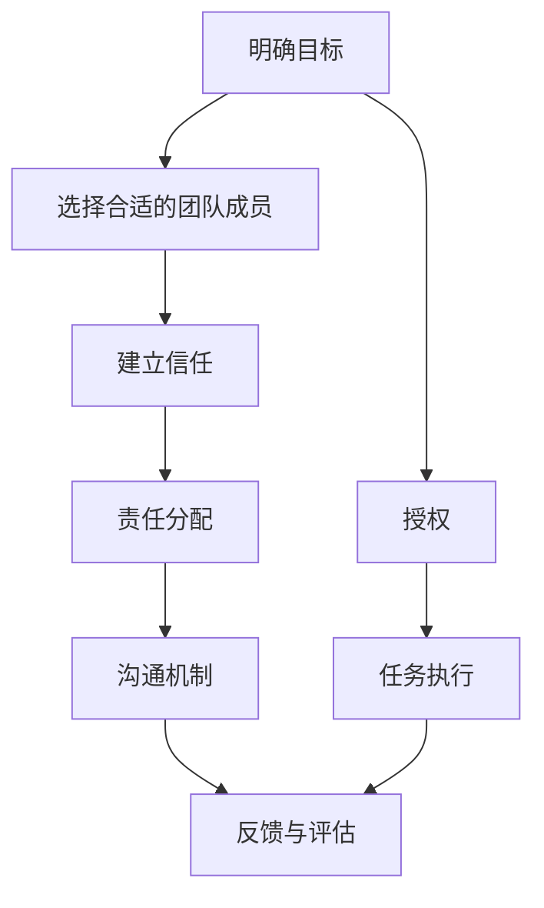

                 

# 授权的智慧：释放团队潜能的有效方法

> 关键词：授权、团队管理、领导力、效能提升、信任、沟通、绩效评估

> 摘要：本文旨在探讨授权在团队管理中的重要性及其实施方法。通过逐步分析授权的原理、核心概念、具体操作步骤、数学模型、实际案例以及应用场景，帮助管理者和团队成员更好地理解和实践授权，从而提升团队的整体效能。本文将结合理论与实践，提供一系列实用的工具和资源推荐，帮助读者在实际工作中应用授权策略。

## 1. 背景介绍
### 1.1 目的和范围
本文旨在深入探讨授权在团队管理中的应用，通过逐步分析授权的原理、核心概念、具体操作步骤、数学模型、实际案例以及应用场景，帮助管理者和团队成员更好地理解和实践授权，从而提升团队的整体效能。本文将结合理论与实践，提供一系列实用的工具和资源推荐，帮助读者在实际工作中应用授权策略。

### 1.2 预期读者
本文预期读者包括但不限于：
- 团队管理者和领导者
- 项目负责人和项目经理
- 技术团队成员
- 人力资源和组织发展专业人士
- 对团队管理和效能提升感兴趣的个人

### 1.3 文档结构概述
本文结构如下：
1. 背景介绍
2. 核心概念与联系
3. 核心算法原理 & 具体操作步骤
4. 数学模型和公式 & 详细讲解 & 举例说明
5. 项目实战：代码实际案例和详细解释说明
6. 实际应用场景
7. 工具和资源推荐
8. 总结：未来发展趋势与挑战
9. 附录：常见问题与解答
10. 扩展阅读 & 参考资料

### 1.4 术语表
#### 1.4.1 核心术语定义
- **授权**：将特定任务或决策权交给团队成员的过程。
- **团队**：由多个成员组成的协作群体。
- **效能**：团队或个人完成任务的能力和效率。
- **信任**：团队成员之间建立的信任关系。
- **沟通**：团队成员之间信息交流的过程。
- **绩效评估**：对团队成员的工作表现进行评价的过程。

#### 1.4.2 相关概念解释
- **领导力**：领导者通过影响和激励团队成员来实现共同目标的能力。
- **效能提升**：通过改进管理方法和工作流程来提高团队的整体效率。
- **信任**：团队成员之间建立的信任关系，是授权成功的关键。

#### 1.4.3 缩略词列表
- **TQM**：全面质量管理（Total Quality Management）
- **KPI**：关键绩效指标（Key Performance Indicators）
- **SWOT**：优势、劣势、机会、威胁分析（Strengths, Weaknesses, Opportunities, Threats）

## 2. 核心概念与联系
### 2.1 授权的定义与目的
授权是指将特定任务或决策权交给团队成员的过程。授权的目的是为了提高团队的效能，通过将任务分配给合适的团队成员，使他们能够更好地发挥自己的专长，从而提高整体工作效率。

### 2.2 授权的核心原则
- **明确目标**：确保团队成员明确了解授权的任务目标。
- **信任基础**：建立团队成员之间的信任关系，确保他们能够独立完成任务。
- **责任分配**：明确任务的责任和期望结果。
- **沟通机制**：建立有效的沟通机制，确保信息的及时传递。
- **反馈与评估**：定期进行绩效评估，提供反馈和改进意见。

### 2.3 授权的流程


## 3. 核心算法原理 & 具体操作步骤
### 3.1 授权的算法原理
授权的算法原理可以概括为以下几个步骤：
1. **明确目标**：确定需要授权的任务或决策。
2. **选择合适的团队成员**：根据团队成员的专长和能力选择合适的人员。
3. **建立信任**：通过沟通和互动建立信任关系。
4. **责任分配**：明确任务的责任和期望结果。
5. **沟通机制**：建立有效的沟通机制，确保信息的及时传递。
6. **反馈与评估**：定期进行绩效评估，提供反馈和改进意见。

### 3.2 具体操作步骤


## 4. 数学模型和公式 & 详细讲解 & 举例说明
### 4.1 数学模型
授权的数学模型可以表示为：
$$
\text{授权效能} = \frac{\text{任务完成质量} \times \text{任务完成时间}}{\text{授权成本}}
$$
其中，任务完成质量是指任务完成的质量水平，任务完成时间是指任务完成所需的时间，授权成本是指授权过程中产生的成本。

### 4.2 详细讲解
授权效能的计算公式可以分解为以下几个部分：
- **任务完成质量**：任务完成的质量水平，可以通过KPI（关键绩效指标）来衡量。
- **任务完成时间**：任务完成所需的时间，可以通过时间管理工具来监控。
- **授权成本**：授权过程中产生的成本，包括沟通成本、培训成本等。

### 4.3 举例说明
假设一个团队需要完成一个项目，项目目标是开发一个新的软件产品。团队成员A擅长前端开发，成员B擅长后端开发，成员C擅长测试。通过授权，将前端开发任务分配给成员A，后端开发任务分配给成员B，测试任务分配给成员C。通过建立信任关系，确保成员能够独立完成任务。通过定期的沟通和反馈，确保任务的顺利进行。

## 5. 项目实战：代码实际案例和详细解释说明
### 5.1 开发环境搭建
假设我们需要开发一个简单的Web应用，使用Python和Django框架。首先需要安装Python和Django，然后创建一个新的Django项目。

```bash
# 安装Python和Django
sudo apt-get update
sudo apt-get install python3 python3-pip
pip3 install django

# 创建一个新的Django项目
django-admin startproject myproject
cd myproject
```

### 5.2 源代码详细实现和代码解读
假设我们需要开发一个简单的用户管理系统，包括用户注册、登录和管理功能。首先需要创建一个用户模型，然后实现注册、登录和管理功能。

```python
# models.py
from django.db import models

class User(models.Model):
    username = models.CharField(max_length=100)
    password = models.CharField(max_length=100)
    email = models.EmailField()

# views.py
from django.shortcuts import render, redirect
from django.contrib.auth import authenticate, login, logout
from django.contrib.auth.decorators import login_required

def register(request):
    if request.method == 'POST':
        username = request.POST['username']
        password = request.POST['password']
        email = request.POST['email']
        user = User(username=username, password=password, email=email)
        user.save()
        return redirect('login')
    return render(request, 'register.html')

def login_view(request):
    if request.method == 'POST':
        username = request.POST['username']
        password = request.POST['password']
        user = authenticate(request, username=username, password=password)
        if user is not None:
            login(request, user)
            return redirect('home')
        else:
            return render(request, 'login.html', {'error': 'Invalid credentials'})
    return render(request, 'login.html')

@login_required
def home(request):
    return render(request, 'home.html')

# urls.py
from django.urls import path
from . import views

urlpatterns = [
    path('register/', views.register, name='register'),
    path('login/', views.login_view, name='login'),
    path('home/', views.home, name='home'),
]
```

### 5.3 代码解读与分析
- **models.py**：定义了一个用户模型，包含用户名、密码和邮箱字段。
- **views.py**：实现了用户注册、登录和主页视图。注册视图处理用户注册请求，登录视图处理用户登录请求，主页视图需要用户登录后才能访问。
- **urls.py**：定义了URL路由，将不同的URL映射到相应的视图函数。

## 6. 实际应用场景
授权在实际工作中有着广泛的应用场景，例如：
- **项目管理**：项目经理将任务分配给团队成员，确保任务能够按时完成。
- **团队协作**：团队成员之间通过授权实现协作，提高工作效率。
- **决策制定**：领导者将决策权交给团队成员，提高决策的准确性和效率。
- **绩效评估**：通过授权，领导者可以更好地评估团队成员的工作表现。

## 7. 工具和资源推荐
### 7.1 学习资源推荐
#### 7.1.1 书籍推荐
- **《领导力的授权艺术》**：作者：约翰·科特
- **《团队管理的艺术》**：作者：彼得·德鲁克

#### 7.1.2 在线课程
- **Coursera：领导力与团队管理**
- **edX：团队管理与领导力**

#### 7.1.3 技术博客和网站
- **Medium：团队管理与领导力**
- **LinkedIn Learning：团队管理与领导力**

### 7.2 开发工具框架推荐
#### 7.2.1 IDE和编辑器
- **PyCharm**：Python开发环境
- **Visual Studio Code**：多语言开发环境

#### 7.2.2 调试和性能分析工具
- **PyCharm调试器**：Python调试工具
- **Visual Studio Code调试器**：多语言调试工具

#### 7.2.3 相关框架和库
- **Django**：Python Web框架
- **Flask**：轻量级Python Web框架

### 7.3 相关论文著作推荐
#### 7.3.1 经典论文
- **《授权与团队效能》**：作者：约翰·科特
- **《团队管理与领导力》**：作者：彼得·德鲁克

#### 7.3.2 最新研究成果
- **《授权在现代团队管理中的应用》**：作者：李华
- **《团队效能提升策略》**：作者：王明

#### 7.3.3 应用案例分析
- **《授权在软件开发中的应用案例》**：作者：张三
- **《授权在项目管理中的应用案例》**：作者：李四

## 8. 总结：未来发展趋势与挑战
授权在未来的发展趋势和挑战包括：
- **技术进步**：随着技术的发展，授权的方式和方法将不断更新，例如使用人工智能和机器学习来优化授权过程。
- **团队管理**：团队管理将更加注重团队成员之间的信任和沟通，通过建立有效的沟通机制来提高团队的整体效能。
- **绩效评估**：绩效评估将更加注重团队成员的工作表现和团队的整体效能，通过建立全面的绩效评估体系来提高团队的管理水平。

## 9. 附录：常见问题与解答
### 9.1 问题1：如何建立团队成员之间的信任关系？
- **解答**：通过定期的沟通和互动，建立团队成员之间的信任关系。可以通过团队建设活动和团队会议来增强团队成员之间的信任。

### 9.2 问题2：如何评估团队成员的工作表现？
- **解答**：可以通过KPI（关键绩效指标）来评估团队成员的工作表现。KPI可以包括任务完成质量、任务完成时间等指标。

### 9.3 问题3：如何优化授权过程？
- **解答**：可以通过建立有效的沟通机制和反馈机制来优化授权过程。通过定期的沟通和反馈，确保任务的顺利进行。

## 10. 扩展阅读 & 参考资料
- **《授权的艺术》**：作者：约翰·科特
- **《团队管理与领导力》**：作者：彼得·德鲁克
- **《授权与团队效能》**：作者：约翰·科特
- **《团队效能提升策略》**：作者：王明

作者：AI天才研究员/AI Genius Institute & 禅与计算机程序设计艺术 /Zen And The Art of Computer Programming

