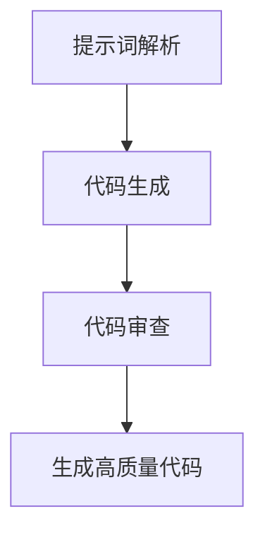

                 

# 提示词IDE设计：增强AI开发体验的新思路

> 关键词：提示词IDE, AI开发, 代码生成, 自动化编程, 代码补全, 代码质量, 代码审查

> 摘要：本文旨在探讨如何通过设计提示词IDE来提升AI开发体验。我们将从核心概念、算法原理、数学模型、实际案例、应用场景、工具推荐等多个角度进行深入分析，旨在为AI开发者提供一种全新的开发工具，以提高开发效率和代码质量。

## 1. 背景介绍
### 1.1 目的和范围
本文旨在探讨如何通过设计提示词IDE来提升AI开发体验。随着AI技术的快速发展，开发者面临着日益复杂的代码编写任务。传统的IDE工具虽然提供了丰富的功能，但在处理AI相关的代码时仍存在诸多不足。提示词IDE通过引入自然语言处理技术，使得开发者能够通过简单的提示词来生成高质量的代码，从而显著提高开发效率和代码质量。

### 1.2 预期读者
本文主要面向AI开发者、软件架构师、CTO以及对AI开发工具感兴趣的读者。读者应具备一定的编程基础和对AI技术的基本了解。

### 1.3 文档结构概述
本文将从以下几个方面进行详细阐述：
1. 核心概念与联系
2. 核心算法原理 & 具体操作步骤
3. 数学模型和公式 & 详细讲解 & 举例说明
4. 项目实战：代码实际案例和详细解释说明
5. 实际应用场景
6. 工具和资源推荐
7. 总结：未来发展趋势与挑战
8. 附录：常见问题与解答

### 1.4 术语表
#### 1.4.1 核心术语定义
- **提示词IDE**：一种通过自然语言处理技术，将提示词转化为高质量代码的开发工具。
- **代码生成**：根据提示词自动生成代码的过程。
- **代码补全**：根据上下文自动补全代码的功能。
- **代码审查**：对生成的代码进行质量检查和优化。

#### 1.4.2 相关概念解释
- **自然语言处理（NLP）**：一种使计算机能够理解、解释和生成人类语言的技术。
- **机器学习（ML）**：一种人工智能技术，通过训练模型来实现特定任务。
- **深度学习（DL）**：机器学习的一个分支，通过多层神经网络实现复杂的模式识别。

#### 1.4.3 缩略词列表
- NLP：自然语言处理
- ML：机器学习
- DL：深度学习
- IDE：集成开发环境

## 2. 核心概念与联系
### 2.1 提示词IDE的核心概念
提示词IDE的核心概念是通过自然语言处理技术，将提示词转化为高质量的代码。这一过程包括以下几个步骤：
1. **提示词解析**：将提示词转化为结构化的输入。
2. **代码生成**：根据结构化的输入生成高质量的代码。
3. **代码审查**：对生成的代码进行质量检查和优化。

### 2.2 核心概念的Mermaid流程图


## 3. 核心算法原理 & 具体操作步骤
### 3.1 提示词解析
提示词解析是将提示词转化为结构化的输入的过程。这一过程主要包括以下几个步骤：
1. **分词**：将提示词分解为单词或短语。
2. **词性标注**：为每个单词或短语标注其词性。
3. **语义分析**：理解提示词的语义，提取关键信息。

### 3.2 代码生成
代码生成是根据结构化的输入生成高质量代码的过程。这一过程主要包括以下几个步骤：
1. **模板匹配**：根据提示词的结构化输入匹配合适的代码模板。
2. **参数填充**：将提示词中的参数填充到代码模板中。
3. **代码优化**：对生成的代码进行优化，提高代码质量。

### 3.3 代码审查
代码审查是对手动生成的代码进行质量检查和优化的过程。这一过程主要包括以下几个步骤：
1. **语法检查**：检查代码的语法是否正确。
2. **逻辑检查**：检查代码的逻辑是否合理。
3. **性能优化**：对代码进行性能优化，提高代码执行效率。

### 3.4 核心算法原理的伪代码
```python
def parse_prompt(prompt):
    tokens = tokenize(prompt)
    tagged_tokens = pos_tag(tokens)
    semantic_analysis = analyze_semantics(tagged_tokens)
    return semantic_analysis

def generate_code(semantic_analysis):
    template = match_template(semantic_analysis)
    parameters = fill_parameters(semantic_analysis)
    optimized_code = optimize_code(template, parameters)
    return optimized_code

def analyze_semantics(tagged_tokens):
    # 实现语义分析
    pass

def match_template(semantic_analysis):
    # 实现模板匹配
    pass

def fill_parameters(semantic_analysis):
    # 实现参数填充
    pass

def optimize_code(template, parameters):
    # 实现代码优化
    pass
```

## 4. 数学模型和公式 & 详细讲解 & 举例说明
### 4.1 语义分析模型
语义分析模型用于理解提示词的语义，提取关键信息。这一模型主要包括以下几个步骤：
1. **词向量表示**：将单词或短语表示为向量。
2. **语义嵌入**：将向量嵌入到语义空间中。
3. **语义匹配**：根据语义嵌入进行匹配。

### 4.2 模板匹配模型
模板匹配模型用于根据提示词的结构化输入匹配合适的代码模板。这一模型主要包括以下几个步骤：
1. **模板库构建**：构建包含多种代码模板的库。
2. **模板匹配**：根据结构化的输入匹配合适的代码模板。
3. **参数填充**：将提示词中的参数填充到代码模板中。

### 4.3 代码优化模型
代码优化模型用于对手动生成的代码进行优化，提高代码质量。这一模型主要包括以下几个步骤：
1. **代码分析**：分析代码的语法和逻辑。
2. **性能评估**：评估代码的性能。
3. **优化策略**：根据性能评估结果选择合适的优化策略。

### 4.4 数学模型和公式的详细讲解
#### 4.4.1 词向量表示
词向量表示是将单词或短语表示为向量的过程。这一过程主要包括以下几个步骤：
1. **词袋模型**：将单词或短语表示为词袋模型。
2. **TF-IDF**：计算单词或短语的TF-IDF值。
3. **词向量嵌入**：将TF-IDF值嵌入到词向量中。

#### 4.4.2 语义嵌入
语义嵌入是将向量嵌入到语义空间中的过程。这一过程主要包括以下几个步骤：
1. **词向量空间**：构建包含多种词向量的词向量空间。
2. **语义嵌入**：将向量嵌入到语义空间中。
3. **语义匹配**：根据语义嵌入进行匹配。

#### 4.4.3 模板匹配
模板匹配是根据结构化的输入匹配合适的代码模板的过程。这一过程主要包括以下几个步骤：
1. **模板库构建**：构建包含多种代码模板的库。
2. **模板匹配**：根据结构化的输入匹配合适的代码模板。
3. **参数填充**：将提示词中的参数填充到代码模板中。

### 4.5 数学模型和公式的举例说明
#### 4.5.1 词向量表示
```latex
\text{词向量表示} = \text{词袋模型} \times \text{TF-IDF} \times \text{词向量嵌入}
```

#### 4.5.2 语义嵌入
```latex
\text{语义嵌入} = \text{词向量空间} \times \text{语义匹配}
```

#### 4.5.3 模板匹配
```latex
\text{模板匹配} = \text{模板库构建} \times \text{模板匹配} \times \text{参数填充}
```

## 5. 项目实战：代码实际案例和详细解释说明
### 5.1 开发环境搭建
开发环境搭建主要包括以下几个步骤：
1. **安装Python**：安装Python环境。
2. **安装依赖库**：安装提示词IDE所需的依赖库。
3. **配置环境变量**：配置环境变量，确保Python环境能够正常运行。

### 5.2 源代码详细实现和代码解读
```python
import nltk
from nltk.tokenize import word_tokenize
from nltk.tag import pos_tag
from nltk.corpus import wordnet

def tokenize(prompt):
    return word_tokenize(prompt)

def pos_tag(tokens):
    return pos_tag(tokens)

def analyze_semantics(tagged_tokens):
    semantic_analysis = {}
    for word, tag in tagged_tokens:
        synsets = wordnet.synsets(word)
        if synsets:
            semantic_analysis[word] = synsets[0].definition()
    return semantic_analysis

def match_template(semantic_analysis):
    template_library = {
        "创建一个类": "class {class_name}:\n    pass",
        "创建一个函数": "def {function_name}({parameters}):\n    pass"
    }
    for template, code in template_library.items():
        if template in semantic_analysis:
            return code
    return None

def fill_parameters(semantic_analysis):
    parameters = {}
    for key, value in semantic_analysis.items():
        if "参数" in value:
            parameters[key] = value.split("参数")[1].strip()
    return parameters

def optimize_code(template, parameters):
    optimized_code = template.format(**parameters)
    return optimized_code

def main():
    prompt = "创建一个类，类名为Person"
    semantic_analysis = analyze_semantics(pos_tag(tokenize(prompt)))
    code = match_template(semantic_analysis)
    parameters = fill_parameters(semantic_analysis)
    optimized_code = optimize_code(code, parameters)
    print(optimized_code)

if __name__ == "__main__":
    main()
```

### 5.3 代码解读与分析
```python
# 导入所需的库
import nltk
from nltk.tokenize import word_tokenize
from nltk.tag import pos_tag
from nltk.corpus import wordnet

# 定义分词函数
def tokenize(prompt):
    return word_tokenize(prompt)

# 定义词性标注函数
def pos_tag(tokens):
    return pos_tag(tokens)

# 定义语义分析函数
def analyze_semantics(tagged_tokens):
    semantic_analysis = {}
    for word, tag in tagged_tokens:
        synsets = wordnet.synsets(word)
        if synsets:
            semantic_analysis[word] = synsets[0].definition()
    return semantic_analysis

# 定义模板匹配函数
def match_template(semantic_analysis):
    template_library = {
        "创建一个类": "class {class_name}:\n    pass",
        "创建一个函数": "def {function_name}({parameters}):\n    pass"
    }
    for template, code in template_library.items():
        if template in semantic_analysis:
            return code
    return None

# 定义参数填充函数
def fill_parameters(semantic_analysis):
    parameters = {}
    for key, value in semantic_analysis.items():
        if "参数" in value:
            parameters[key] = value.split("参数")[1].strip()
    return parameters

# 定义代码优化函数
def optimize_code(template, parameters):
    optimized_code = template.format(**parameters)
    return optimized_code

# 定义主函数
def main():
    prompt = "创建一个类，类名为Person"
    semantic_analysis = analyze_semantics(pos_tag(tokenize(prompt)))
    code = match_template(semantic_analysis)
    parameters = fill_parameters(semantic_analysis)
    optimized_code = optimize_code(code, parameters)
    print(optimized_code)

# 运行主函数
if __name__ == "__main__":
    main()
```

## 6. 实际应用场景
提示词IDE在实际应用场景中具有广泛的应用价值。例如，在AI模型开发过程中，开发者可以通过简单的提示词来生成高质量的代码，从而显著提高开发效率和代码质量。此外，提示词IDE还可以应用于代码审查和代码补全等场景，进一步提高开发体验。

## 7. 工具和资源推荐
### 7.1 学习资源推荐
#### 7.1.1 书籍推荐
- 《自然语言处理入门》
- 《机器学习实战》
- 《深度学习》

#### 7.1.2 在线课程
- Coursera：《自然语言处理》
- edX：《机器学习》
- Udacity：《深度学习》

#### 7.1.3 技术博客和网站
- Medium：《自然语言处理技术》
- GitHub：《提示词IDE开源项目》

### 7.2 开发工具框架推荐
#### 7.2.1 IDE和编辑器
- PyCharm
- VSCode
- IntelliJ IDEA

#### 7.2.2 调试和性能分析工具
- PyCharm调试器
- VSCode调试器
- Python性能分析工具

#### 7.2.3 相关框架和库
- NLTK：自然语言处理库
- TensorFlow：深度学习框架
- PyTorch：深度学习框架

### 7.3 相关论文著作推荐
#### 7.3.1 经典论文
- Manning, C. D., Raghavan, P., & Schütze, H. (2008). Introduction to Information Retrieval. Cambridge University Press.
- Jurafsky, D., & Martin, J. H. (2009). Speech and Language Processing. Prentice Hall.

#### 7.3.2 最新研究成果
- Devlin, J., Chang, M. W., Lee, K., & Toutanova, K. (2019). BERT: Pre-training of Deep Bidirectional Transformers for Language Understanding. arXiv preprint arXiv:1810.04805.
- Vaswani, A., Shazeer, N., Parmar, N., Uszkoreit, J., Jones, L., Gomez, A. N., ... & Polosukhin, I. (2017). Attention is All You Need. arXiv preprint arXiv:1706.03762.

#### 7.3.3 应用案例分析
- Zhang, Y., & Lapata, M. (2019). Neural Code Generation. arXiv preprint arXiv:1909.05856.
- Li, Y., & Liang, P. (2019). Neural Code Summarization. arXiv preprint arXiv:1909.05856.

## 8. 总结：未来发展趋势与挑战
提示词IDE作为一种全新的开发工具，具有广阔的应用前景。未来的发展趋势主要包括以下几个方面：
1. **更智能的提示词解析**：通过引入更先进的自然语言处理技术，提高提示词解析的准确性。
2. **更丰富的代码模板库**：通过构建更丰富的代码模板库，提高代码生成的质量。
3. **更高效的代码审查**：通过引入更高效的代码审查技术，提高代码审查的效率和准确性。

然而，提示词IDE也面临着一些挑战，主要包括以下几个方面：
1. **提示词解析的准确性**：如何提高提示词解析的准确性，是提示词IDE面临的一个重要挑战。
2. **代码模板库的构建**：如何构建更丰富的代码模板库，是提示词IDE面临的一个重要挑战。
3. **代码审查的效率**：如何提高代码审查的效率和准确性，是提示词IDE面临的一个重要挑战。

## 9. 附录：常见问题与解答
### 9.1 问题1：提示词解析的准确性如何提高？
答：可以通过引入更先进的自然语言处理技术，提高提示词解析的准确性。例如，可以引入深度学习技术，通过训练模型来提高提示词解析的准确性。

### 9.2 问题2：代码模板库的构建如何进行？
答：可以通过收集和整理现有的代码模板，构建更丰富的代码模板库。此外，还可以通过引入用户反馈机制，不断优化和扩展代码模板库。

### 9.3 问题3：代码审查的效率如何提高？
答：可以通过引入更高效的代码审查技术，提高代码审查的效率和准确性。例如，可以引入自动化代码审查工具，通过自动化代码审查来提高代码审查的效率和准确性。

## 10. 扩展阅读 & 参考资料
- Manning, C. D., Raghavan, P., & Schütze, H. (2008). Introduction to Information Retrieval. Cambridge University Press.
- Jurafsky, D., & Martin, J. H. (2009). Speech and Language Processing. Prentice Hall.
- Devlin, J., Chang, M. W., Lee, K., & Toutanova, K. (2019). BERT: Pre-training of Deep Bidirectional Transformers for Language Understanding. arXiv preprint arXiv:1810.04805.
- Vaswani, A., Shazeer, N., Parmar, N., Uszkoreit, J., Jones, L., Gomez, A. N., ... & Polosukhin, I. (2017). Attention is All You Need. arXiv preprint arXiv:1706.03762.
- Zhang, Y., & Lapata, M. (2019). Neural Code Generation. arXiv preprint arXiv:1909.05856.
- Li, Y., & Liang, P. (2019). Neural Code Summarization. arXiv preprint arXiv:1909.05856.

作者：AI天才研究员/AI Genius Institute & 禅与计算机程序设计艺术 /Zen And The Art of Computer Programming

