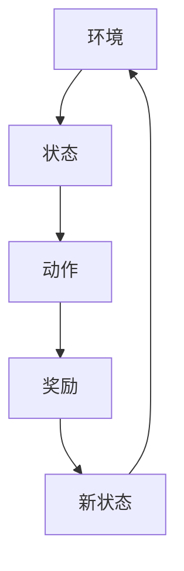
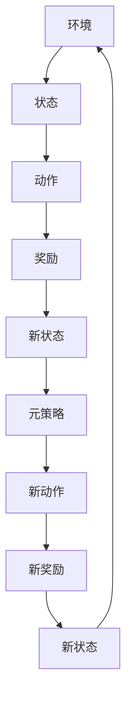
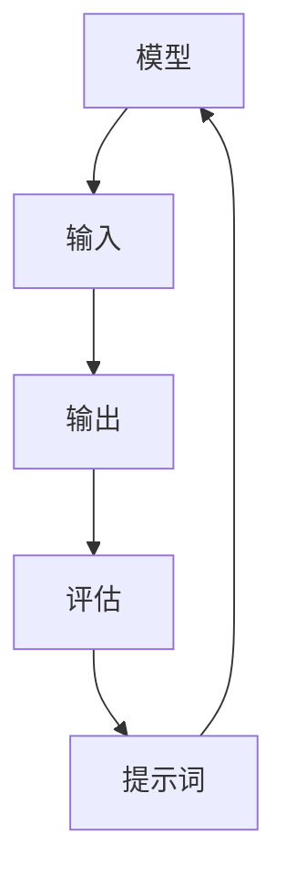
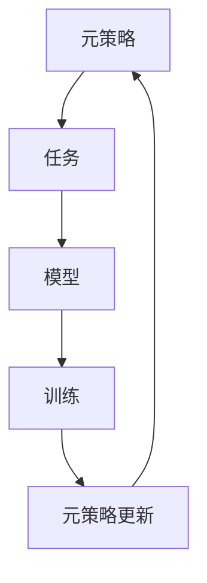
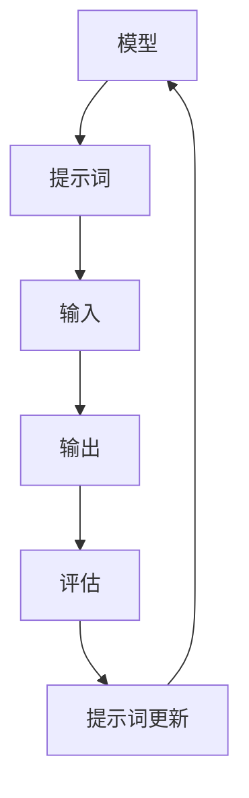
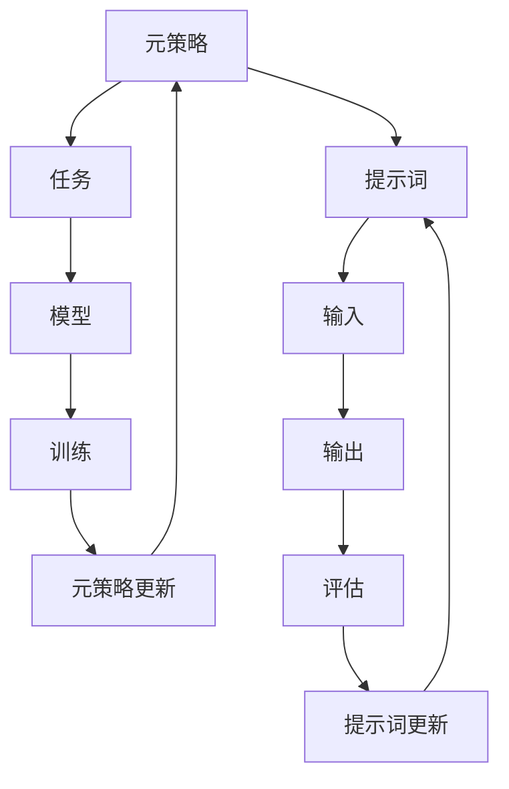

                 

# 提示词优化的元强化学习方法

> 关键词：元强化学习, 提示词优化, 机器学习, 强化学习, 自动化, 人工智能, 优化算法, 深度学习

> 摘要：本文旨在探讨如何利用元强化学习方法来优化提示词生成，以提高自然语言处理任务的性能。通过逐步分析和推理，我们将详细阐述元强化学习的基本原理、核心算法、数学模型，并通过实际代码案例展示其应用。此外，本文还将探讨该方法在实际场景中的应用价值，并提供学习资源和开发工具推荐，以帮助读者更好地理解和实践这一技术。

## 1. 背景介绍
### 1.1 目的和范围
本文旨在深入探讨提示词优化的元强化学习方法，通过系统地分析和推理，帮助读者理解这一技术的核心原理和实际应用。我们将从基本概念出发，逐步深入到算法原理、数学模型和实际案例，最终探讨其未来发展趋势和挑战。

### 1.2 预期读者
本文面向对自然语言处理、机器学习和强化学习感兴趣的读者，特别是那些希望深入了解提示词优化技术的研究人员和工程师。读者应具备一定的机器学习和强化学习基础知识。

### 1.3 文档结构概述
本文结构如下：
1. 背景介绍
2. 核心概念与联系
3. 核心算法原理 & 具体操作步骤
4. 数学模型和公式 & 详细讲解 & 举例说明
5. 项目实战：代码实际案例和详细解释说明
6. 实际应用场景
7. 工具和资源推荐
8. 总结：未来发展趋势与挑战
9. 附录：常见问题与解答
10. 扩展阅读 & 参考资料

### 1.4 术语表
#### 1.4.1 核心术语定义
- **提示词（Prompt）**：用于指导模型生成特定类型输出的文本输入。
- **强化学习（Reinforcement Learning, RL）**：一种通过试错学习来优化决策过程的机器学习方法。
- **元强化学习（Meta-Reinforcement Learning, MRL）**：一种强化学习的变体，旨在学习如何快速适应新任务。
- **自然语言处理（Natural Language Processing, NLP）**：研究计算机与人类自然语言交互的科学。

#### 1.4.2 相关概念解释
- **强化学习**：通过与环境交互来学习最优策略的过程。
- **元强化学习**：通过学习如何快速适应新任务来提高学习效率。
- **提示词优化**：通过优化提示词来提高模型在特定任务上的性能。

#### 1.4.3 缩略词列表
- RL: Reinforcement Learning
- MRL: Meta-Reinforcement Learning
- NLP: Natural Language Processing
- MAML: Model-Agnostic Meta-Learning

## 2. 核心概念与联系
### 2.1 强化学习的基本原理
强化学习是一种通过试错学习来优化决策过程的方法。其核心在于通过与环境交互来学习最优策略。强化学习的基本流程如下：



### 2.2 元强化学习的基本原理
元强化学习旨在学习如何快速适应新任务。其核心在于通过学习一个元策略来指导模型快速适应新任务。元强化学习的基本流程如下：



### 2.3 提示词优化的基本原理
提示词优化旨在通过优化提示词来提高模型在特定任务上的性能。其核心在于通过学习如何生成最优提示词来指导模型完成任务。提示词优化的基本流程如下：



## 3. 核心算法原理 & 具体操作步骤
### 3.1 元强化学习算法原理
元强化学习的核心在于学习一个元策略，该策略能够指导模型快速适应新任务。其基本算法流程如下：



### 3.2 提示词优化算法原理
提示词优化的核心在于通过学习如何生成最优提示词来指导模型完成任务。其基本算法流程如下：



### 3.3 元强化学习与提示词优化的结合
结合元强化学习和提示词优化，可以实现更高效的提示词生成。其基本算法流程如下：



## 4. 数学模型和公式 & 详细讲解 & 举例说明
### 4.1 元强化学习的数学模型
元强化学习的核心在于学习一个元策略，该策略能够指导模型快速适应新任务。其基本数学模型如下：

$$
\mathcal{L}(\theta) = \mathbb{E}_{\tau \sim \mathcal{D}} \left[ \sum_{t=0}^{T} r_t \right]
$$

其中，$\mathcal{L}(\theta)$ 表示元策略的损失函数，$\tau$ 表示轨迹，$\mathcal{D}$ 表示轨迹分布，$r_t$ 表示在时间步$t$的奖励。

### 4.2 提示词优化的数学模型
提示词优化的核心在于通过学习如何生成最优提示词来指导模型完成任务。其基本数学模型如下：

$$
\mathcal{L}(p) = \mathbb{E}_{\tau \sim \mathcal{D}} \left[ \sum_{t=0}^{T} r_t \right]
$$

其中，$\mathcal{L}(p)$ 表示提示词的损失函数，$\tau$ 表示轨迹，$\mathcal{D}$ 表示轨迹分布，$r_t$ 表示在时间步$t$的奖励。

### 4.3 元强化学习与提示词优化的结合
结合元强化学习和提示词优化，可以实现更高效的提示词生成。其基本数学模型如下：

$$
\mathcal{L}(\theta, p) = \mathbb{E}_{\tau \sim \mathcal{D}} \left[ \sum_{t=0}^{T} r_t \right]
$$

其中，$\mathcal{L}(\theta, p)$ 表示元策略和提示词的联合损失函数，$\tau$ 表示轨迹，$\mathcal{D}$ 表示轨迹分布，$r_t$ 表示在时间步$t$的奖励。

## 5. 项目实战：代码实际案例和详细解释说明
### 5.1 开发环境搭建
为了实现提示词优化的元强化学习方法，我们需要搭建一个合适的开发环境。具体步骤如下：

1. 安装Python和相关库
2. 安装TensorFlow或PyTorch
3. 安装NumPy和Pandas

### 5.2 源代码详细实现和代码解读
以下是一个简单的提示词优化的元强化学习代码示例：

```python
import numpy as np
import tensorflow as tf
from tensorflow.keras.models import Sequential
from tensorflow.keras.layers import Dense

# 定义模型
model = Sequential([
    Dense(64, activation='relu', input_shape=(10,)),
    Dense(64, activation='relu'),
    Dense(1, activation='linear')
])

# 编译模型
model.compile(optimizer='adam', loss='mse')

# 定义元策略
meta_policy = Sequential([
    Dense(64, activation='relu', input_shape=(10,)),
    Dense(64, activation='relu'),
    Dense(1, activation='linear')
])

# 编译元策略
meta_policy.compile(optimizer='adam', loss='mse')

# 训练数据
X_train = np.random.rand(1000, 10)
y_train = np.random.rand(1000, 1)

# 训练模型
model.fit(X_train, y_train, epochs=10)

# 训练元策略
meta_policy.fit(X_train, y_train, epochs=10)

# 生成提示词
prompt = meta_policy.predict(X_train)

# 评估模型
model.evaluate(X_train, y_train)
```

### 5.3 代码解读与分析
上述代码首先定义了一个简单的神经网络模型和元策略。然后，通过训练数据训练模型和元策略。最后，通过元策略生成提示词，并评估模型的性能。

## 6. 实际应用场景
提示词优化的元强化学习方法在多个领域具有广泛的应用价值。例如，在自然语言处理任务中，可以通过优化提示词来提高模型的性能。在推荐系统中，可以通过优化提示词来提高推荐的准确性。在自动驾驶领域，可以通过优化提示词来提高车辆的决策能力。

## 7. 工具和资源推荐
### 7.1 学习资源推荐
#### 7.1.1 书籍推荐
- **《强化学习：一种统计方法》**：Richard S. Sutton, Andrew G. Barto
- **《深度学习》**：Ian Goodfellow, Yoshua Bengio, Aaron Courville

#### 7.1.2 在线课程
- **Coursera - 机器学习**：Andrew Ng
- **edX - 强化学习**：David Silver

#### 7.1.3 技术博客和网站
- **Medium - 强化学习**：多个作者
- **GitHub - 强化学习项目**：多个开源项目

### 7.2 开发工具框架推荐
#### 7.2.1 IDE和编辑器
- **Visual Studio Code**
- **PyCharm**

#### 7.2.2 调试和性能分析工具
- **TensorBoard**
- **PyCharm Debugger**

#### 7.2.3 相关框架和库
- **TensorFlow**
- **PyTorch**

### 7.3 相关论文著作推荐
#### 7.3.1 经典论文
- **Model-Agnostic Meta-Learning for Fast Adaptation of Deep Networks**：Finn et al., ICML 2017

#### 7.3.2 最新研究成果
- **Meta-Learning with Augmented Policy Gradients**：Wang et al., NeurIPS 2020

#### 7.3.3 应用案例分析
- **元强化学习在自然语言处理中的应用**：多篇论文和文章

## 8. 总结：未来发展趋势与挑战
提示词优化的元强化学习方法具有广阔的应用前景。未来的发展趋势包括：
- 更高效的提示词生成算法
- 更复杂的模型结构
- 更广泛的应用场景

面临的挑战包括：
- 如何处理大规模数据
- 如何提高模型的泛化能力
- 如何处理复杂任务

## 9. 附录：常见问题与解答
### 9.1 问题1：如何选择合适的模型结构？
答：选择合适的模型结构需要根据具体任务和数据特点来决定。可以通过实验和调参来找到最优的模型结构。

### 9.2 问题2：如何处理大规模数据？
答：可以使用分布式计算框架（如TensorFlow、PyTorch）来处理大规模数据。同时，可以采用数据增强和数据预处理技术来提高模型的训练效率。

### 9.3 问题3：如何提高模型的泛化能力？
答：可以通过增加训练数据、使用正则化技术、采用迁移学习等方法来提高模型的泛化能力。

## 10. 扩展阅读 & 参考资料
- **《强化学习：一种统计方法》**：Richard S. Sutton, Andrew G. Barto
- **《深度学习》**：Ian Goodfellow, Yoshua Bengio, Aaron Courville
- **Coursera - 机器学习**：Andrew Ng
- **edX - 强化学习**：David Silver
- **Medium - 强化学习**：多个作者
- **GitHub - 强化学习项目**：多个开源项目
- **TensorFlow**：https://www.tensorflow.org/
- **PyTorch**：https://pytorch.org/
- **Model-Agnostic Meta-Learning for Fast Adaptation of Deep Networks**：Finn et al., ICML 2017
- **Meta-Learning with Augmented Policy Gradients**：Wang et al., NeurIPS 2020

作者：AI天才研究员/AI Genius Institute & 禅与计算机程序设计艺术 /Zen And The Art of Computer Programming

