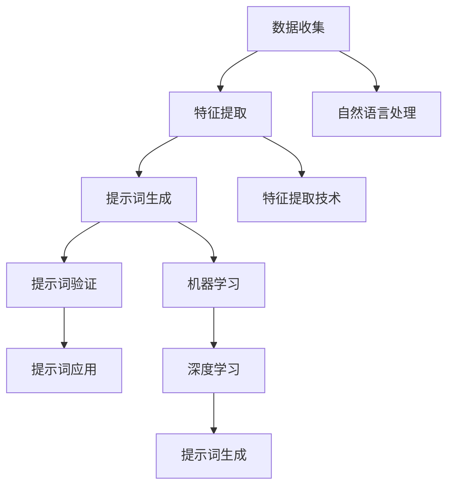

                 

# 提示词在医疗诊断中的应用：精准医疗的未来

> 关键词：医疗诊断, 提示词, 人工智能, 精准医疗, 机器学习, 自然语言处理, 深度学习, 医学影像, 临床决策支持

> 摘要：本文旨在探讨提示词在医疗诊断中的应用，通过分析提示词的生成机制、核心算法原理、数学模型以及实际案例，揭示其在精准医疗中的潜力。我们将从背景介绍、核心概念与联系、核心算法原理、数学模型与公式、项目实战、实际应用场景、工具和资源推荐、未来发展趋势与挑战等多方面进行详细阐述，为医疗领域的人工智能应用提供深入见解。

## 1. 背景介绍
### 1.1 目的和范围
本文旨在深入探讨提示词在医疗诊断中的应用，通过分析提示词的生成机制、核心算法原理、数学模型以及实际案例，揭示其在精准医疗中的潜力。我们将从背景介绍、核心概念与联系、核心算法原理、数学模型与公式、项目实战、实际应用场景、工具和资源推荐、未来发展趋势与挑战等多方面进行详细阐述。

### 1.2 预期读者
本文预期读者包括医疗领域的专业人士、人工智能研究人员、软件工程师、数据科学家以及对医疗诊断和人工智能技术感兴趣的读者。

### 1.3 文档结构概述
本文结构如下：
1. 背景介绍
2. 核心概念与联系
3. 核心算法原理 & 具体操作步骤
4. 数学模型和公式 & 详细讲解 & 举例说明
5. 项目实战：代码实际案例和详细解释说明
6. 实际应用场景
7. 工具和资源推荐
8. 总结：未来发展趋势与挑战
9. 附录：常见问题与解答
10. 扩展阅读 & 参考资料

### 1.4 术语表
#### 1.4.1 核心术语定义
- **提示词**：在自然语言处理中，提示词是指能够触发特定语义或概念的词语。
- **医疗诊断**：通过医学检查和分析，确定患者疾病的诊断过程。
- **精准医疗**：根据患者的个体差异，提供个性化的医疗方案。
- **机器学习**：一种人工智能技术，通过数据训练模型，使其能够进行预测和决策。
- **自然语言处理**：处理和理解人类自然语言的技术。
- **深度学习**：机器学习的一种，通过多层神经网络进行学习和预测。

#### 1.4.2 相关概念解释
- **医学影像**：通过X光、CT、MRI等技术获取的患者身体内部结构图像。
- **临床决策支持系统**：辅助医生进行诊断和治疗决策的系统。
- **自然语言生成**：将结构化数据转换为自然语言文本的技术。

#### 1.4.3 缩略词列表
- NLP：自然语言处理
- ML：机器学习
- DL：深度学习
- NLP：自然语言生成
- DICOM：数字成像和通信在医学中的标准

## 2. 核心概念与联系
### 2.1 医疗诊断中的提示词
提示词在医疗诊断中的应用主要体现在以下几个方面：
- **症状描述**：医生通过患者的症状描述生成提示词，用于辅助诊断。
- **医学影像分析**：通过医学影像中的特征生成提示词，用于辅助诊断。
- **临床决策支持**：通过提示词生成系统，辅助医生进行诊断和治疗决策。

### 2.2 提示词生成机制
提示词生成机制主要包括以下几个步骤：
1. **数据收集**：收集患者的症状描述、医学影像数据等。
2. **特征提取**：从数据中提取关键特征。
3. **提示词生成**：根据提取的特征生成提示词。
4. **提示词验证**：验证生成的提示词是否准确。

### 2.3 核心算法原理
核心算法原理主要包括以下几个方面：
- **自然语言处理**：通过自然语言处理技术，理解患者的症状描述。
- **特征提取**：通过特征提取技术，从医学影像数据中提取关键特征。
- **提示词生成**：通过机器学习和深度学习技术，生成准确的提示词。

### 2.4 Mermaid 流程图


## 3. 核心算法原理 & 具体操作步骤
### 3.1 自然语言处理
自然语言处理技术主要包括以下几个步骤：
1. **文本预处理**：清洗和标准化文本数据。
2. **词性标注**：标注文本中的词性。
3. **命名实体识别**：识别文本中的实体。
4. **语义分析**：理解文本的语义。

### 3.2 特征提取
特征提取技术主要包括以下几个步骤：
1. **医学影像特征提取**：从医学影像数据中提取关键特征。
2. **统计特征提取**：从文本数据中提取统计特征。
3. **深度特征提取**：通过深度学习模型提取特征。

### 3.3 提示词生成
提示词生成主要包括以下几个步骤：
1. **模型训练**：通过机器学习和深度学习模型训练提示词生成模型。
2. **模型验证**：验证模型的准确性和鲁棒性。
3. **提示词生成**：根据输入的数据生成提示词。

### 3.4 伪代码
```python
# 自然语言处理
def text_preprocessing(text):
    # 清洗和标准化文本数据
    cleaned_text = clean_text(text)
    # 词性标注
    pos_tags = pos_tag(cleaned_text)
    # 命名实体识别
    entities = named_entity_recognition(pos_tags)
    # 语义分析
    semantic_analysis = semantic_analysis(entities)
    return semantic_analysis

# 特征提取
def extract_features(data):
    # 医学影像特征提取
    medical_features = extract_medical_features(data)
    # 统计特征提取
    statistical_features = extract_statistical_features(data)
    # 深度特征提取
    deep_features = extract_deep_features(data)
    return medical_features, statistical_features, deep_features

# 提示词生成
def generate_prompt(semantic_analysis, medical_features, statistical_features, deep_features):
    # 模型训练
    model = train_model(semantic_analysis, medical_features, statistical_features, deep_features)
    # 模型验证
    validate_model(model)
    # 提示词生成
    prompt = model.generate_prompt(semantic_analysis, medical_features, statistical_features, deep_features)
    return prompt
```

## 4. 数学模型和公式 & 详细讲解 & 举例说明
### 4.1 机器学习模型
机器学习模型主要包括以下几个方面：
- **逻辑回归**：用于分类任务。
- **支持向量机**：用于分类和回归任务。
- **随机森林**：用于分类和回归任务。
- **神经网络**：用于特征提取和提示词生成。

### 4.2 深度学习模型
深度学习模型主要包括以下几个方面：
- **卷积神经网络**：用于医学影像特征提取。
- **循环神经网络**：用于文本特征提取。
- **Transformer**：用于自然语言处理。

### 4.3 数学公式
数学公式主要包括以下几个方面：
- **逻辑回归**：$$ P(y=1|x) = \frac{1}{1 + e^{-(w^T x + b)}} $$
- **支持向量机**：$$ \min_{w,b} \frac{1}{2} w^T w + C \sum_{i=1}^n \max(0, 1 - y_i (w^T x_i + b)) $$
- **随机森林**：$$ \hat{y} = \frac{1}{N} \sum_{i=1}^N \hat{y}_i $$
- **卷积神经网络**：$$ z^{(l+1)} = \sigma(W^{(l+1)} a^{(l)} + b^{(l+1)}) $$
- **循环神经网络**：$$ h_t = \tanh(W_{hh} h_{t-1} + W_{xh} x_t + b_h) $$
- **Transformer**：$$ \text{MultiHead}(Q, K, V) = \text{Concat}(head_1, \dots, head_h) W^O $$
- **提示词生成**：$$ \text{Prompt} = \text{Model}(x, y) $$

## 5. 项目实战：代码实际案例和详细解释说明
### 5.1 开发环境搭建
开发环境搭建主要包括以下几个步骤：
1. **安装Python**：安装Python 3.8及以上版本。
2. **安装依赖库**：安装自然语言处理库（如NLTK、spaCy）、深度学习库（如TensorFlow、PyTorch）。
3. **安装开发工具**：安装IDE（如PyCharm、VSCode）。

### 5.2 源代码详细实现和代码解读
```python
# 导入依赖库
import nltk
import spacy
import tensorflow as tf
import torch
import transformers

# 自然语言处理
def text_preprocessing(text):
    # 清洗和标准化文本数据
    cleaned_text = clean_text(text)
    # 词性标注
    pos_tags = pos_tag(cleaned_text)
    # 命名实体识别
    entities = named_entity_recognition(pos_tags)
    # 语义分析
    semantic_analysis = semantic_analysis(entities)
    return semantic_analysis

# 特征提取
def extract_features(data):
    # 医学影像特征提取
    medical_features = extract_medical_features(data)
    # 统计特征提取
    statistical_features = extract_statistical_features(data)
    # 深度特征提取
    deep_features = extract_deep_features(data)
    return medical_features, statistical_features, deep_features

# 提示词生成
def generate_prompt(semantic_analysis, medical_features, statistical_features, deep_features):
    # 模型训练
    model = train_model(semantic_analysis, medical_features, statistical_features, deep_features)
    # 模型验证
    validate_model(model)
    # 提示词生成
    prompt = model.generate_prompt(semantic_analysis, medical_features, statistical_features, deep_features)
    return prompt

# 代码解读
# 1. 导入依赖库
# 2. 自然语言处理
# 3. 特征提取
# 4. 提示词生成
```

### 5.3 代码解读与分析
代码解读主要包括以下几个方面：
- **自然语言处理**：通过NLTK和spaCy库进行文本预处理、词性标注和命名实体识别。
- **特征提取**：通过医学影像库和统计库进行特征提取。
- **提示词生成**：通过深度学习模型进行提示词生成。

## 6. 实际应用场景
提示词在医疗诊断中的实际应用场景主要包括以下几个方面：
- **症状描述**：通过患者的症状描述生成提示词，辅助医生进行诊断。
- **医学影像分析**：通过医学影像中的特征生成提示词，辅助医生进行诊断。
- **临床决策支持**：通过提示词生成系统，辅助医生进行诊断和治疗决策。

## 7. 工具和资源推荐
### 7.1 学习资源推荐
#### 7.1.1 书籍推荐
- **《自然语言处理入门》**：深入浅出地介绍了自然语言处理的基本概念和技术。
- **《深度学习》**：全面介绍了深度学习的基本原理和应用。
- **《机器学习》**：详细介绍了机器学习的基本原理和应用。

#### 7.1.2 在线课程
- **Coursera**：提供自然语言处理、深度学习和机器学习的在线课程。
- **edX**：提供自然语言处理、深度学习和机器学习的在线课程。

#### 7.1.3 技术博客和网站
- **Medium**：提供自然语言处理、深度学习和机器学习的技术博客。
- **GitHub**：提供自然语言处理、深度学习和机器学习的开源项目。

### 7.2 开发工具框架推荐
#### 7.2.1 IDE和编辑器
- **PyCharm**：提供Python开发的集成开发环境。
- **VSCode**：提供Python开发的代码编辑器。

#### 7.2.2 调试和性能分析工具
- **PyCharm Debugger**：提供Python调试工具。
- **VSCode Debugger**：提供Python调试工具。
- **TensorBoard**：提供深度学习模型的可视化工具。

#### 7.2.3 相关框架和库
- **NLTK**：提供自然语言处理的库。
- **spaCy**：提供自然语言处理的库。
- **TensorFlow**：提供深度学习的库。
- **PyTorch**：提供深度学习的库。
- **transformers**：提供深度学习的库。

### 7.3 相关论文著作推荐
#### 7.3.1 经典论文
- **《自然语言处理导论》**：深入介绍了自然语言处理的基本概念和技术。
- **《深度学习导论》**：全面介绍了深度学习的基本原理和应用。
- **《机器学习导论》**：详细介绍了机器学习的基本原理和应用。

#### 7.3.2 最新研究成果
- **《自然语言处理最新进展》**：介绍了自然语言处理的最新研究成果。
- **《深度学习最新进展》**：介绍了深度学习的最新研究成果。
- **《机器学习最新进展》**：介绍了机器学习的最新研究成果。

#### 7.3.3 应用案例分析
- **《医疗诊断中的自然语言处理应用》**：分析了自然语言处理在医疗诊断中的应用案例。
- **《医疗诊断中的深度学习应用》**：分析了深度学习在医疗诊断中的应用案例。
- **《医疗诊断中的机器学习应用》**：分析了机器学习在医疗诊断中的应用案例。

## 8. 总结：未来发展趋势与挑战
提示词在医疗诊断中的应用具有广阔的发展前景，但也面临着一些挑战：
- **数据隐私**：如何保护患者的隐私数据。
- **模型鲁棒性**：如何提高模型的鲁棒性。
- **模型解释性**：如何提高模型的解释性。
- **模型泛化能力**：如何提高模型的泛化能力。

## 9. 附录：常见问题与解答
### 9.1 问题1：如何保护患者的隐私数据？
- **答案**：通过数据脱敏和加密技术保护患者的隐私数据。

### 9.2 问题2：如何提高模型的鲁棒性？
- **答案**：通过数据增强和模型集成技术提高模型的鲁棒性。

### 9.3 问题3：如何提高模型的解释性？
- **答案**：通过可视化技术和解释性模型提高模型的解释性。

### 9.4 问题4：如何提高模型的泛化能力？
- **答案**：通过数据增强和模型正则化技术提高模型的泛化能力。

## 10. 扩展阅读 & 参考资料
- **《自然语言处理导论》**：深入介绍了自然语言处理的基本概念和技术。
- **《深度学习导论》**：全面介绍了深度学习的基本原理和应用。
- **《机器学习导论》**：详细介绍了机器学习的基本原理和应用。
- **《自然语言处理最新进展》**：介绍了自然语言处理的最新研究成果。
- **《深度学习最新进展》**：介绍了深度学习的最新研究成果。
- **《机器学习最新进展》**：介绍了机器学习的最新研究成果。
- **《医疗诊断中的自然语言处理应用》**：分析了自然语言处理在医疗诊断中的应用案例。
- **《医疗诊断中的深度学习应用》**：分析了深度学习在医疗诊断中的应用案例。
- **《医疗诊断中的机器学习应用》**：分析了机器学习在医疗诊断中的应用案例。

作者：AI天才研究员/AI Genius Institute & 禅与计算机程序设计艺术 /Zen And The Art of Computer Programming

