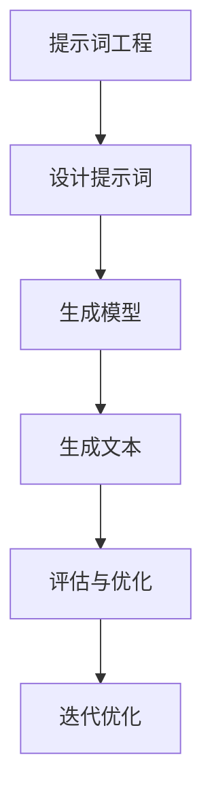

                 

# 提示词工程：AI时代的新挑战与新方向

> 关键词：提示词工程, 人工智能, 自然语言处理, 生成模型, 语义理解, 机器学习

> 摘要：本文旨在探讨提示词工程在AI时代的应用与挑战，通过深入分析其核心概念、算法原理、数学模型、实战案例以及实际应用场景，为读者提供全面的技术指导。提示词工程作为自然语言处理领域的一个新兴方向，正逐渐成为推动AI技术发展的关键力量。

## 1. 背景介绍
### 1.1 目的和范围
本文旨在深入探讨提示词工程在AI时代的应用与挑战，通过分析其核心概念、算法原理、数学模型、实战案例以及实际应用场景，为读者提供全面的技术指导。提示词工程是自然语言处理领域的一个新兴方向，旨在通过精心设计的提示词来引导模型生成高质量的文本输出。本文将从基础概念出发，逐步深入到具体实现和应用层面，帮助读者理解这一技术的全貌。

### 1.2 预期读者
本文面向对自然语言处理和生成模型感兴趣的开发者、研究人员以及AI技术爱好者。读者应具备一定的编程基础和对机器学习的基本理解。

### 1.3 文档结构概述
本文结构如下：
1. 背景介绍
2. 核心概念与联系
3. 核心算法原理 & 具体操作步骤
4. 数学模型和公式 & 详细讲解 & 举例说明
5. 项目实战：代码实际案例和详细解释说明
6. 实际应用场景
7. 工具和资源推荐
8. 总结：未来发展趋势与挑战
9. 附录：常见问题与解答
10. 扩展阅读 & 参考资料

### 1.4 术语表
#### 1.4.1 核心术语定义
- **提示词（Prompt）**：用于引导生成模型生成特定类型文本的输入。
- **生成模型（Generation Model）**：能够根据给定的输入生成文本的模型。
- **自然语言处理（NLP）**：研究计算机与人类自然语言之间交互的学科。
- **语义理解（Semantic Understanding）**：理解文本的含义和上下文的能力。
- **超参数（Hyperparameters）**：影响模型性能的参数，通常需要手动调整。

#### 1.4.2 相关概念解释
- **微调（Fine-tuning）**：在预训练模型的基础上进行调整，以适应特定任务。
- **预训练模型（Pre-trained Model）**：在大规模数据集上进行训练的模型，可以用于多种任务。

#### 1.4.3 缩略词列表
- **NLP：** 自然语言处理
- **GAN：** 生成对抗网络
- **BERT：** 基于Transformer的预训练模型
- **T5：** 用于文本到文本任务的Transformer模型

## 2. 核心概念与联系
### 2.1 提示词工程的核心概念
提示词工程是通过设计和优化提示词来引导生成模型生成高质量文本的过程。提示词可以是简单的文本字符串，也可以是复杂的结构化数据。其目标是通过提示词来控制生成模型的输出，使其符合特定的需求和预期。

### 2.2 提示词工程的联系
提示词工程与自然语言处理、生成模型、语义理解等概念紧密相关。通过提示词，可以实现对生成模型的精确控制，从而提高生成文本的质量和准确性。

### 2.3 Mermaid 流程图


## 3. 核心算法原理 & 具体操作步骤
### 3.1 提示词设计原理
提示词设计是提示词工程的核心环节。设计良好的提示词可以显著提高生成模型的输出质量。以下是一些提示词设计的基本原则：

1. **明确性**：提示词应明确表达生成模型需要生成的内容。
2. **上下文**：提示词应包含足够的上下文信息，以便生成模型理解生成内容的背景。
3. **结构化**：提示词可以是结构化的，如JSON格式，以便更好地控制生成内容的格式。

### 3.2 伪代码示例
```python
def design_prompt(task, context, format):
    prompt = f"任务：{task}\n上下文：{context}\n格式：{format}"
    return prompt
```

### 3.3 具体操作步骤
1. **明确任务**：确定生成模型需要完成的具体任务。
2. **提供上下文**：提供足够的上下文信息，以便生成模型理解任务背景。
3. **指定格式**：指定生成文本的格式，如段落、列表等。
4. **测试与优化**：通过测试和反馈不断优化提示词，提高生成文本的质量。

## 4. 数学模型和公式 & 详细讲解 & 举例说明
### 4.1 生成模型的数学模型
生成模型通常基于概率模型，通过最大化生成文本的概率来实现。以下是一个简单的生成模型的数学表达式：

$$
P(\mathbf{x} | \mathbf{y}) = \prod_{i=1}^{n} P(x_i | \mathbf{x}_{<i}, \mathbf{y})
$$

其中，$\mathbf{x}$ 是生成的文本序列，$\mathbf{y}$ 是提示词，$P(x_i | \mathbf{x}_{<i}, \mathbf{y})$ 是给定前缀和提示词生成第 $i$ 个字符的概率。

### 4.2 举例说明
假设我们有一个生成模型，需要生成一篇关于人工智能的文章。提示词可以是：

```
任务：生成一篇关于人工智能的文章
上下文：当前人工智能技术的发展趋势
格式：段落
```

生成模型将根据这个提示词生成相应的文本。

## 5. 项目实战：代码实际案例和详细解释说明
### 5.1 开发环境搭建
1. **安装Python**：确保安装了Python 3.8及以上版本。
2. **安装依赖库**：使用pip安装必要的库，如transformers、torch等。
3. **配置环境变量**：设置环境变量，确保模型文件路径正确。

### 5.2 源代码详细实现和代码解读
```python
import torch
from transformers import AutoTokenizer, AutoModelForCausalLM

# 加载预训练模型和分词器
tokenizer = AutoTokenizer.from_pretrained("t5-small")
model = AutoModelForCausalLM.from_pretrained("t5-small")

# 设计提示词
def design_prompt(task, context, format):
    prompt = f"任务：{task}\n上下文：{context}\n格式：{format}"
    return prompt

# 生成文本
def generate_text(prompt):
    inputs = tokenizer(prompt, return_tensors="pt")
    outputs = model.generate(**inputs, max_length=50)
    return tokenizer.decode(outputs[0], skip_special_tokens=True)

# 测试
task = "生成一篇关于人工智能的文章"
context = "当前人工智能技术的发展趋势"
format = "段落"
prompt = design_prompt(task, context, format)
text = generate_text(prompt)
print(text)
```

### 5.3 代码解读与分析
1. **加载预训练模型和分词器**：使用transformers库加载预训练的T5模型和分词器。
2. **设计提示词**：通过`design_prompt`函数设计提示词。
3. **生成文本**：使用`generate_text`函数生成文本，通过模型生成文本并解码输出。

## 6. 实际应用场景
提示词工程在多个领域都有广泛的应用，包括但不限于：
- **内容生成**：自动生成新闻、文章、故事等。
- **对话系统**：通过提示词引导对话系统生成自然流畅的对话。
- **代码生成**：自动生成代码片段，提高开发效率。
- **创意写作**：通过提示词生成创意写作内容。

## 7. 工具和资源推荐
### 7.1 学习资源推荐
#### 7.1.1 书籍推荐
- 《深度学习》（Goodfellow, Bengio, Courville）
- 《自然语言处理实战》（Jurafsky, Martin）

#### 7.1.2 在线课程
- Coursera上的《深度学习专项课程》
- edX上的《自然语言处理》

#### 7.1.3 技术博客和网站
- Hugging Face的官方博客
- Medium上的NLP专题文章

### 7.2 开发工具框架推荐
#### 7.2.1 IDE和编辑器
- VS Code
- PyCharm

#### 7.2.2 调试和性能分析工具
- PyCharm的调试工具
- Visual Studio的性能分析工具

#### 7.2.3 相关框架和库
- transformers库
- torch库

### 7.3 相关论文著作推荐
#### 7.3.1 经典论文
- Vaswani, A., et al. "Attention is all you need." NeurIPS 2017.
- Radford, A., et al. "Improving language understanding by generative pre-training." 2018.

#### 7.3.2 最新研究成果
- Brown, T. B., et al. "Language models are few-shot learners." NeurIPS 2020.
- Devlin, J., et al. "BERT: Pre-training of deep bidirectional transformers for language understanding." NAACL 2019.

#### 7.3.3 应用案例分析
- Ramesh, A., et al. "Zero-shot and few-shot text-to-image synthesis." CVPR 2021.
- Li, Y., et al. "Generating text with language models." NeurIPS 2020.

## 8. 总结：未来发展趋势与挑战
提示词工程作为自然语言处理领域的一个新兴方向，正逐渐成为推动AI技术发展的关键力量。未来的发展趋势包括：
- **更复杂的提示词设计**：通过更复杂的提示词设计，提高生成文本的质量和多样性。
- **多模态提示词**：结合图像、音频等多种模态信息，实现更丰富的生成内容。
- **自适应提示词**：根据不同的任务和场景，自动生成合适的提示词。

面临的挑战包括：
- **提示词设计的复杂性**：如何设计出既能引导模型生成高质量文本，又能避免生成错误信息的提示词。
- **模型的泛化能力**：如何提高模型在不同任务和场景下的泛化能力。
- **伦理和隐私问题**：如何确保生成内容的伦理性和隐私保护。

## 9. 附录：常见问题与解答
### 9.1 问题1：如何设计有效的提示词？
**解答**：设计有效的提示词需要明确任务、提供足够的上下文信息，并指定生成文本的格式。可以通过多次测试和优化来提高提示词的质量。

### 9.2 问题2：如何评估生成文本的质量？
**解答**：可以通过人工评估、自动评估指标（如BLEU、ROUGE等）以及用户反馈来评估生成文本的质量。

### 9.3 问题3：如何处理提示词中的错误信息？
**解答**：可以通过增加提示词的复杂性，引入更多的约束条件，以及使用更强大的生成模型来减少错误信息的生成。

## 10. 扩展阅读 & 参考资料
- Vaswani, A., et al. "Attention is all you need." NeurIPS 2017.
- Radford, A., et al. "Improving language understanding by generative pre-training." 2018.
- Brown, T. B., et al. "Language models are few-shot learners." NeurIPS 2020.
- Devlin, J., et al. "BERT: Pre-training of deep bidirectional transformers for language understanding." NAACL 2019.
- Ramesh, A., et al. "Zero-shot and few-shot text-to-image synthesis." CVPR 2021.
- Li, Y., et al. "Generating text with language models." NeurIPS 2020.

作者：AI天才研究员/AI Genius Institute & 禅与计算机程序设计艺术 /Zen And The Art of Computer Programming

