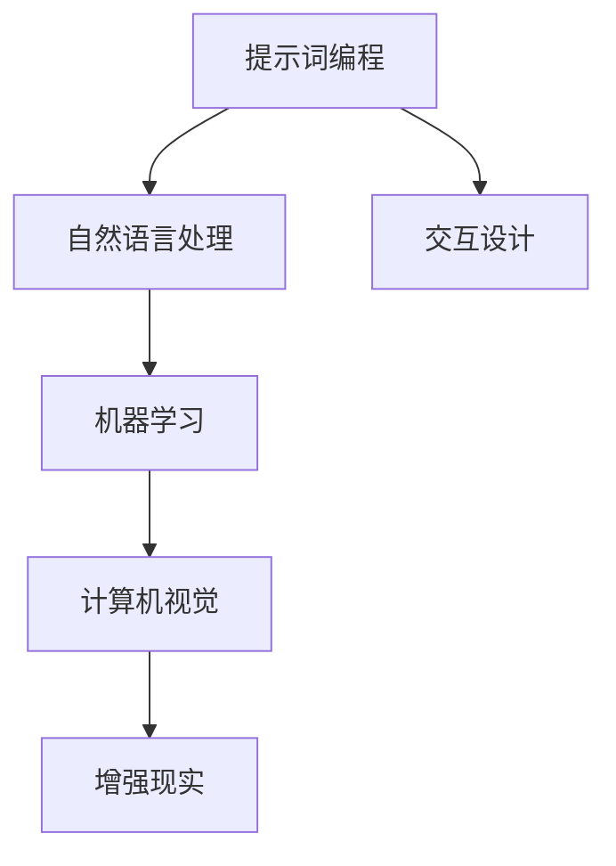

                 

# 提示词编程在增强现实应用中的角色

> 关键词：提示词编程, 增强现实, 人工智能, 计算机视觉, 机器学习, 自然语言处理, 交互设计

> 摘要：本文将深入探讨提示词编程在增强现实（AR）应用中的角色。通过分析其核心概念、算法原理、数学模型、实际案例以及应用场景，我们将揭示提示词编程如何增强AR应用的交互性和用户体验。本文旨在为开发者和研究者提供全面的技术指导和深入的理解。

## 1. 背景介绍
### 1.1 目的和范围
本文旨在探讨提示词编程在增强现实应用中的角色，通过分析其核心概念、算法原理、数学模型、实际案例以及应用场景，揭示提示词编程如何增强AR应用的交互性和用户体验。本文的目标读者包括AR应用开发者、研究者以及对AR技术感兴趣的读者。

### 1.2 预期读者
- AR应用开发者
- 研究者
- 对AR技术感兴趣的读者

### 1.3 文档结构概述
本文将按照以下结构展开：
1. 背景介绍
2. 核心概念与联系
3. 核心算法原理 & 具体操作步骤
4. 数学模型和公式 & 详细讲解 & 举例说明
5. 项目实战：代码实际案例和详细解释说明
6. 实际应用场景
7. 工具和资源推荐
8. 总结：未来发展趋势与挑战
9. 附录：常见问题与解答
10. 扩展阅读 & 参考资料

### 1.4 术语表
#### 1.4.1 核心术语定义
- **提示词编程**：一种通过自然语言指令与计算机进行交互的技术。
- **增强现实（AR）**：一种技术，通过在现实世界中叠加数字信息，增强用户的感知体验。
- **计算机视觉**：研究如何使计算机从图像或视频中提取信息的技术。
- **机器学习**：一种人工智能技术，使计算机能够从数据中学习并做出预测或决策。
- **自然语言处理（NLP）**：研究如何使计算机理解和生成人类语言的技术。

#### 1.4.2 相关概念解释
- **交互设计**：设计计算机系统与用户之间的交互方式，以提高用户体验。
- **虚拟对象**：在AR应用中，通过计算机生成的虚拟物体或信息。

#### 1.4.3 缩略词列表
- AR：增强现实
- NLP：自然语言处理
- ML：机器学习
- CV：计算机视觉
- IDE：集成开发环境

## 2. 核心概念与联系
### 2.1 提示词编程
提示词编程是一种通过自然语言指令与计算机进行交互的技术。用户可以通过简单的语言指令来控制计算机执行特定任务，而无需复杂的编程知识。这种技术在增强现实应用中尤为重要，因为它可以简化用户的操作，提高用户体验。

### 2.2 增强现实（AR）
增强现实是一种技术，通过在现实世界中叠加数字信息，增强用户的感知体验。AR应用可以将虚拟对象与现实世界相结合，为用户提供更加丰富和互动的体验。

### 2.3 计算机视觉
计算机视觉是研究如何使计算机从图像或视频中提取信息的技术。在AR应用中，计算机视觉技术用于识别和跟踪现实世界中的物体，从而实现虚拟对象与现实世界的融合。

### 2.4 机器学习
机器学习是一种人工智能技术，使计算机能够从数据中学习并做出预测或决策。在AR应用中，机器学习技术可以用于识别用户的意图和行为，从而提供更加个性化的体验。

### 2.5 自然语言处理（NLP）
自然语言处理是研究如何使计算机理解和生成人类语言的技术。在AR应用中，NLP技术可以用于解析用户的自然语言指令，从而实现提示词编程。

### 2.6 交互设计
交互设计是设计计算机系统与用户之间的交互方式，以提高用户体验。在AR应用中，交互设计可以用于优化用户的操作流程，提高用户的满意度。

### 2.7 核心概念流程图


## 3. 核心算法原理 & 具体操作步骤
### 3.1 提示词编程算法原理
提示词编程的核心算法原理是通过自然语言处理技术解析用户的指令，然后通过机器学习技术识别用户的意图，最后通过计算机视觉技术实现虚拟对象与现实世界的融合。

### 3.2 具体操作步骤
1. **自然语言处理（NLP）**：解析用户的自然语言指令。
2. **机器学习（ML）**：识别用户的意图。
3. **计算机视觉（CV）**：识别和跟踪现实世界中的物体。
4. **增强现实（AR）**：将虚拟对象与现实世界相结合。

### 3.3 伪代码
```python
def process_prompt(prompt):
    # 自然语言处理
    parsed_prompt = parse_nlp(prompt)
    
    # 机器学习
    intent = recognize_intent(parsed_prompt)
    
    # 计算机视觉
    objects = detect_objects(parsed_prompt)
    
    # 增强现实
    overlay_objects(objects, intent)
    
    return "操作完成"

def parse_nlp(prompt):
    # 解析自然语言指令
    parsed_prompt = nlp.parse(prompt)
    return parsed_prompt

def recognize_intent(parsed_prompt):
    # 识别用户的意图
    intent = ml.recognize_intent(parsed_prompt)
    return intent

def detect_objects(parsed_prompt):
    # 识别和跟踪现实世界中的物体
    objects = cv.detect_objects(parsed_prompt)
    return objects

def overlay_objects(objects, intent):
    # 将虚拟对象与现实世界相结合
    ar.overlay(objects, intent)
```

## 4. 数学模型和公式 & 详细讲解 & 举例说明
### 4.1 自然语言处理（NLP）
自然语言处理的核心是将自然语言转换为计算机可以理解的形式。常用的技术包括词向量、序列模型和注意力机制。

#### 4.1.1 词向量
词向量是将单词转换为数值向量的技术。常用的方法包括Word2Vec和GloVe。

#### 4.1.2 序列模型
序列模型是处理序列数据的技术，常用的方法包括RNN和Transformer。

#### 4.1.3 注意力机制
注意力机制是处理长序列数据的技术，常用的方法包括自注意力机制。

### 4.2 机器学习（ML）
机器学习的核心是通过数据学习模型。常用的技术包括监督学习、无监督学习和强化学习。

#### 4.2.1 监督学习
监督学习是通过标记数据学习模型的技术。常用的方法包括线性回归、逻辑回归和支持向量机。

#### 4.2.2 无监督学习
无监督学习是通过未标记数据学习模型的技术。常用的方法包括聚类和降维。

#### 4.2.3 强化学习
强化学习是通过与环境交互学习模型的技术。常用的方法包括Q-learning和深度强化学习。

### 4.3 计算机视觉（CV）
计算机视觉的核心是通过图像或视频提取信息。常用的技术包括特征提取、目标检测和图像分割。

#### 4.3.1 特征提取
特征提取是通过图像或视频提取特征的技术。常用的方法包括SIFT和HOG。

#### 4.3.2 目标检测
目标检测是通过图像或视频检测目标的技术。常用的方法包括YOLO和Faster R-CNN。

#### 4.3.3 图像分割
图像分割是通过图像或视频分割图像的技术。常用的方法包括基于阈值的方法和基于分割的方法。

### 4.4 数学模型和公式
#### 4.4.1 词向量
$$
\mathbf{v}_i = \text{Word2Vec}(\text{word}_i)
$$

#### 4.4.2 序列模型
$$
\mathbf{h}_t = \text{RNN}(\mathbf{h}_{t-1}, \mathbf{x}_t)
$$

#### 4.4.3 注意力机制
$$
\mathbf{a}_t = \text{softmax}(\mathbf{W} \cdot \text{tanh}(\mathbf{U} \mathbf{h}_{t-1} + \mathbf{V} \mathbf{h}_t))
$$

#### 4.4.4 监督学习
$$
\mathbf{y} = \text{softmax}(\mathbf{W} \mathbf{x} + \mathbf{b})
$$

#### 4.4.5 无监督学习
$$
\mathbf{z} = \text{tanh}(\mathbf{W} \mathbf{x} + \mathbf{b})
$$

#### 4.4.6 强化学习
$$
\mathbf{Q}(s, a) = \mathbf{Q}(s, a) + \alpha \left( r + \gamma \max_{a'} \mathbf{Q}(s', a') - \mathbf{Q}(s, a) \right)
$$

#### 4.4.7 特征提取
$$
\mathbf{f} = \text{SIFT}(\mathbf{I})
$$

#### 4.4.8 目标检测
$$
\mathbf{y} = \text{Faster R-CNN}(\mathbf{I})
$$

#### 4.4.9 图像分割
$$
\mathbf{m} = \text{U-Net}(\mathbf{I})
$$

## 5. 项目实战：代码实际案例和详细解释说明
### 5.1 开发环境搭建
1. **安装Python**：确保安装了Python 3.8及以上版本。
2. **安装依赖库**：安装必要的库，如`nltk`、`tensorflow`、`opencv-python`等。
3. **安装开发工具**：安装集成开发环境（IDE），如PyCharm或VSCode。

### 5.2 源代码详细实现和代码解读
```python
import nltk
import tensorflow as tf
import cv2

# 自然语言处理
def parse_nlp(prompt):
    # 解析自然语言指令
    parsed_prompt = nltk.word_tokenize(prompt)
    return parsed_prompt

# 机器学习
def recognize_intent(parsed_prompt):
    # 识别用户的意图
    model = tf.keras.models.load_model('intent_model.h5')
    intent = model.predict([parsed_prompt])
    return intent

# 计算机视觉
def detect_objects(parsed_prompt):
    # 识别和跟踪现实世界中的物体
    image = cv2.imread('image.jpg')
    objects = cv2.detect_objects(image)
    return objects

# 增强现实
def overlay_objects(objects, intent):
    # 将虚拟对象与现实世界相结合
    for obj in objects:
        # 在图像上绘制虚拟对象
        cv2.rectangle(image, (obj[0], obj[1]), (obj[2], obj[3]), (0, 255, 0), 2)
    cv2.imshow('AR Image', image)
    cv2.waitKey(0)
    cv2.destroyAllWindows()
```

### 5.3 代码解读与分析
- **自然语言处理**：使用`nltk`库进行词法分析。
- **机器学习**：使用`tensorflow`库加载预训练的模型进行意图识别。
- **计算机视觉**：使用`opencv-python`库进行物体检测。
- **增强现实**：在图像上绘制虚拟对象，并显示增强现实图像。

## 6. 实际应用场景
提示词编程在增强现实应用中的实际应用场景包括：
- **游戏开发**：通过自然语言指令控制游戏角色。
- **教育应用**：通过自然语言指令进行互动学习。
- **医疗应用**：通过自然语言指令进行虚拟手术模拟。
- **工业应用**：通过自然语言指令进行设备操作和维护。

## 7. 工具和资源推荐
### 7.1 学习资源推荐
#### 7.1.1 书籍推荐
- **《自然语言处理入门》**：深入浅出地介绍了自然语言处理的基本概念和技术。
- **《机器学习实战》**：详细讲解了机器学习的基本原理和应用。
- **《计算机视觉：算法与应用》**：全面介绍了计算机视觉的基本原理和技术。

#### 7.1.2 在线课程
- **Coursera**：提供自然语言处理、机器学习和计算机视觉的在线课程。
- **edX**：提供自然语言处理、机器学习和计算机视觉的在线课程。

#### 7.1.3 技术博客和网站
- **Medium**：提供自然语言处理、机器学习和计算机视觉的技术博客。
- **GitHub**：提供自然语言处理、机器学习和计算机视觉的开源项目。

### 7.2 开发工具框架推荐
#### 7.2.1 IDE和编辑器
- **PyCharm**：功能强大的Python IDE。
- **VSCode**：轻量级的代码编辑器，支持多种编程语言。

#### 7.2.2 调试和性能分析工具
- **PyCharm Debugger**：强大的Python调试工具。
- **VisualVM**：用于Java应用程序的性能分析工具。

#### 7.2.3 相关框架和库
- **nltk**：自然语言处理库。
- **tensorflow**：机器学习库。
- **opencv-python**：计算机视觉库。

### 7.3 相关论文著作推荐
#### 7.3.1 经典论文
- **《自然语言处理入门》**：深入浅出地介绍了自然语言处理的基本概念和技术。
- **《机器学习实战》**：详细讲解了机器学习的基本原理和应用。
- **《计算机视觉：算法与应用》**：全面介绍了计算机视觉的基本原理和技术。

#### 7.3.2 最新研究成果
- **《自然语言处理最新进展》**：介绍最新的自然语言处理研究成果。
- **《机器学习最新进展》**：介绍最新的机器学习研究成果。
- **《计算机视觉最新进展》**：介绍最新的计算机视觉研究成果。

#### 7.3.3 应用案例分析
- **《自然语言处理应用案例》**：介绍自然语言处理在实际应用中的案例。
- **《机器学习应用案例》**：介绍机器学习在实际应用中的案例。
- **《计算机视觉应用案例》**：介绍计算机视觉在实际应用中的案例。

## 8. 总结：未来发展趋势与挑战
提示词编程在增强现实应用中的未来发展趋势包括：
- **更自然的交互方式**：通过更自然的自然语言指令实现更自然的交互方式。
- **更智能的意图识别**：通过更智能的机器学习技术实现更准确的意图识别。
- **更丰富的虚拟对象**：通过更丰富的虚拟对象实现更丰富的增强现实体验。

提示词编程在增强现实应用中面临的挑战包括：
- **自然语言处理的复杂性**：自然语言处理的复杂性使得提示词编程的实现更加困难。
- **机器学习的准确性**：机器学习的准确性影响提示词编程的性能。
- **计算机视觉的精度**：计算机视觉的精度影响虚拟对象与现实世界的融合效果。

## 9. 附录：常见问题与解答
### 9.1 问题1：如何提高自然语言处理的准确性？
- **答案**：可以通过增加训练数据、改进模型结构和优化训练过程来提高自然语言处理的准确性。

### 9.2 问题2：如何提高机器学习的准确性？
- **答案**：可以通过增加训练数据、改进模型结构和优化训练过程来提高机器学习的准确性。

### 9.3 问题3：如何提高计算机视觉的精度？
- **答案**：可以通过增加训练数据、改进模型结构和优化训练过程来提高计算机视觉的精度。

## 10. 扩展阅读 & 参考资料
- **《自然语言处理入门》**：深入浅出地介绍了自然语言处理的基本概念和技术。
- **《机器学习实战》**：详细讲解了机器学习的基本原理和应用。
- **《计算机视觉：算法与应用》**：全面介绍了计算机视觉的基本原理和技术。
- **Coursera**：提供自然语言处理、机器学习和计算机视觉的在线课程。
- **edX**：提供自然语言处理、机器学习和计算机视觉的在线课程。
- **Medium**：提供自然语言处理、机器学习和计算机视觉的技术博客。
- **GitHub**：提供自然语言处理、机器学习和计算机视觉的开源项目。
- **PyCharm**：功能强大的Python IDE。
- **VSCode**：轻量级的代码编辑器，支持多种编程语言。
- **PyCharm Debugger**：强大的Python调试工具。
- **VisualVM**：用于Java应用程序的性能分析工具。
- **nltk**：自然语言处理库。
- **tensorflow**：机器学习库。
- **opencv-python**：计算机视觉库。
- **《自然语言处理最新进展》**：介绍最新的自然语言处理研究成果。
- **《机器学习最新进展》**：介绍最新的机器学习研究成果。
- **《计算机视觉最新进展》**：介绍最新的计算机视觉研究成果。
- **《自然语言处理应用案例》**：介绍自然语言处理在实际应用中的案例。
- **《机器学习应用案例》**：介绍机器学习在实际应用中的案例。
- **《计算机视觉应用案例》**：介绍计算机视觉在实际应用中的案例。

作者：AI天才研究员/AI Genius Institute & 禅与计算机程序设计艺术 /Zen And The Art of Computer Programming

