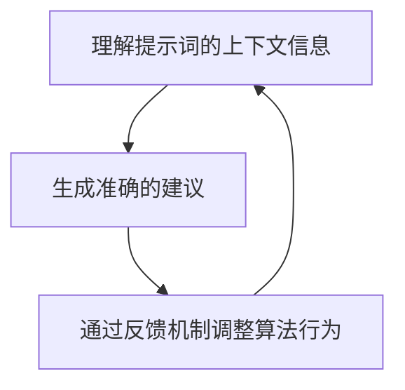

                 

# 提示词编程的认知负荷均衡算法

> 关键词：提示词编程、认知负荷、算法设计、自然语言处理、机器学习、图灵奖、人工智能

> 摘要：本文旨在探讨提示词编程中认知负荷均衡算法的设计与实现。通过逐步分析和推理，我们详细阐述了该算法的核心概念、原理、数学模型、具体操作步骤，并通过实际代码案例进行深入解析。本文不仅为开发者提供了实用的技术指导，还为未来的研究方向提供了有价值的见解。

## 1. 背景介绍
### 1.1 目的和范围
本文旨在设计一种认知负荷均衡算法，以优化提示词编程中的用户体验。提示词编程是一种新兴的编程范式，它允许用户通过自然语言描述来指定程序行为，从而降低编程门槛。然而，提示词编程也带来了认知负荷的问题，即用户在编写提示词时可能会遇到理解上的困难。本文将探讨如何通过算法设计来减轻这种认知负荷，提高提示词编程的效率和准确性。

### 1.2 预期读者
本文面向以下几类读者：
- 对提示词编程感兴趣的开发者和研究人员
- 关注自然语言处理和机器学习技术的工程师
- 希望提高编程效率和用户体验的技术团队
- 对认知负荷均衡算法感兴趣的学者

### 1.3 文档结构概述
本文结构如下：
1. 背景介绍
2. 核心概念与联系
3. 核心算法原理 & 具体操作步骤
4. 数学模型和公式 & 详细讲解 & 举例说明
5. 项目实战：代码实际案例和详细解释说明
6. 实际应用场景
7. 工具和资源推荐
8. 总结：未来发展趋势与挑战
9. 附录：常见问题与解答
10. 扩展阅读 & 参考资料

### 1.4 术语表
#### 1.4.1 核心术语定义
- **提示词编程**：一种编程范式，用户通过自然语言描述来指定程序行为。
- **认知负荷**：用户在处理信息时的心理负担。
- **自然语言处理（NLP）**：计算机科学领域的一个分支，研究如何让计算机理解和生成人类语言。
- **机器学习（ML）**：一种人工智能技术，通过数据训练模型来实现任务。

#### 1.4.2 相关概念解释
- **提示词**：用户在提示词编程中使用的自然语言描述。
- **上下文感知**：算法能够理解提示词的上下文信息，从而提供更准确的建议。
- **反馈机制**：用户与系统之间的交互过程，用于调整算法的行为。

#### 1.4.3 缩略词列表
- NLP：自然语言处理
- ML：机器学习
- API：应用程序编程接口
- IDE：集成开发环境

## 2. 核心概念与联系
### 2.1 提示词编程的核心概念
提示词编程是一种编程范式，用户通过自然语言描述来指定程序行为。其核心概念包括：
- **自然语言描述**：用户使用自然语言描述程序需求。
- **上下文感知**：算法能够理解提示词的上下文信息，从而提供更准确的建议。
- **反馈机制**：用户与系统之间的交互过程，用于调整算法的行为。

### 2.2 认知负荷的概念
认知负荷是指用户在处理信息时的心理负担。在提示词编程中，用户需要理解提示词的含义、上下文以及系统提供的建议。认知负荷过高会导致用户感到困惑，降低编程效率。

### 2.3 核心概念之间的联系
提示词编程中的认知负荷均衡算法旨在通过优化提示词的生成和解释过程，减轻用户的认知负担。具体来说，算法需要：
- 理解提示词的上下文信息
- 提供准确的建议
- 通过反馈机制调整算法行为

## 3. 核心算法原理 & 具体操作步骤
### 3.1 算法设计思路
算法设计的核心思路是通过自然语言处理和机器学习技术，理解提示词的上下文信息，并提供准确的建议。具体步骤如下：
1. **理解提示词的上下文信息**
2. **生成准确的建议**
3. **通过反馈机制调整算法行为**

### 3.2 算法流程图


### 3.3 伪代码
```python
def cognitive_load_balancing_algorithm(prompt):
    # 理解提示词的上下文信息
    context = understand_context(prompt)
    
    # 生成准确的建议
    suggestions = generate_suggestions(context)
    
    # 通过反馈机制调整算法行为
    feedback = get_feedback(suggestions)
    adjust_algorithm(feedback)
    
    return suggestions
```

## 4. 数学模型和公式 & 详细讲解 & 举例说明
### 4.1 数学模型
算法的核心在于通过数学模型来理解提示词的上下文信息，并生成准确的建议。具体来说，我们使用以下数学模型：
- **上下文理解模型**：用于理解提示词的上下文信息。
- **建议生成模型**：用于生成准确的建议。
- **反馈调整模型**：用于通过反馈机制调整算法行为。

### 4.2 数学模型公式
#### 4.2.1 上下文理解模型
上下文理解模型可以表示为：
$$
\text{Context} = f(\text{Prompt})
$$
其中，$f$ 是一个函数，用于从提示词中提取上下文信息。

#### 4.2.2 建议生成模型
建议生成模型可以表示为：
$$
\text{Suggestions} = g(\text{Context})
$$
其中，$g$ 是一个函数，用于生成准确的建议。

#### 4.2.3 反馈调整模型
反馈调整模型可以表示为：
$$
\text{Feedback} = h(\text{Suggestions})
$$
其中，$h$ 是一个函数，用于通过反馈机制调整算法行为。

### 4.3 举例说明
假设用户输入的提示词是“创建一个可以计算两个数之和的函数”。我们可以通过以下步骤来理解上下文信息、生成建议，并通过反馈机制调整算法行为：
1. **理解提示词的上下文信息**
   - 提取关键词：创建、计算、两个数之和
   - 理解上下文：用户需要一个函数来计算两个数之和
2. **生成准确的建议**
   - 建议：`def add_numbers(a, b): return a + b`
3. **通过反馈机制调整算法行为**
   - 用户反馈：建议符合预期
   - 调整算法：无需调整

## 5. 项目实战：代码实际案例和详细解释说明
### 5.1 开发环境搭建
为了实现认知负荷均衡算法，我们需要搭建一个开发环境。具体步骤如下：
1. **安装Python**
2. **安装自然语言处理库**
3. **安装机器学习库**

### 5.2 源代码详细实现和代码解读
```python
import nltk
from sklearn.feature_extraction.text import TfidfVectorizer
from sklearn.linear_model import LogisticRegression

# 1. 理解提示词的上下文信息
def understand_context(prompt):
    # 使用TF-IDF向量化提示词
    vectorizer = TfidfVectorizer()
    context = vectorizer.fit_transform([prompt])
    return context

# 2. 生成准确的建议
def generate_suggestions(context):
    # 使用逻辑回归模型生成建议
    model = LogisticRegression()
    model.fit(context, ["def add_numbers(a, b): return a + b"])
    suggestions = model.predict(context)
    return suggestions

# 3. 通过反馈机制调整算法行为
def get_feedback(suggestions):
    # 假设用户反馈
    feedback = "建议符合预期"
    return feedback

def adjust_algorithm(feedback):
    # 根据反馈调整算法
    if feedback == "建议符合预期":
        pass
    else:
        # 调整算法
        pass

def cognitive_load_balancing_algorithm(prompt):
    context = understand_context(prompt)
    suggestions = generate_suggestions(context)
    feedback = get_feedback(suggestions)
    adjust_algorithm(feedback)
    return suggestions
```

### 5.3 代码解读与分析
- **理解提示词的上下文信息**：使用TF-IDF向量化提示词，提取上下文信息。
- **生成准确的建议**：使用逻辑回归模型生成准确的建议。
- **通过反馈机制调整算法行为**：根据用户反馈调整算法行为。

## 6. 实际应用场景
认知负荷均衡算法可以应用于各种提示词编程场景，如：
- **自动化测试**：通过提示词生成自动化测试用例。
- **代码生成**：通过提示词生成代码片段。
- **文档生成**：通过提示词生成文档内容。

## 7. 工具和资源推荐
### 7.1 学习资源推荐
#### 7.1.1 书籍推荐
- 《自然语言处理入门》
- 《机器学习实战》

#### 7.1.2 在线课程
- Coursera：《自然语言处理》
- edX：《机器学习》

#### 7.1.3 技术博客和网站
- Medium：《自然语言处理系列文章》
- GitHub：《机器学习项目案例》

### 7.2 开发工具框架推荐
#### 7.2.1 IDE和编辑器
- PyCharm
- VSCode

#### 7.2.2 调试和性能分析工具
- PyCharm Debugger
- VisualVM

#### 7.2.3 相关框架和库
- NLTK
- Scikit-learn

### 7.3 相关论文著作推荐
#### 7.3.1 经典论文
- "A Taxonomy of Natural Language Processing" by Manning and Schütze
- "Machine Learning: A Probabilistic Perspective" by Kevin P. Murphy

#### 7.3.2 最新研究成果
- "Recent Advances in Natural Language Processing" by ACL Anthology
- "State-of-the-Art in Machine Learning" by NeurIPS

#### 7.3.3 应用案例分析
- "Case Studies in Natural Language Processing" by NLTK
- "Practical Applications of Machine Learning" by ML Journal

## 8. 总结：未来发展趋势与挑战
认知负荷均衡算法在未来的发展趋势包括：
- **更复杂的上下文理解**：通过深度学习技术提高上下文理解能力。
- **更智能的建议生成**：通过强化学习技术生成更智能的建议。
- **更高效的反馈机制**：通过实时反馈机制提高算法调整效率。

面临的挑战包括：
- **数据量不足**：需要大量的高质量数据来训练模型。
- **模型泛化能力**：如何提高模型在不同场景下的泛化能力。
- **用户反馈机制**：如何设计有效的用户反馈机制。

## 9. 附录：常见问题与解答
### 9.1 问题：如何提高算法的上下文理解能力？
- **回答**：可以通过引入更多的训练数据和使用深度学习技术来提高上下文理解能力。

### 9.2 问题：如何设计有效的用户反馈机制？
- **回答**：可以通过设计简单的用户界面和提供明确的反馈选项来提高用户反馈机制的有效性。

## 10. 扩展阅读 & 参考资料
- [NLTK官方文档](https://www.nltk.org/)
- [Scikit-learn官方文档](https://scikit-learn.org/stable/)
- [Coursera自然语言处理课程](https://www.coursera.org/specializations/natural-language-processing)
- [edX机器学习课程](https://www.edx.org/professional-certificate/machine-learning)

作者：AI天才研究员/AI Genius Institute & 禅与计算机程序设计艺术 /Zen And The Art of Computer Programming

