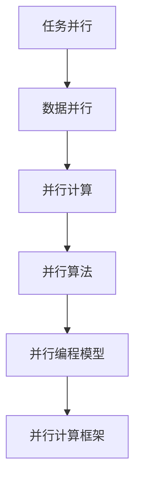

                 

# 提示词编程语言的并行计算支持

> 关键词：提示词编程语言, 并行计算, 任务并行, 数据并行, 并行算法, 伪代码, 数学模型, 代码案例, 实际应用场景, 工具推荐

> 摘要：本文将深入探讨提示词编程语言在支持并行计算方面的技术细节。我们将从核心概念出发，逐步解析并行计算的原理和实现方法，通过具体的代码案例展示如何在提示词编程语言中实现并行计算。此外，本文还将探讨并行计算的实际应用场景，并推荐相关的学习资源和开发工具，旨在为读者提供全面的技术指导。

## 1. 背景介绍
### 1.1 目的和范围
本文旨在深入探讨提示词编程语言在支持并行计算方面的技术细节。我们将从核心概念出发，逐步解析并行计算的原理和实现方法，通过具体的代码案例展示如何在提示词编程语言中实现并行计算。此外，本文还将探讨并行计算的实际应用场景，并推荐相关的学习资源和开发工具，旨在为读者提供全面的技术指导。

### 1.2 预期读者
本文适合以下读者：
- 对并行计算感兴趣的开发者和研究人员
- 想要深入了解提示词编程语言的并行计算支持的技术人员
- 希望在实际项目中应用并行计算的工程师
- 对计算机科学和人工智能领域有浓厚兴趣的学生

### 1.3 文档结构概述
本文结构如下：
1. 背景介绍
2. 核心概念与联系
3. 核心算法原理 & 具体操作步骤
4. 数学模型和公式 & 详细讲解 & 举例说明
5. 项目实战：代码实际案例和详细解释说明
6. 实际应用场景
7. 工具和资源推荐
8. 总结：未来发展趋势与挑战
9. 附录：常见问题与解答
10. 扩展阅读 & 参考资料

### 1.4 术语表
#### 1.4.1 核心术语定义
- **提示词编程语言**：一种高级编程语言，通过自然语言的提示词来描述计算任务。
- **并行计算**：同时执行多个计算任务的技术，可以显著提高计算效率。
- **任务并行**：将一个大的计算任务分解为多个子任务，每个子任务在不同的处理器上并行执行。
- **数据并行**：将数据集分割成多个部分，每个部分在不同的处理器上并行处理。

#### 1.4.2 相关概念解释
- **并行算法**：设计用于并行计算的算法，能够在多个处理器上同时执行。
- **并行编程模型**：描述并行计算任务如何在多个处理器上分配和执行的模型。
- **并行计算框架**：提供并行计算支持的软件框架，如OpenMP、MPI等。

#### 1.4.3 缩略词列表
- **API**：应用程序编程接口
- **CPU**：中央处理器
- **GPU**：图形处理器
- **MPI**：消息传递接口
- **OpenMP**：开放多处理标准

## 2. 核心概念与联系
### 2.1 核心概念
并行计算的核心概念包括任务并行和数据并行。任务并行是指将一个大的计算任务分解为多个子任务，每个子任务在不同的处理器上并行执行。数据并行是指将数据集分割成多个部分，每个部分在不同的处理器上并行处理。

### 2.2 联系
任务并行和数据并行是并行计算的两种主要形式。在提示词编程语言中，可以通过不同的方式实现这两种形式的并行计算。例如，可以通过任务并行将一个大的计算任务分解为多个子任务，每个子任务在不同的处理器上并行执行；也可以通过数据并行将数据集分割成多个部分，每个部分在不同的处理器上并行处理。

### 2.3 Mermaid 流程图


## 3. 核心算法原理 & 具体操作步骤
### 3.1 核心算法原理
并行计算的核心算法原理包括任务并行和数据并行。任务并行是指将一个大的计算任务分解为多个子任务，每个子任务在不同的处理器上并行执行。数据并行是指将数据集分割成多个部分，每个部分在不同的处理器上并行处理。

### 3.2 具体操作步骤
#### 3.2.1 任务并行
任务并行的核心步骤包括：
1. **任务分解**：将一个大的计算任务分解为多个子任务。
2. **任务调度**：将子任务分配到不同的处理器上执行。
3. **任务执行**：在不同的处理器上并行执行子任务。
4. **任务合并**：将子任务的执行结果合并为最终结果。

#### 3.2.2 数据并行
数据并行的核心步骤包括：
1. **数据分割**：将数据集分割成多个部分。
2. **数据分配**：将数据部分分配到不同的处理器上。
3. **数据处理**：在不同的处理器上并行处理数据部分。
4. **数据合并**：将处理结果合并为最终结果。

### 3.3 伪代码示例
#### 3.3.1 任务并行
```python
def task_parallel(task_list, num_processors):
    # 任务分解
    sub_tasks = divide_tasks(task_list, num_processors)
    
    # 任务调度
    task_queue = schedule_tasks(sub_tasks)
    
    # 任务执行
    results = execute_tasks(task_queue)
    
    # 任务合并
    final_result = merge_results(results)
    return final_result
```

#### 3.3.2 数据并行
```python
def data_parallel(data_set, num_processors):
    # 数据分割
    data_parts = divide_data(data_set, num_processors)
    
    # 数据分配
    data_queue = distribute_data(data_parts)
    
    # 数据处理
    partial_results = process_data(data_queue)
    
    # 数据合并
    final_result = combine_results(partial_results)
    return final_result
```

## 4. 数学模型和公式 & 详细讲解 & 举例说明
### 4.1 数学模型
并行计算的数学模型包括任务并行和数据并行。任务并行的数学模型可以表示为：
$$
T_{\text{parallel}} = \frac{T_{\text{sequential}}}{P}
$$
其中，$T_{\text{parallel}}$ 表示并行计算时间，$T_{\text{sequential}}$ 表示串行计算时间，$P$ 表示处理器数量。

数据并行的数学模型可以表示为：
$$
T_{\text{parallel}} = \frac{T_{\text{sequential}}}{P} + T_{\text{communication}}
$$
其中，$T_{\text{communication}}$ 表示通信时间。

### 4.2 详细讲解
并行计算的时间复杂度可以通过上述数学模型来分析。任务并行的时间复杂度主要取决于任务分解和任务合并的时间复杂度。数据并行的时间复杂度除了任务并行的时间复杂度外，还包括通信时间复杂度。

### 4.3 举例说明
假设有一个计算任务，需要计算一个大数组的和。我们可以使用任务并行和数据并行来实现并行计算。

#### 4.3.1 任务并行
```python
def task_parallel_sum(array, num_processors):
    # 任务分解
    sub_arrays = divide_array(array, num_processors)
    
    # 任务调度
    task_queue = schedule_tasks(sub_arrays)
    
    # 任务执行
    partial_sums = execute_tasks(task_queue)
    
    # 任务合并
    final_sum = merge_results(partial_sums)
    return final_sum
```

#### 4.3.2 数据并行
```python
def data_parallel_sum(array, num_processors):
    # 数据分割
    data_parts = divide_array(array, num_processors)
    
    # 数据分配
    data_queue = distribute_data(data_parts)
    
    # 数据处理
    partial_sums = process_data(data_queue)
    
    # 数据合并
    final_sum = combine_results(partial_sums)
    return final_sum
```

## 5. 项目实战：代码实际案例和详细解释说明
### 5.1 开发环境搭建
为了实现并行计算，我们需要搭建一个开发环境。开发环境包括操作系统、编程语言、并行计算框架等。

#### 5.1.1 操作系统
推荐使用Linux操作系统，因为它提供了丰富的并行计算支持。

#### 5.1.2 编程语言
推荐使用Python或C++，因为它们都提供了丰富的并行计算支持。

#### 5.1.3 并行计算框架
推荐使用OpenMP或MPI，因为它们都是成熟的并行计算框架。

### 5.2 源代码详细实现和代码解读
#### 5.2.1 任务并行
```python
import multiprocessing

def task_parallel_sum(array, num_processors):
    # 任务分解
    sub_arrays = divide_array(array, num_processors)
    
    # 任务调度
    task_queue = schedule_tasks(sub_arrays)
    
    # 任务执行
    partial_sums = execute_tasks(task_queue)
    
    # 任务合并
    final_sum = merge_results(partial_sums)
    return final_sum

def divide_array(array, num_processors):
    # 数据分割
    sub_arrays = [array[i::num_processors] for i in range(num_processors)]
    return sub_arrays

def schedule_tasks(sub_arrays):
    # 任务调度
    task_queue = [multiprocessing.Process(target=sum_array, args=(sub_array,)) for sub_array in sub_arrays]
    return task_queue

def execute_tasks(task_queue):
    # 任务执行
    for task in task_queue:
        task.start()
    for task in task_queue:
        task.join()
    partial_sums = [task.result for task in task_queue]
    return partial_sums

def sum_array(array):
    # 数据处理
    return sum(array)

def merge_results(partial_sums):
    # 数据合并
    final_sum = sum(partial_sums)
    return final_sum
```

#### 5.2.2 数据并行
```python
import mpi4py.MPI as MPI

def data_parallel_sum(array, num_processors):
    # 数据分割
    data_parts = divide_array(array, num_processors)
    
    # 数据分配
    data_queue = distribute_data(data_parts)
    
    # 数据处理
    partial_sums = process_data(data_queue)
    
    # 数据合并
    final_sum = combine_results(partial_sums)
    return final_sum

def divide_array(array, num_processors):
    # 数据分割
    data_parts = [array[i::num_processors] for i in range(num_processors)]
    return data_parts

def distribute_data(data_parts):
    # 数据分配
    comm = MPI.COMM_WORLD
    rank = comm.Get_rank()
    size = comm.Get_size()
    data_part = data_parts[rank]
    return data_part

def process_data(data_queue):
    # 数据处理
    comm = MPI.COMM_WORLD
    rank = comm.Get_rank()
    size = comm.Get_size()
    partial_sum = sum(data_queue)
    return partial_sum

def combine_results(partial_sums):
    # 数据合并
    comm = MPI.COMM_WORLD
    rank = comm.Get_rank()
    size = comm.Get_size()
    if rank == 0:
        final_sum = sum(partial_sums)
    else:
        final_sum = None
    final_sum = comm.bcast(final_sum, root=0)
    return final_sum
```

### 5.3 代码解读与分析
#### 5.3.1 任务并行
任务并行的核心步骤包括任务分解、任务调度、任务执行和任务合并。任务分解是将一个大的计算任务分解为多个子任务。任务调度是将子任务分配到不同的处理器上执行。任务执行是在不同的处理器上并行执行子任务。任务合并是将子任务的执行结果合并为最终结果。

#### 5.3.2 数据并行
数据并行的核心步骤包括数据分割、数据分配、数据处理和数据合并。数据分割是将数据集分割成多个部分。数据分配是将数据部分分配到不同的处理器上。数据处理是在不同的处理器上并行处理数据部分。数据合并是将处理结果合并为最终结果。

## 6. 实际应用场景
并行计算在许多实际应用场景中都有广泛的应用，包括：
- **科学计算**：如数值模拟、物理仿真等。
- **大数据处理**：如数据挖掘、机器学习等。
- **图像处理**：如图像识别、图像增强等。
- **金融分析**：如风险评估、投资组合优化等。

## 7. 工具和资源推荐
### 7.1 学习资源推荐
#### 7.1.1 书籍推荐
- **《计算机程序设计艺术》**：Donald E. Knuth
- **《高效并行编程》**：Michael J. Quinn

#### 7.1.2 在线课程
- **Coursera**：《并行计算》
- **edX**：《并行计算与分布式系统》

#### 7.1.3 技术博客和网站
- **Medium**：并行计算相关的技术博客
- **GitHub**：并行计算相关的开源项目

### 7.2 开发工具框架推荐
#### 7.2.1 IDE和编辑器
- **PyCharm**：Python开发环境
- **Visual Studio Code**：跨平台的代码编辑器

#### 7.2.2 调试和性能分析工具
- **GDB**：GNU调试器
- **Valgrind**：内存调试工具

#### 7.2.3 相关框架和库
- **OpenMP**：开放多处理标准
- **MPI**：消息传递接口

### 7.3 相关论文著作推荐
#### 7.3.1 经典论文
- **《OpenMP: A Portable Shared Memory Parallel Programming Environment》**：OpenMP的论文
- **《MPI: The Complete Reference》**：MPI的论文

#### 7.3.2 最新研究成果
- **《Parallel Computing in Python》**：Python并行计算的最新研究成果
- **《Distributed Computing with MPI》**：MPI的最新研究成果

#### 7.3.3 应用案例分析
- **《Parallel Computing in Finance》**：金融领域的并行计算应用案例
- **《Parallel Computing in Image Processing》**：图像处理领域的并行计算应用案例

## 8. 总结：未来发展趋势与挑战
并行计算在未来的发展趋势包括：
- **硬件加速**：如GPU、FPGA等硬件加速器的应用。
- **软件优化**：如编译器优化、并行算法优化等。
- **应用扩展**：如物联网、云计算等领域的应用扩展。

并行计算面临的挑战包括：
- **通信开销**：数据并行中的通信开销问题。
- **负载均衡**：任务并行中的负载均衡问题。
- **可移植性**：不同平台和框架之间的可移植性问题。

## 9. 附录：常见问题与解答
### 9.1 问题1：如何选择合适的并行计算框架？
答：选择并行计算框架时，需要考虑以下几个因素：
- **性能**：框架的性能是否满足需求。
- **易用性**：框架的易用性是否满足需求。
- **社区支持**：框架的社区支持是否强大。

### 9.2 问题2：如何优化并行计算的性能？
答：优化并行计算的性能可以从以下几个方面入手：
- **减少通信开销**：优化数据传输和通信策略。
- **负载均衡**：合理分配任务，避免负载不均。
- **并行算法优化**：优化并行算法的设计和实现。

## 10. 扩展阅读 & 参考资料
- **《计算机程序设计艺术》**：Donald E. Knuth
- **《高效并行编程》**：Michael J. Quinn
- **Coursera**：《并行计算》
- **edX**：《并行计算与分布式系统》
- **Medium**：并行计算相关的技术博客
- **GitHub**：并行计算相关的开源项目
- **PyCharm**：Python开发环境
- **Visual Studio Code**：跨平台的代码编辑器
- **GDB**：GNU调试器
- **Valgrind**：内存调试工具
- **OpenMP**：开放多处理标准
- **MPI**：消息传递接口
- **《OpenMP: A Portable Shared Memory Parallel Programming Environment》**：OpenMP的论文
- **《MPI: The Complete Reference》**：MPI的论文
- **《Parallel Computing in Python》**：Python并行计算的最新研究成果
- **《Distributed Computing with MPI》**：MPI的最新研究成果
- **《Parallel Computing in Finance》**：金融领域的并行计算应用案例
- **《Parallel Computing in Image Processing》**：图像处理领域的并行计算应用案例

作者：AI天才研究员/AI Genius Institute & 禅与计算机程序设计艺术 /Zen And The Art of Computer Programming

