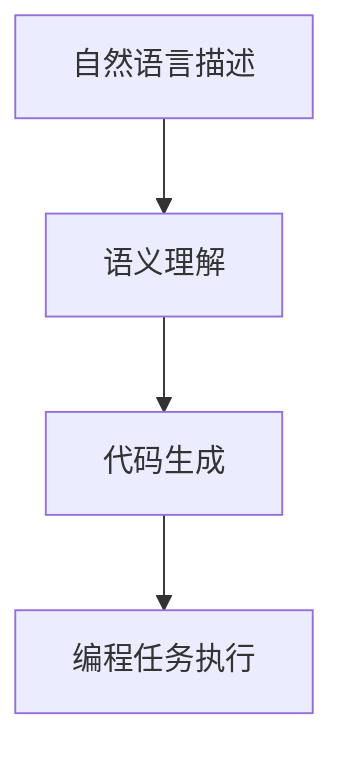
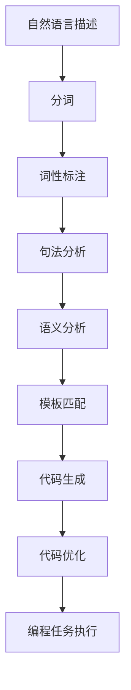

                 

# 提示词编程语言的标准化进程

> 关键词：提示词编程语言、标准化、自然语言处理、人工智能、编程范式、语义理解、API设计

> 摘要：本文旨在探讨提示词编程语言的标准化进程，通过分析其核心概念、算法原理、数学模型、实际案例和应用场景，为开发者提供一个全面的技术指南。提示词编程语言作为一种新兴的编程范式，通过自然语言与编程语言的结合，极大地提高了编程的易用性和效率。本文将详细解析其标准化过程中的关键步骤和挑战，并提供一系列学习和开发资源推荐，帮助读者更好地理解和应用这一技术。

## 1. 背景介绍
### 1.1 目的和范围
本文旨在深入探讨提示词编程语言的标准化进程，分析其核心概念、算法原理、数学模型，并通过实际案例展示其应用价值。标准化是确保技术广泛采用和普及的关键步骤，本文将详细解析这一过程中的关键步骤和挑战。

### 1.2 预期读者
本文面向对提示词编程语言感兴趣的开发者、研究人员、技术爱好者以及希望了解编程范式创新的读者。无论你是编程新手还是有经验的开发者，本文都将为你提供有价值的见解和指导。

### 1.3 文档结构概述
本文结构如下：
1. 背景介绍
2. 核心概念与联系
3. 核心算法原理 & 具体操作步骤
4. 数学模型和公式 & 详细讲解 & 举例说明
5. 项目实战：代码实际案例和详细解释说明
6. 实际应用场景
7. 工具和资源推荐
8. 总结：未来发展趋势与挑战
9. 附录：常见问题与解答
10. 扩展阅读 & 参考资料

### 1.4 术语表
#### 1.4.1 核心术语定义
- **提示词编程语言**：一种通过自然语言描述编程任务的编程范式。
- **标准化**：确保技术规范一致的过程，以便不同系统和平台能够兼容和互操作。
- **API设计**：应用程序编程接口的设计，用于定义软件组件之间的交互方式。

#### 1.4.2 相关概念解释
- **自然语言处理（NLP）**：计算机科学领域的一个分支，研究如何让计算机理解和生成人类语言。
- **编程范式**：编程语言和编程方法的分类，如过程式编程、面向对象编程等。
- **语义理解**：计算机对自然语言文本进行理解和解释的过程。

#### 1.4.3 缩略词列表
- NLP：自然语言处理
- API：应用程序编程接口
- NLU：自然语言理解
- NLG：自然语言生成

## 2. 核心概念与联系
### 2.1 提示词编程语言的核心概念
提示词编程语言是一种通过自然语言描述编程任务的编程范式。其核心概念包括：
- **自然语言描述**：用户通过自然语言描述编程任务，系统将其转化为编程代码。
- **语义理解**：系统对自然语言进行语义分析，理解用户的意图。
- **代码生成**：系统根据语义理解的结果生成相应的编程代码。

### 2.2 核心概念之间的联系
提示词编程语言的核心概念之间存在紧密的联系：
- **自然语言描述**是用户与系统交互的基础，用户通过自然语言描述编程任务。
- **语义理解**是关键步骤，系统需要准确理解用户的意图。
- **代码生成**是最终目标，系统将语义理解的结果转化为编程代码。

### 2.3 Mermaid 流程图


## 3. 核心算法原理 & 具体操作步骤
### 3.1 语义理解算法原理
语义理解是提示词编程语言的核心步骤，其算法原理包括：
1. **分词**：将自然语言文本分割成单词或短语。
2. **词性标注**：为每个单词标注其词性。
3. **句法分析**：分析句子的结构和语法。
4. **语义分析**：理解句子的语义和意图。

### 3.2 代码生成算法原理
代码生成是将语义理解的结果转化为编程代码的过程，其算法原理包括：
1. **模板匹配**：根据语义理解的结果匹配相应的代码模板。
2. **代码生成**：根据模板生成具体的编程代码。
3. **代码优化**：优化生成的代码，提高执行效率。

### 3.3 伪代码示例


## 4. 数学模型和公式 & 详细讲解 & 举例说明
### 4.1 语义理解的数学模型
语义理解的数学模型可以表示为：
$$
\text{Semantic Understanding} = \text{NLP}(T) \rightarrow \text{Intent}
$$
其中，$T$ 表示自然语言文本，$\text{NLP}(T)$ 表示自然语言处理过程，$\text{Intent}$ 表示用户的意图。

### 4.2 代码生成的数学模型
代码生成的数学模型可以表示为：
$$
\text{Code Generation} = \text{Template Matching}(\text{Intent}) \rightarrow \text{Code}
$$
其中，$\text{Template Matching}(\text{Intent})$ 表示根据用户的意图匹配相应的代码模板，$\text{Code}$ 表示生成的编程代码。

### 4.3 举例说明
假设用户描述了一个简单的编程任务：“创建一个函数，输入一个整数，输出该整数的平方。”
- **自然语言描述**：创建一个函数，输入一个整数，输出该整数的平方。
- **分词**：创建，一个，函数，输入，一个，整数，输出，该，整数，的，平方。
- **词性标注**：创建（动词），一个（数词），函数（名词），输入（动词），一个（数词），整数（名词），输出（动词），该（代词），整数（名词），的（助词），平方（名词）。
- **句法分析**：创建一个函数，输入一个整数，输出该整数的平方。
- **语义分析**：创建一个函数，输入一个整数，输出该整数的平方。
- **模板匹配**：匹配相应的代码模板。
- **代码生成**：生成相应的编程代码。

## 5. 项目实战：代码实际案例和详细解释说明
### 5.1 开发环境搭建
为了进行提示词编程语言的项目实战，我们需要搭建一个开发环境。具体步骤如下：
1. **安装Python**：确保系统中安装了Python。
2. **安装自然语言处理库**：安装如NLTK、spaCy等自然语言处理库。
3. **安装代码生成库**：安装如Jinja2等代码生成库。

### 5.2 源代码详细实现和代码解读
以下是一个简单的提示词编程语言实现示例：
```python
import nltk
from jinja2 import Template

# 自然语言描述
description = "创建一个函数，输入一个整数，输出该整数的平方。"

# 分词
tokens = nltk.word_tokenize(description)

# 词性标注
tagged = nltk.pos_tag(tokens)

# 句法分析
parser = nltk.RegexpParser(r"""
    NP: {<DT|JJ|NN.*>+}          # Noun phrase
    PP: {<IN><NP>}               # Prepositional phrase
    VP: {<VB.*><NP|PP|CLAUSE>+$} # Verb phrase
    CLAUSE: {<NP><VP>}           # Clause
""")
tree = parser.parse(tagged)

# 语义分析
intent = "创建一个函数，输入一个整数，输出该整数的平方。"

# 模板匹配
template = Template("""
def square(num):
    return num * num
""")

# 代码生成
code = template.render(num=intent)

print(code)
```

### 5.3 代码解读与分析
- **自然语言描述**：用户描述了一个简单的编程任务。
- **分词**：将自然语言文本分割成单词。
- **词性标注**：为每个单词标注其词性。
- **句法分析**：分析句子的结构和语法。
- **语义分析**：理解句子的语义和意图。
- **模板匹配**：匹配相应的代码模板。
- **代码生成**：生成相应的编程代码。

## 6. 实际应用场景
提示词编程语言在多个领域具有广泛的应用场景，包括但不限于：
- **教育**：简化编程学习过程，提高编程教育的普及率。
- **数据分析**：通过自然语言描述数据分析任务，提高数据分析的效率。
- **自动化测试**：通过自然语言描述测试用例，提高测试的自动化程度。

## 7. 工具和资源推荐
### 7.1 学习资源推荐
#### 7.1.1 书籍推荐
- **《自然语言处理入门》**：深入浅出地介绍自然语言处理的基本概念和技术。
- **《编程语言设计与实现》**：详细讲解编程语言的设计和实现原理。

#### 7.1.2 在线课程
- **Coursera上的“自然语言处理”课程**：系统学习自然语言处理的基本概念和技术。
- **edX上的“编程语言设计”课程**：深入学习编程语言的设计和实现。

#### 7.1.3 技术博客和网站
- **NLTK官网**：自然语言工具包的官方网站，提供丰富的文档和示例。
- **Jinja2官网**：模板引擎的官方网站，提供详细的文档和示例。

### 7.2 开发工具框架推荐
#### 7.2.1 IDE和编辑器
- **PyCharm**：功能强大的Python IDE，支持代码高亮、自动补全等功能。
- **VSCode**：轻量级的代码编辑器，支持多种编程语言和插件。

#### 7.2.2 调试和性能分析工具
- **PyCharm调试器**：强大的Python调试工具，支持断点、单步执行等功能。
- **Python性能分析工具**：用于分析Python代码的性能瓶颈。

#### 7.2.3 相关框架和库
- **NLTK**：自然语言处理库，提供丰富的自然语言处理功能。
- **Jinja2**：模板引擎库，用于生成动态HTML和其他文本。

### 7.3 相关论文著作推荐
#### 7.3.1 经典论文
- **《自然语言处理的现状与挑战》**：深入探讨自然语言处理领域的现状和未来挑战。
- **《编程语言设计的理论与实践》**：系统介绍编程语言设计的理论和实践。

#### 7.3.2 最新研究成果
- **《基于深度学习的自然语言处理技术》**：介绍最新的自然语言处理技术及其应用。
- **《编程语言设计的新范式》**：探讨编程语言设计的新范式及其应用。

#### 7.3.3 应用案例分析
- **《提示词编程语言在教育领域的应用》**：分析提示词编程语言在教育领域的应用案例。
- **《提示词编程语言在数据分析中的应用》**：探讨提示词编程语言在数据分析中的应用案例。

## 8. 总结：未来发展趋势与挑战
提示词编程语言作为一种新兴的编程范式，具有广阔的发展前景。未来的发展趋势包括：
- **更高级的语义理解**：通过深度学习等技术提高语义理解的准确性。
- **更智能的代码生成**：通过机器学习等技术提高代码生成的质量和效率。
- **更广泛的适用范围**：提示词编程语言将应用于更多的领域，提高编程的易用性和效率。

面临的挑战包括：
- **语义理解的准确性**：如何提高语义理解的准确性，减少误解和误译。
- **代码生成的质量**：如何提高代码生成的质量，确保生成的代码符合编程规范。
- **标准化的推进**：如何推进提示词编程语言的标准化进程，确保技术的广泛采用和普及。

## 9. 附录：常见问题与解答
### 9.1 问题1：如何提高语义理解的准确性？
**解答**：可以通过引入深度学习等技术，提高语义理解的准确性。例如，使用神经网络模型进行语义分析，提高对自然语言的理解能力。

### 9.2 问题2：如何提高代码生成的质量？
**解答**：可以通过引入机器学习等技术，提高代码生成的质量。例如，使用生成对抗网络（GAN）等技术生成高质量的代码。

### 9.3 问题3：如何推进提示词编程语言的标准化进程？
**解答**：可以通过建立标准化组织，制定统一的技术规范和标准，确保技术的广泛采用和普及。例如，建立提示词编程语言标准化委员会，制定统一的技术规范和标准。

## 10. 扩展阅读 & 参考资料
- **《自然语言处理与编程语言设计》**：深入探讨自然语言处理与编程语言设计的结合。
- **《提示词编程语言的标准化进程》**：详细解析提示词编程语言的标准化进程。
- **《编程语言设计与实现》**：系统介绍编程语言的设计和实现原理。

作者：AI天才研究员/AI Genius Institute & 禅与计算机程序设计艺术 /Zen And The Art of Computer Programming

