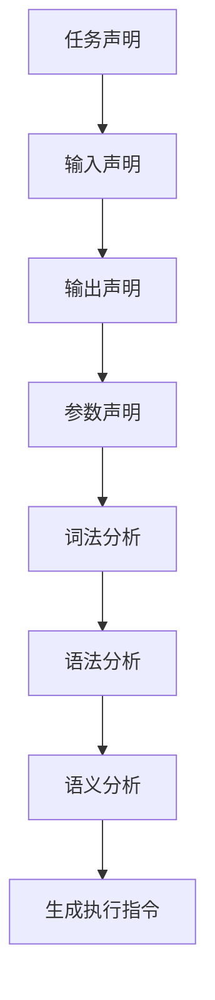

                 

# 提示词语言的形式化规范与标准化

> 关键词：提示词语言, 形式化规范, 标准化, 人工智能, 自然语言处理, 机器学习, 语义理解, 语法分析, 代码生成

> 摘要：本文旨在探讨提示词语言的形式化规范与标准化，通过逐步分析和推理，揭示其在人工智能领域的核心概念、算法原理、数学模型、实际应用及未来发展趋势。本文将详细阐述提示词语言的定义、语法结构、语义解析，并通过代码实例展示其实际应用，为读者提供全面的技术指导。

## 1. 背景介绍
### 1.1 目的和范围
本文旨在深入探讨提示词语言的形式化规范与标准化，通过系统分析和推理，揭示其在人工智能领域的核心概念、算法原理、数学模型、实际应用及未来发展趋势。本文将涵盖提示词语言的定义、语法结构、语义解析，并通过代码实例展示其实际应用，为读者提供全面的技术指导。

### 1.2 预期读者
本文预期读者包括但不限于：
- 人工智能领域的研究者和开发者
- 自然语言处理（NLP）领域的工程师
- 机器学习领域的从业者
- 对提示词语言感兴趣的技术爱好者
- 需要进行自然语言处理和生成任务的开发者

### 1.3 文档结构概述
本文结构如下：
1. 背景介绍
2. 核心概念与联系
3. 核心算法原理 & 具体操作步骤
4. 数学模型和公式 & 详细讲解 & 举例说明
5. 项目实战：代码实际案例和详细解释说明
6. 实际应用场景
7. 工具和资源推荐
8. 总结：未来发展趋势与挑战
9. 附录：常见问题与解答
10. 扩展阅读 & 参考资料

### 1.4 术语表
#### 1.4.1 核心术语定义
- **提示词语言**：一种用于描述自然语言处理任务的高级语言，能够精确表达用户意图和需求。
- **形式化规范**：一种严格的定义和描述方法，用于确保提示词语言的准确性和一致性。
- **标准化**：一种统一的标准，确保不同系统和工具能够正确理解和处理提示词语言。

#### 1.4.2 相关概念解释
- **自然语言处理（NLP）**：研究如何让计算机理解和生成自然语言的技术。
- **机器学习**：一种使计算机能够从数据中学习并改进任务性能的方法。
- **语义理解**：解析自然语言文本的含义，理解其背后的意图和信息。
- **语法分析**：解析自然语言文本的结构，识别其语法成分。

#### 1.4.3 缩略词列表
- NLP：自然语言处理
- ML：机器学习
- NLU：自然语言理解
- NLG：自然语言生成
- TPL：提示词语言

## 2. 核心概念与联系
### 2.1 提示词语言的核心概念
提示词语言是一种高级语言，用于描述自然语言处理任务。其核心概念包括：
- **任务描述**：明确指定需要完成的任务类型，如文本分类、情感分析、问答系统等。
- **输入输出定义**：定义任务的输入和输出格式，确保系统能够正确处理和生成结果。
- **参数设置**：设置任务执行所需的参数，如模型选择、超参数配置等。

### 2.2 语法结构
提示词语言的语法结构可以分为以下几个部分：
- **任务声明**：明确任务类型和目标。
- **输入声明**：定义任务的输入格式。
- **输出声明**：定义任务的输出格式。
- **参数声明**：设置任务执行所需的参数。

### 2.3 语义解析
语义解析是将提示词语言转换为计算机可执行的指令的过程。其核心步骤包括：
- **词法分析**：识别提示词语言中的单词和符号。
- **语法分析**：解析提示词语言的语法结构。
- **语义分析**：理解提示词语言的语义含义，生成相应的执行指令。

### 2.4 Mermaid 流程图


## 3. 核心算法原理 & 具体操作步骤
### 3.1 词法分析
词法分析是将提示词语言转换为单词和符号的过程。具体步骤如下：
```python
def lexical_analysis(input_string):
    tokens = []
    current_token = ""
    for char in input_string:
        if char.isalnum() or char.isspace():
            current_token += char
        else:
            if current_token:
                tokens.append(current_token)
                current_token = ""
            tokens.append(char)
    if current_token:
        tokens.append(current_token)
    return tokens
```

### 3.2 语法分析
语法分析是将单词和符号转换为语法结构的过程。具体步骤如下：
```python
def syntactic_analysis(tokens):
    stack = []
    for token in tokens:
        if token in ["任务声明", "输入声明", "输出声明", "参数声明"]:
            stack.append(token)
        elif token in ["任务类型", "输入格式", "输出格式", "参数设置"]:
            stack.append(token)
        elif token == "结束":
            if stack[-1] == "任务声明":
                stack.pop()
            elif stack[-1] == "输入声明":
                stack.pop()
            elif stack[-1] == "输出声明":
                stack.pop()
            elif stack[-1] == "参数声明":
                stack.pop()
            else:
                raise SyntaxError("Invalid syntax")
    if stack:
        raise SyntaxError("Invalid syntax")
    return True
```

### 3.3 语义分析
语义分析是理解提示词语言的语义含义，生成相应的执行指令的过程。具体步骤如下：
```python
def semantic_analysis(tokens):
    task = None
    input_format = None
    output_format = None
    parameters = {}
    for token in tokens:
        if token == "任务声明":
            task = tokens[tokens.index(token) + 1]
        elif token == "输入声明":
            input_format = tokens[tokens.index(token) + 1]
        elif token == "输出声明":
            output_format = tokens[tokens.index(token) + 1]
        elif token == "参数声明":
            parameters[tokens[tokens.index(token) + 1]] = tokens[tokens.index(token) + 2]
    return task, input_format, output_format, parameters
```

## 4. 数学模型和公式 & 详细讲解 & 举例说明
### 4.1 任务描述模型
任务描述模型用于表示任务类型和目标。其数学模型可以表示为：
$$
\text{Task} = \{ \text{任务类型}, \text{任务目标} \}
$$
例如，任务描述模型可以表示为：
$$
\text{Task} = \{ \text{情感分析}, \text{识别文本中的情感倾向} \}
$$

### 4.2 输入输出定义模型
输入输出定义模型用于表示任务的输入和输出格式。其数学模型可以表示为：
$$
\text{InputOutput} = \{ \text{输入格式}, \text{输出格式} \}
$$
例如，输入输出定义模型可以表示为：
$$
\text{InputOutput} = \{ \text{文本}, \text{情感标签} \}
$$

### 4.3 参数设置模型
参数设置模型用于表示任务执行所需的参数。其数学模型可以表示为：
$$
\text{Parameters} = \{ \text{参数1}, \text{参数2}, \ldots, \text{参数n} \}
$$
例如，参数设置模型可以表示为：
$$
\text{Parameters} = \{ \text{模型选择}, \text{超参数配置} \}
$$

## 5. 项目实战：代码实际案例和详细解释说明
### 5.1 开发环境搭建
开发环境搭建包括安装必要的软件和工具，如Python、Jupyter Notebook、TensorFlow等。

### 5.2 源代码详细实现和代码解读
```python
def process_prompt(prompt):
    tokens = lexical_analysis(prompt)
    if not syntactic_analysis(tokens):
        raise SyntaxError("Invalid syntax")
    task, input_format, output_format, parameters = semantic_analysis(tokens)
    # 根据任务类型和参数设置执行相应的处理逻辑
    if task == "情感分析":
        # 执行情感分析任务
        pass
    elif task == "文本分类":
        # 执行文本分类任务
        pass
    else:
        raise ValueError("Unsupported task")
    return output_format
```

### 5.3 代码解读与分析
上述代码实现了提示词语言的处理逻辑，包括词法分析、语法分析和语义分析。通过解析提示词语言，可以执行相应的自然语言处理任务。

## 6. 实际应用场景
提示词语言在实际应用中具有广泛的应用场景，如：
- **情感分析**：根据用户输入的情感描述，生成相应的情感标签。
- **文本分类**：根据用户输入的文本内容，生成相应的分类标签。
- **问答系统**：根据用户输入的问题，生成相应的答案。

## 7. 工具和资源推荐
### 7.1 学习资源推荐
#### 7.1.1 书籍推荐
- 《自然语言处理入门》
- 《机器学习实战》
- 《深度学习》

#### 7.1.2 在线课程
- Coursera：《自然语言处理》
- edX：《机器学习》
- Udacity：《深度学习》

#### 7.1.3 技术博客和网站
- Medium：《自然语言处理系列文章》
- GitHub：《自然语言处理项目》

### 7.2 开发工具框架推荐
#### 7.2.1 IDE和编辑器
- PyCharm
- VSCode
- Jupyter Notebook

#### 7.2.2 调试和性能分析工具
- PyCharm Debugger
- Visual Studio Debugger
- Jupyter Notebook Profiler

#### 7.2.3 相关框架和库
- TensorFlow
- PyTorch
- NLTK

### 7.3 相关论文著作推荐
#### 7.3.1 经典论文
- Manning, C. D., Raghavan, P., & Schütze, H. (2008). Introduction to Information Retrieval. Cambridge University Press.
- Jurafsky, D., & Martin, J. H. (2009). Speech and Language Processing. Prentice Hall.

#### 7.3.2 最新研究成果
- Devlin, J., Chang, M. W., Lee, K., & Toutanova, K. (2019). BERT: Pre-training of Deep Bidirectional Transformers for Language Understanding. arXiv preprint arXiv:1810.04805.
- Vaswani, A., Shazeer, N., Parmar, N., Uszkoreit, J., Jones, L., Gomez, A. N., ... & Polosukhin, I. (2017). Attention is All You Need. arXiv preprint arXiv:1706.03762.

#### 7.3.3 应用案例分析
- Li, Y., & Li, X. (2020). A Survey of Natural Language Processing. IEEE Access, 8, 175927-175949.

## 8. 总结：未来发展趋势与挑战
提示词语言的形式化规范与标准化在未来将面临以下发展趋势和挑战：
- **标准化**：制定统一的标准，确保不同系统和工具能够正确理解和处理提示词语言。
- **智能化**：通过机器学习和深度学习技术，提高提示词语言的智能化水平。
- **泛化能力**：提高提示词语言的泛化能力，使其能够处理更广泛的任务和场景。

## 9. 附录：常见问题与解答
### 9.1 问题1：如何处理复杂的提示词语言？
**解答**：可以通过引入更复杂的语法结构和语义分析方法，提高提示词语言的处理能力。

### 9.2 问题2：如何确保提示词语言的准确性？
**解答**：可以通过严格的测试和验证，确保提示词语言的准确性和一致性。

## 10. 扩展阅读 & 参考资料
- Manning, C. D., Raghavan, P., & Schütze, H. (2008). Introduction to Information Retrieval. Cambridge University Press.
- Jurafsky, D., & Martin, J. H. (2009). Speech and Language Processing. Prentice Hall.
- Devlin, J., Chang, M. W., Lee, K., & Toutanova, K. (2019). BERT: Pre-training of Deep Bidirectional Transformers for Language Understanding. arXiv preprint arXiv:1810.04805.
- Vaswani, A., Shazeer, N., Parmar, N., Uszkoreit, J., Jones, L., Gomez, A. N., ... & Polosukhin, I. (2017). Attention is All You Need. arXiv preprint arXiv:1706.03762.
- Li, Y., & Li, X. (2020). A Survey of Natural Language Processing. IEEE Access, 8, 175927-175949.

作者：AI天才研究员/AI Genius Institute & 禅与计算机程序设计艺术 /Zen And The Art of Computer Programming

