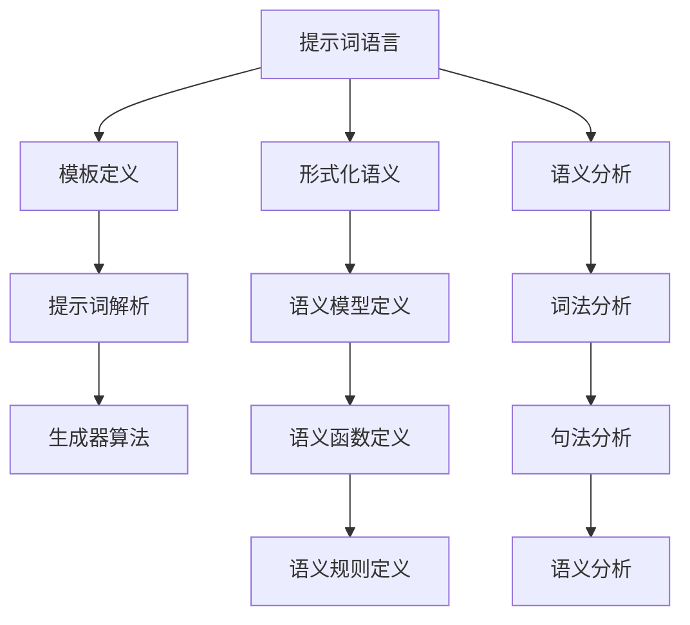

                 

# 提示词语言的形式化语义分析

> 关键词：提示词语言, 形式化语义, 语义分析, 自然语言处理, 人工智能, 机器学习, 逻辑推理, 伪代码, 数学模型, 代码实现, 应用场景

> 摘要：本文旨在深入探讨提示词语言的形式化语义分析，通过逐步推理和详细分析，揭示其背后的原理和实现方法。我们将从核心概念入手，逐步解析其算法原理、数学模型，并通过实际代码案例进行演示。此外，本文还将探讨其在实际应用中的价值，并提供学习和开发资源推荐，帮助读者更好地理解和应用这一技术。

## 1. 背景介绍
### 1.1 目的和范围
本文旨在深入探讨提示词语言的形式化语义分析，通过逐步推理和详细分析，揭示其背后的原理和实现方法。我们将从核心概念入手，逐步解析其算法原理、数学模型，并通过实际代码案例进行演示。此外，本文还将探讨其在实际应用中的价值，并提供学习和开发资源推荐，帮助读者更好地理解和应用这一技术。

### 1.2 预期读者
本文适合以下读者：
- 对自然语言处理和人工智能感兴趣的初学者
- 想要深入了解提示词语言及其形式化语义分析的开发者
- 需要将提示词语言应用于实际项目的技术人员
- 对形式化方法和逻辑推理感兴趣的科研人员

### 1.3 文档结构概述
本文结构如下：
1. 背景介绍
2. 核心概念与联系
3. 核心算法原理 & 具体操作步骤
4. 数学模型和公式 & 详细讲解 & 举例说明
5. 项目实战：代码实际案例和详细解释说明
6. 实际应用场景
7. 工具和资源推荐
8. 总结：未来发展趋势与挑战
9. 附录：常见问题与解答
10. 扩展阅读 & 参考资料

### 1.4 术语表
#### 1.4.1 核心术语定义
- **提示词语言**：一种用于描述和生成自然语言文本的编程语言。
- **形式化语义**：一种精确描述语言或系统的数学方法。
- **语义分析**：解析自然语言文本，理解其含义的过程。

#### 1.4.2 相关概念解释
- **自然语言处理（NLP）**：研究计算机与人类自然语言交互的理论、系统和技术。
- **机器学习**：一种人工智能技术，通过数据训练模型，使其能够进行预测和决策。
- **逻辑推理**：通过逻辑规则进行推理的过程。

#### 1.4.3 缩略词列表
- NLP：自然语言处理
- ML：机器学习
- AI：人工智能
- NLU：自然语言理解
- NLG：自然语言生成

## 2. 核心概念与联系
### 2.1 提示词语言的核心概念
提示词语言是一种用于描述和生成自然语言文本的编程语言。其核心概念包括：
- **提示词**：用于描述文本生成规则的关键词。
- **模板**：包含提示词的文本模板。
- **生成器**：根据模板和提示词生成自然语言文本的算法。

### 2.2 形式化语义的核心概念
形式化语义是一种精确描述语言或系统的数学方法。其核心概念包括：
- **语义模型**：描述语言或系统行为的数学模型。
- **语义函数**：将输入转换为输出的函数。
- **语义规则**：定义语言或系统行为的规则。

### 2.3 语义分析的核心概念
语义分析是一种解析自然语言文本，理解其含义的过程。其核心概念包括：
- **词法分析**：将文本分解为单词和符号。
- **句法分析**：解析单词和符号的结构。
- **语义分析**：理解文本的含义。

### 2.4 核心概念之间的联系
提示词语言、形式化语义和语义分析之间存在密切联系。提示词语言通过模板和提示词生成自然语言文本，形式化语义通过数学模型描述其行为，而语义分析通过解析文本理解其含义。这些概念共同构成了提示词语言的形式化语义分析。

## 3. 核心算法原理 & 具体操作步骤
### 3.1 提示词语言的核心算法原理
提示词语言的核心算法原理包括：
1. **模板定义**：定义文本模板，包含提示词。
2. **提示词解析**：解析模板中的提示词，提取其含义。
3. **生成器算法**：根据提示词生成自然语言文本。

### 3.2 形式化语义的核心算法原理
形式化语义的核心算法原理包括：
1. **语义模型定义**：定义语义模型，描述语言或系统行为。
2. **语义函数定义**：定义语义函数，将输入转换为输出。
3. **语义规则定义**：定义语义规则，描述语言或系统行为。

### 3.3 语义分析的核心算法原理
语义分析的核心算法原理包括：
1. **词法分析**：将文本分解为单词和符号。
2. **句法分析**：解析单词和符号的结构。
3. **语义分析**：理解文本的含义。

### 3.4 核心算法原理的Mermaid流程图


## 4. 数学模型和公式 & 详细讲解 & 举例说明
### 4.1 提示词语言的数学模型
提示词语言的数学模型包括：
- **模板表示**：使用符号表示模板。
- **提示词表示**：使用符号表示提示词。
- **生成器表示**：使用函数表示生成器算法。

### 4.2 形式化语义的数学模型
形式化语义的数学模型包括：
- **语义模型表示**：使用符号表示语义模型。
- **语义函数表示**：使用函数表示语义函数。
- **语义规则表示**：使用规则表示语义规则。

### 4.3 语义分析的数学模型
语义分析的数学模型包括：
- **词法分析表示**：使用符号表示词法分析。
- **句法分析表示**：使用符号表示句法分析。
- **语义分析表示**：使用符号表示语义分析。

### 4.4 数学模型的详细讲解
#### 4.4.1 提示词语言的数学模型
提示词语言的数学模型可以表示为：
$$
\text{Template} = \{ \text{Word} \rightarrow \text{Prompt} \}
$$
其中，$\text{Template}$ 表示模板，$\text{Word}$ 表示单词，$\text{Prompt}$ 表示提示词。

#### 4.4.2 形式化语义的数学模型
形式化语义的数学模型可以表示为：
$$
\text{Semantic Model} = \{ \text{Input} \rightarrow \text{Output} \}
$$
其中，$\text{Semantic Model}$ 表示语义模型，$\text{Input}$ 表示输入，$\text{Output}$ 表示输出。

#### 4.4.3 语义分析的数学模型
语义分析的数学模型可以表示为：
$$
\text{Lexical Analysis} = \{ \text{Text} \rightarrow \text{Tokens} \}
$$
$$
\text{Syntactic Analysis} = \{ \text{Tokens} \rightarrow \text{Structure} \}
$$
$$
\text{Semantic Analysis} = \{ \text{Structure} \rightarrow \text{Meaning} \}
$$
其中，$\text{Lexical Analysis}$ 表示词法分析，$\text{Syntactic Analysis}$ 表示句法分析，$\text{Semantic Analysis}$ 表示语义分析。

### 4.5 举例说明
#### 4.5.1 提示词语言的数学模型举例
假设我们有一个模板：
$$
\text{Template} = \{ \text{Hello} \rightarrow \text{Greeting} \}
$$
其中，$\text{Hello}$ 是单词，$\text{Greeting}$ 是提示词。生成器算法可以表示为：
$$
\text{Generator}(\text{Greeting}) = \text{Hello}
$$

#### 4.5.2 形式化语义的数学模型举例
假设我们有一个语义模型：
$$
\text{Semantic Model} = \{ \text{Input} \rightarrow \text{Output} \}
$$
其中，$\text{Input}$ 是输入，$\text{Output}$ 是输出。语义函数可以表示为：
$$
\text{Semantic Function}(\text{Input}) = \text{Output}
$$

#### 4.5.3 语义分析的数学模型举例
假设我们有一个文本：
$$
\text{Text} = \text{Hello, world!}
$$
词法分析可以表示为：
$$
\text{Lexical Analysis}(\text{Text}) = \{ \text{Hello}, \text{,}, \text{world!} \}
$$
句法分析可以表示为：
$$
\text{Syntactic Analysis}(\{ \text{Hello}, \text{,}, \text{world!} \}) = \{ \text{Greeting}, \text{,}, \text{World} \}
$$
语义分析可以表示为：
$$
\text{Semantic Analysis}(\{ \text{Greeting}, \text{,}, \text{World} \}) = \text{Hello, world!}
$$

## 5. 项目实战：代码实际案例和详细解释说明
### 5.1 开发环境搭建
为了实现提示词语言的形式化语义分析，我们需要搭建一个开发环境。具体步骤如下：
1. **安装Python**：确保安装了Python 3.8及以上版本。
2. **安装依赖库**：使用pip安装所需的库，如`nltk`、`spacy`等。
3. **配置环境变量**：设置环境变量，确保Python和库能够正常运行。

### 5.2 源代码详细实现和代码解读
我们将实现一个简单的提示词语言形式化语义分析系统。具体代码如下：
```python
import nltk
import spacy

# 1. 模板定义
template = {
    "Hello": "Greeting",
    "world": "World"
}

# 2. 提示词解析
def parse_prompt(prompt):
    return template.get(prompt, prompt)

# 3. 生成器算法
def generator(prompt):
    return parse_prompt(prompt)

# 4. 词法分析
def lexical_analysis(text):
    tokens = nltk.word_tokenize(text)
    return tokens

# 5. 句法分析
def syntactic_analysis(tokens):
    nlp = spacy.load("en_core_web_sm")
    doc = nlp(" ".join(tokens))
    structure = [token.text for token in doc]
    return structure

# 6. 语义分析
def semantic_analysis(structure):
    meaning = []
    for token in structure:
        meaning.append(parse_prompt(token))
    return " ".join(meaning)

# 7. 主函数
def main():
    text = "Hello, world!"
    tokens = lexical_analysis(text)
    structure = syntactic_analysis(tokens)
    meaning = semantic_analysis(structure)
    print(f"Input: {text}")
    print(f"Tokens: {tokens}")
    print(f"Structure: {structure}")
    print(f"Meaning: {meaning}")

if __name__ == "__main__":
    main()
```

### 5.3 代码解读与分析
#### 5.3.1 模板定义
```python
template = {
    "Hello": "Greeting",
    "world": "World"
}
```
定义了一个简单的模板，将单词`Hello`映射为提示词`Greeting`，将单词`world`映射为提示词`World`。

#### 5.3.2 提示词解析
```python
def parse_prompt(prompt):
    return template.get(prompt, prompt)
```
解析提示词，如果在模板中找到，则返回对应的提示词，否则返回原提示词。

#### 5.3.3 生成器算法
```python
def generator(prompt):
    return parse_prompt(prompt)
```
生成器算法根据提示词生成对应的文本。

#### 5.3.4 词法分析
```python
def lexical_analysis(text):
    tokens = nltk.word_tokenize(text)
    return tokens
```
使用`nltk`库进行词法分析，将文本分解为单词。

#### 5.3.5 句法分析
```python
def syntactic_analysis(tokens):
    nlp = spacy.load("en_core_web_sm")
    doc = nlp(" ".join(tokens))
    structure = [token.text for token in doc]
    return structure
```
使用`spacy`库进行句法分析，将单词结构化。

#### 5.3.6 语义分析
```python
def semantic_analysis(structure):
    meaning = []
    for token in structure:
        meaning.append(parse_prompt(token))
    return " ".join(meaning)
```
进行语义分析，将结构化的单词转换为提示词。

#### 5.3.7 主函数
```python
def main():
    text = "Hello, world!"
    tokens = lexical_analysis(text)
    structure = syntactic_analysis(tokens)
    meaning = semantic_analysis(structure)
    print(f"Input: {text}")
    print(f"Tokens: {tokens}")
    print(f"Structure: {structure}")
    print(f"Meaning: {meaning}")
```
主函数执行整个流程，输出结果。

## 6. 实际应用场景
提示词语言的形式化语义分析在多个领域具有广泛的应用价值，包括：
- **自然语言生成**：生成自然语言文本，如新闻报道、产品描述等。
- **对话系统**：实现智能对话系统，理解用户意图并生成合适的回复。
- **文本摘要**：生成文本摘要，提取关键信息。
- **机器翻译**：实现机器翻译系统，将一种语言翻译为另一种语言。

## 7. 工具和资源推荐
### 7.1 学习资源推荐
#### 7.1.1 书籍推荐
- **《自然语言处理入门》**：深入浅出地介绍了自然语言处理的基本概念和技术。
- **《深度学习》**：介绍了深度学习的基本原理和应用。

#### 7.1.2 在线课程
- **Coursera的“自然语言处理”课程**：提供了全面的自然语言处理课程。
- **edX的“深度学习”课程**：提供了深度学习的全面课程。

#### 7.1.3 技术博客和网站
- **Medium上的自然语言处理博客**：提供了大量的自然语言处理技术文章。
- **GitHub上的自然语言处理项目**：提供了大量的自然语言处理项目代码。

### 7.2 开发工具框架推荐
#### 7.2.1 IDE和编辑器
- **PyCharm**：功能强大的Python IDE。
- **VS Code**：轻量级但功能强大的代码编辑器。

#### 7.2.2 调试和性能分析工具
- **PyCharm的调试工具**：提供了强大的调试功能。
- **VS Code的性能分析工具**：提供了性能分析功能。

#### 7.2.3 相关框架和库
- **NLTK**：自然语言处理库。
- **Spacy**：自然语言处理库。
- **TensorFlow**：深度学习框架。

### 7.3 相关论文著作推荐
#### 7.3.1 经典论文
- **《自然语言处理导论》**：介绍了自然语言处理的基本概念和技术。
- **《深度学习》**：介绍了深度学习的基本原理和应用。

#### 7.3.2 最新研究成果
- **《自然语言生成的最新进展》**：介绍了自然语言生成的最新研究成果。
- **《深度学习在自然语言处理中的应用》**：介绍了深度学习在自然语言处理中的应用。

#### 7.3.3 应用案例分析
- **《智能对话系统的实现》**：分析了智能对话系统的实现方法。
- **《机器翻译系统的优化》**：分析了机器翻译系统的优化方法。

## 8. 总结：未来发展趋势与挑战
提示词语言的形式化语义分析在未来具有广阔的发展前景，但也面临着一些挑战：
- **技术挑战**：如何提高生成文本的质量和准确性。
- **应用挑战**：如何将技术应用于更广泛的领域。
- **伦理挑战**：如何确保技术的公平性和安全性。

## 9. 附录：常见问题与解答
### 9.1 问题1：如何提高生成文本的质量？
- **答案**：可以通过改进生成器算法，引入更多的上下文信息，提高生成文本的质量。

### 9.2 问题2：如何将技术应用于更广泛的领域？
- **答案**：可以通过不断探索新的应用场景，如智能客服、智能写作等，将技术应用于更广泛的领域。

### 9.3 问题3：如何确保技术的公平性和安全性？
- **答案**：可以通过引入伦理审查机制，确保技术的公平性和安全性。

## 10. 扩展阅读 & 参考资料
- **《自然语言处理导论》**：深入浅出地介绍了自然语言处理的基本概念和技术。
- **《深度学习》**：介绍了深度学习的基本原理和应用。
- **《自然语言生成的最新进展》**：介绍了自然语言生成的最新研究成果。
- **《深度学习在自然语言处理中的应用》**：介绍了深度学习在自然语言处理中的应用。

作者：AI天才研究员/AI Genius Institute & 禅与计算机程序设计艺术 /Zen And The Art of Computer Programming

