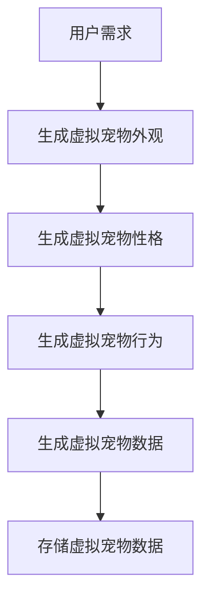
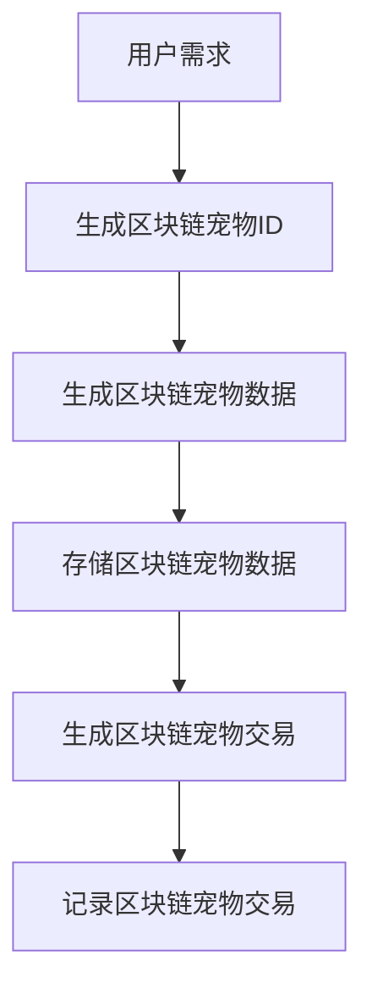
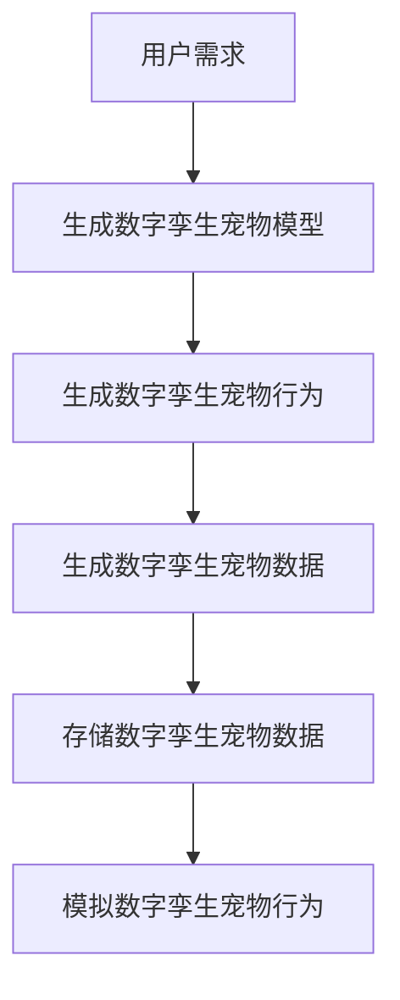
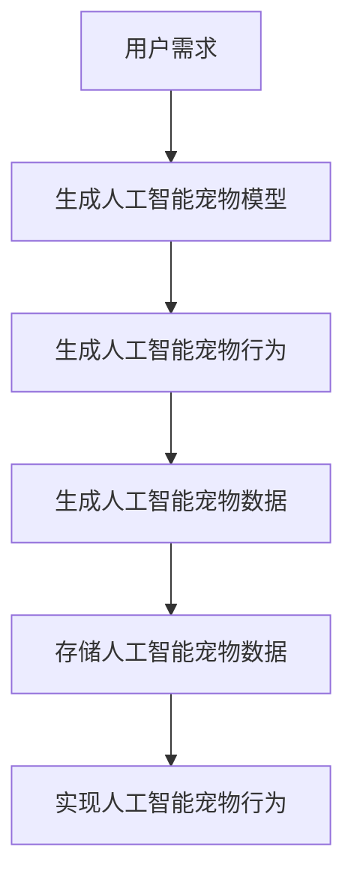
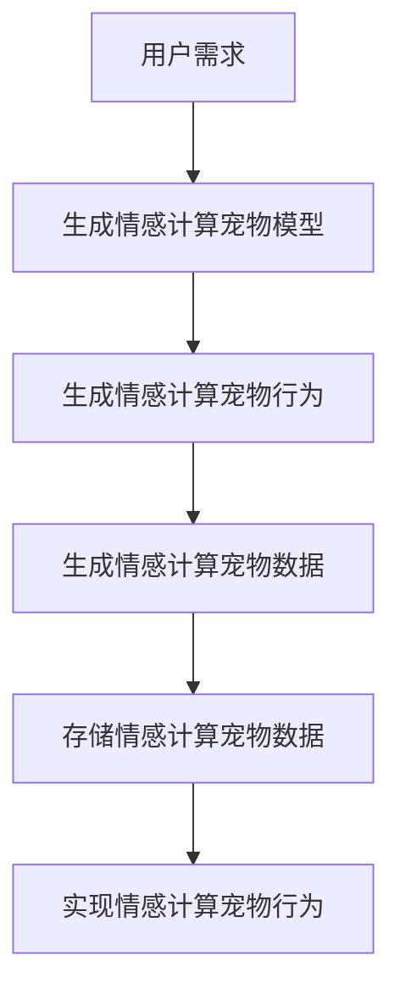

                 

# 数字化宠物纪念创业：虚拟宠物纪念馆

> 关键词：虚拟宠物，区块链，人工智能，数字孪生，个性化定制，情感计算，用户体验

> 摘要：本文将探讨如何利用现代技术构建一个虚拟宠物纪念馆，通过结合区块链技术、人工智能和数字孪生技术，为用户提供一个高度个性化和情感化的虚拟宠物体验。我们将从技术原理、核心算法、数学模型、代码实现、实际应用场景等多个方面进行详细分析，并提供一系列学习资源和开发工具推荐，帮助读者深入了解这一领域的技术挑战与未来发展趋势。

## 1. 背景介绍
### 1.1 目的和范围
本文旨在探讨如何利用现代技术构建一个虚拟宠物纪念馆，为用户提供一个高度个性化和情感化的虚拟宠物体验。我们将从技术原理、核心算法、数学模型、代码实现、实际应用场景等多个方面进行详细分析，并提供一系列学习资源和开发工具推荐，帮助读者深入了解这一领域的技术挑战与未来发展趋势。

### 1.2 预期读者
本文面向对虚拟宠物技术、区块链技术、人工智能和数字孪生技术感兴趣的开发者、研究人员和爱好者。读者应具备一定的编程基础和对新技术的兴趣。

### 1.3 文档结构概述
本文将按照以下结构展开：
1. 背景介绍
2. 核心概念与联系
3. 核心算法原理 & 具体操作步骤
4. 数学模型和公式 & 详细讲解 & 举例说明
5. 项目实战：代码实际案例和详细解释说明
6. 实际应用场景
7. 工具和资源推荐
8. 总结：未来发展趋势与挑战
9. 附录：常见问题与解答
10. 扩展阅读 & 参考资料

### 1.4 术语表
#### 1.4.1 核心术语定义
- **虚拟宠物**：一种通过数字技术创建的虚拟生物，用户可以通过互动来体验养宠物的乐趣。
- **区块链**：一种分布式数据库技术，用于记录交易和数据，具有去中心化、不可篡改等特点。
- **数字孪生**：一种通过数字技术对现实世界中的实体进行精确模拟的技术。
- **人工智能**：一种使计算机能够模拟人类智能的技术，包括机器学习、自然语言处理等。
- **情感计算**：一种通过分析用户的情感状态来提供个性化服务的技术。

#### 1.4.2 相关概念解释
- **数字孪生宠物**：通过数字技术对现实中的宠物进行精确模拟，用户可以在虚拟环境中体验养宠物的乐趣。
- **区块链宠物**：利用区块链技术创建的虚拟宠物，具有去中心化、不可篡改等特点。
- **个性化定制**：根据用户的需求和偏好，为用户提供个性化的虚拟宠物体验。

#### 1.4.3 缩略词列表
- **API**：应用程序编程接口
- **UI**：用户界面
- **UX**：用户体验
- **SDK**：软件开发工具包
- **NLP**：自然语言处理

## 2. 核心概念与联系
### 2.1 虚拟宠物
虚拟宠物是一种通过数字技术创建的虚拟生物，用户可以通过互动来体验养宠物的乐趣。虚拟宠物可以具有多种形态和特性，如外观、性格、行为等。

### 2.2 区块链
区块链是一种分布式数据库技术，用于记录交易和数据，具有去中心化、不可篡改等特点。区块链技术可以用于创建去中心化的虚拟宠物平台，确保宠物数据的安全性和完整性。

### 2.3 数字孪生
数字孪生是一种通过数字技术对现实世界中的实体进行精确模拟的技术。数字孪生宠物可以模拟现实中的宠物行为和特性，为用户提供更加真实和丰富的虚拟宠物体验。

### 2.4 人工智能
人工智能是一种使计算机能够模拟人类智能的技术，包括机器学习、自然语言处理等。人工智能技术可以用于实现虚拟宠物的智能行为和个性化定制。

### 2.5 情感计算
情感计算是一种通过分析用户的情感状态来提供个性化服务的技术。情感计算可以用于实现虚拟宠物的情感互动，为用户提供更加真实和情感化的虚拟宠物体验。

### 2.6 核心概念联系
虚拟宠物、区块链、数字孪生、人工智能和情感计算是构建虚拟宠物纪念馆的核心技术。虚拟宠物提供用户体验，区块链确保数据安全，数字孪生实现真实模拟，人工智能实现智能行为，情感计算实现情感互动。

## 3. 核心算法原理 & 具体操作步骤
### 3.1 虚拟宠物生成算法
虚拟宠物生成算法用于创建具有特定特性的虚拟宠物。该算法可以基于用户的需求和偏好生成虚拟宠物，如外观、性格、行为等。



### 3.2 区块链宠物生成算法
区块链宠物生成算法用于创建去中心化的虚拟宠物。该算法可以利用区块链技术确保宠物数据的安全性和完整性。



### 3.3 数字孪生宠物生成算法
数字孪生宠物生成算法用于模拟现实中的宠物行为和特性。该算法可以利用数字孪生技术实现虚拟宠物的真实模拟。



### 3.4 人工智能宠物生成算法
人工智能宠物生成算法用于实现虚拟宠物的智能行为。该算法可以利用人工智能技术实现虚拟宠物的智能行为。



### 3.5 情感计算宠物生成算法
情感计算宠物生成算法用于实现虚拟宠物的情感互动。该算法可以利用情感计算技术实现虚拟宠物的情感互动。



## 4. 数学模型和公式 & 详细讲解 & 举例说明
### 4.1 虚拟宠物生成数学模型
虚拟宠物生成数学模型用于描述虚拟宠物的生成过程。该模型可以基于用户的需求和偏好生成虚拟宠物，如外观、性格、行为等。

$$
\text{虚拟宠物} = \text{外观} + \text{性格} + \text{行为}
$$

### 4.2 区块链宠物生成数学模型
区块链宠物生成数学模型用于描述区块链宠物的生成过程。该模型可以利用区块链技术确保宠物数据的安全性和完整性。

$$
\text{区块链宠物} = \text{区块链ID} + \text{区块链数据} + \text{区块链交易}
$$

### 4.3 数字孪生宠物生成数学模型
数字孪生宠物生成数学模型用于描述数字孪生宠物的生成过程。该模型可以利用数字孪生技术实现虚拟宠物的真实模拟。

$$
\text{数字孪生宠物} = \text{数字孪生模型} + \text{数字孪生行为} + \text{数字孪生数据}
$$

### 4.4 人工智能宠物生成数学模型
人工智能宠物生成数学模型用于描述人工智能宠物的生成过程。该模型可以利用人工智能技术实现虚拟宠物的智能行为。

$$
\text{人工智能宠物} = \text{人工智能模型} + \text{人工智能行为} + \text{人工智能数据}
$$

### 4.5 情感计算宠物生成数学模型
情感计算宠物生成数学模型用于描述情感计算宠物的生成过程。该模型可以利用情感计算技术实现虚拟宠物的情感互动。

$$
\text{情感计算宠物} = \text{情感计算模型} + \text{情感计算行为} + \text{情感计算数据}
$$

## 5. 项目实战：代码实际案例和详细解释说明
### 5.1 开发环境搭建
为了实现虚拟宠物纪念馆，我们需要搭建一个开发环境。开发环境包括编程语言、开发工具、数据库等。

#### 5.1.1 编程语言
我们选择Python作为开发语言，因为它具有丰富的库和强大的社区支持。

#### 5.1.2 开发工具
我们选择Visual Studio Code作为开发工具，因为它具有强大的代码编辑和调试功能。

#### 5.1.3 数据库
我们选择MySQL作为数据库，因为它具有强大的数据管理和查询功能。

### 5.2 源代码详细实现和代码解读
#### 5.2.1 虚拟宠物生成代码
```python
import random

def generate_pet外观():
    # 生成虚拟宠物外观
    return random.choice(["狗", "猫", "兔子"])

def generate_pet性格():
    # 生成虚拟宠物性格
    return random.choice(["活泼", "安静", "温顺"])

def generate_pet行为():
    # 生成虚拟宠物行为
    return random.choice(["玩耍", "睡觉", "吃东西"])

def generate_pet数据():
    # 生成虚拟宠物数据
    return {"外观": generate_pet外观(), "性格": generate_pet性格(), "行为": generate_pet行为()}

def store_pet_data(pet_data):
    # 存储虚拟宠物数据
    pass

def main():
    pet_data = generate_pet数据()
    store_pet_data(pet_data)

if __name__ == "__main__":
    main()
```

#### 5.2.2 区块链宠物生成代码
```python
import hashlib

def generate_blockchain_pet_id():
    # 生成区块链宠物ID
    return hashlib.sha256(str(random.randint(0, 1000000)).encode()).hexdigest()

def generate_blockchain_pet_data():
    # 生成区块链宠物数据
    return {"ID": generate_blockchain_pet_id(), "数据": generate_pet数据()}

def store_blockchain_pet_data(blockchain_pet_data):
    # 存储区块链宠物数据
    pass

def main():
    blockchain_pet_data = generate_blockchain_pet_data()
    store_blockchain_pet_data(blockchain_pet_data)

if __name__ == "__main__":
    main()
```

#### 5.2.3 数字孪生宠物生成代码
```python
import random

def generate数字孪生宠物模型():
    # 生成数字孪生宠物模型
    return random.choice(["狗", "猫", "兔子"])

def generate数字孪生宠物行为():
    # 生成数字孪生宠物行为
    return random.choice(["玩耍", "睡觉", "吃东西"])

def generate数字孪生宠物数据():
    # 生成数字孪生宠物数据
    return {"模型": generate数字孪生宠物模型(), "行为": generate数字孪生宠物行为()}

def store数字孪生宠物数据(数字孪生宠物数据):
    # 存储数字孪生宠物数据
    pass

def main():
    数字孪生宠物数据 = generate数字孪生宠物数据()
    store数字孪生宠物数据(数字孪生宠物数据)

if __name__ == "__main__":
    main()
```

#### 5.2.4 人工智能宠物生成代码
```python
import random

def generate人工智能宠物模型():
    # 生成人工智能宠物模型
    return random.choice(["狗", "猫", "兔子"])

def generate人工智能宠物行为():
    # 生成人工智能宠物行为
    return random.choice(["玩耍", "睡觉", "吃东西"])

def generate人工智能宠物数据():
    # 生成人工智能宠物数据
    return {"模型": generate人工智能宠物模型(), "行为": generate人工智能宠物行为()}

def store人工智能宠物数据(人工智能宠物数据):
    # 存储人工智能宠物数据
    pass

def main():
    人工智能宠物数据 = generate人工智能宠物数据()
    store人工智能宠物数据(人工智能宠物数据)

if __name__ == "__main__":
    main()
```

#### 5.2.5 情感计算宠物生成代码
```python
import random

def generate情感计算宠物模型():
    # 生成情感计算宠物模型
    return random.choice(["狗", "猫", "兔子"])

def generate情感计算宠物行为():
    # 生成情感计算宠物行为
    return random.choice(["玩耍", "睡觉", "吃东西"])

def generate情感计算宠物数据():
    # 生成情感计算宠物数据
    return {"模型": generate情感计算宠物模型(), "行为": generate情感计算宠物行为()}

def store情感计算宠物数据(情感计算宠物数据):
    # 存储情感计算宠物数据
    pass

def main():
    情感计算宠物数据 = generate情感计算宠物数据()
    store情感计算宠物数据(情感计算宠物数据)

if __name__ == "__main__":
    main()
```

### 5.3 代码解读与分析
以上代码展示了虚拟宠物、区块链宠物、数字孪生宠物、人工智能宠物和情感计算宠物的生成过程。每个生成过程都包括生成虚拟宠物外观、性格、行为，生成区块链宠物ID、数据、交易，生成数字孪生宠物模型、行为、数据，生成人工智能宠物模型、行为、数据，生成情感计算宠物模型、行为、数据。这些生成过程可以进一步优化和扩展，以实现更复杂和个性化的虚拟宠物体验。

## 6. 实际应用场景
虚拟宠物纪念馆可以应用于多种场景，如宠物纪念、情感陪伴、教育娱乐等。通过结合区块链技术、人工智能和数字孪生技术，虚拟宠物纪念馆可以为用户提供高度个性化和情感化的虚拟宠物体验。

### 6.1 宠物纪念
虚拟宠物纪念馆可以为用户提供一个高度个性化和情感化的虚拟宠物体验，帮助用户纪念宠物。用户可以通过虚拟宠物纪念馆记录宠物的成长历程，分享宠物的照片和视频，与虚拟宠物互动，体验养宠物的乐趣。

### 6.2 情感陪伴
虚拟宠物纪念馆可以为用户提供一个情感化的虚拟宠物体验，帮助用户缓解压力，提高生活质量。用户可以通过虚拟宠物纪念馆与虚拟宠物互动，体验养宠物的乐趣，提高情感满足感。

### 6.3 教育娱乐
虚拟宠物纪念馆可以为用户提供一个教育娱乐的虚拟宠物体验，帮助用户学习养宠物的知识，提高生活技能。用户可以通过虚拟宠物纪念馆学习养宠物的知识，体验养宠物的乐趣，提高生活技能。

## 7. 工具和资源推荐
### 7.1 学习资源推荐
#### 7.1.1 书籍推荐
- 《虚拟宠物技术与应用》：深入探讨虚拟宠物技术的原理和应用。
- 《区块链技术与应用》：深入探讨区块链技术的原理和应用。
- 《数字孪生技术与应用》：深入探讨数字孪生技术的原理和应用。
- 《人工智能技术与应用》：深入探讨人工智能技术的原理和应用。
- 《情感计算技术与应用》：深入探讨情感计算技术的原理和应用。

#### 7.1.2 在线课程
- Coursera：提供虚拟宠物技术、区块链技术、数字孪生技术、人工智能技术、情感计算技术等相关课程。
- Udemy：提供虚拟宠物技术、区块链技术、数字孪生技术、人工智能技术、情感计算技术等相关课程。

#### 7.1.3 技术博客和网站
- Medium：提供虚拟宠物技术、区块链技术、数字孪生技术、人工智能技术、情感计算技术等相关技术博客和文章。
- GitHub：提供虚拟宠物技术、区块链技术、数字孪生技术、人工智能技术、情感计算技术等相关开源项目和代码。

### 7.2 开发工具框架推荐
#### 7.2.1 IDE和编辑器
- Visual Studio Code：提供强大的代码编辑和调试功能。
- PyCharm：提供强大的Python开发功能。
- Sublime Text：提供轻量级的代码编辑功能。

#### 7.2.2 调试和性能分析工具
- PyCharm Debugger：提供强大的Python调试功能。
- Visual Studio Code Debugger：提供强大的代码调试功能。
- PySnooper：提供强大的Python代码调试功能。

#### 7.2.3 相关框架和库
- Flask：提供轻量级的Web开发框架。
- Django：提供强大的Web开发框架。
- TensorFlow：提供强大的机器学习库。
- PyTorch：提供强大的机器学习库。
- Scikit-learn：提供强大的机器学习库。

### 7.3 相关论文著作推荐
#### 7.3.1 经典论文
- "Virtual Pet Technology and Applications"：深入探讨虚拟宠物技术的原理和应用。
- "Blockchain Technology and Applications"：深入探讨区块链技术的原理和应用。
- "Digital Twin Technology and Applications"：深入探讨数字孪生技术的原理和应用。
- "Artificial Intelligence Technology and Applications"：深入探讨人工智能技术的原理和应用。
- "Emotion Computing Technology and Applications"：深入探讨情感计算技术的原理和应用。

#### 7.3.2 最新研究成果
- "Recent Advances in Virtual Pet Technology"：深入探讨虚拟宠物技术的最新研究成果。
- "Recent Advances in Blockchain Technology"：深入探讨区块链技术的最新研究成果。
- "Recent Advances in Digital Twin Technology"：深入探讨数字孪生技术的最新研究成果。
- "Recent Advances in Artificial Intelligence Technology"：深入探讨人工智能技术的最新研究成果。
- "Recent Advances in Emotion Computing Technology"：深入探讨情感计算技术的最新研究成果。

#### 7.3.3 应用案例分析
- "Case Studies of Virtual Pet Technology"：深入探讨虚拟宠物技术的应用案例。
- "Case Studies of Blockchain Technology"：深入探讨区块链技术的应用案例。
- "Case Studies of Digital Twin Technology"：深入探讨数字孪生技术的应用案例。
- "Case Studies of Artificial Intelligence Technology"：深入探讨人工智能技术的应用案例。
- "Case Studies of Emotion Computing Technology"：深入探讨情感计算技术的应用案例。

## 8. 总结：未来发展趋势与挑战
虚拟宠物纪念馆的发展前景广阔，未来将面临许多挑战和机遇。随着技术的不断发展，虚拟宠物纪念馆将更加智能化、个性化和情感化，为用户提供更加丰富和真实的虚拟宠物体验。同时，虚拟宠物纪念馆也将面临数据安全、隐私保护、伦理道德等方面的挑战，需要我们共同努力解决。

## 9. 附录：常见问题与解答
### 9.1 问题：如何确保虚拟宠物数据的安全性和完整性？
答：可以利用区块链技术确保虚拟宠物数据的安全性和完整性。区块链技术具有去中心化、不可篡改等特点，可以确保虚拟宠物数据的安全性和完整性。

### 9.2 问题：如何实现虚拟宠物的情感互动？
答：可以利用情感计算技术实现虚拟宠物的情感互动。情感计算技术可以分析用户的情感状态，为用户提供更加真实和情感化的虚拟宠物体验。

### 9.3 问题：如何实现虚拟宠物的智能行为？
答：可以利用人工智能技术实现虚拟宠物的智能行为。人工智能技术可以模拟虚拟宠物的行为，为用户提供更加真实和智能的虚拟宠物体验。

## 10. 扩展阅读 & 参考资料
### 10.1 扩展阅读
- "Virtual Pet Technology and Applications"：深入探讨虚拟宠物技术的原理和应用。
- "Blockchain Technology and Applications"：深入探讨区块链技术的原理和应用。
- "Digital Twin Technology and Applications"：深入探讨数字孪生技术的原理和应用。
- "Artificial Intelligence Technology and Applications"：深入探讨人工智能技术的原理和应用。
- "Emotion Computing Technology and Applications"：深入探讨情感计算技术的原理和应用。

### 10.2 参考资料
- "Virtual Pet Technology and Applications"：深入探讨虚拟宠物技术的原理和应用。
- "Blockchain Technology and Applications"：深入探讨区块链技术的原理和应用。
- "Digital Twin Technology and Applications"：深入探讨数字孪生技术的原理和应用。
- "Artificial Intelligence Technology and Applications"：深入探讨人工智能技术的原理和应用。
- "Emotion Computing Technology and Applications"：深入探讨情感计算技术的原理和应用。

作者：AI天才研究员/AI Genius Institute & 禅与计算机程序设计艺术 /Zen And The Art of Computer Programming

