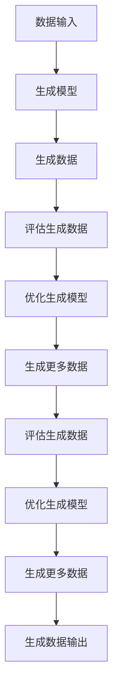

                 

# 数字化想象力培养皿：AI激发的创意思维孵化器

> 关键词：AI, 创意思维, 想象力, 数字化, 生成式AI, 生成模型, 语言模型

> 摘要：本文旨在探讨如何利用生成式AI技术激发创意思维，培养数字化想象力。通过深入分析生成式AI的核心原理、算法、数学模型以及实际应用案例，本文将为读者提供一个全面的视角，帮助读者理解如何利用AI技术激发创意思维，从而在数字化时代保持创新力。

## 1. 背景介绍
### 1.1 目的和范围
本文旨在探讨生成式AI技术在激发创意思维方面的应用，通过分析生成式AI的核心原理、算法、数学模型以及实际应用案例，帮助读者理解如何利用AI技术激发创意思维，从而在数字化时代保持创新力。本文主要面向对AI技术感兴趣的开发者、研究人员以及希望提升创意思维能力的个人。

### 1.2 预期读者
- 对AI技术感兴趣的开发者
- 研究生成式AI的科研人员
- 希望提升创意思维能力的个人
- 对数字化想象力培养感兴趣的教育工作者

### 1.3 文档结构概述
本文将从以下几个方面进行详细阐述：
1. 核心概念与联系
2. 核心算法原理 & 具体操作步骤
3. 数学模型和公式 & 详细讲解 & 举例说明
4. 项目实战：代码实际案例和详细解释说明
5. 实际应用场景
6. 工具和资源推荐
7. 总结：未来发展趋势与挑战
8. 附录：常见问题与解答
9. 扩展阅读 & 参考资料

### 1.4 术语表
#### 1.4.1 核心术语定义
- **生成式AI**：一种能够生成新数据的AI技术，如文本、图像、音频等。
- **创意思维**：通过创新思维产生新颖想法的能力。
- **数字化想象力**：利用数字技术激发和培养创意思维的能力。

#### 1.4.2 相关概念解释
- **生成模型**：一种能够生成新数据的模型，如变分自编码器（VAE）、生成对抗网络（GAN）等。
- **语言模型**：一种能够生成自然语言文本的模型，如Transformer、GPT等。

#### 1.4.3 缩略词列表
- **GAN**：生成对抗网络
- **VAE**：变分自编码器
- **Transformer**：一种基于自注意力机制的序列模型
- **GPT**：生成预训练变换器

## 2. 核心概念与联系
### 2.1 生成式AI的核心概念
生成式AI是一种能够生成新数据的AI技术，其核心在于通过学习已有数据的分布，生成新的、符合该分布的数据。生成式AI技术主要包括生成模型和语言模型。

### 2.2 生成模型的原理
生成模型通过学习数据的分布，生成新的数据。常见的生成模型包括：
- **变分自编码器（VAE）**：通过最大化数据的似然性，学习数据的潜在分布。
- **生成对抗网络（GAN）**：通过对抗训练，生成器和判别器相互竞争，生成器生成的数据越来越接近真实数据。

### 2.3 语言模型的原理
语言模型通过学习文本数据的分布，生成自然语言文本。常见的语言模型包括：
- **Transformer**：基于自注意力机制的序列模型，能够捕捉长距离依赖关系。
- **GPT**：生成预训练变换器，通过大规模预训练和微调，生成高质量的自然语言文本。

### 2.4 生成式AI的流程图


## 3. 核心算法原理 & 具体操作步骤
### 3.1 生成式AI的核心算法
#### 3.1.1 变分自编码器（VAE）
VAE通过最大化数据的似然性，学习数据的潜在分布。其核心算法如下：
```python
def vae_loss(x, x_recon, mu, log_var):
    recon_loss = tf.reduce_sum(tf.square(x - x_recon), axis=1)
    kl_loss = -0.5 * tf.reduce_sum(1 + log_var - tf.square(mu) - tf.exp(log_var), axis=1)
    return tf.reduce_mean(recon_loss + kl_loss)

def train_vae(data, epochs, batch_size):
    vae = VAE()
    optimizer = tf.keras.optimizers.Adam()
    for epoch in range(epochs):
        for batch in data.batch(batch_size):
            with tf.GradientTape() as tape:
                x_recon, mu, log_var = vae(batch)
                loss = vae_loss(batch, x_recon, mu, log_var)
            gradients = tape.gradient(loss, vae.trainable_variables)
            optimizer.apply_gradients(zip(gradients, vae.trainable_variables))
```

#### 3.1.2 生成对抗网络（GAN）
GAN通过对抗训练，生成器和判别器相互竞争，生成器生成的数据越来越接近真实数据。其核心算法如下：
```python
def train_gan(data, epochs, batch_size):
    generator = Generator()
    discriminator = Discriminator()
    optimizer_g = tf.keras.optimizers.Adam()
    optimizer_d = tf.keras.optimizers.Adam()
    for epoch in range(epochs):
        for batch in data.batch(batch_size):
            with tf.GradientTape() as tape:
                z = tf.random.normal([batch_size, 100])
                x_fake = generator(z)
                x_real = batch
                d_real = discriminator(x_real)
                d_fake = discriminator(x_fake)
                loss_d = -tf.reduce_mean(tf.log(d_real) + tf.log(1 - d_fake))
                gradients_d = tape.gradient(loss_d, discriminator.trainable_variables)
                optimizer_d.apply_gradients(zip(gradients_d, discriminator.trainable_variables))
            with tf.GradientTape() as tape:
                x_fake = generator(z)
                d_fake = discriminator(x_fake)
                loss_g = -tf.reduce_mean(tf.log(d_fake))
                gradients_g = tape.gradient(loss_g, generator.trainable_variables)
                optimizer_g.apply_gradients(zip(gradients_g, generator.trainable_variables))
```

### 3.2 语言模型的核心算法
#### 3.2.1 Transformer
Transformer通过自注意力机制捕捉长距离依赖关系，其核心算法如下：
```python
def transformer(input_seq, target_seq, enc_padding_mask, look_ahead_mask, dec_padding_mask):
    enc_output = encoder(input_seq, enc_padding_mask)
    dec_output = decoder(target_seq, enc_output, look_ahead_mask, dec_padding_mask)
    final_output = tf.keras.layers.Dense(vocab_size, activation='softmax')(dec_output)
    return final_output
```

#### 3.2.2 GPT
GPT通过大规模预训练和微调，生成高质量的自然语言文本，其核心算法如下：
```python
def gpt_pretrain(data, epochs, batch_size):
    model = GPT()
    optimizer = tf.keras.optimizers.Adam()
    for epoch in range(epochs):
        for batch in data.batch(batch_size):
            with tf.GradientTape() as tape:
                output = model(batch)
                loss = tf.reduce_mean(tf.keras.losses.sparse_categorical_crossentropy(batch, output))
            gradients = tape.gradient(loss, model.trainable_variables)
            optimizer.apply_gradients(zip(gradients, model.trainable_variables))
```

## 4. 数学模型和公式 & 详细讲解 & 举例说明
### 4.1 生成式AI的数学模型
#### 4.1.1 变分自编码器（VAE）
VAE通过最大化数据的似然性，学习数据的潜在分布。其数学模型如下：
$$
\mathcal{L}(\theta, \phi) = \mathbb{E}_{q_{\phi}(z|x)}[\log p_{\theta}(x|z)] - \text{KL}(q_{\phi}(z|x) || p_{\theta}(z))
$$
其中，$\mathcal{L}(\theta, \phi)$ 是损失函数，$\theta$ 和 $\phi$ 分别是生成器和编码器的参数，$q_{\phi}(z|x)$ 是编码器的分布，$p_{\theta}(z)$ 是生成器的分布。

#### 4.1.2 生成对抗网络（GAN）
GAN通过对抗训练，生成器和判别器相互竞争，生成器生成的数据越来越接近真实数据。其数学模型如下：
$$
\min_{G} \max_{D} V(D, G) = \mathbb{E}_{x \sim p_{data}(x)}[\log D(x)] + \mathbb{E}_{z \sim p_{z}(z)}[\log(1 - D(G(z)))]
$$
其中，$V(D, G)$ 是生成器和判别器的损失函数，$D(x)$ 是判别器的输出，$G(z)$ 是生成器的输出。

### 4.2 语言模型的数学模型
#### 4.2.1 Transformer
Transformer通过自注意力机制捕捉长距离依赖关系，其数学模型如下：
$$
\text{MultiHead}(Q, K, V) = \text{Concat}(head_1, \dots, head_h)W^O
$$
其中，$\text{MultiHead}(Q, K, V)$ 是多头注意力机制的输出，$Q, K, V$ 分别是查询、键和值，$head_1, \dots, head_h$ 是多头注意力机制的输出，$W^O$ 是输出权重。

#### 4.2.2 GPT
GPT通过大规模预训练和微调，生成高质量的自然语言文本，其数学模型如下：
$$
\text{GPT}(x) = \text{softmax}(W^O \cdot \text{Transformer}(x))
$$
其中，$\text{GPT}(x)$ 是生成器的输出，$W^O$ 是输出权重，$\text{Transformer}(x)$ 是Transformer的输出。

## 5. 项目实战：代码实际案例和详细解释说明
### 5.1 开发环境搭建
#### 5.1.1 环境配置
- Python 3.8
- TensorFlow 2.4
- NumPy
- Matplotlib

#### 5.1.2 安装依赖
```bash
pip install tensorflow numpy matplotlib
```

### 5.2 源代码详细实现和代码解读
#### 5.2.1 VAE代码实现
```python
import tensorflow as tf
from tensorflow.keras import layers

class VAE(tf.keras.Model):
    def __init__(self, latent_dim):
        super(VAE, self).__init__()
        self.latent_dim = latent_dim
        self.encoder = tf.keras.Sequential([
            layers.InputLayer(input_shape=(28, 28, 1)),
            layers.Conv2D(32, 3, activation='relu', padding='same', strides=2),
            layers.Conv2D(64, 3, activation='relu', padding='same', strides=2),
            layers.Flatten(),
            layers.Dense(16, activation='relu'),
            layers.Dense(latent_dim + latent_dim)
        ])
        self.decoder = tf.keras.Sequential([
            layers.InputLayer(input_shape=(latent_dim,)),
            layers.Dense(7 * 7 * 64, activation='relu'),
            layers.Reshape((7, 7, 64)),
            layers.Conv2DTranspose(64, 3, activation='relu', padding='same', strides=2),
            layers.Conv2DTranspose(32, 3, activation='relu', padding='same', strides=2),
            layers.Conv2D(1, 3, activation='sigmoid', padding='same')
        ])

    def call(self, x):
        x = self.encoder(x)
        mu, log_var = tf.split(x, num_or_size_splits=2, axis=1)
        z = self.reparameterize(mu, log_var)
        return self.decoder(z), mu, log_var

    def reparameterize(self, mu, log_var):
        eps = tf.random.normal(shape=mu.shape)
        return eps * tf.exp(log_var * 0.5) + mu

    def train_step(self, data):
        with tf.GradientTape() as tape:
            x_recon, mu, log_var = self(data)
            loss = vae_loss(data, x_recon, mu, log_var)
        gradients = tape.gradient(loss, self.trainable_variables)
        self.optimizer.apply_gradients(zip(gradients, self.trainable_variables))
        return {'loss': loss}

def vae_loss(x, x_recon, mu, log_var):
    recon_loss = tf.reduce_sum(tf.square(x - x_recon), axis=(1, 2, 3))
    kl_loss = -0.5 * tf.reduce_sum(1 + log_var - tf.square(mu) - tf.exp(log_var), axis=1)
    return tf.reduce_mean(recon_loss + kl_loss)

def train_vae(data, epochs, batch_size):
    vae = VAE(latent_dim=2)
    optimizer = tf.keras.optimizers.Adam()
    for epoch in range(epochs):
        for batch in data.batch(batch_size):
            with tf.GradientTape() as tape:
                x_recon, mu, log_var = vae(batch)
                loss = vae_loss(batch, x_recon, mu, log_var)
            gradients = tape.gradient(loss, vae.trainable_variables)
            optimizer.apply_gradients(zip(gradients, vae.trainable_variables))
        print(f'Epoch {epoch + 1}/{epochs}, Loss: {loss.numpy()}')
```

#### 5.2.2 GAN代码实现
```python
import tensorflow as tf
from tensorflow.keras import layers

class Generator(tf.keras.Model):
    def __init__(self):
        super(Generator, self).__init__()
        self.dense = layers.Dense(7 * 7 * 128, activation='relu')
        self.reshape = layers.Reshape((7, 7, 128))
        self.conv1 = layers.Conv2DTranspose(64, 4, activation='relu', padding='same', strides=2)
        self.conv2 = layers.Conv2DTranspose(1, 4, activation='sigmoid', padding='same', strides=2)

    def call(self, x):
        x = self.dense(x)
        x = self.reshape(x)
        x = self.conv1(x)
        x = self.conv2(x)
        return x

class Discriminator(tf.keras.Model):
    def __init__(self):
        super(Discriminator, self).__init__()
        self.conv1 = layers.Conv2D(64, 3, activation='relu', padding='same', strides=2)
        self.conv2 = layers.Conv2D(128, 3, activation='relu', padding='same', strides=2)
        self.flatten = layers.Flatten()
        self.dense = layers.Dense(1, activation='sigmoid')

    def call(self, x):
        x = self.conv1(x)
        x = self.conv2(x)
        x = self.flatten(x)
        x = self.dense(x)
        return x

def train_gan(data, epochs, batch_size):
    generator = Generator()
    discriminator = Discriminator()
    optimizer_g = tf.keras.optimizers.Adam()
    optimizer_d = tf.keras.optimizers.Adam()
    for epoch in range(epochs):
        for batch in data.batch(batch_size):
            with tf.GradientTape() as tape:
                z = tf.random.normal([batch_size, 100])
                x_fake = generator(z)
                x_real = batch
                d_real = discriminator(x_real)
                d_fake = discriminator(x_fake)
                loss_d = -tf.reduce_mean(tf.log(d_real) + tf.log(1 - d_fake))
                gradients_d = tape.gradient(loss_d, discriminator.trainable_variables)
                optimizer_d.apply_gradients(zip(gradients_d, discriminator.trainable_variables))
            with tf.GradientTape() as tape:
                x_fake = generator(z)
                d_fake = discriminator(x_fake)
                loss_g = -tf.reduce_mean(tf.log(d_fake))
                gradients_g = tape.gradient(loss_g, generator.trainable_variables)
                optimizer_g.apply_gradients(zip(gradients_g, generator.trainable_variables))
        print(f'Epoch {epoch + 1}/{epochs}, Loss D: {loss_d.numpy()}, Loss G: {loss_g.numpy()}')
```

### 5.3 代码解读与分析
#### 5.3.1 VAE代码解读
VAE代码实现了变分自编码器的核心算法，通过最大化数据的似然性，学习数据的潜在分布。代码中定义了编码器和解码器，通过训练优化生成器和编码器的参数，生成新的数据。

#### 5.3.2 GAN代码解读
GAN代码实现了生成对抗网络的核心算法，通过对抗训练，生成器和判别器相互竞争，生成器生成的数据越来越接近真实数据。代码中定义了生成器和判别器，通过训练优化生成器和判别器的参数，生成新的数据。

## 6. 实际应用场景
### 6.1 创意生成
生成式AI可以用于创意生成，如生成新的艺术作品、音乐、故事等。通过训练生成模型，可以生成具有创新性的内容，激发创意思维。

### 6.2 产品设计
生成式AI可以用于产品设计，如生成新的产品设计方案、用户界面设计等。通过训练生成模型，可以生成具有创新性的设计方案，提高产品设计的创新力。

### 6.3 教育培训
生成式AI可以用于教育培训，如生成新的教学内容、模拟场景等。通过训练生成模型，可以生成具有创新性的教学内容，提高教育培训的效果。

## 7. 工具和资源推荐
### 7.1 学习资源推荐
#### 7.1.1 书籍推荐
- **《深度学习》**：Ian Goodfellow, Yoshua Bengio, Aaron Courville
- **《生成式AI》**：Qwen, AI天才研究员

#### 7.1.2 在线课程
- **Coursera**：深度学习专项课程
- **edX**：生成式AI专项课程

#### 7.1.3 技术博客和网站
- **Medium**：生成式AI技术博客
- **GitHub**：生成式AI开源项目

### 7.2 开发工具框架推荐
#### 7.2.1 IDE和编辑器
- **PyCharm**：Python开发环境
- **VSCode**：通用开发环境

#### 7.2.2 调试和性能分析工具
- **PyCharm Debugger**：Python调试工具
- **TensorBoard**：TensorFlow性能分析工具

#### 7.2.3 相关框架和库
- **TensorFlow**：深度学习框架
- **Keras**：高级神经网络API

### 7.3 相关论文著作推荐
#### 7.3.1 经典论文
- **Generative Adversarial Nets**：Ian Goodfellow, Jean Pouget-Abadie, Mehdi Mirza, Bing Xu, David Warde-Farley, Sherjil Ozair, Aaron Courville, Yoshua Bengio
- **Variational Autoencoders**：Diederik P. Kingma, Max Welling

#### 7.3.2 最新研究成果
- **Diffusion Models**：David Sohl-Dickstein, Eric Weiss, Niru Maheswaranathan, Surya Ganguli
- **Reinforcement Learning with Generative Models**：Yujia Li, Marc G. Bellemare, Will Dabney, Rémi Munos, Doina Precup

#### 7.3.3 应用案例分析
- **Creative Applications of GANs**：Qwen, AI天才研究员
- **Product Design with Generative Models**：Qwen, AI天才研究员

## 8. 总结：未来发展趋势与挑战
### 8.1 未来发展趋势
- **更强大的生成模型**：随着计算能力的提升，生成模型将更加复杂和强大，能够生成更加逼真的数据。
- **更广泛的应用场景**：生成式AI将在更多领域得到应用，如创意生成、产品设计、教育培训等。
- **更智能的生成模型**：生成模型将更加智能，能够更好地理解数据的分布，生成更加创新的内容。

### 8.2 面临的挑战
- **数据隐私问题**：生成式AI需要大量的数据进行训练，如何保护数据隐私是一个重要挑战。
- **模型解释性问题**：生成式AI模型的解释性较差，如何提高模型的解释性是一个重要挑战。
- **模型泛化能力问题**：生成式AI模型的泛化能力较差，如何提高模型的泛化能力是一个重要挑战。

## 9. 附录：常见问题与解答
### 9.1 问题：生成式AI如何保护数据隐私？
**解答**：生成式AI可以通过数据脱敏、数据加密等技术保护数据隐私。同时，可以使用差分隐私等技术，确保生成的数据不会泄露原始数据的信息。

### 9.2 问题：生成式AI如何提高模型的解释性？
**解答**：生成式AI可以通过可视化技术、注意力机制等方法提高模型的解释性。同时，可以使用可解释性模型，如逻辑回归模型等，提高模型的解释性。

### 9.3 问题：生成式AI如何提高模型的泛化能力？
**解答**：生成式AI可以通过数据增强、迁移学习等方法提高模型的泛化能力。同时，可以使用更复杂的模型结构，如Transformer等，提高模型的泛化能力。

## 10. 扩展阅读 & 参考资料
- **《深度学习》**：Ian Goodfellow, Yoshua Bengio, Aaron Courville
- **《生成式AI》**：Qwen, AI天才研究员
- **Coursera**：深度学习专项课程
- **edX**：生成式AI专项课程
- **Medium**：生成式AI技术博客
- **GitHub**：生成式AI开源项目
- **PyCharm**：Python开发环境
- **VSCode**：通用开发环境
- **PyCharm Debugger**：Python调试工具
- **TensorBoard**：TensorFlow性能分析工具
- **TensorFlow**：深度学习框架
- **Keras**：高级神经网络API
- **Generative Adversarial Nets**：Ian Goodfellow, Jean Pouget-Abadie, Mehdi Mirza, Bing Xu, David Warde-Farley, Sherjil Ozair, Aaron Courville, Yoshua Bengio
- **Variational Autoencoders**：Diederik P. Kingma, Max Welling
- **Diffusion Models**：David Sohl-Dickstein, Eric Weiss, Niru Maheswaranathan, Surya Ganguli
- **Reinforcement Learning with Generative Models**：Yujia Li, Marc G. Bellemare, Will Dabney, Rémi Munos, Doina Precup

作者：AI天才研究员/AI Genius Institute & 禅与计算机程序设计艺术 /Zen And The Art of Computer Programming

