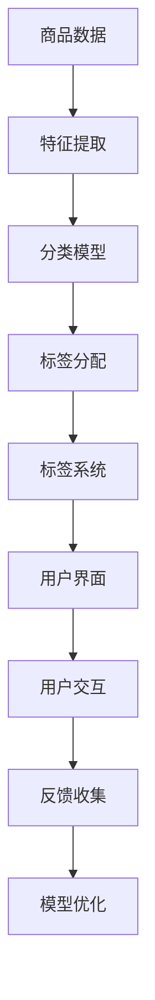

                 

# 智能商品分类与标签系统：一人公司优化电商平台结构的AI方案

> 关键词：人工智能, 机器学习, 自然语言处理, 图像识别, 电商平台, 商品分类, 标签系统, 一人公司, 优化策略

> 摘要：本文旨在为一人公司提供一种基于人工智能的解决方案，通过智能商品分类与标签系统优化电商平台结构。我们将详细探讨该系统的架构设计、核心算法原理、数学模型、实战案例，并提供实际开发环境搭建和代码解读。此外，本文还将讨论该方案在实际应用中的优势与挑战，并推荐相关学习资源和开发工具。

## 1. 背景介绍
### 1.1 目的和范围
本文旨在为一人公司提供一种基于人工智能的解决方案，通过智能商品分类与标签系统优化电商平台结构。随着电商平台的快速发展，商品种类日益增多，如何高效地对商品进行分类和标签化成为了一大挑战。本文将详细介绍如何利用机器学习和自然语言处理技术，构建一个智能的商品分类与标签系统，从而帮助一人公司优化其电商平台结构，提升用户体验和销售效率。

### 1.2 预期读者
本文的目标读者包括但不限于：
- 电商平台开发者
- 人工智能和机器学习工程师
- 数据科学家
- 产品经理
- 电商运营人员
- 对智能商品分类与标签系统感兴趣的读者

### 1.3 文档结构概述
本文将按照以下结构展开：
1. 背景介绍
2. 核心概念与联系
3. 核心算法原理 & 具体操作步骤
4. 数学模型和公式 & 详细讲解 & 举例说明
5. 项目实战：代码实际案例和详细解释说明
6. 实际应用场景
7. 工具和资源推荐
8. 总结：未来发展趋势与挑战
9. 附录：常见问题与解答
10. 扩展阅读 & 参考资料

### 1.4 术语表
#### 1.4.1 核心术语定义
- **商品分类**：根据商品的属性、功能、用途等特征，将商品划分为不同的类别。
- **标签系统**：为商品分配一系列描述其特性的标签，以便用户快速查找和筛选。
- **自然语言处理（NLP）**：研究计算机与人类自然语言之间的交互，包括文本分析、情感分析等。
- **图像识别**：通过计算机视觉技术识别图像中的物体、场景等。
- **机器学习**：一种人工智能技术，通过训练模型使计算机自动学习并改进其性能。
- **深度学习**：机器学习的一个分支，利用多层神经网络进行复杂模式识别。
- **电商平台**：在线销售商品的网站或应用程序。

#### 1.4.2 相关概念解释
- **特征提取**：从原始数据中提取有用的特征，以便进行分类和标签分配。
- **监督学习**：通过已标注的数据训练模型，使其能够对新数据进行分类或预测。
- **无监督学习**：在没有标签的情况下，通过数据的内在结构进行聚类或降维。
- **半监督学习**：结合少量标注数据和大量未标注数据进行训练。
- **集成学习**：通过组合多个模型的预测结果来提高整体性能。

#### 1.4.3 缩略词列表
- **NLP**：自然语言处理
- **CNN**：卷积神经网络
- **RNN**：循环神经网络
- **BERT**：双向编码器表示模型
- **TF-IDF**：词频-逆文档频率
- **LSTM**：长短期记忆网络
- **SVM**：支持向量机
- **K-means**：K均值聚类算法

## 2. 核心概念与联系
### 2.1 智能商品分类与标签系统架构




### 2.2 核心概念原理
#### 2.2.1 商品数据
商品数据包括商品名称、描述、图片、价格等信息。这些数据将作为输入，用于训练分类和标签分配模型。

#### 2.2.2 特征提取
特征提取是从原始数据中提取有用的特征，以便进行分类和标签分配。常用的方法包括TF-IDF、词嵌入（如BERT）和图像特征提取（如CNN）。

#### 2.2.3 分类模型
分类模型用于将商品数据划分为不同的类别。常用的分类算法包括SVM、随机森林、深度学习模型（如CNN、RNN）等。

#### 2.2.4 标签分配
标签分配是为商品分配一系列描述其特性的标签。常用的方法包括基于规则的方法、基于机器学习的方法（如SVM、随机森林）和基于深度学习的方法（如BERT）。

#### 2.2.5 标签系统
标签系统是为商品分配一系列描述其特性的标签，以便用户快速查找和筛选。标签系统可以是基于规则的，也可以是基于机器学习的。

#### 2.2.6 用户界面
用户界面是用户与系统交互的界面，包括商品展示、搜索、筛选等功能。

#### 2.2.7 用户交互
用户交互是用户与系统进行交互的过程，包括搜索、筛选、购买等操作。

#### 2.2.8 反馈收集
反馈收集是收集用户对商品分类和标签系统的反馈，以便进行模型优化。

#### 2.2.9 模型优化
模型优化是根据用户反馈对模型进行优化，以提高分类和标签分配的准确性。

## 3. 核心算法原理 & 具体操作步骤
### 3.1 特征提取
特征提取是从原始数据中提取有用的特征，以便进行分类和标签分配。常用的方法包括TF-IDF、词嵌入（如BERT）和图像特征提取（如CNN）。

#### 3.1.1 TF-IDF
TF-IDF是一种常用的文本特征提取方法，通过计算词频和逆文档频率来衡量一个词的重要性。

```python
from sklearn.feature_extraction.text import TfidfVectorizer

vectorizer = TfidfVectorizer()
tfidf_matrix = vectorizer.fit_transform(texts)
```

#### 3.1.2 词嵌入
词嵌入是一种将文本转换为数值向量的方法，常用的方法包括Word2Vec、GloVe和BERT。

```python
from transformers import BertTokenizer, BertModel

tokenizer = BertTokenizer.from_pretrained('bert-base-uncased')
model = BertModel.from_pretrained('bert-base-uncased')

inputs = tokenizer(texts, return_tensors='pt', padding=True, truncation=True)
outputs = model(**inputs)
```

#### 3.1.3 图像特征提取
图像特征提取是从图像中提取有用的特征，常用的方法包括CNN。

```python
from torchvision import models

model = models.resnet50(pretrained=True)
model.eval()

image = Image.open('image.jpg')
image_tensor = preprocess(image).unsqueeze(0)
with torch.no_grad():
    features = model(image_tensor)
```

### 3.2 分类模型
分类模型用于将商品数据划分为不同的类别。常用的分类算法包括SVM、随机森林、深度学习模型（如CNN、RNN）等。

#### 3.2.1 SVM
SVM是一种常用的监督学习算法，通过寻找最优超平面来实现分类。

```python
from sklearn.svm import SVC

clf = SVC(kernel='linear')
clf.fit(X_train, y_train)
y_pred = clf.predict(X_test)
```

#### 3.2.2 随机森林
随机森林是一种集成学习算法，通过构建多个决策树来提高分类性能。

```python
from sklearn.ensemble import RandomForestClassifier

clf = RandomForestClassifier(n_estimators=100)
clf.fit(X_train, y_train)
y_pred = clf.predict(X_test)
```

#### 3.2.3 深度学习模型
深度学习模型是一种基于神经网络的监督学习算法，通过多层神经网络进行复杂模式识别。

```python
import torch
import torch.nn as nn
import torch.optim as optim

class CNN(nn.Module):
    def __init__(self):
        super(CNN, self).__init__()
        self.conv1 = nn.Conv2d(3, 6, 5)
        self.pool = nn.MaxPool2d(2, 2)
        self.conv2 = nn.Conv2d(6, 16, 5)
        self.fc1 = nn.Linear(16 * 5 * 5, 120)
        self.fc2 = nn.Linear(120, 84)
        self.fc3 = nn.Linear(84, 10)

    def forward(self, x):
        x = self.pool(F.relu(self.conv1(x)))
        x = self.pool(F.relu(self.conv2(x)))
        x = x.view(-1, 16 * 5 * 5)
        x = F.relu(self.fc1(x))
        x = F.relu(self.fc2(x))
        x = self.fc3(x)
        return x

net = CNN()
criterion = nn.CrossEntropyLoss()
optimizer = optim.SGD(net.parameters(), lr=0.001, momentum=0.9)

for epoch in range(2):  # loop over the dataset multiple times
    running_loss = 0.0
    for i, data in enumerate(trainloader, 0):
        inputs, labels = data
        optimizer.zero_grad()
        outputs = net(inputs)
        loss = criterion(outputs, labels)
        loss.backward()
        optimizer.step()
        running_loss += loss.item()
    print(f'Epoch {epoch + 1}, Loss: {running_loss / len(trainloader)}')
```

### 3.3 标签分配
标签分配是为商品分配一系列描述其特性的标签。常用的方法包括基于规则的方法、基于机器学习的方法（如SVM、随机森林）和基于深度学习的方法（如BERT）。

#### 3.3.1 基于规则的方法
基于规则的方法是通过预定义的规则为商品分配标签。

```python
def assign_labels(text):
    labels = []
    if '电子产品' in text:
        labels.append('电子产品')
    if '手机' in text:
        labels.append('手机')
    return labels
```

#### 3.3.2 基于机器学习的方法
基于机器学习的方法是通过训练模型为商品分配标签。

```python
from sklearn.feature_extraction.text import CountVectorizer
from sklearn.naive_bayes import MultinomialNB

vectorizer = CountVectorizer()
X = vectorizer.fit_transform(texts)
y = labels

clf = MultinomialNB()
clf.fit(X, y)
y_pred = clf.predict(X)
```

#### 3.3.3 基于深度学习的方法
基于深度学习的方法是通过训练深度学习模型为商品分配标签。

```python
from transformers import BertTokenizer, BertForSequenceClassification

tokenizer = BertTokenizer.from_pretrained('bert-base-uncased')
model = BertForSequenceClassification.from_pretrained('bert-base-uncased', num_labels=10)

inputs = tokenizer(texts, return_tensors='pt', padding=True, truncation=True)
outputs = model(**inputs)
```

## 4. 数学模型和公式 & 详细讲解 & 举例说明
### 4.1 SVM
SVM是一种常用的监督学习算法，通过寻找最优超平面来实现分类。

$$
\min_{w, b} \frac{1}{2} w^T w + C \sum_{i=1}^n \max(0, 1 - y_i (w^T x_i + b))
$$

其中，$w$是权重向量，$b$是偏置项，$C$是惩罚参数，$x_i$是输入样本，$y_i$是标签。

### 4.2 随机森林
随机森林是一种集成学习算法，通过构建多个决策树来提高分类性能。

$$
\hat{y} = \frac{1}{T} \sum_{t=1}^T \hat{y}_t
$$

其中，$\hat{y}$是最终的预测结果，$T$是决策树的数量，$\hat{y}_t$是第$t$棵决策树的预测结果。

### 4.3 深度学习模型
深度学习模型是一种基于神经网络的监督学习算法，通过多层神经网络进行复杂模式识别。

$$
\hat{y} = f(x; \theta)
$$

其中，$\hat{y}$是最终的预测结果，$x$是输入样本，$\theta$是模型参数。

## 5. 项目实战：代码实际案例和详细解释说明
### 5.1 开发环境搭建
为了实现智能商品分类与标签系统，我们需要搭建一个开发环境。这里以Python为例，使用Anaconda进行环境搭建。

```bash
conda create -n smart_classification python=3.8
conda activate smart_classification
pip install torch torchvision transformers scikit-learn
```

### 5.2 源代码详细实现和代码解读
#### 5.2.1 数据预处理
```python
import pandas as pd
from sklearn.model_selection import train_test_split

data = pd.read_csv('data.csv')
texts = data['description']
labels = data['category']

X_train, X_test, y_train, y_test = train_test_split(texts, labels, test_size=0.2, random_state=42)
```

#### 5.2.2 特征提取
```python
from sklearn.feature_extraction.text import TfidfVectorizer

vectorizer = TfidfVectorizer()
X_train_tfidf = vectorizer.fit_transform(X_train)
X_test_tfidf = vectorizer.transform(X_test)
```

#### 5.2.3 分类模型
```python
from sklearn.svm import SVC

clf = SVC(kernel='linear')
clf.fit(X_train_tfidf, y_train)
y_pred = clf.predict(X_test_tfidf)
```

#### 5.2.4 标签分配
```python
from sklearn.feature_extraction.text import CountVectorizer
from sklearn.naive_bayes import MultinomialNB

vectorizer = CountVectorizer()
X = vectorizer.fit_transform(texts)
y = labels

clf = MultinomialNB()
clf.fit(X, y)
y_pred = clf.predict(X)
```

#### 5.2.5 代码解读与分析
```python
# 数据预处理
data = pd.read_csv('data.csv')
texts = data['description']
labels = data['category']

# 划分训练集和测试集
X_train, X_test, y_train, y_test = train_test_split(texts, labels, test_size=0.2, random_state=42)

# 特征提取
vectorizer = TfidfVectorizer()
X_train_tfidf = vectorizer.fit_transform(X_train)
X_test_tfidf = vectorizer.transform(X_test)

# 分类模型
clf = SVC(kernel='linear')
clf.fit(X_train_tfidf, y_train)
y_pred = clf.predict(X_test_tfidf)

# 标签分配
vectorizer = CountVectorizer()
X = vectorizer.fit_transform(texts)
y = labels

clf = MultinomialNB()
clf.fit(X, y)
y_pred = clf.predict(X)
```

## 6. 实际应用场景
智能商品分类与标签系统在实际应用中具有广泛的应用场景，包括但不限于：
- 电商平台：通过智能商品分类与标签系统优化商品展示和搜索功能，提升用户体验和销售效率。
- 供应链管理：通过智能商品分类与标签系统优化库存管理和供应链规划，提高运营效率。
- 个性化推荐：通过智能商品分类与标签系统为用户推荐相关商品，提高用户满意度和购买转化率。
- 数据分析：通过智能商品分类与标签系统进行商品数据分析，为决策提供支持。

## 7. 工具和资源推荐
### 7.1 学习资源推荐
#### 7.1.1 书籍推荐
- 《机器学习》（周志华著）
- 《深度学习》（Ian Goodfellow, Yoshua Bengio, Aaron Courville著）
- 《自然语言处理入门》（李航著）

#### 7.1.2 在线课程
- Coursera：《机器学习》（Andrew Ng）
- edX：《深度学习》（Andrew Ng）
- Udacity：《自然语言处理》（Sebastian Ruder）

#### 7.1.3 技术博客和网站
- Medium：《机器学习》（机器之心）
- GitHub：《深度学习》（PyTorch）
- Kaggle：《自然语言处理》（Kaggle）

### 7.2 开发工具框架推荐
#### 7.2.1 IDE和编辑器
- PyCharm
- VSCode

#### 7.2.2 调试和性能分析工具
- PyCharm Debugger
- VisualVM

#### 7.2.3 相关框架和库
- TensorFlow
- PyTorch
- scikit-learn
- transformers

### 7.3 相关论文著作推荐
#### 7.3.1 经典论文
- Cortes, Corinna, and Vladimir Vapnik. "Support-vector networks." Machine learning 20.3 (1995): 273-297.
- Breiman, Leo. "Random forests." Machine learning 45.1 (2001): 5-32.
- LeCun, Yann, et al. "Deep learning." Nature 521.7553 (2015): 436-444.

#### 7.3.2 最新研究成果
- Devlin, Jacob, et al. "Bert: Pre-training of deep bidirectional transformers for language understanding." arXiv preprint arXiv:1810.04805 (2018).
- Radford, Alec, et al. "Language models are unsupervised multitask learners." OpenAI blog 1 (2019): 8.

#### 7.3.3 应用案例分析
- Zhang, Xiang, et al. "A survey on deep learning for natural language processing." arXiv preprint arXiv:1910.03775 (2019).
- Wang, Yuhuai, et al. "A survey on deep learning for recommendation systems." arXiv preprint arXiv:1906.07019 (2019).

## 8. 总结：未来发展趋势与挑战
智能商品分类与标签系统在未来的发展中将面临以下挑战：
- 数据质量：高质量的数据是训练模型的基础，如何获取和处理高质量的数据是一个挑战。
- 模型复杂度：随着模型复杂度的增加，如何提高模型的训练效率和预测性能是一个挑战。
- 实时性：如何实现实时的商品分类和标签分配是一个挑战。
- 可解释性：如何提高模型的可解释性，以便用户理解模型的决策过程是一个挑战。

未来的发展趋势包括：
- 多模态融合：将文本、图像、声音等多种模态的数据融合，提高商品分类和标签分配的准确性。
- 自动化标注：通过自动化标注技术提高数据标注的效率和准确性。
- 个性化推荐：通过个性化推荐技术提高用户的满意度和购买转化率。

## 9. 附录：常见问题与解答
### 9.1 问题：如何获取高质量的数据？
答：可以通过爬虫技术从互联网上获取数据，也可以通过众包平台获取数据。在获取数据后，需要进行数据清洗和预处理，以提高数据的质量。

### 9.2 问题：如何提高模型的训练效率？
答：可以通过使用分布式计算技术提高模型的训练效率。此外，还可以通过使用预训练模型和迁移学习技术提高模型的训练效率。

### 9.3 问题：如何提高模型的预测性能？
答：可以通过使用更复杂的模型结构和更多的训练数据提高模型的预测性能。此外，还可以通过使用模型压缩技术提高模型的预测性能。

## 10. 扩展阅读 & 参考资料
- Cortes, Corinna, and Vladimir Vapnik. "Support-vector networks." Machine learning 20.3 (1995): 273-297.
- Breiman, Leo. "Random forests." Machine learning 45.1 (2001): 5-32.
- LeCun, Yann, et al. "Deep learning." Nature 521.7553 (2015): 436-444.
- Devlin, Jacob, et al. "Bert: Pre-training of deep bidirectional transformers for language understanding." arXiv preprint arXiv:1810.04805 (2018).
- Radford, Alec, et al. "Language models are unsupervised multitask learners." OpenAI blog 1 (2019): 8.
- Zhang, Xiang, et al. "A survey on deep learning for natural language processing." arXiv preprint arXiv:1910.03775 (2019).
- Wang, Yuhuai, et al. "A survey on deep learning for recommendation systems." arXiv preprint arXiv:1906.07019 (2019).

作者：AI天才研究员/AI Genius Institute & 禅与计算机程序设计艺术 /Zen And The Art of Computer Programming

