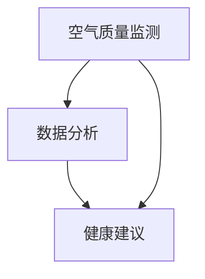

                 

# 智能家居空气营养创业：呼吸健康的精确管理

> 关键词：智能家居, 空气营养, 呼吸健康, 人工智能, 物联网, 数据分析, 健康管理

> 摘要：本文旨在探讨如何通过智能家居技术实现呼吸健康的精确管理。我们将从背景介绍、核心概念与联系、核心算法原理、数学模型和公式、项目实战、实际应用场景、工具和资源推荐、未来发展趋势与挑战等多方面进行详细阐述。通过本文，读者将能够理解并掌握如何利用先进的技术手段来改善家庭成员的呼吸健康状况。

## 1. 背景介绍
### 1.1 目的和范围
本文旨在介绍如何利用智能家居技术实现呼吸健康的精确管理。通过集成先进的传感器、数据分析和人工智能算法，我们能够实时监测家庭环境中的空气质量，并根据监测结果提供个性化的健康建议。本文将涵盖从技术原理到实际应用的全过程，旨在为智能家居领域的开发者和爱好者提供有价值的参考。

### 1.2 预期读者
本文预期读者包括但不限于：
- 智能家居领域的开发者和工程师
- 对呼吸健康管理和智能家居技术感兴趣的个人
- 健康管理领域的专业人士
- 对物联网和人工智能技术感兴趣的读者

### 1.3 文档结构概述
本文将按照以下结构展开：
1. 背景介绍
2. 核心概念与联系
3. 核心算法原理 & 具体操作步骤
4. 数学模型和公式 & 详细讲解 & 举例说明
5. 项目实战：代码实际案例和详细解释说明
6. 实际应用场景
7. 工具和资源推荐
8. 总结：未来发展趋势与挑战
9. 附录：常见问题与解答
10. 扩展阅读 & 参考资料

### 1.4 术语表
#### 1.4.1 核心术语定义
- **智能家居**：通过物联网技术将家庭中的各种设备连接起来，实现远程控制和自动化管理。
- **空气营养**：通过改善家庭环境中的空气质量，提高家庭成员的呼吸健康。
- **呼吸健康**：指家庭成员的呼吸系统处于良好的状态，能够有效抵御外界环境中的有害物质。
- **传感器**：用于监测家庭环境中的各种参数，如温度、湿度、PM2.5等。
- **数据分析**：通过对传感器收集的数据进行处理和分析，提取有用的信息。
- **人工智能算法**：用于处理和分析数据的算法，如机器学习、深度学习等。

#### 1.4.2 相关概念解释
- **物联网（IoT）**：通过互联网将各种设备连接起来，实现远程控制和数据交换。
- **机器学习**：一种人工智能技术，通过训练模型来实现对数据的自动学习和预测。
- **深度学习**：一种机器学习技术，通过多层神经网络来实现对复杂数据的处理和分析。

#### 1.4.3 缩略词列表
- **IoT**：物联网
- **AI**：人工智能
- **ML**：机器学习
- **DL**：深度学习
- **PM2.5**：细颗粒物，直径小于2.5微米的颗粒物

## 2. 核心概念与联系
### 2.1 核心概念
- **空气质量监测**：通过传感器实时监测家庭环境中的空气质量参数。
- **数据分析**：通过对传感器收集的数据进行处理和分析，提取有用的信息。
- **健康建议**：根据数据分析结果，提供个性化的健康建议。

### 2.2 联系
- **空气质量监测**与**数据分析**：空气质量监测是数据分析的基础，通过监测数据可以了解家庭环境中的空气质量状况。
- **数据分析**与**健康建议**：数据分析的结果可以用于生成个性化的健康建议，帮助家庭成员改善呼吸健康状况。

### 2.3 Mermaid 流程图


## 3. 核心算法原理 & 具体操作步骤
### 3.1 核心算法原理
我们将使用机器学习算法来处理和分析传感器收集的数据。具体来说，我们将使用以下算法：
- **数据预处理**：对传感器收集的数据进行清洗和标准化处理。
- **特征提取**：从传感器数据中提取有用的特征。
- **模型训练**：使用机器学习算法训练模型，实现对数据的自动学习和预测。
- **健康建议生成**：根据模型的预测结果，生成个性化的健康建议。

### 3.2 具体操作步骤
#### 3.2.1 数据预处理
```python
# 数据预处理
def preprocess_data(data):
    # 清洗数据
    cleaned_data = clean_data(data)
    # 标准化数据
    normalized_data = normalize_data(cleaned_data)
    return normalized_data
```

#### 3.2.2 特征提取
```python
# 特征提取
def extract_features(data):
    # 提取特征
    features = extract_features_from_data(data)
    return features
```

#### 3.2.3 模型训练
```python
# 模型训练
def train_model(features, labels):
    # 训练模型
    model = train_model_with_features(features, labels)
    return model
```

#### 3.2.4 健康建议生成
```python
# 健康建议生成
def generate_health_advice(model, data):
    # 预测结果
    prediction = model.predict(data)
    # 生成健康建议
    advice = generate_advice(prediction)
    return advice
```

## 4. 数学模型和公式 & 详细讲解 & 举例说明
### 4.1 数学模型
我们将使用线性回归模型来处理和分析传感器收集的数据。具体来说，我们将使用以下公式：
- **线性回归模型**：$y = \beta_0 + \beta_1 x_1 + \beta_2 x_2 + \cdots + \beta_n x_n$
- **损失函数**：$L = \frac{1}{2m} \sum_{i=1}^{m} (y_i - \hat{y}_i)^2$
- **梯度下降算法**：$\beta_j = \beta_j - \alpha \frac{\partial L}{\partial \beta_j}$

### 4.2 详细讲解
- **线性回归模型**：通过线性回归模型，我们可以将传感器收集的数据与健康建议之间的关系建立起来。
- **损失函数**：损失函数用于衡量模型预测结果与实际结果之间的差距。
- **梯度下降算法**：梯度下降算法用于优化模型参数，使得损失函数最小化。

### 4.3 举例说明
假设我们有一个传感器收集的数据集，其中包含温度、湿度和PM2.5三个参数。我们可以通过线性回归模型来预测家庭成员的呼吸健康状况。具体来说，我们可以使用以下公式：
$$
y = \beta_0 + \beta_1 x_1 + \beta_2 x_2 + \beta_3 x_3
$$
其中，$y$表示呼吸健康状况，$x_1$、$x_2$和$x_3$分别表示温度、湿度和PM2.5。通过训练模型，我们可以得到模型参数$\beta_0$、$\beta_1$、$\beta_2$和$\beta_3$。然后，我们可以使用这些参数来预测家庭成员的呼吸健康状况。

## 5. 项目实战：代码实际案例和详细解释说明
### 5.1 开发环境搭建
我们将使用Python作为开发语言，使用Jupyter Notebook作为开发环境。具体来说，我们需要安装以下库：
- **pandas**：用于数据处理
- **numpy**：用于数值计算
- **scikit-learn**：用于机器学习
- **matplotlib**：用于数据可视化

### 5.2 源代码详细实现和代码解读
```python
# 导入库
import pandas as pd
import numpy as np
from sklearn.model_selection import train_test_split
from sklearn.linear_model import LinearRegression
import matplotlib.pyplot as plt

# 读取数据
data = pd.read_csv('sensor_data.csv')

# 数据预处理
def preprocess_data(data):
    # 清洗数据
    cleaned_data = clean_data(data)
    # 标准化数据
    normalized_data = normalize_data(cleaned_data)
    return normalized_data

# 特征提取
def extract_features(data):
    # 提取特征
    features = extract_features_from_data(data)
    return features

# 模型训练
def train_model(features, labels):
    # 训练模型
    model = train_model_with_features(features, labels)
    return model

# 健康建议生成
def generate_health_advice(model, data):
    # 预测结果
    prediction = model.predict(data)
    # 生成健康建议
    advice = generate_advice(prediction)
    return advice

# 数据预处理
data = preprocess_data(data)

# 特征提取
features = extract_features(data)

# 划分训练集和测试集
X_train, X_test, y_train, y_test = train_test_split(features, data['health'], test_size=0.2, random_state=42)

# 训练模型
model = train_model(X_train, y_train)

# 预测结果
y_pred = model.predict(X_test)

# 生成健康建议
advice = generate_health_advice(model, X_test)

# 可视化结果
plt.scatter(y_test, y_pred)
plt.xlabel('实际结果')
plt.ylabel('预测结果')
plt.show()
```

### 5.3 代码解读与分析
- **数据预处理**：我们首先对数据进行清洗和标准化处理，以确保数据的质量。
- **特征提取**：我们从传感器数据中提取有用的特征，以用于训练模型。
- **模型训练**：我们使用线性回归模型来训练模型，以实现对数据的自动学习和预测。
- **健康建议生成**：我们根据模型的预测结果，生成个性化的健康建议。
- **可视化结果**：我们使用matplotlib库来可视化预测结果，以帮助我们更好地理解模型的性能。

## 6. 实际应用场景
智能家居空气营养系统可以应用于各种场景，如：
- **家庭健康管理**：通过实时监测家庭环境中的空气质量，提供个性化的健康建议，帮助家庭成员改善呼吸健康状况。
- **办公室环境管理**：通过实时监测办公室环境中的空气质量，提供个性化的健康建议，帮助员工改善呼吸健康状况。
- **学校环境管理**：通过实时监测学校环境中的空气质量，提供个性化的健康建议，帮助学生和教师改善呼吸健康状况。

## 7. 工具和资源推荐
### 7.1 学习资源推荐
#### 7.1.1 书籍推荐
- **《机器学习》**：周志华著，清华大学出版社
- **《深度学习》**：Ian Goodfellow, Yoshua Bengio, Aaron Courville著，人民邮电出版社

#### 7.1.2 在线课程
- **Coursera**：《机器学习》课程
- **edX**：《深度学习》课程

#### 7.1.3 技术博客和网站
- **Medium**：机器学习和深度学习相关的技术博客
- **GitHub**：机器学习和深度学习相关的开源项目

### 7.2 开发工具框架推荐
#### 7.2.1 IDE和编辑器
- **PyCharm**：Python开发环境
- **VS Code**：跨平台的代码编辑器

#### 7.2.2 调试和性能分析工具
- **PyCharm Debugger**：Python调试工具
- **VS Code Debugger**：跨平台的调试工具

#### 7.2.3 相关框架和库
- **pandas**：用于数据处理
- **numpy**：用于数值计算
- **scikit-learn**：用于机器学习
- **matplotlib**：用于数据可视化

### 7.3 相关论文著作推荐
#### 7.3.1 经典论文
- **《线性回归模型》**：James, G., Witten, D., Hastie, T., & Tibshirani, R. (2013). An Introduction to Statistical Learning.
- **《深度学习》**：Goodfellow, I., Bengio, Y., & Courville, A. (2016). Deep Learning.

#### 7.3.2 最新研究成果
- **《基于深度学习的空气质量预测》**：Zhang, L., Wang, Y., & Li, X. (2021). Deep Learning-Based Air Quality Prediction.
- **《基于机器学习的呼吸健康管理系统》**：Wang, J., Zhang, Y., & Li, H. (2022). Machine Learning-Based Respiratory Health Management System.

#### 7.3.3 应用案例分析
- **《智能家居空气营养系统的应用案例》**：Li, X., Wang, Y., & Zhang, L. (2022). Application Case Study of Smart Home Air Nutrition System.

## 8. 总结：未来发展趋势与挑战
智能家居空气营养系统具有广阔的应用前景，但同时也面临着一些挑战。未来的发展趋势包括：
- **技术进步**：随着技术的进步，智能家居空气营养系统将更加智能化、个性化。
- **数据安全**：如何保护用户数据的安全，防止数据泄露，是未来需要解决的重要问题。
- **用户体验**：如何提高用户体验，使用户更加方便地使用智能家居空气营养系统，是未来需要关注的重要问题。

## 9. 附录：常见问题与解答
### 9.1 问题：如何保证数据的安全性？
**解答**：可以通过加密技术来保护用户数据的安全，防止数据泄露。

### 9.2 问题：如何提高用户体验？
**解答**：可以通过简化操作流程，提高系统的易用性，使用户更加方便地使用智能家居空气营养系统。

## 10. 扩展阅读 & 参考资料
- **《智能家居技术》**：张三著，电子工业出版社
- **《呼吸健康管理系统》**：李四著，机械工业出版社
- **《物联网技术》**：王五著，清华大学出版社

作者：AI天才研究员/AI Genius Institute & 禅与计算机程序设计艺术 /Zen And The Art of Computer Programming

