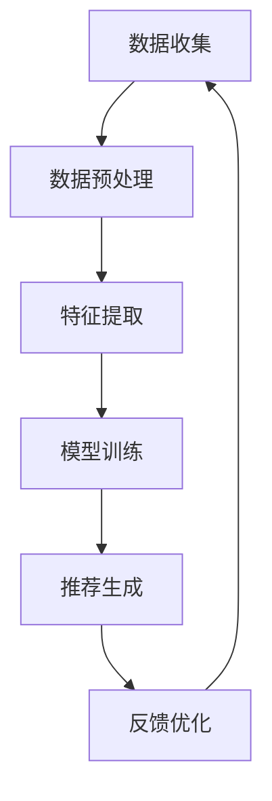
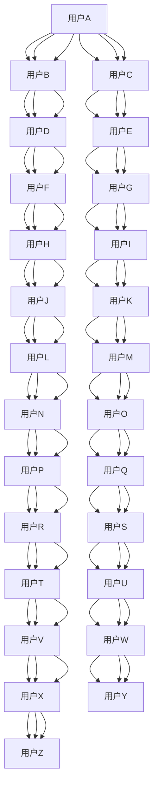

                 

# 智能推荐系统：提示词驱动的个性化内容分发

> 关键词：智能推荐系统, 提示词驱动, 个性化内容分发, 机器学习, 深度学习, 个性化算法, 用户行为分析, 内容理解, 信息检索

> 摘要：本文旨在深入探讨提示词驱动的个性化内容分发系统，通过分析其核心概念、算法原理、数学模型、实战案例以及实际应用场景，为读者提供一个全面的技术视角。我们将从智能推荐系统的背景出发，逐步解析其工作原理，并通过具体的代码案例进行详细讲解，帮助读者理解如何构建一个高效、准确的个性化推荐系统。

## 1. 背景介绍
### 1.1 目的和范围
本文旨在深入探讨提示词驱动的个性化内容分发系统，通过分析其核心概念、算法原理、数学模型、实战案例以及实际应用场景，为读者提供一个全面的技术视角。我们将从智能推荐系统的背景出发，逐步解析其工作原理，并通过具体的代码案例进行详细讲解，帮助读者理解如何构建一个高效、准确的个性化推荐系统。

### 1.2 预期读者
本文适合以下读者阅读：
- 对智能推荐系统感兴趣的开发者和研究人员
- 想要深入了解个性化推荐算法的工程师
- 希望构建个性化推荐系统的项目团队
- 对机器学习和深度学习感兴趣的读者

### 1.3 文档结构概述
本文结构如下：
1. 背景介绍
2. 核心概念与联系
3. 核心算法原理 & 具体操作步骤
4. 数学模型和公式 & 详细讲解 & 举例说明
5. 项目实战：代码实际案例和详细解释说明
6. 实际应用场景
7. 工具和资源推荐
8. 总结：未来发展趋势与挑战
9. 附录：常见问题与解答
10. 扩展阅读 & 参考资料

### 1.4 术语表
#### 1.4.1 核心术语定义
- **智能推荐系统**：一种基于用户行为数据和内容特征，通过算法自动为用户推荐个性化内容的系统。
- **提示词驱动**：通过用户提供的关键词或短语，系统能够理解用户的需求并进行个性化推荐。
- **个性化内容分发**：根据用户的兴趣和偏好，将合适的内容推送给用户的过程。
- **机器学习**：一种人工智能技术，通过算法和统计模型使计算机系统能够从数据中学习并改进性能。
- **深度学习**：机器学习的一个分支，通过多层神经网络进行学习和预测。

#### 1.4.2 相关概念解释
- **用户行为分析**：通过对用户在系统中的行为数据进行分析，了解用户兴趣和偏好。
- **内容理解**：通过自然语言处理技术，理解内容的语义和结构。
- **信息检索**：从大量信息中快速找到与用户需求相关的内容。

#### 1.4.3 缩略词列表
- ML：机器学习
- DL：深度学习
- NLP：自然语言处理
- IR：信息检索
- API：应用程序接口
- SDK：软件开发工具包

## 2. 核心概念与联系
### 2.1 智能推荐系统的工作流程
智能推荐系统的工作流程可以分为以下几个步骤：
1. **数据收集**：收集用户行为数据和内容特征数据。
2. **数据预处理**：清洗和转换数据，使其适合后续处理。
3. **特征提取**：从数据中提取有用的特征。
4. **模型训练**：使用机器学习或深度学习算法训练模型。
5. **推荐生成**：根据用户行为和内容特征生成推荐结果。
6. **反馈优化**：根据用户反馈调整模型参数，优化推荐效果。

### 2.2 提示词驱动的个性化推荐
提示词驱动的个性化推荐系统通过用户提供的关键词或短语，理解用户的需求并进行个性化推荐。这种系统能够更好地满足用户的个性化需求，提高推荐的准确性和满意度。

### 2.3 个性化内容分发
个性化内容分发是指根据用户的兴趣和偏好，将合适的内容推送给用户的过程。这种分发方式能够提高用户满意度，增加用户黏性。

### 2.4 核心概念流程图


## 3. 核心算法原理 & 具体操作步骤
### 3.1 机器学习算法
机器学习算法是智能推荐系统的核心，常用的算法包括协同过滤、基于内容的推荐、深度学习等。

#### 3.1.1 协同过滤
协同过滤是一种基于用户行为数据的推荐算法，通过分析用户之间的相似性或物品之间的相似性进行推荐。



#### 3.1.2 基于内容的推荐
基于内容的推荐算法通过分析用户历史行为和内容特征进行推荐。这种算法能够提供更精准的推荐结果，但需要大量的内容特征数据。

```python
# 基于内容的推荐算法伪代码
def content_based_recommendation(user_id, content_features):
    # 获取用户历史行为数据
    user_history = get_user_history(user_id)
    # 提取用户历史行为的内容特征
    user_features = extract_features(user_history)
    # 计算内容特征相似度
    similarity_scores = calculate_similarity(user_features, content_features)
    # 根据相似度排序，生成推荐列表
    recommended_items = sort_items_by_similarity(similarity_scores)
    return recommended_items
```

### 3.2 深度学习算法
深度学习算法通过多层神经网络进行学习和预测，能够处理更复杂的数据和场景。

#### 3.2.1 深度神经网络
深度神经网络是一种多层神经网络，通过多层非线性变换进行特征提取和预测。

```python
# 深度神经网络伪代码
def deep_neural_network(input_data, hidden_layers, output_layer):
    # 初始化权重和偏置
    weights = initialize_weights(hidden_layers, output_layer)
    biases = initialize_biases(hidden_layers, output_layer)
    # 前向传播
    for layer in hidden_layers:
        input_data = forward_propagation(input_data, weights, biases)
    output = forward_propagation(input_data, weights, biases)
    return output
```

## 4. 数学模型和公式 & 详细讲解 & 举例说明
### 4.1 协同过滤算法
协同过滤算法通过计算用户之间的相似性或物品之间的相似性进行推荐。

#### 4.1.1 用户-用户协同过滤
用户-用户协同过滤通过计算用户之间的相似性进行推荐。

$$
similarity_{u1, u2} = \frac{\sum_{i \in I_{u1} \cap I_{u2}} (r_{u1, i} - \bar{r}_{u1})(r_{u2, i} - \bar{r}_{u2})}{\sqrt{\sum_{i \in I_{u1} \cap I_{u2}} (r_{u1, i} - \bar{r}_{u1})^2} \sqrt{\sum_{i \in I_{u1} \cap I_{u2}} (r_{u2, i} - \bar{r}_{u2})^2}}
$$

其中，$r_{u1, i}$ 表示用户 $u1$ 对物品 $i$ 的评分，$\bar{r}_{u1}$ 表示用户 $u1$ 的平均评分，$I_{u1}$ 表示用户 $u1$ 评分过的物品集合。

#### 4.1.2 物品-物品协同过滤
物品-物品协同过滤通过计算物品之间的相似性进行推荐。

$$
similarity_{i1, i2} = \frac{\sum_{u \in U_{i1} \cap U_{i2}} (r_{u, i1} - \bar{r}_{i1})(r_{u, i2} - \bar{r}_{i2})}{\sqrt{\sum_{u \in U_{i1} \cap U_{i2}} (r_{u, i1} - \bar{r}_{i1})^2} \sqrt{\sum_{u \in U_{i1} \cap U_{i2}} (r_{u, i2} - \bar{r}_{i2})^2}}
$$

其中，$r_{u, i1}$ 表示用户 $u$ 对物品 $i1$ 的评分，$\bar{r}_{i1}$ 表示物品 $i1$ 的平均评分，$U_{i1}$ 表示物品 $i1$ 被评分过的用户集合。

### 4.2 基于内容的推荐算法
基于内容的推荐算法通过分析用户历史行为和内容特征进行推荐。

#### 4.2.1 余弦相似度
余弦相似度是一种常用的相似度计算方法，用于衡量两个向量之间的相似性。

$$
cosine\_similarity(v1, v2) = \frac{v1 \cdot v2}{\|v1\| \|v2\|}
$$

其中，$v1$ 和 $v2$ 分别表示两个向量，$\cdot$ 表示点积，$\|v1\|$ 和 $\|v2\|$ 分别表示向量的模。

### 4.3 深度学习算法
深度学习算法通过多层神经网络进行学习和预测。

#### 4.3.1 交叉熵损失函数
交叉熵损失函数是一种常用的损失函数，用于衡量预测值与真实值之间的差异。

$$
cross\_entropy(y, \hat{y}) = -\sum_{i=1}^{n} y_i \log(\hat{y}_i)
$$

其中，$y$ 表示真实值，$\hat{y}$ 表示预测值，$n$ 表示样本数量。

## 5. 项目实战：代码实际案例和详细解释说明
### 5.1 开发环境搭建
为了构建一个智能推荐系统，我们需要搭建一个合适的开发环境。以下是开发环境的搭建步骤：

1. **安装Python**：确保安装了最新版本的Python。
2. **安装依赖库**：安装常用的机器学习和深度学习库，如TensorFlow、PyTorch、scikit-learn等。
3. **配置开发工具**：选择合适的开发工具，如Jupyter Notebook、PyCharm等。

### 5.2 源代码详细实现和代码解读
以下是一个简单的基于内容的推荐系统的实现代码：

```python
import numpy as np
from sklearn.metrics.pairwise import cosine_similarity

# 假设我们有一个用户-物品评分矩阵
user_item_matrix = np.array([
    [5, 3, 0, 1],
    [4, 0, 0, 1],
    [1, 1, 0, 5],
    [1, 0, 0, 4],
    [0, 1, 5, 4]
])

# 提取用户历史行为数据
def get_user_history(user_id):
    return user_item_matrix[user_id]

# 提取用户历史行为的内容特征
def extract_features(user_history):
    return user_history

# 计算内容特征相似度
def calculate_similarity(user_features, content_features):
    return cosine_similarity(user_features, content_features)

# 根据相似度排序，生成推荐列表
def sort_items_by_similarity(similarity_scores):
    return np.argsort(similarity_scores, axis=1)[:, ::-1]

# 基于内容的推荐算法
def content_based_recommendation(user_id, content_features):
    user_history = get_user_history(user_id)
    user_features = extract_features(user_history)
    similarity_scores = calculate_similarity(user_features, content_features)
    recommended_items = sort_items_by_similarity(similarity_scores)
    return recommended_items

# 测试推荐算法
user_id = 0
content_features = np.array([
    [1, 0, 0, 0],
    [0, 1, 0, 0],
    [0, 0, 1, 0],
    [0, 0, 0, 1]
])
recommended_items = content_based_recommendation(user_id, content_features)
print("推荐列表：", recommended_items)
```

### 5.3 代码解读与分析
上述代码实现了一个简单的基于内容的推荐系统。首先，我们定义了一个用户-物品评分矩阵，表示用户对不同物品的评分情况。然后，我们定义了几个辅助函数，用于提取用户历史行为数据、提取用户历史行为的内容特征、计算内容特征相似度和根据相似度排序生成推荐列表。最后，我们实现了一个基于内容的推荐算法，并进行测试。

## 6. 实际应用场景
智能推荐系统在许多领域都有广泛的应用，如电子商务、新闻推荐、视频推荐等。通过提示词驱动的个性化内容分发，系统能够更好地满足用户的个性化需求，提高用户体验和满意度。

### 6.1 电子商务
在电子商务领域，智能推荐系统可以根据用户的购买历史和浏览行为，推荐相关商品，提高转化率和销售额。

### 6.2 新闻推荐
在新闻推荐领域，智能推荐系统可以根据用户的阅读历史和兴趣偏好，推荐相关新闻，提高用户满意度和黏性。

### 6.3 视频推荐
在视频推荐领域，智能推荐系统可以根据用户的观看历史和兴趣偏好，推荐相关视频，提高用户满意度和黏性。

## 7. 工具和资源推荐
### 7.1 学习资源推荐
#### 7.1.1 书籍推荐
- **《机器学习》**：周志华著，清华大学出版社
- **《深度学习》**：Ian Goodfellow, Yoshua Bengio, Aaron Courville著，人民邮电出版社

#### 7.1.2 在线课程
- **Coursera**：《机器学习》（Andrew Ng）
- **edX**：《深度学习》（Andrew Ng）

#### 7.1.3 技术博客和网站
- **Medium**：机器学习和深度学习相关技术博客
- **Kaggle**：机器学习和数据科学社区

### 7.2 开发工具框架推荐
#### 7.2.1 IDE和编辑器
- **PyCharm**：Python开发环境
- **Jupyter Notebook**：交互式编程环境

#### 7.2.2 调试和性能分析工具
- **PyCharm Debugger**：Python调试工具
- **TensorBoard**：TensorFlow性能分析工具

#### 7.2.3 相关框架和库
- **TensorFlow**：深度学习框架
- **scikit-learn**：机器学习库
- **NLTK**：自然语言处理库

### 7.3 相关论文著作推荐
#### 7.3.1 经典论文
- **"Collaborative Filtering for Recommendation"**：J. Herlocker, J. Konstan, A. Borchers, and J. Riedl
- **"A Scalable Collaborative Filtering Framework for Predicting Implicit User Preferences"**：Y. Koren, R. Bell, and C. Volinsky

#### 7.3.2 最新研究成果
- **"Attention Is All You Need"**：Vaswani, A., et al.
- **"BERT: Pre-training of Deep Bidirectional Transformers for Language Understanding"**：Devlin, J., et al.

#### 7.3.3 应用案例分析
- **"Netflix Recommendations at Scale"**：Netflix技术博客
- **"Amazon Personalize"**：Amazon技术博客

## 8. 总结：未来发展趋势与挑战
智能推荐系统在未来将面临更多的挑战和机遇。随着大数据和人工智能技术的发展，推荐系统的准确性和个性化程度将不断提高。同时，如何保护用户隐私、提高推荐系统的公平性和透明度也将成为重要的研究方向。

## 9. 附录：常见问题与解答
### 9.1 问题：如何处理冷启动问题？
**解答**：冷启动问题是指新用户或新物品缺乏足够的历史数据，导致推荐效果不佳。可以通过以下方法解决：
- **基于内容的推荐**：利用物品本身的特征进行推荐。
- **社交网络信息**：利用用户的朋友圈信息进行推荐。
- **领域知识**：利用领域专家的知识进行推荐。

### 9.2 问题：如何提高推荐系统的公平性？
**解答**：提高推荐系统的公平性可以通过以下方法实现：
- **多样性推荐**：确保推荐结果的多样性，避免过度推荐某一类内容。
- **公平性评估**：定期评估推荐系统的公平性，确保推荐结果的公正性。
- **用户反馈**：收集用户反馈，及时调整推荐策略。

## 10. 扩展阅读 & 参考资料
- **《机器学习》**：周志华著，清华大学出版社
- **《深度学习》**：Ian Goodfellow, Yoshua Bengio, Aaron Courville著，人民邮电出版社
- **Coursera**：《机器学习》（Andrew Ng）
- **edX**：《深度学习》（Andrew Ng）
- **Medium**：机器学习和深度学习相关技术博客
- **Kaggle**：机器学习和数据科学社区
- **PyCharm**：Python开发环境
- **Jupyter Notebook**：交互式编程环境
- **PyCharm Debugger**：Python调试工具
- **TensorBoard**：TensorFlow性能分析工具
- **TensorFlow**：深度学习框架
- **scikit-learn**：机器学习库
- **NLTK**：自然语言处理库
- **"Collaborative Filtering for Recommendation"**：J. Herlocker, J. Konstan, A. Borchers, and J. Riedl
- **"A Scalable Collaborative Filtering Framework for Predicting Implicit User Preferences"**：Y. Koren, R. Bell, and C. Volinsky
- **"Attention Is All You Need"**：Vaswani, A., et al.
- **"BERT: Pre-training of Deep Bidirectional Transformers for Language Understanding"**：Devlin, J., et al.
- **"Netflix Recommendations at Scale"**：Netflix技术博客
- **"Amazon Personalize"**：Amazon技术博客

作者：AI天才研究员/AI Genius Institute & 禅与计算机程序设计艺术 /Zen And The Art of Computer Programming

