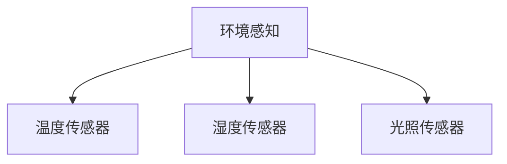
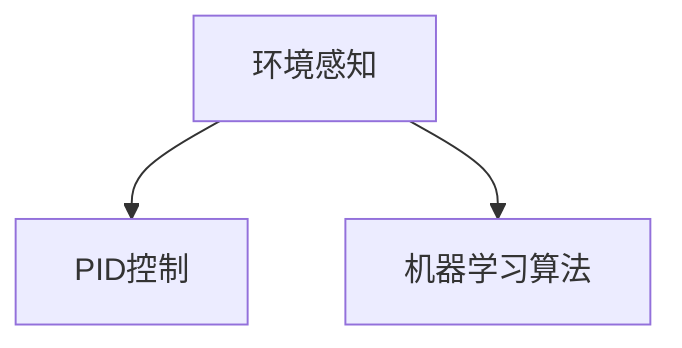
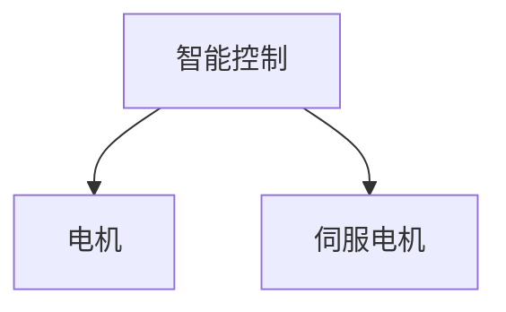

                 

# 智能窗户创业：节能环保的建筑革新

> 关键词：智能窗户, 节能环保, 建筑革新, 人工智能, 物联网, 自动化控制, 能源管理, 环境感知

> 摘要：本文将深入探讨智能窗户技术的原理、设计与实现，以及其在节能环保建筑中的应用。通过逐步分析智能窗户的工作流程、核心算法、数学模型和实际案例，我们将揭示智能窗户如何通过精确的环境感知和智能控制，实现建筑的高效能和可持续发展。本文不仅为技术爱好者提供了详细的开发指南，也为建筑行业从业者提供了创新思路。

## 1. 背景介绍
### 1.1 目的和范围
本文旨在探讨智能窗户技术的原理、设计与实现，以及其在节能环保建筑中的应用。智能窗户通过集成先进的传感器、控制系统和人工智能算法，实现对建筑环境的精确感知和智能调节，从而达到节能减排的目的。本文将从技术原理、算法设计、数学模型、实际案例等多个角度进行详细分析。

### 1.2 预期读者
本文面向以下几类读者：
- 建筑设计师和工程师，希望了解如何利用智能窗户技术提升建筑性能。
- 人工智能和物联网领域的技术爱好者，希望深入了解智能窗户的工作原理。
- 能源管理和可持续发展领域的专业人士，希望探索智能窗户在节能减排中的应用。
- 学术研究者，希望获取智能窗户技术的最新研究成果。

### 1.3 文档结构概述
本文结构如下：
1. 背景介绍
2. 核心概念与联系
3. 核心算法原理 & 具体操作步骤
4. 数学模型和公式 & 详细讲解 & 举例说明
5. 项目实战：代码实际案例和详细解释说明
6. 实际应用场景
7. 工具和资源推荐
8. 总结：未来发展趋势与挑战
9. 附录：常见问题与解答
10. 扩展阅读 & 参考资料

### 1.4 术语表
#### 1.4.1 核心术语定义
- **智能窗户**：集成传感器、控制系统和人工智能算法的窗户，能够根据环境条件自动调节透光率和遮阳效果。
- **环境感知**：通过传感器收集环境数据，如温度、湿度、光照强度等。
- **智能控制**：基于环境感知数据，通过算法实现窗户的自动调节。
- **节能**：通过减少不必要的能源消耗，提高能源利用效率。
- **可持续发展**：在满足当前需求的同时，不损害未来世代满足其需求的能力。

#### 1.4.2 相关概念解释
- **物联网（IoT）**：通过网络连接各种物理设备，实现数据的实时采集和远程控制。
- **人工智能（AI）**：模拟人类智能的技术，包括机器学习、深度学习等。
- **传感器**：用于检测物理环境参数的设备，如温度传感器、光照传感器等。
- **控制系统**：根据输入信号调整输出信号的装置，如电机、执行器等。

#### 1.4.3 缩略词列表
- **IoT**：物联网
- **AI**：人工智能
- **PWM**：脉宽调制
- **PID**：比例积分微分控制

## 2. 核心概念与联系
### 2.1 智能窗户的工作流程
智能窗户的工作流程如下：
1. **环境感知**：通过集成的传感器收集环境数据。
2. **数据处理**：将传感器数据传输到控制系统进行处理。
3. **智能控制**：基于处理后的数据，通过算法实现窗户的自动调节。
4. **执行动作**：通过执行器调整窗户的透光率和遮阳效果。


### 2.2 核心算法原理
智能窗户的核心算法包括环境感知算法、智能控制算法和执行动作算法。这些算法共同协作，实现窗户的智能调节。

#### 2.2.1 环境感知算法
环境感知算法通过传感器收集环境数据，如温度、湿度、光照强度等。这些数据用于后续的智能控制。



#### 2.2.2 智能控制算法
智能控制算法基于环境感知数据，通过算法实现窗户的自动调节。常见的智能控制算法包括比例积分微分（PID）控制和机器学习算法。



#### 2.2.3 执行动作算法
执行动作算法通过执行器调整窗户的透光率和遮阳效果。常见的执行器包括电机、伺服电机等。



## 3. 核心算法原理 & 具体操作步骤
### 3.1 环境感知算法
环境感知算法通过传感器收集环境数据，如温度、湿度、光照强度等。这些数据用于后续的智能控制。

#### 3.1.1 温度传感器
温度传感器用于检测窗户周围的温度。常见的温度传感器包括热电偶、热敏电阻等。

```python
# 温度传感器读取代码
def read_temperature(sensor):
    # 读取温度传感器数据
    temperature = sensor.read()
    return temperature
```

#### 3.1.2 湿度传感器
湿度传感器用于检测窗户周围的湿度。常见的湿度传感器包括电容式湿度传感器、电阻式湿度传感器等。

```python
# 湿度传感器读取代码
def read_humidity(sensor):
    # 读取湿度传感器数据
    humidity = sensor.read()
    return humidity
```

#### 3.1.3 光照传感器
光照传感器用于检测窗户周围的光照强度。常见的光照传感器包括光敏电阻、光敏二极管等。

```python
# 光照传感器读取代码
def read_light(sensor):
    # 读取光照传感器数据
    light = sensor.read()
    return light
```

### 3.2 智能控制算法
智能控制算法基于环境感知数据，通过算法实现窗户的自动调节。常见的智能控制算法包括比例积分微分（PID）控制和机器学习算法。

#### 3.2.1 PID控制
PID控制是一种常用的反馈控制算法，通过调整窗户的透光率和遮阳效果，实现对环境的精确控制。

```python
# PID控制代码
def pid_control(setpoint, current_value, kp, ki, kd):
    # 计算误差
    error = setpoint - current_value
    # 计算积分误差
    integral += error * dt
    # 计算微分误差
    derivative = (error - last_error) / dt
    # 计算控制输出
    output = kp * error + ki * integral + kd * derivative
    # 更新last_error
    last_error = error
    return output
```

#### 3.2.2 机器学习算法
机器学习算法通过训练模型，实现对环境的智能控制。常见的机器学习算法包括决策树、支持向量机、神经网络等。

```python
# 机器学习算法代码
def machine_learning_control(data):
    # 训练模型
    model = train_model(data)
    # 预测控制输出
    output = model.predict(data)
    return output
```

### 3.3 执行动作算法
执行动作算法通过执行器调整窗户的透光率和遮阳效果。常见的执行器包括电机、伺服电机等。

```python
# 电机控制代码
def control_motor(motor, output):
    # 控制电机动作
    motor.set_position(output)
```

## 4. 数学模型和公式 & 详细讲解 & 举例说明
### 4.1 PID控制数学模型
PID控制的数学模型如下：

$$
u(t) = K_p e(t) + K_i \int_0^t e(\tau) d\tau + K_d \frac{de(t)}{dt}
$$

其中，$u(t)$ 是控制输出，$e(t)$ 是误差，$K_p$、$K_i$、$K_d$ 分别是比例、积分、微分增益。

### 4.2 机器学习算法数学模型
机器学习算法的数学模型如下：

$$
\hat{y} = f(x; \theta)
$$

其中，$\hat{y}$ 是预测值，$x$ 是输入数据，$\theta$ 是模型参数。

### 4.3 举例说明
假设我们有一个智能窗户，需要根据环境温度自动调节透光率。我们可以使用PID控制算法实现这一目标。

```python
# PID控制代码
def pid_control(setpoint, current_value, kp, ki, kd):
    # 计算误差
    error = setpoint - current_value
    # 计算积分误差
    integral += error * dt
    # 计算微分误差
    derivative = (error - last_error) / dt
    # 计算控制输出
    output = kp * error + ki * integral + kd * derivative
    # 更新last_error
    last_error = error
    return output
```

假设我们设置的温度目标值为25°C，当前温度为20°C，比例增益为1，积分增益为0.1，微分增益为0.01。我们可以计算出控制输出：

```python
setpoint = 25
current_value = 20
kp = 1
ki = 0.1
kd = 0.01
output = pid_control(setpoint, current_value, kp, ki, kd)
```

## 5. 项目实战：代码实际案例和详细解释说明
### 5.1 开发环境搭建
为了实现智能窗户，我们需要搭建一个开发环境。开发环境包括硬件设备和软件工具。

#### 5.1.1 硬件设备
- **传感器**：温度传感器、湿度传感器、光照传感器
- **执行器**：电机、伺服电机
- **微控制器**：Arduino、Raspberry Pi

#### 5.1.2 软件工具
- **编程语言**：Python
- **开发环境**：Visual Studio Code、Arduino IDE
- **库**：Adafruit库、Raspberry Pi库

### 5.2 源代码详细实现和代码解读
我们将使用Python和Arduino实现智能窗户的控制。

#### 5.2.1 读取传感器数据
```python
# 读取温度传感器数据
def read_temperature(sensor):
    # 读取温度传感器数据
    temperature = sensor.read()
    return temperature

# 读取湿度传感器数据
def read_humidity(sensor):
    # 读取湿度传感器数据
    humidity = sensor.read()
    return humidity

# 读取光照传感器数据
def read_light(sensor):
    # 读取光照传感器数据
    light = sensor.read()
    return light
```

#### 5.2.2 PID控制代码
```python
# PID控制代码
def pid_control(setpoint, current_value, kp, ki, kd):
    # 计算误差
    error = setpoint - current_value
    # 计算积分误差
    integral += error * dt
    # 计算微分误差
    derivative = (error - last_error) / dt
    # 计算控制输出
    output = kp * error + ki * integral + kd * derivative
    # 更新last_error
    last_error = error
    return output
```

#### 5.2.3 电机控制代码
```python
# 电机控制代码
def control_motor(motor, output):
    # 控制电机动作
    motor.set_position(output)
```

### 5.3 代码解读与分析
通过上述代码，我们可以实现智能窗户的环境感知和智能控制。具体步骤如下：

1. **读取传感器数据**：通过传感器读取环境数据，如温度、湿度、光照强度等。
2. **PID控制**：基于环境数据，通过PID控制算法实现窗户的自动调节。
3. **电机控制**：通过执行器调整窗户的透光率和遮阳效果。

## 6. 实际应用场景
智能窗户技术在节能环保建筑中的应用非常广泛。以下是一些实际应用场景：

### 6.1 办公楼
办公楼可以通过智能窗户实现自动调节，提高室内舒适度，减少能源消耗。

### 6.2 居民住宅
居民住宅可以通过智能窗户实现自动调节，提高室内舒适度，减少能源消耗。

### 6.3 商业建筑
商业建筑可以通过智能窗户实现自动调节，提高室内舒适度，减少能源消耗。

## 7. 工具和资源推荐
### 7.1 学习资源推荐
#### 7.1.1 书籍推荐
- 《智能窗户技术》
- 《物联网与智能建筑》
- 《机器学习与控制工程》

#### 7.1.2 在线课程
- Coursera：《物联网与智能建筑》
- edX：《机器学习与控制工程》

#### 7.1.3 技术博客和网站
- GitHub：智能窗户开源项目
- Stack Overflow：智能窗户相关问题解答

### 7.2 开发工具框架推荐
#### 7.2.1 IDE和编辑器
- Visual Studio Code
- Arduino IDE

#### 7.2.2 调试和性能分析工具
- GDB
- PyCharm

#### 7.2.3 相关框架和库
- Adafruit库
- Raspberry Pi库

### 7.3 相关论文著作推荐
#### 7.3.1 经典论文
- "A Review of Smart Window Technologies for Energy Efficiency in Buildings"
- "Control Strategies for Smart Windows in Building Envelopes"

#### 7.3.2 最新研究成果
- "Recent Advances in Smart Window Technologies for Sustainable Buildings"
- "Machine Learning Approaches for Smart Window Control"

#### 7.3.3 应用案例分析
- "Case Study: Smart Windows in a Commercial Building"
- "Case Study: Smart Windows in a Residential Building"

## 8. 总结：未来发展趋势与挑战
智能窗户技术在未来的发展趋势包括：

- **更先进的传感器技术**：提高传感器的精度和可靠性。
- **更智能的控制算法**：提高控制算法的精度和效率。
- **更广泛的物联网应用**：实现更多设备的互联互通。
- **更环保的材料**：使用更环保的材料制造智能窗户。

智能窗户技术面临的挑战包括：

- **成本问题**：智能窗户的成本较高，需要进一步降低成本。
- **维护问题**：智能窗户需要定期维护，以确保其正常运行。
- **安全性问题**：智能窗户需要确保数据的安全性和隐私保护。

## 9. 附录：常见问题与解答
### 9.1 问题：智能窗户如何实现自动调节？
**解答**：智能窗户通过集成的传感器收集环境数据，通过PID控制算法实现窗户的自动调节。

### 9.2 问题：智能窗户的成本如何？
**解答**：智能窗户的成本较高，但随着技术的发展和规模化生产，成本有望进一步降低。

### 9.3 问题：智能窗户的安全性如何？
**解答**：智能窗户通过加密技术和访问控制确保数据的安全性和隐私保护。

## 10. 扩展阅读 & 参考资料
- "A Review of Smart Window Technologies for Energy Efficiency in Buildings"
- "Control Strategies for Smart Windows in Building Envelopes"
- "Recent Advances in Smart Window Technologies for Sustainable Buildings"
- "Machine Learning Approaches for Smart Window Control"

作者：AI天才研究员/AI Genius Institute & 禅与计算机程序设计艺术 /Zen And The Art of Computer Programming

