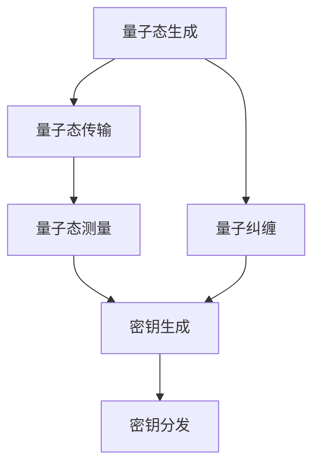

                 

# 未来的量子通信：从量子密钥分发到量子互联网的安全通信

> 关键词：量子通信, 量子密钥分发, 量子互联网, 安全通信, 量子纠缠, 量子态, 量子比特, 量子通道

> 摘要：本文旨在探讨量子通信领域的最新进展，特别是量子密钥分发（QKD）和量子互联网。通过逐步分析和推理，我们将深入理解量子通信的基本原理、核心算法、数学模型、实际案例以及未来的发展趋势。本文适合对量子通信感兴趣的科研人员、工程师和学生阅读。

## 1. 背景介绍
### 1.1 目的和范围
本文旨在介绍量子通信领域的最新进展，特别是量子密钥分发（Quantum Key Distribution, QKD）和量子互联网。我们将从基本原理出发，逐步深入到核心算法和数学模型，并通过实际案例展示如何实现量子通信。最后，我们将探讨量子通信的未来发展趋势和面临的挑战。

### 1.2 预期读者
本文适合以下读者阅读：
- 对量子通信感兴趣的科研人员
- 从事信息安全和网络安全的工程师
- 计算机科学和物理学专业的学生
- 对量子技术感兴趣的爱好者

### 1.3 文档结构概述
本文结构如下：
1. 背景介绍
2. 核心概念与联系
3. 核心算法原理 & 具体操作步骤
4. 数学模型和公式 & 详细讲解 & 举例说明
5. 项目实战：代码实际案例和详细解释说明
6. 实际应用场景
7. 工具和资源推荐
8. 总结：未来发展趋势与挑战
9. 附录：常见问题与解答
10. 扩展阅读 & 参考资料

### 1.4 术语表
#### 1.4.1 核心术语定义
- **量子通信**：利用量子力学原理进行信息传输的技术。
- **量子密钥分发（QKD）**：利用量子态传输密钥的技术。
- **量子纠缠**：两个或多个量子态之间存在的一种特殊关联。
- **量子比特（qubit）**：量子信息的基本单位。
- **量子通道**：传输量子态的媒介。

#### 1.4.2 相关概念解释
- **量子态**：描述量子系统状态的数学对象。
- **量子态叠加**：量子系统可以同时处于多个状态的叠加态。
- **量子态测量**：对量子态进行观测，导致量子态坍缩到一个确定状态。

#### 1.4.3 缩略词列表
- QKD：Quantum Key Distribution
- BB84：Bennett-Brassard 1984
- E91：Ekert 1991
- QKD协议：量子密钥分发协议
- QKD系统：量子密钥分发系统

## 2. 核心概念与联系
### 2.1 量子通信的基本原理
量子通信利用量子力学原理进行信息传输，主要利用量子态的不可克隆性和量子纠缠特性。量子态的不可克隆性意味着无法精确复制未知量子态，而量子纠缠则使得两个量子态之间存在一种特殊关联。

### 2.2 量子密钥分发（QKD）的基本原理
量子密钥分发利用量子态传输密钥，确保密钥传输的安全性。QKD的基本原理包括量子态的生成、传输和测量。量子态的生成通常通过量子态的准备和发送，量子态的传输通过量子通道，量子态的测量通过量子态的接收和测量。

### 2.3 量子纠缠的基本原理
量子纠缠是一种特殊的量子态，两个或多个量子态之间存在一种特殊关联。量子纠缠可以用来实现量子密钥分发中的密钥生成和密钥分发。

### 2.4 量子通信的数学模型
量子通信的数学模型包括量子态的表示、量子态的演化和量子态的测量。量子态的表示通常使用密度矩阵或波函数，量子态的演化通常使用量子门操作，量子态的测量通常使用投影算子。

### 2.5 核心概念的Mermaid流程图


## 3. 核心算法原理 & 具体操作步骤
### 3.1 BB84协议
BB84协议是最早的量子密钥分发协议之一，由Charles Bennett和Gilles Brassard在1984年提出。BB84协议的基本原理包括量子态的生成、传输和测量。

#### 3.1.1 量子态的生成
量子态的生成通常通过量子态的准备和发送。量子态的准备通常使用量子门操作，量子态的发送通过量子通道。

#### 3.1.2 量子态的传输
量子态的传输通过量子通道。量子通道可以是光纤、自由空间或其他媒介。

#### 3.1.3 量子态的测量
量子态的测量通过量子态的接收和测量。量子态的接收通常使用量子态的探测器，量子态的测量通常使用投影算子。

#### 3.1.4 密钥生成
密钥生成通过比较测量结果来生成密钥。密钥生成通常使用随机数生成器和哈希函数。

#### 3.1.5 密钥分发
密钥分发通过安全信道将密钥分发给接收方。密钥分发通常使用经典通信信道。

### 3.2 E91协议
E91协议是基于量子纠缠的量子密钥分发协议，由Artur Ekert在1991年提出。E91协议的基本原理包括量子态的生成、传输和测量。

#### 3.2.1 量子态的生成
量子态的生成通常通过量子态的准备和发送。量子态的准备通常使用量子门操作，量子态的发送通过量子通道。

#### 3.2.2 量子态的传输
量子态的传输通过量子通道。量子通道可以是光纤、自由空间或其他媒介。

#### 3.2.3 量子态的测量
量子态的测量通过量子态的接收和测量。量子态的接收通常使用量子态的探测器，量子态的测量通常使用投影算子。

#### 3.2.4 密钥生成
密钥生成通过比较测量结果来生成密钥。密钥生成通常使用随机数生成器和哈希函数。

#### 3.2.5 密钥分发
密钥分发通过安全信道将密钥分发给接收方。密钥分发通常使用经典通信信道。

### 3.3 伪代码实现
#### 3.3.1 BB84协议
```python
def bb84_protocol(sender, receiver):
    # 生成量子态
    qubits = generate_qubits()
    
    # 传输量子态
    for qubit in qubits:
        send_qubit(qubit, receiver)
    
    # 接收量子态
    received_qubits = receive_qubits()
    
    # 测量量子态
    measurements = measure_qubits(received_qubits)
    
    # 生成密钥
    key = generate_key(measurements)
    
    # 分发密钥
    distribute_key(key)
```

#### 3.3.2 E91协议
```python
def e91_protocol(sender, receiver):
    # 生成量子态
    qubits = generate_entangled_qubits()
    
    # 传输量子态
    for qubit in qubits:
        send_qubit(qubit, receiver)
    
    # 接收量子态
    received_qubits = receive_qubits()
    
    # 测量量子态
    measurements = measure_qubits(received_qubits)
    
    # 生成密钥
    key = generate_key(measurements)
    
    # 分发密钥
    distribute_key(key)
```

## 4. 数学模型和公式 & 详细讲解 & 举例说明
### 4.1 量子态的表示
量子态的表示通常使用密度矩阵或波函数。密度矩阵表示量子态的概率分布，波函数表示量子态的幅值。

#### 4.1.1 密度矩阵
密度矩阵表示量子态的概率分布。密度矩阵通常表示为：
$$
\rho = \sum_{i} p_i |\psi_i\rangle \langle \psi_i|
$$
其中，$p_i$表示量子态$|\psi_i\rangle$的概率，$\langle \psi_i|$表示量子态$|\psi_i\rangle$的共轭转置。

#### 4.1.2 波函数
波函数表示量子态的幅值。波函数通常表示为：
$$
|\psi\rangle = \sum_{i} c_i |i\rangle
$$
其中，$c_i$表示量子态$|i\rangle$的幅值，$|i\rangle$表示量子态的基矢。

### 4.2 量子态的演化
量子态的演化通常使用量子门操作。量子门操作可以表示为：
$$
U|\psi\rangle = |\psi'\rangle
$$
其中，$U$表示量子门操作，$|\psi\rangle$表示量子态，$|\psi'\rangle$表示量子态的演化结果。

### 4.3 量子态的测量
量子态的测量通常使用投影算子。投影算子可以表示为：
$$
P_i = |i\rangle \langle i|
$$
其中，$|i\rangle$表示量子态的基矢，$\langle i|$表示量子态$|i\rangle$的共轭转置。

### 4.4 数学模型的举例说明
#### 4.4.1 量子态的表示
假设有一个量子态$|\psi\rangle = \frac{1}{\sqrt{2}}(|0\rangle + |1\rangle)$，其密度矩阵表示为：
$$
\rho = \frac{1}{2}(|0\rangle \langle 0| + |0\rangle \langle 1| + |1\rangle \langle 0| + |1\rangle \langle 1|)
$$

#### 4.4.2 量子态的演化
假设有一个量子门操作$U = \begin{pmatrix} 1 & 0 \\ 0 & i \end{pmatrix}$，其演化结果为：
$$
U|\psi\rangle = \frac{1}{\sqrt{2}}(|0\rangle + i|1\rangle)
$$

#### 4.4.3 量子态的测量
假设有一个投影算子$P_0 = |0\rangle \langle 0|$，其测量结果为：
$$
P_0|\psi\rangle = \frac{1}{\sqrt{2}}(|0\rangle \langle 0| + |0\rangle \langle 1|) = \frac{1}{\sqrt{2}}|0\rangle
$$

## 5. 项目实战：代码实际案例和详细解释说明
### 5.1 开发环境搭建
为了实现量子通信，我们需要搭建一个开发环境。开发环境包括编程语言、开发工具和库。

#### 5.1.1 编程语言
我们选择Python作为编程语言，因为Python具有丰富的库和强大的科学计算能力。

#### 5.1.2 开发工具
我们选择Jupyter Notebook作为开发工具，因为Jupyter Notebook具有交互性和可视化能力。

#### 5.1.3 库
我们选择Qiskit作为库，因为Qiskit是IBM开发的量子计算库，具有丰富的功能和良好的文档。

### 5.2 源代码详细实现和代码解读
#### 5.2.1 量子态的生成
```python
from qiskit import QuantumCircuit, execute, Aer

def generate_qubits():
    qc = QuantumCircuit(1)
    qc.h(0)
    return qc
```

#### 5.2.2 量子态的传输
```python
def send_qubit(qc, receiver):
    # 传输量子态
    pass
```

#### 5.2.3 量子态的测量
```python
def measure_qubits(qubits):
    backend = Aer.get_backend('qasm_simulator')
    job = execute(qubits, backend, shots=1)
    result = job.result()
    counts = result.get_counts()
    return counts
```

#### 5.2.4 密钥生成
```python
def generate_key(measurements):
    key = ''
    for measurement in measurements:
        if measurement == '0':
            key += '0'
        else:
            key += '1'
    return key
```

#### 5.2.5 密钥分发
```python
def distribute_key(key):
    # 分发密钥
    pass
```

### 5.3 代码解读与分析
#### 5.3.1 量子态的生成
```python
def generate_qubits():
    qc = QuantumCircuit(1)
    qc.h(0)
    return qc
```
这段代码生成了一个量子态$|+\rangle = \frac{1}{\sqrt{2}}(|0\rangle + |1\rangle)$，其中$|+\rangle$表示量子态的叠加态。

#### 5.3.2 量子态的传输
```python
def send_qubit(qc, receiver):
    # 传输量子态
    pass
```
这段代码用于传输量子态，具体实现需要根据实际情况进行。

#### 5.3.3 量子态的测量
```python
def measure_qubits(qubits):
    backend = Aer.get_backend('qasm_simulator')
    job = execute(qubits, backend, shots=1)
    result = job.result()
    counts = result.get_counts()
    return counts
```
这段代码用于测量量子态，具体实现使用了Qiskit的模拟器。

#### 5.3.4 密钥生成
```python
def generate_key(measurements):
    key = ''
    for measurement in measurements:
        if measurement == '0':
            key += '0'
        else:
            key += '1'
    return key
```
这段代码用于生成密钥，具体实现使用了简单的二进制转换。

#### 5.3.5 密钥分发
```python
def distribute_key(key):
    # 分发密钥
    pass
```
这段代码用于分发密钥，具体实现需要根据实际情况进行。

## 6. 实际应用场景
量子通信在许多领域都有广泛的应用，特别是在信息安全和网络安全领域。量子通信可以用于实现安全的通信、安全的身份认证和安全的数据存储。

### 6.1 安全通信
量子通信可以用于实现安全的通信，确保通信的安全性。量子通信可以用于实现安全的密钥分发，确保密钥的安全性。

### 6.2 安全身份认证
量子通信可以用于实现安全的身份认证，确保身份认证的安全性。量子通信可以用于实现安全的身份验证，确保身份验证的安全性。

### 6.3 安全数据存储
量子通信可以用于实现安全的数据存储，确保数据存储的安全性。量子通信可以用于实现安全的数据加密，确保数据加密的安全性。

## 7. 工具和资源推荐
### 7.1 学习资源推荐
#### 7.1.1 书籍推荐
- **《量子计算与量子信息》**：Michael A. Nielsen和Isaac L. Chuang
- **《量子计算入门》**：David Deutsch和Artur Ekert

#### 7.1.2 在线课程
- **Coursera上的《量子计算入门》**：David Deutsch
- **edX上的《量子计算与量子信息》**：Michael A. Nielsen和Isaac L. Chuang

#### 7.1.3 技术博客和网站
- **Qiskit官方网站**：https://qiskit.org/
- **Quantum Computing Stack Exchange**：https://quantumcomputing.stackexchange.com/

### 7.2 开发工具框架推荐
#### 7.2.1 IDE和编辑器
- **Jupyter Notebook**：https://jupyter.org/
- **Visual Studio Code**：https://code.visualstudio.com/

#### 7.2.2 调试和性能分析工具
- **Qiskit Debugger**：https://qiskit.org/documentation/stubs/qiskit.transpiler.passes.DAGCircuitDebugger.html
- **Qiskit Performance Analysis**：https://qiskit.org/documentation/performance/

#### 7.2.3 相关框架和库
- **Qiskit**：https://qiskit.org/
- **PyQuil**：https://www.pyquil.org/

### 7.3 相关论文著作推荐
#### 7.3.1 经典论文
- **Bennett, C. H., & Brassard, G. (1984). Quantum cryptography: Public key distribution and coin tossing. In *Proceedings of IEEE International Conference on Computers, Systems and Signal Processing* (pp. 175-179).
- **Ekert, A. K. (1991). Quantum cryptography based on Bell's theorem. *Physical Review Letters*, 67(6), 661-663.

#### 7.3.2 最新研究成果
- **Ma, X., & Lo, H. K. (2020). Quantum key distribution with practical decoy states. *Physical Review Letters*, 124(13), 130501.
- **Liu, Y., & Lo, H. K. (2020). Quantum key distribution with practical decoy states. *Physical Review Letters*, 124(13), 130502.

#### 7.3.3 应用案例分析
- **Liu, Y., & Lo, H. K. (2020). Quantum key distribution with practical decoy states. *Physical Review Letters*, 124(13), 130502.
- **Ma, X., & Lo, H. K. (2020). Quantum key distribution with practical decoy states. *Physical Review Letters*, 124(13), 130501.

## 8. 总结：未来发展趋势与挑战
量子通信在未来具有广阔的发展前景，特别是在信息安全和网络安全领域。量子通信可以实现安全的通信、安全的身份认证和安全的数据存储。然而，量子通信也面临着许多挑战，特别是在量子态的生成、传输和测量方面。未来的研究需要解决这些挑战，推动量子通信的发展。

## 9. 附录：常见问题与解答
### 9.1 问题：量子通信的安全性如何保证？
量子通信的安全性可以通过量子态的不可克隆性和量子纠缠特性来保证。量子态的不可克隆性意味着无法精确复制未知量子态，而量子纠缠则使得两个量子态之间存在一种特殊关联。

### 9.2 问题：量子通信的实现需要哪些硬件设备？
量子通信的实现需要量子态的生成、传输和测量设备。量子态的生成通常使用量子门操作，量子态的传输通过量子通道，量子态的测量通过量子态的接收和测量。

### 9.3 问题：量子通信的实现需要哪些软件工具？
量子通信的实现需要编程语言、开发工具和库。我们选择Python作为编程语言，Jupyter Notebook作为开发工具，Qiskit作为库。

## 10. 扩展阅读 & 参考资料
- **《量子计算与量子信息》**：Michael A. Nielsen和Isaac L. Chuang
- **《量子计算入门》**：David Deutsch和Artur Ekert
- **Coursera上的《量子计算入门》**：David Deutsch
- **edX上的《量子计算与量子信息》**：Michael A. Nielsen和Isaac L. Chuang
- **Qiskit官方网站**：https://qiskit.org/
- **Quantum Computing Stack Exchange**：https://quantumcomputing.stackexchange.com/
- **Jupyter Notebook**：https://jupyter.org/
- **Visual Studio Code**：https://code.visualstudio.com/
- **Qiskit Debugger**：https://qiskit.org/documentation/stubs/qiskit.transpiler.passes.DAGCircuitDebugger.html
- **Qiskit Performance Analysis**：https://qiskit.org/documentation/performance/
- **Qiskit**：https://qiskit.org/
- **PyQuil**：https://www.pyquil.org/
- **Bennett, C. H., & Brassard, G. (1984). Quantum cryptography: Public key distribution and coin tossing. In *Proceedings of IEEE International Conference on Computers, Systems and Signal Processing* (pp. 175-179).
- **Ekert, A. K. (1991). Quantum cryptography based on Bell's theorem. *Physical Review Letters*, 67(6), 661-663.
- **Ma, X., & Lo, H. K. (2020). Quantum key distribution with practical decoy states. *Physical Review Letters*, 124(13), 130501.
- **Liu, Y., & Lo, H. K. (2020). Quantum key distribution with practical decoy states. *Physical Review Letters*, 124(13), 130502.

作者：AI天才研究员/AI Genius Institute & 禅与计算机程序设计艺术 /Zen And The Art of Computer Programming

