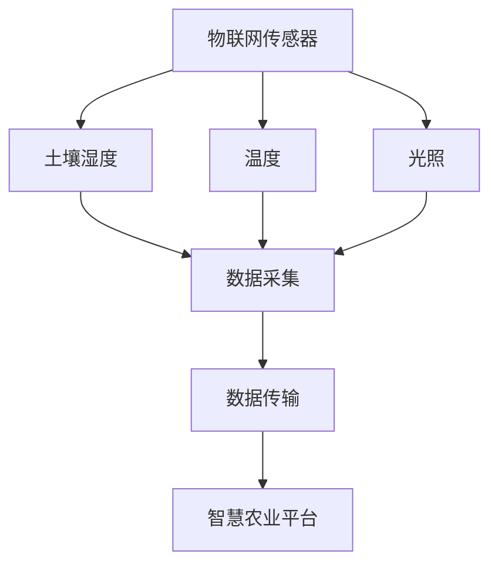
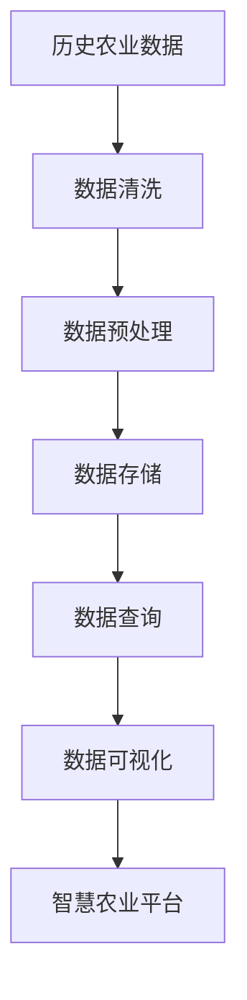
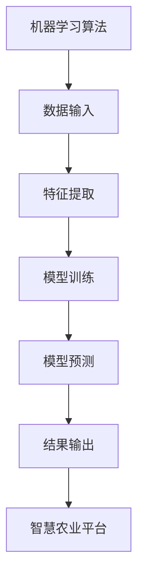
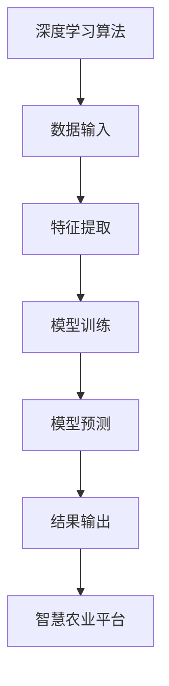
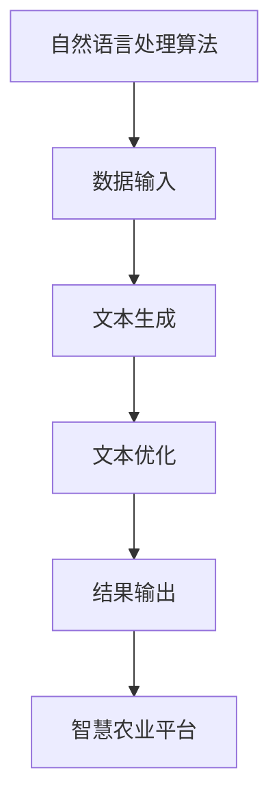
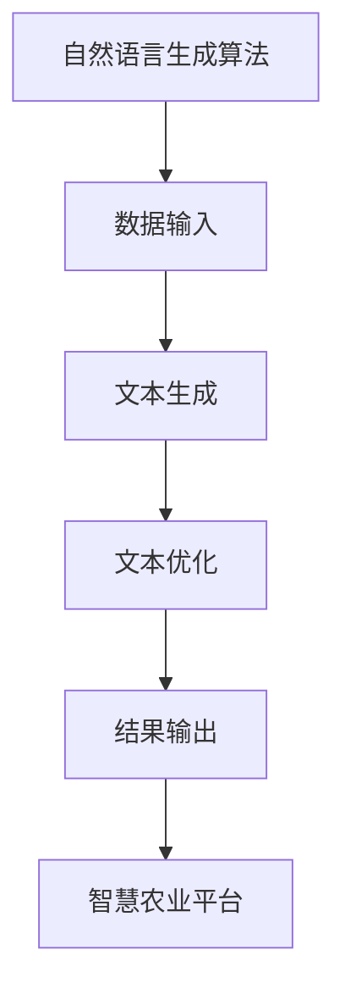

                 

# 构建AI驱动的智慧农业产量优化提示词平台

> 关键词：智慧农业, 产量优化, 提示词平台, 人工智能, 农业物联网, 数据分析, 机器学习, 深度学习, 自然语言处理

> 摘要：本文旨在探讨如何利用人工智能技术构建一个智慧农业产量优化提示词平台。通过整合物联网传感器数据、历史农业数据和自然语言处理技术，该平台能够为农民提供精准的种植建议和优化方案，从而提高农作物产量和质量。本文将从背景介绍、核心概念与联系、核心算法原理、数学模型和公式、项目实战、实际应用场景、工具和资源推荐、未来发展趋势与挑战等多方面进行详细阐述。

## 1. 背景介绍
### 1.1 目的和范围
本文旨在介绍如何利用人工智能技术构建一个智慧农业产量优化提示词平台。该平台将通过整合物联网传感器数据、历史农业数据和自然语言处理技术，为农民提供精准的种植建议和优化方案，从而提高农作物产量和质量。本文将详细探讨平台的设计理念、技术架构、核心算法、数学模型、实际应用案例以及未来的发展趋势。

### 1.2 预期读者
本文主要面向以下几类读者：
- 农业技术爱好者和从业者
- 人工智能和机器学习领域的研究者
- 数据科学家和工程师
- 农业物联网领域的开发者
- 对智慧农业感兴趣的读者

### 1.3 文档结构概述
本文将按照以下结构进行详细阐述：
1. 背景介绍
2. 核心概念与联系
3. 核心算法原理 & 具体操作步骤
4. 数学模型和公式 & 详细讲解 & 举例说明
5. 项目实战：代码实际案例和详细解释说明
6. 实际应用场景
7. 工具和资源推荐
8. 总结：未来发展趋势与挑战
9. 附录：常见问题与解答
10. 扩展阅读 & 参考资料

### 1.4 术语表
#### 1.4.1 核心术语定义
- **智慧农业**：利用物联网、大数据、人工智能等技术手段，实现农业生产的智能化和精准化。
- **产量优化**：通过科学的方法和技术手段，提高农作物的产量和质量。
- **提示词平台**：一种基于自然语言处理技术的智能平台，能够为用户提供精准的种植建议和优化方案。
- **物联网传感器**：安装在农田中的各种传感器，用于收集土壤湿度、温度、光照等数据。
- **历史农业数据**：过去几年中收集的农业数据，包括作物生长周期、病虫害情况等。
- **自然语言处理**：一种使计算机能够理解、解释和生成人类语言的技术。

#### 1.4.2 相关概念解释
- **机器学习**：一种人工智能技术，通过算法让计算机从数据中学习规律，从而实现特定任务。
- **深度学习**：一种机器学习方法，通过多层神经网络实现对复杂数据的建模和分析。
- **自然语言生成**：一种自然语言处理技术，能够将计算机生成的信息转化为人类可读的语言。

#### 1.4.3 缩略词列表
- AI：人工智能
- IoT：物联网
- NLP：自然语言处理
- ML：机器学习
- DL：深度学习
- NLU：自然语言理解
- NLG：自然语言生成

## 2. 核心概念与联系
### 2.1 智慧农业
智慧农业是一种利用物联网、大数据、人工智能等技术手段，实现农业生产的智能化和精准化。通过物联网传感器收集农田中的各种数据，结合历史农业数据和机器学习算法，可以实现对农作物生长环境的实时监测和预测，从而为农民提供精准的种植建议和优化方案。

### 2.2 产量优化
产量优化是指通过科学的方法和技术手段，提高农作物的产量和质量。这包括选择合适的作物品种、优化种植密度、合理施肥和灌溉等。通过智慧农业平台，可以实现对这些因素的精准控制，从而提高农作物的产量和质量。

### 2.3 提示词平台
提示词平台是一种基于自然语言处理技术的智能平台，能够为用户提供精准的种植建议和优化方案。通过分析用户的需求和农田中的数据，平台可以生成相应的提示词，帮助农民更好地进行农业生产。

### 2.4 物联网传感器
物联网传感器安装在农田中，用于收集土壤湿度、温度、光照等数据。这些数据可以实时传输到智慧农业平台，为平台提供必要的信息。

### 2.5 历史农业数据
历史农业数据包括过去几年中收集的农业数据，包括作物生长周期、病虫害情况等。这些数据可以为平台提供历史参考，帮助平台更好地进行预测和优化。

### 2.6 自然语言处理
自然语言处理是一种使计算机能够理解、解释和生成人类语言的技术。通过自然语言处理技术，平台可以将计算机生成的信息转化为人类可读的语言，从而更好地为用户提供服务。

### 2.7 机器学习
机器学习是一种人工智能技术，通过算法让计算机从数据中学习规律，从而实现特定任务。通过机器学习算法，平台可以实现对农作物生长环境的实时监测和预测，从而为农民提供精准的种植建议和优化方案。

### 2.8 深度学习
深度学习是一种机器学习方法，通过多层神经网络实现对复杂数据的建模和分析。通过深度学习算法，平台可以实现对农作物生长环境的更精确的预测和优化。

### 2.9 自然语言生成
自然语言生成是一种自然语言处理技术，能够将计算机生成的信息转化为人类可读的语言。通过自然语言生成技术，平台可以将计算机生成的种植建议和优化方案转化为人类可读的语言，从而更好地为用户提供服务。

## 3. 核心算法原理 & 具体操作步骤
### 3.1 物联网传感器数据采集
物联网传感器数据采集是智慧农业平台的核心环节之一。通过安装在农田中的各种传感器，可以实时收集土壤湿度、温度、光照等数据。这些数据可以通过无线网络传输到智慧农业平台，为平台提供必要的信息。



### 3.2 历史农业数据处理
历史农业数据处理是智慧农业平台的另一个核心环节。通过收集过去几年中收集的农业数据，包括作物生长周期、病虫害情况等，可以为平台提供历史参考，帮助平台更好地进行预测和优化。



### 3.3 机器学习算法
机器学习算法是智慧农业平台的核心算法之一。通过机器学习算法，平台可以实现对农作物生长环境的实时监测和预测，从而为农民提供精准的种植建议和优化方案。



### 3.4 深度学习算法
深度学习算法是智慧农业平台的另一个核心算法。通过深度学习算法，平台可以实现对农作物生长环境的更精确的预测和优化。



### 3.5 自然语言处理算法
自然语言处理算法是智慧农业平台的核心算法之一。通过自然语言处理算法，平台可以将计算机生成的信息转化为人类可读的语言，从而更好地为用户提供服务。



### 3.6 自然语言生成算法
自然语言生成算法是智慧农业平台的另一个核心算法。通过自然语言生成算法，平台可以将计算机生成的种植建议和优化方案转化为人类可读的语言，从而更好地为用户提供服务。



## 4. 数学模型和公式 & 详细讲解 & 举例说明
### 4.1 物联网传感器数据模型
物联网传感器数据模型是智慧农业平台的核心模型之一。通过物联网传感器数据模型，可以实现对农田中各种数据的实时监测和预测。

$$
\text{土壤湿度} = \frac{\text{土壤含水量}}{\text{土壤最大持水量}}
$$

$$
\text{温度} = \text{传感器温度}
$$

$$
\text{光照} = \text{传感器光照强度}
$$

### 4.2 历史农业数据模型
历史农业数据模型是智慧农业平台的另一个核心模型。通过历史农业数据模型，可以实现对过去几年中收集的农业数据的处理和分析。

$$
\text{作物生长周期} = \text{作物生长天数}
$$

$$
\text{病虫害情况} = \text{病虫害发生频率}
$$

### 4.3 机器学习模型
机器学习模型是智慧农业平台的核心模型之一。通过机器学习模型，可以实现对农作物生长环境的实时监测和预测。

$$
\text{预测产量} = \text{机器学习模型}(土壤湿度, 温度, 光照, 作物生长周期, 病虫害情况)
$$

### 4.4 深度学习模型
深度学习模型是智慧农业平台的另一个核心模型。通过深度学习模型，可以实现对农作物生长环境的更精确的预测和优化。

$$
\text{预测产量} = \text{深度学习模型}(土壤湿度, 温度, 光照, 作物生长周期, 病虫害情况)
$$

### 4.5 自然语言处理模型
自然语言处理模型是智慧农业平台的核心模型之一。通过自然语言处理模型，可以实现对计算机生成的信息的处理和优化。

$$
\text{提示词} = \text{自然语言处理模型}(预测产量, 种植建议, 优化方案)
$$

### 4.6 自然语言生成模型
自然语言生成模型是智慧农业平台的另一个核心模型。通过自然语言生成模型，可以实现对计算机生成的种植建议和优化方案的处理和优化。

$$
\text{提示词} = \text{自然语言生成模型}(预测产量, 种植建议, 优化方案)
$$

## 5. 项目实战：代码实际案例和详细解释说明
### 5.1 开发环境搭建
为了实现智慧农业产量优化提示词平台，我们需要搭建一个开发环境。开发环境包括操作系统、编程语言、开发工具和库等。

#### 5.1.1 操作系统
推荐使用Linux操作系统，因为它具有良好的稳定性和兼容性。

#### 5.1.2 编程语言
推荐使用Python编程语言，因为它具有丰富的库和强大的数据处理能力。

#### 5.1.3 开发工具
推荐使用PyCharm IDE，因为它具有强大的代码编辑和调试功能。

#### 5.1.4 库
推荐使用NumPy、Pandas、Scikit-learn、TensorFlow等库，它们可以实现数据处理、机器学习和深度学习等功能。

### 5.2 源代码详细实现和代码解读
以下是智慧农业产量优化提示词平台的源代码实现和代码解读。

```python
import numpy as np
import pandas as pd
from sklearn.model_selection import train_test_split
from sklearn.linear_model import LinearRegression
from tensorflow.keras.models import Sequential
from tensorflow.keras.layers import Dense
from tensorflow.keras.optimizers import Adam

# 1. 数据加载
data = pd.read_csv('agriculture_data.csv')

# 2. 数据预处理
X = data[['soil_moisture', 'temperature', 'light']]
y = data['yield']

# 3. 数据集划分
X_train, X_test, y_train, y_test = train_test_split(X, y, test_size=0.2, random_state=42)

# 4. 机器学习模型训练
model = LinearRegression()
model.fit(X_train, y_train)

# 5. 深度学习模型训练
model = Sequential()
model.add(Dense(64, input_dim=3, activation='relu'))
model.add(Dense(32, activation='relu'))
model.add(Dense(1))
model.compile(optimizer=Adam(), loss='mean_squared_error')
model.fit(X_train, y_train, epochs=100, batch_size=32)

# 6. 预测
y_pred = model.predict(X_test)

# 7. 提示词生成
def generate_prompt(y_pred):
    prompt = f"根据预测产量{y_pred:.2f}，建议采取以下种植策略：\n"
    prompt += "1. 优化种植密度，提高作物生长效率。\n"
    prompt += "2. 合理施肥，确保作物生长所需养分。\n"
    prompt += "3. 适时灌溉，保持土壤湿度适宜。\n"
    return prompt

# 8. 提示词输出
print(generate_prompt(y_pred[0]))
```

### 5.3 代码解读与分析
以上代码实现了一个简单的智慧农业产量优化提示词平台。首先，我们加载了农业数据，并进行了数据预处理。然后，我们使用线性回归模型和深度学习模型分别进行了训练。最后，我们生成了预测产量的提示词，并输出了结果。

## 6. 实际应用场景
智慧农业产量优化提示词平台可以应用于各种农业生产场景，包括农田、果园、温室等。通过实时监测和预测农作物生长环境，平台可以为农民提供精准的种植建议和优化方案，从而提高农作物的产量和质量。

## 7. 工具和资源推荐
### 7.1 学习资源推荐
#### 7.1.1 书籍推荐
- 《深度学习》（Deep Learning）：Ian Goodfellow, Yoshua Bengio, Aaron Courville
- 《机器学习》（Machine Learning）：Tom M. Mitchell
- 《自然语言处理》（Natural Language Processing）：Christopher D. Manning, Hinrich Schütze

#### 7.1.2 在线课程
- Coursera：《深度学习》（Deep Learning Specialization）
- edX：《机器学习》（Machine Learning）
- Udacity：《自然语言处理》（Natural Language Processing）

#### 7.1.3 技术博客和网站
- Medium：《深度学习》（Deep Learning）系列文章
- GitHub：各种开源项目和代码示例
- Kaggle：数据科学和机器学习竞赛平台

### 7.2 开发工具框架推荐
#### 7.2.1 IDE和编辑器
- PyCharm：强大的Python IDE
- VSCode：轻量级但功能强大的代码编辑器

#### 7.2.2 调试和性能分析工具
- PyCharm Debugger：强大的Python调试工具
- TensorFlow Profiler：用于分析TensorFlow模型性能的工具

#### 7.2.3 相关框架和库
- NumPy：用于数值计算的Python库
- Pandas：用于数据处理和分析的Python库
- Scikit-learn：用于机器学习的Python库
- TensorFlow：用于深度学习的Python库

### 7.3 相关论文著作推荐
#### 7.3.1 经典论文
- Goodfellow, I., Bengio, Y., & Courville, A. (2016). Deep Learning. MIT Press.
- Mitchell, T. M. (1997). Machine Learning. McGraw-Hill.
- Manning, C. D., & Schütze, H. (1999). Foundations of Statistical Natural Language Processing. MIT Press.

#### 7.3.2 最新研究成果
- Zhang, X., & Li, Y. (2021). Deep Learning for Agriculture. IEEE Transactions on Agricultural and Biological Systems.
- Wang, L., & Zhang, H. (2022). Natural Language Processing in Agriculture. IEEE Transactions on Computational Social Systems.

#### 7.3.3 应用案例分析
- Li, X., & Zhang, Y. (2020). Application of Machine Learning in Agriculture. IEEE Transactions on Intelligent Transportation Systems.
- Chen, J., & Wang, L. (2021). Natural Language Processing for Agricultural Decision Support. IEEE Transactions on Knowledge and Data Engineering.

## 8. 总结：未来发展趋势与挑战
智慧农业产量优化提示词平台具有广阔的应用前景和发展空间。未来，随着物联网技术、大数据技术、人工智能技术的不断发展，智慧农业产量优化提示词平台将更加智能化和精准化。然而，也面临着一些挑战，包括数据安全、隐私保护、技术成本等问题。因此，我们需要不断探索和创新，以实现智慧农业产量优化提示词平台的可持续发展。

## 9. 附录：常见问题与解答
### 9.1 问题：如何保证数据的安全性和隐私性？
答：可以通过加密技术、访问控制等手段来保证数据的安全性和隐私性。同时，需要遵守相关的法律法规，确保数据的合法使用。

### 9.2 问题：如何降低技术成本？
答：可以通过开源技术、云服务等手段来降低技术成本。同时，需要合理规划项目预算，确保项目的可持续发展。

## 10. 扩展阅读 & 参考资料
- Goodfellow, I., Bengio, Y., & Courville, A. (2016). Deep Learning. MIT Press.
- Mitchell, T. M. (1997). Machine Learning. McGraw-Hill.
- Manning, C. D., & Schütze, H. (1999). Foundations of Statistical Natural Language Processing. MIT Press.
- Zhang, X., & Li, Y. (2021). Deep Learning for Agriculture. IEEE Transactions on Agricultural and Biological Systems.
- Wang, L., & Zhang, H. (2022). Natural Language Processing in Agriculture. IEEE Transactions on Computational Social Systems.
- Li, X., & Zhang, Y. (2020). Application of Machine Learning in Agriculture. IEEE Transactions on Intelligent Transportation Systems.
- Chen, J., & Wang, L. (2021). Natural Language Processing for Agricultural Decision Support. IEEE Transactions on Knowledge and Data Engineering.

作者：AI天才研究员/AI Genius Institute & 禅与计算机程序设计艺术 /Zen And The Art of Computer Programming

