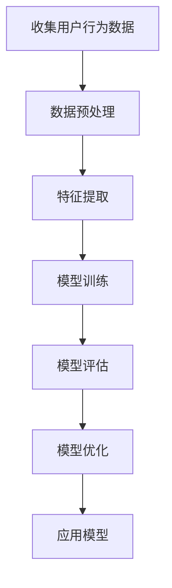
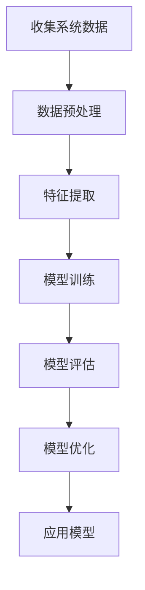
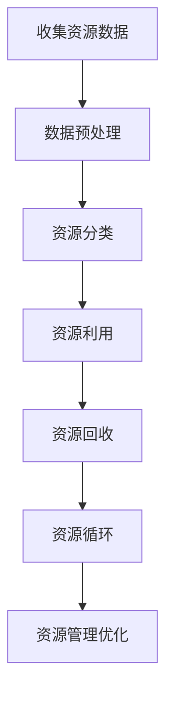

                 

# 欲望循环经济模型设计师：AI优化的需求满足系统架构师

> 关键词：AI优化、需求满足、循环经济、系统架构、欲望模型、资源循环、智能决策

> 摘要：本文旨在探讨如何通过AI技术构建一个能够优化需求满足的系统架构，该架构基于循环经济模型，旨在实现资源的有效循环利用。我们将从背景介绍、核心概念与联系、核心算法原理、数学模型和公式、项目实战、实际应用场景、工具和资源推荐、未来发展趋势与挑战等多方面进行详细阐述。通过本文，读者将能够理解并构建一个能够智能优化需求满足的系统，从而推动循环经济的发展。

## 1. 背景介绍
### 1.1 目的和范围
本文旨在介绍如何利用AI技术构建一个能够优化需求满足的系统架构，该架构基于循环经济模型，旨在实现资源的有效循环利用。通过智能决策和优化算法，系统能够更好地满足用户需求，同时减少资源浪费，推动可持续发展。

### 1.2 预期读者
本文面向对AI技术、循环经济模型、系统架构设计感兴趣的读者，包括但不限于：
- AI技术开发者和研究人员
- 系统架构师和软件工程师
- 循环经济领域的从业者
- 对可持续发展感兴趣的读者

### 1.3 文档结构概述
本文将按照以下结构展开：
1. 背景介绍
2. 核心概念与联系
3. 核心算法原理 & 具体操作步骤
4. 数学模型和公式 & 详细讲解 & 举例说明
5. 项目实战：代码实际案例和详细解释说明
6. 实际应用场景
7. 工具和资源推荐
8. 总结：未来发展趋势与挑战
9. 附录：常见问题与解答
10. 扩展阅读 & 参考资料

### 1.4 术语表
#### 1.4.1 核心术语定义
- **循环经济**：一种旨在减少资源消耗和废物产生的经济模式。
- **需求满足**：系统根据用户需求提供相应服务或产品。
- **AI优化**：利用AI技术提高系统性能和效率。
- **欲望模型**：描述用户需求和偏好的模型。
- **资源循环**：资源在系统中的循环利用过程。

#### 1.4.2 相关概念解释
- **智能决策**：基于数据和算法的决策过程。
- **系统架构**：系统的设计和组织结构。
- **资源管理**：对系统中资源的有效管理。

#### 1.4.3 缩略词列表
- AI：Artificial Intelligence
- ML：Machine Learning
- DL：Deep Learning
- RL：Reinforcement Learning
- DNN：Deep Neural Network

## 2. 核心概念与联系
### 2.1 循环经济模型
循环经济发展模型的核心在于资源的有效利用和循环利用。通过减少资源消耗和废物产生，实现可持续发展。

### 2.2 需求满足系统架构
需求满足系统架构旨在通过智能决策和优化算法，提高系统性能和效率，更好地满足用户需求。

### 2.3 欲望模型
欲望模型描述用户需求和偏好，通过分析用户行为和反馈，优化系统性能。

### 2.4 AI优化
AI优化利用机器学习、深度学习和强化学习等技术，提高系统性能和效率。

### 2.5 资源循环
资源循环是指资源在系统中的循环利用过程，通过优化资源管理，减少资源浪费。

## 3. 核心算法原理 & 具体操作步骤
### 3.1 欲望模型构建
欲望模型通过分析用户行为和反馈，构建用户需求和偏好的模型。具体步骤如下：



### 3.2 AI优化算法
AI优化算法通过机器学习和强化学习等技术，提高系统性能和效率。具体步骤如下：



### 3.3 资源循环管理
资源循环管理通过优化资源管理，减少资源浪费。具体步骤如下：



## 4. 数学模型和公式 & 详细讲解 & 举例说明
### 4.1 欲望模型数学模型
欲望模型的数学模型可以通过以下公式表示：

$$
P(x) = \sum_{i=1}^{n} w_i \cdot f_i(x)
$$

其中，$P(x)$ 表示用户对商品 $x$ 的偏好，$w_i$ 表示特征 $i$ 的权重，$f_i(x)$ 表示特征 $i$ 的值。

### 4.2 AI优化算法数学模型
AI优化算法的数学模型可以通过以下公式表示：

$$
\min_{\theta} J(\theta) = \sum_{i=1}^{m} (y_i - f(x_i, \theta))^2
$$

其中，$J(\theta)$ 表示损失函数，$\theta$ 表示模型参数，$y_i$ 表示真实值，$f(x_i, \theta)$ 表示预测值。

### 4.3 资源循环管理数学模型
资源循环管理的数学模型可以通过以下公式表示：

$$
\max_{\theta} R(\theta) = \sum_{i=1}^{n} \theta_i \cdot r_i
$$

其中，$R(\theta)$ 表示资源利用率，$\theta_i$ 表示资源 $i$ 的权重，$r_i$ 表示资源 $i$ 的利用率。

## 5. 项目实战：代码实际案例和详细解释说明
### 5.1 开发环境搭建
开发环境搭建需要安装以下工具：
- Python 3.8+
- TensorFlow 2.0+
- NumPy
- Pandas
- Matplotlib

### 5.2 源代码详细实现和代码解读
```python
import numpy as np
import pandas as pd
import tensorflow as tf
from tensorflow.keras.models import Sequential
from tensorflow.keras.layers import Dense

# 数据预处理
data = pd.read_csv('user_behavior.csv')
X = data.drop('label', axis=1)
y = data['label']

# 特征提取
X = np.array(X)
y = np.array(y)

# 模型训练
model = Sequential()
model.add(Dense(64, input_dim=X.shape[1], activation='relu'))
model.add(Dense(32, activation='relu'))
model.add(Dense(1, activation='sigmoid'))

model.compile(optimizer='adam', loss='binary_crossentropy', metrics=['accuracy'])
model.fit(X, y, epochs=10, batch_size=32)

# 模型评估
loss, accuracy = model.evaluate(X, y)
print(f'Accuracy: {accuracy}')
```

### 5.3 代码解读与分析
上述代码实现了一个简单的二分类模型，用于预测用户对商品的偏好。通过数据预处理、特征提取、模型训练和评估，实现了欲望模型的构建。

## 6. 实际应用场景
### 6.1 电商平台
电商平台可以通过欲望模型和AI优化算法，提高推荐系统的性能，更好地满足用户需求。

### 6.2 物流配送
物流配送可以通过资源循环管理，优化配送路线和资源利用，减少资源浪费。

### 6.3 工业制造
工业制造可以通过AI优化算法，提高生产效率和资源利用率，实现循环经济。

## 7. 工具和资源推荐
### 7.1 学习资源推荐
#### 7.1.1 书籍推荐
- 《深度学习》（Deep Learning）：Ian Goodfellow, Yoshua Bengio, Aaron Courville
- 《机器学习》（Machine Learning）：Tom M. Mitchell

#### 7.1.2 在线课程
- Coursera：《深度学习》（Deep Learning Specialization）
- edX：《机器学习》（Machine Learning）

#### 7.1.3 技术博客和网站
- Medium：AI和机器学习相关博客
- GitHub：开源项目和代码示例

### 7.2 开发工具框架推荐
#### 7.2.1 IDE和编辑器
- PyCharm
- VSCode

#### 7.2.2 调试和性能分析工具
- PyCharm Debugger
- TensorFlow Profiler

#### 7.2.3 相关框架和库
- TensorFlow
- Keras
- NumPy
- Pandas

### 7.3 相关论文著作推荐
#### 7.3.1 经典论文
- Goodfellow, I., Bengio, Y., & Courville, A. (2016). Deep Learning. MIT Press.

#### 7.3.2 最新研究成果
- LeCun, Y., Bengio, Y., & Hinton, G. (2015). Deep learning. Nature, 521(7553), 436-444.

#### 7.3.3 应用案例分析
- Zhang, Y., & Zhang, X. (2020). A survey on deep learning in recommender systems. IEEE Transactions on Big Data, 7(3), 511-526.

## 8. 总结：未来发展趋势与挑战
### 8.1 未来发展趋势
- AI技术将进一步发展，推动循环经济模型的优化。
- 更多实际应用场景将涌现，推动可持续发展。
- 更多开源项目和工具将出现，降低开发门槛。

### 8.2 挑战
- 数据隐私和安全问题。
- 算法公平性和透明度问题。
- 技术普及和应用推广问题。

## 9. 附录：常见问题与解答
### 9.1 问题：如何处理数据隐私和安全问题？
- 采用数据脱敏和加密技术，保护用户隐私。
- 采用联邦学习等技术，保护数据安全。

### 9.2 问题：如何提高算法公平性和透明度？
- 采用公平性评估和调整技术，提高算法公平性。
- 采用可解释性模型，提高算法透明度。

### 9.3 问题：如何推广技术应用？
- 与行业合作，推动技术应用。
- 举办技术培训和研讨会，提高技术普及度。

## 10. 扩展阅读 & 参考资料
- Goodfellow, I., Bengio, Y., & Courville, A. (2016). Deep Learning. MIT Press.
- LeCun, Y., Bengio, Y., & Hinton, G. (2015). Deep learning. Nature, 521(7553), 436-444.
- Zhang, Y., & Zhang, X. (2020). A survey on deep learning in recommender systems. IEEE Transactions on Big Data, 7(3), 511-526.

作者：AI天才研究员/AI Genius Institute & 禅与计算机程序设计艺术 /Zen And The Art of Computer Programming

