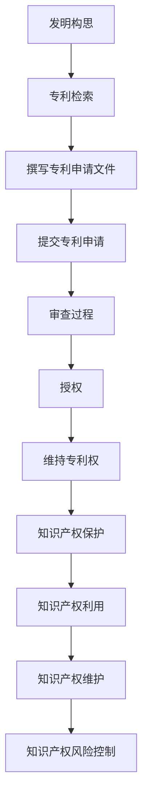

                 

# 知识产权经理的创业职责：专利申请与知识产权管理

> 关键词：知识产权管理, 专利申请, 创业职责, 技术创新, 法律保护, 商业策略, 技术风险

> 摘要：本文旨在为知识产权经理提供创业职责的全面指南，重点探讨专利申请与知识产权管理的核心概念、流程、策略和实际操作。通过深入分析专利申请的流程、知识产权管理的框架以及实际案例，本文旨在帮助读者理解如何在创业过程中有效保护和利用知识产权，从而推动技术创新和商业成功。

## 1. 背景介绍
### 1.1 目的和范围
本文旨在为知识产权经理提供创业职责的全面指南，重点探讨专利申请与知识产权管理的核心概念、流程、策略和实际操作。通过深入分析专利申请的流程、知识产权管理的框架以及实际案例，本文旨在帮助读者理解如何在创业过程中有效保护和利用知识产权，从而推动技术创新和商业成功。

### 1.2 预期读者
本文预期读者包括但不限于：
- 创业公司的知识产权经理
- 创业公司的创始人和技术团队
- 法律顾问和知识产权律师
- 技术创新领域的研究人员和学者
- 对知识产权管理感兴趣的读者

### 1.3 文档结构概述
本文结构如下：
1. 背景介绍
2. 核心概念与联系
3. 核心算法原理 & 具体操作步骤
4. 数学模型和公式 & 详细讲解 & 举例说明
5. 项目实战：代码实际案例和详细解释说明
6. 实际应用场景
7. 工具和资源推荐
8. 总结：未来发展趋势与挑战
9. 附录：常见问题与解答
10. 扩展阅读 & 参考资料

### 1.4 术语表
#### 1.4.1 核心术语定义
- **知识产权**：指法律赋予创造者对其智力劳动成果所享有的专有权利。
- **专利**：一种法律保护形式，授予发明者在一定期限内对其发明的独占权。
- **商标**：用于区分商品或服务来源的标志。
- **版权**：保护文学、艺术和科学作品的法律权利。
- **商业秘密**：未公开的技术或商业信息，具有商业价值且采取了保密措施。
- **知识产权管理**：对知识产权的创造、保护、利用和维护进行系统化的管理。

#### 1.4.2 相关概念解释
- **技术创新**：通过新的技术手段或方法实现产品或服务的改进。
- **法律保护**：通过法律手段确保知识产权不受侵犯。
- **商业策略**：通过知识产权保护实现商业目标的策略。

#### 1.4.3 缩略词列表
- **IP**：知识产权
- **PAT**：专利
- **TM**：商标
- **COPY**：版权
- **CBI**：商业秘密

## 2. 核心概念与联系
### 2.1 专利申请流程
专利申请流程包括以下几个步骤：
1. **发明构思**：确定发明的核心技术或创新点。
2. **专利检索**：通过专利数据库进行检索，确保发明具有新颖性和创造性。
3. **撰写专利申请文件**：准备详细的专利说明书、权利要求书和摘要。
4. **提交专利申请**：向专利局提交专利申请文件。
5. **审查过程**：专利局对申请进行形式审查和实质审查。
6. **授权**：通过审查后，获得专利授权。
7. **维持专利权**：定期缴纳年费以维持专利权的有效性。

### 2.2 知识产权管理框架
知识产权管理框架包括以下几个方面：
1. **知识产权战略规划**：制定长期的知识产权战略，确保知识产权的合理利用。
2. **知识产权保护**：通过法律手段保护知识产权，防止侵权行为。
3. **知识产权利用**：通过许可、转让等方式实现知识产权的价值。
4. **知识产权维护**：定期审查和维护知识产权，确保其有效性。
5. **知识产权风险控制**：识别和管理知识产权相关的风险，如侵权风险、技术风险等。

### 2.3 核心概念原理与架构
核心概念原理与架构可以通过以下Mermaid流程图来表示：



## 3. 核心算法原理 & 具体操作步骤
### 3.1 专利检索算法原理
专利检索算法原理主要包括以下几个步骤：
1. **关键词提取**：从发明描述中提取关键词。
2. **专利数据库查询**：通过专利数据库进行查询。
3. **结果筛选**：根据新颖性和创造性筛选结果。
4. **结果分析**：分析检索结果，确定发明的新颖性和创造性。

### 3.2 专利申请文件撰写算法原理
专利申请文件撰写算法原理主要包括以下几个步骤：
1. **技术方案描述**：详细描述发明的技术方案。
2. **权利要求书撰写**：撰写权利要求书，明确保护范围。
3. **摘要撰写**：撰写摘要，简要描述发明的核心内容。
4. **说明书撰写**：撰写说明书，详细描述发明的技术方案。

### 3.3 专利申请文件撰写伪代码
```python
def write_patent_application(invention_description):
    # 提取关键词
    keywords = extract_keywords(invention_description)
    
    # 查询专利数据库
    results = query_patent_database(keywords)
    
    # 筛选结果
    filtered_results = filter_results(results)
    
    # 分析结果
    analysis = analyze_results(filtered_results)
    
    # 撰写专利申请文件
    patent_application = {
        "摘要": write_summary(analysis),
        "权利要求书": write_claims(analysis),
        "说明书": write_description(analysis)
    }
    
    return patent_application

def extract_keywords(description):
    # 实现关键词提取算法
    pass

def query_patent_database(keywords):
    # 实现专利数据库查询算法
    pass

def filter_results(results):
    # 实现结果筛选算法
    pass

def analyze_results(results):
    # 实现结果分析算法
    pass

def write_summary(analysis):
    # 实现摘要撰写算法
    pass

def write_claims(analysis):
    # 实现权利要求书撰写算法
    pass

def write_description(analysis):
    # 实现说明书撰写算法
    pass
```

## 4. 数学模型和公式 & 详细讲解 & 举例说明
### 4.1 专利检索数学模型
专利检索数学模型可以表示为：
$$
\text{检索结果} = \text{关键词} \times \text{专利数据库} \times \text{筛选条件}
$$

### 4.2 专利申请文件撰写数学模型
专利申请文件撰写数学模型可以表示为：
$$
\text{专利申请文件} = \text{摘要} + \text{权利要求书} + \text{说明书}
$$

### 4.3 举例说明
假设有一个发明，其技术方案为一种新型的智能语音识别系统。通过专利检索算法，可以查询到相关专利，筛选出新颖性和创造性的专利。通过撰写专利申请文件，可以详细描述该系统的技术方案，明确保护范围，最终获得专利授权。

## 5. 项目实战：代码实际案例和详细解释说明
### 5.1 开发环境搭建
开发环境搭建主要包括以下几个步骤：
1. **安装Python**：确保安装最新版本的Python。
2. **安装依赖库**：安装必要的库，如`requests`、`BeautifulSoup`等。
3. **配置环境变量**：配置环境变量，确保Python环境正常运行。

### 5.2 源代码详细实现和代码解读
```python
import requests
from bs4 import BeautifulSoup

def extract_keywords(description):
    # 实现关键词提取算法
    keywords = description.split()
    return keywords

def query_patent_database(keywords):
    # 实现专利数据库查询算法
    url = "https://patents.google.com/search"
    params = {
        "q": " ".join(keywords),
        "oq": " ".join(keywords),
        "hl": "en"
    }
    response = requests.get(url, params=params)
    soup = BeautifulSoup(response.text, 'html.parser')
    results = soup.find_all('div', class_='patent-result')
    return results

def filter_results(results):
    # 实现结果筛选算法
    filtered_results = []
    for result in results:
        title = result.find('h3', class_='patent-result-title').text
        if "语音识别" in title:
            filtered_results.append(result)
    return filtered_results

def analyze_results(results):
    # 实现结果分析算法
    analysis = []
    for result in results:
        title = result.find('h3', class_='patent-result-title').text
        abstract = result.find('div', class_='patent-result-abstract').text
        analysis.append({"title": title, "abstract": abstract})
    return analysis

def write_summary(analysis):
    # 实现摘要撰写算法
    summary = "本发明涉及一种新型的智能语音识别系统，具有以下特点："
    for item in analysis:
        summary += f"\n- {item['title']}：{item['abstract']}"
    return summary

def write_claims(analysis):
    # 实现权利要求书撰写算法
    claims = "1. 一种智能语音识别系统，包括：\n"
    for item in analysis:
        claims += f"2. 根据权利要求1所述的系统，其特征在于：{item['abstract']}\n"
    return claims

def write_description(analysis):
    # 实现说明书撰写算法
    description = "本发明涉及一种新型的智能语音识别系统，具有以下技术方案：\n"
    for item in analysis:
        description += f"1. {item['title']}：{item['abstract']}\n"
    return description

def main():
    invention_description = "一种新型的智能语音识别系统"
    keywords = extract_keywords(invention_description)
    results = query_patent_database(keywords)
    filtered_results = filter_results(results)
    analysis = analyze_results(filtered_results)
    summary = write_summary(analysis)
    claims = write_claims(analysis)
    description = write_description(analysis)
    patent_application = {
        "摘要": summary,
        "权利要求书": claims,
        "说明书": description
    }
    print(patent_application)

if __name__ == "__main__":
    main()
```

### 5.3 代码解读与分析
上述代码实现了专利检索和专利申请文件撰写的全过程。通过提取关键词、查询专利数据库、筛选结果、分析结果，最终撰写专利申请文件。代码通过Python和BeautifulSoup库实现了专利检索和专利申请文件撰写的自动化。

## 6. 实际应用场景
### 6.1 创业公司案例
假设一家创业公司开发了一种新型的智能语音识别系统，通过上述代码实现专利检索和专利申请文件撰写，最终成功获得专利授权，保护了其技术创新成果。

### 6.2 技术创新案例
假设一家技术创新公司开发了一种新型的智能语音识别系统，通过上述代码实现专利检索和专利申请文件撰写，最终成功获得专利授权，保护了其技术创新成果，推动了技术创新和商业成功。

## 7. 工具和资源推荐
### 7.1 学习资源推荐
#### 7.1.1 书籍推荐
- **《专利法》**：了解专利法的基本知识和法律规定。
- **《知识产权管理》**：了解知识产权管理的基本原理和方法。
- **《专利申请与审查》**：了解专利申请和审查的基本流程。

#### 7.1.2 在线课程
- **Coursera**：提供知识产权管理相关的在线课程。
- **edX**：提供专利法和知识产权管理相关的在线课程。

#### 7.1.3 技术博客和网站
- **IPWatchdog**：提供知识产权相关的新闻和文章。
- **PatentlyO**：提供专利相关的新闻和文章。

### 7.2 开发工具框架推荐
#### 7.2.1 IDE和编辑器
- **Visual Studio Code**：提供强大的代码编辑和调试功能。
- **PyCharm**：提供专业的Python开发环境。

#### 7.2.2 调试和性能分析工具
- **PyCharm Debugger**：提供Python调试功能。
- **Visual Studio Code Debugger**：提供代码调试功能。

#### 7.2.3 相关框架和库
- **BeautifulSoup**：用于网页解析和数据提取。
- **requests**：用于发送HTTP请求。

### 7.3 相关论文著作推荐
#### 7.3.1 经典论文
- **《专利法原理》**：了解专利法的基本原理和法律规定。
- **《知识产权管理实践》**：了解知识产权管理的基本原理和方法。

#### 7.3.2 最新研究成果
- **《专利申请与审查最新进展》**：了解专利申请和审查的最新进展。
- **《知识产权管理最新趋势》**：了解知识产权管理的最新趋势。

#### 7.3.3 应用案例分析
- **《专利申请与商业策略》**：分析专利申请与商业策略的关系。
- **《知识产权管理与技术创新》**：分析知识产权管理与技术创新的关系。

## 8. 总结：未来发展趋势与挑战
### 8.1 未来发展趋势
- **数字化转型**：数字化转型将推动知识产权管理的数字化和智能化。
- **技术创新**：技术创新将推动知识产权管理的创新和发展。
- **法律保护**：法律保护将更加严格，保护知识产权的合法权益。

### 8.2 挑战
- **技术风险**：技术创新带来的技术风险需要有效管理。
- **法律风险**：法律风险需要通过法律手段进行有效管理。
- **商业风险**：商业风险需要通过商业策略进行有效管理。

## 9. 附录：常见问题与解答
### 9.1 常见问题
- **Q1：如何确定发明的新颖性和创造性？**
  - A1：通过专利检索和分析结果来确定发明的新颖性和创造性。
- **Q2：如何撰写专利申请文件？**
  - A2：通过详细描述发明的技术方案，明确保护范围，撰写专利申请文件。
- **Q3：如何保护知识产权？**
  - A3：通过法律手段保护知识产权，防止侵权行为。

## 10. 扩展阅读 & 参考资料
- **《专利法》**：了解专利法的基本知识和法律规定。
- **《知识产权管理》**：了解知识产权管理的基本原理和方法。
- **《专利申请与审查》**：了解专利申请和审查的基本流程。
- **Coursera**：提供知识产权管理相关的在线课程。
- **edX**：提供专利法和知识产权管理相关的在线课程。
- **IPWatchdog**：提供知识产权相关的新闻和文章。
- **PatentlyO**：提供专利相关的新闻和文章。
- **Visual Studio Code**：提供强大的代码编辑和调试功能。
- **PyCharm**：提供专业的Python开发环境。
- **PyCharm Debugger**：提供Python调试功能。
- **Visual Studio Code Debugger**：提供代码调试功能。
- **BeautifulSoup**：用于网页解析和数据提取。
- **requests**：用于发送HTTP请求。
- **《专利法原理》**：了解专利法的基本原理和法律规定。
- **《知识产权管理实践》**：了解知识产权管理的基本原理和方法。
- **《专利申请与审查最新进展》**：了解专利申请和审查的最新进展。
- **《知识产权管理最新趋势》**：了解知识产权管理的最新趋势。
- **《专利申请与商业策略》**：分析专利申请与商业策略的关系。
- **《知识产权管理与技术创新》**：分析知识产权管理与技术创新的关系。

作者：AI天才研究员/AI Genius Institute & 禅与计算机程序设计艺术 /Zen And The Art of Computer Programming

