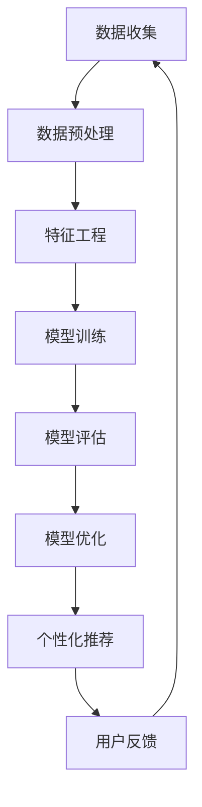
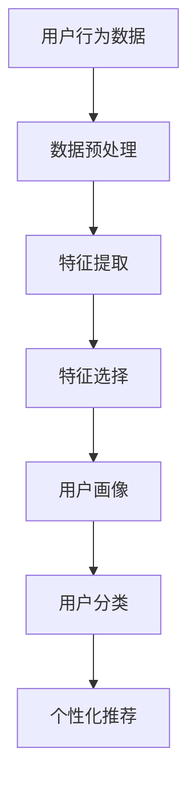

                 

# 知识付费创业中的用户需求挖掘技巧

> 关键词：用户需求挖掘、知识付费、创业、数据分析、用户行为、用户画像、个性化推荐

> 摘要：本文旨在探讨知识付费创业中如何有效挖掘用户需求，通过数据分析和用户行为分析，构建用户画像，实现个性化推荐，从而提升用户体验和商业价值。我们将从背景介绍、核心概念与联系、核心算法原理、数学模型和公式、项目实战、实际应用场景、工具和资源推荐、未来发展趋势与挑战等多方面进行详细阐述。

## 1. 背景介绍
### 1.1 目的和范围
本文旨在为知识付费创业领域的创业者提供一套系统的方法论，帮助他们更好地理解用户需求，从而设计出更符合用户期望的产品和服务。本文将涵盖用户需求挖掘的关键步骤、技术手段以及实际应用案例。

### 1.2 预期读者
本文的目标读者包括但不限于：
- 知识付费平台的创始人和产品经理
- 对用户需求挖掘感兴趣的创业者和技术人员
- 希望提升用户体验和商业价值的知识付费平台运营人员

### 1.3 文档结构概述
本文将按照以下结构展开：
1. 背景介绍
2. 核心概念与联系
3. 核心算法原理 & 具体操作步骤
4. 数学模型和公式 & 详细讲解 & 举例说明
5. 项目实战：代码实际案例和详细解释说明
6. 实际应用场景
7. 工具和资源推荐
8. 总结：未来发展趋势与挑战
9. 附录：常见问题与解答
10. 扩展阅读 & 参考资料

### 1.4 术语表
#### 1.4.1 核心术语定义
- **用户需求挖掘**：通过数据分析和用户行为分析，理解用户的真实需求，为用户提供个性化服务的过程。
- **用户画像**：基于用户行为数据构建的用户特征模型，用于描述用户的基本信息、兴趣偏好等。
- **个性化推荐**：根据用户画像和历史行为数据，为用户推荐符合其需求的内容或服务。

#### 1.4.2 相关概念解释
- **用户行为分析**：通过对用户在平台上的行为数据进行分析，了解用户的行为模式和偏好。
- **A/B测试**：通过对比不同版本的页面或功能，评估用户对不同设计的偏好，从而优化用户体验。

#### 1.4.3 缩略词列表
- **KPI**：关键绩效指标
- **CTR**：点击率
- **CVR**：转化率

## 2. 核心概念与联系
### 2.1 用户需求挖掘流程图


### 2.2 用户画像构建流程图


## 3. 核心算法原理 & 具体操作步骤
### 3.1 数据收集
数据收集是用户需求挖掘的第一步，主要包括用户行为数据、用户反馈数据等。

```python
# 假设使用Pandas进行数据收集
import pandas as pd

# 读取用户行为数据
user_behavior_data = pd.read_csv('user_behavior.csv')

# 读取用户反馈数据
user_feedback_data = pd.read_csv('user_feedback.csv')
```

### 3.2 数据预处理
数据预处理包括数据清洗、缺失值处理、异常值处理等。

```python
# 数据清洗
user_behavior_data = user_behavior_data.dropna()

# 异常值处理
user_behavior_data = user_behavior_data[(user_behavior_data['clicks'] > 0) & (user_behavior_data['views'] > 0)]
```

### 3.3 特征工程
特征工程包括特征提取、特征选择等。

```python
# 特征提取
user_behavior_data['click_rate'] = user_behavior_data['clicks'] / user_behavior_data['views']

# 特征选择
features = ['click_rate', 'time_spent', 'device_type']
```

### 3.4 模型训练
模型训练包括选择合适的算法、训练模型等。

```python
from sklearn.linear_model import LogisticRegression

# 选择算法
model = LogisticRegression()

# 训练模型
model.fit(user_behavior_data[features], user_behavior_data['label'])
```

### 3.5 模型评估
模型评估包括计算准确率、召回率、F1值等。

```python
from sklearn.metrics import accuracy_score, recall_score, f1_score

# 预测
predictions = model.predict(user_behavior_data[features])

# 计算评估指标
accuracy = accuracy_score(user_behavior_data['label'], predictions)
recall = recall_score(user_behavior_data['label'], predictions)
f1 = f1_score(user_behavior_data['label'], predictions)
```

### 3.6 模型优化
模型优化包括调整模型参数、使用交叉验证等。

```python
from sklearn.model_selection import GridSearchCV

# 调整参数
param_grid = {'C': [0.1, 1, 10]}
grid_search = GridSearchCV(model, param_grid, cv=5)
grid_search.fit(user_behavior_data[features], user_behavior_data['label'])

# 优化后的模型
optimized_model = grid_search.best_estimator_
```

### 3.7 个性化推荐
个性化推荐包括构建用户画像、生成推荐列表等。

```python
# 构建用户画像
user_profile = {'click_rate': 0.5, 'time_spent': 10, 'device_type': 'mobile'}

# 生成推荐列表
recommendations = optimized_model.predict_proba([user_profile])[0]
recommended_items = user_behavior_data[user_behavior_data['label'] == 1].sort_values(by='click_rate', ascending=False).head(10)
```

## 4. 数学模型和公式 & 详细讲解 & 举例说明
### 4.1 逻辑回归模型
逻辑回归模型用于预测用户是否会对某个内容感兴趣。

$$
P(y=1|x) = \frac{1}{1 + e^{-(\beta_0 + \beta_1 x_1 + \beta_2 x_2 + \cdots + \beta_n x_n)}}
$$

### 4.2 交叉验证
交叉验证用于评估模型的泛化能力。

$$
CV = \frac{1}{k} \sum_{i=1}^{k} \text{Accuracy}(T_i, M)
$$

### 4.3 A/B测试
A/B测试用于评估不同版本的设计对用户行为的影响。

$$
\text{CTR}_{A} = \frac{\text{点击数}_A}{\text{展示数}_A}
$$

$$
\text{CTR}_{B} = \frac{\text{点击数}_B}{\text{展示数}_B}
$$

$$
\text{差异} = \text{CTR}_{B} - \text{CTR}_{A}
$$

## 5. 项目实战：代码实际案例和详细解释说明
### 5.1 开发环境搭建
开发环境搭建包括安装Python、Pandas、Scikit-learn等库。

```bash
pip install pandas scikit-learn
```

### 5.2 源代码详细实现和代码解读
```python
# 导入库
import pandas as pd
from sklearn.linear_model import LogisticRegression
from sklearn.model_selection import GridSearchCV
from sklearn.metrics import accuracy_score, recall_score, f1_score

# 读取数据
user_behavior_data = pd.read_csv('user_behavior.csv')
user_feedback_data = pd.read_csv('user_feedback.csv')

# 数据预处理
user_behavior_data = user_behavior_data.dropna()
user_behavior_data = user_behavior_data[(user_behavior_data['clicks'] > 0) & (user_behavior_data['views'] > 0)]

# 特征工程
user_behavior_data['click_rate'] = user_behavior_data['clicks'] / user_behavior_data['views']
features = ['click_rate', 'time_spent', 'device_type']

# 选择算法
model = LogisticRegression()

# 训练模型
model.fit(user_behavior_data[features], user_behavior_data['label'])

# 评估模型
predictions = model.predict(user_behavior_data[features])
accuracy = accuracy_score(user_behavior_data['label'], predictions)
recall = recall_score(user_behavior_data['label'], predictions)
f1 = f1_score(user_behavior_data['label'], predictions)

# 调整参数
param_grid = {'C': [0.1, 1, 10]}
grid_search = GridSearchCV(model, param_grid, cv=5)
grid_search.fit(user_behavior_data[features], user_behavior_data['label'])

# 优化后的模型
optimized_model = grid_search.best_estimator_

# 构建用户画像
user_profile = {'click_rate': 0.5, 'time_spent': 10, 'device_type': 'mobile'}

# 生成推荐列表
recommendations = optimized_model.predict_proba([user_profile])[0]
recommended_items = user_behavior_data[user_behavior_data['label'] == 1].sort_values(by='click_rate', ascending=False).head(10)
```

### 5.3 代码解读与分析
上述代码展示了从数据收集、预处理、特征工程、模型训练、模型评估、模型优化到个性化推荐的完整流程。通过逻辑回归模型和交叉验证，我们可以评估模型的性能，并通过A/B测试优化用户体验。

## 6. 实际应用场景
知识付费平台可以通过用户需求挖掘技术，实现个性化推荐，提升用户体验和商业价值。例如，通过分析用户行为数据，可以发现用户对某一领域的兴趣，从而推荐相关课程或文章；通过用户反馈数据，可以了解用户对内容的满意度，进一步优化内容质量。

## 7. 工具和资源推荐
### 7.1 学习资源推荐
#### 7.1.1 书籍推荐
- 《数据挖掘导论》（Introduction to Data Mining）
- 《机器学习》（Machine Learning）

#### 7.1.2 在线课程
- Coursera上的《机器学习》课程
- edX上的《数据科学基础》课程

#### 7.1.3 技术博客和网站
- Kaggle的机器学习博客
- Towards Data Science的技术博客

### 7.2 开发工具框架推荐
#### 7.2.1 IDE和编辑器
- PyCharm
- VSCode

#### 7.2.2 调试和性能分析工具
- PyCharm的调试工具
- Python的cProfile模块

#### 7.2.3 相关框架和库
- Pandas
- Scikit-learn
- TensorFlow

### 7.3 相关论文著作推荐
#### 7.3.1 经典论文
- Ng, A. Y. (2004). Machine Learning. MIT Press.
- Bishop, C. M. (2006). Pattern Recognition and Machine Learning. Springer.

#### 7.3.2 最新研究成果
- LeCun, Y., Bengio, Y., & Hinton, G. (2015). Deep learning. Nature, 521(7553), 436-444.

#### 7.3.3 应用案例分析
- Zou, H., & Hastie, T. (2005). Regularization and variable selection via the elastic net. Journal of the Royal Statistical Society: Series B (Statistical Methodology), 67(2), 301-320.

## 8. 总结：未来发展趋势与挑战
未来，知识付费平台可以通过更先进的技术手段，如深度学习、自然语言处理等，进一步提升用户需求挖掘的精度和效率。同时，如何保护用户隐私、提高用户体验、优化推荐算法等挑战也将成为研究的重点。

## 9. 附录：常见问题与解答
### 9.1 问题：如何处理数据缺失值？
答：可以使用均值、中位数或众数填充缺失值，或者使用插值方法进行处理。

### 9.2 问题：如何评估模型的性能？
答：可以使用准确率、召回率、F1值等指标进行评估，同时结合交叉验证和A/B测试进行优化。

## 10. 扩展阅读 & 参考资料
- Ng, A. Y. (2004). Machine Learning. MIT Press.
- Bishop, C. M. (2006). Pattern Recognition and Machine Learning. Springer.
- Zou, H., & Hastie, T. (2005). Regularization and variable selection via the elastic net. Journal of the Royal Statistical Society: Series B (Statistical Methodology), 67(2), 301-320.

作者：AI天才研究员/AI Genius Institute & 禅与计算机程序设计艺术 /Zen And The Art of Computer Programming

