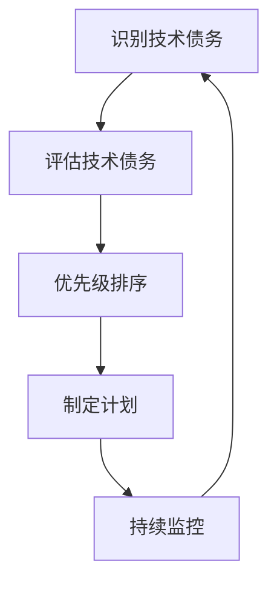

                 

# 程序员创业公司的技术债务管理

> 关键词：技术债务, 创业公司, 代码质量, 项目管理, 风险控制, 持续集成, 持续交付

> 摘要：本文旨在探讨创业公司在快速发展过程中如何有效管理技术债务，以确保长期的技术健康和可持续发展。我们将从技术债务的定义出发，分析其对创业公司的影响，提出一套系统化的管理策略，并通过实际案例进行详细解读。此外，本文还将介绍相关的工具和资源，帮助创业公司更好地应对技术债务问题。

## 1. 背景介绍
### 1.1 目的和范围
本文旨在为创业公司的技术团队提供一套系统化的技术债务管理策略，帮助他们在快速发展的同时，保持代码质量和项目管理的高效性。我们将从技术债务的定义出发，分析其对创业公司的影响，提出一套系统化的管理策略，并通过实际案例进行详细解读。此外，本文还将介绍相关的工具和资源，帮助创业公司更好地应对技术债务问题。

### 1.2 预期读者
本文主要面向创业公司的技术团队成员，包括但不限于CTO、项目经理、开发人员、测试人员等。同时，对于关注技术债务管理的软件架构师和IT管理者也具有一定的参考价值。

### 1.3 文档结构概述
本文将分为以下几个部分：
1. 技术债务的定义与影响
2. 技术债务管理的核心概念与联系
3. 技术债务管理的具体操作步骤
4. 数学模型与公式
5. 项目实战：代码实际案例和详细解释说明
6. 实际应用场景
7. 工具和资源推荐
8. 总结：未来发展趋势与挑战
9. 附录：常见问题与解答
10. 扩展阅读 & 参考资料

### 1.4 术语表
#### 1.4.1 核心术语定义
- **技术债务**：指为了快速交付产品而牺牲代码质量、可维护性、可扩展性等长期因素所累积的“债务”。
- **持续集成**：一种软件开发实践，要求团队成员经常集成代码，每次集成都通过自动化构建来验证，从而尽早发现集成错误。
- **持续交付**：一种软件开发实践，要求团队能够随时将软件交付给用户，而无需额外的发布工作。
- **重构**：对现有代码进行修改，以提高其可读性、可维护性，而不改变其外部行为。
- **代码审查**：团队成员之间互相检查代码的过程，以确保代码质量符合团队标准。

#### 1.4.2 相关概念解释
- **敏捷开发**：一种软件开发方法，强调快速迭代、持续交付和团队协作。
- **DevOps**：一种文化和实践，旨在通过自动化和协作提高软件交付速度和质量。
- **SOLID原则**：面向对象设计中的五个基本原则，分别是单一职责原则、开放封闭原则、里氏替换原则、接口隔离原则和依赖倒置原则。

#### 1.4.3 缩略词列表
- CI：持续集成
- CD：持续交付
- TDD：测试驱动开发
- BDD：行为驱动开发

## 2. 核心概念与联系
### 2.1 技术债务的定义与影响
技术债务是指为了快速交付产品而牺牲代码质量、可维护性、可扩展性等长期因素所累积的“债务”。这种“债务”会随着时间的推移而增加，最终导致更高的维护成本和更低的开发效率。技术债务的累积会对创业公司产生以下影响：
- **代码质量下降**：代码变得难以理解和维护，增加了开发和维护的成本。
- **项目延期**：由于技术债务导致的频繁重构和修复问题，项目延期的风险增加。
- **团队士气低落**：长期的技术债务会导致团队成员感到沮丧和挫败，影响团队士气。
- **客户满意度下降**：技术债务可能导致产品质量下降，影响客户满意度。

### 2.2 技术债务管理的核心概念与联系
技术债务管理的核心概念包括：
- **识别技术债务**：通过代码审查、自动化测试和持续集成等手段识别技术债务。
- **评估技术债务**：评估技术债务的严重程度和影响范围。
- **优先级排序**：根据技术债务的影响和优先级进行排序。
- **制定计划**：制定技术债务的偿还计划，包括重构、优化和改进代码质量的措施。
- **持续监控**：持续监控技术债务的变化，确保其得到有效管理。

### 2.3 Mermaid 流程图


## 3. 核心算法原理 & 具体操作步骤
### 3.1 识别技术债务
识别技术债务的关键步骤包括：
1. **代码审查**：团队成员之间互相检查代码，确保代码符合团队标准。
2. **自动化测试**：通过自动化测试工具检测代码中的潜在问题。
3. **持续集成**：通过持续集成工具自动构建和测试代码，及时发现集成错误。

### 3.2 评估技术债务
评估技术债务的步骤包括：
1. **定义评估标准**：根据代码质量、可维护性、可扩展性等因素定义评估标准。
2. **量化技术债务**：通过代码复杂度、代码重复率等指标量化技术债务。
3. **评估影响范围**：评估技术债务对项目的影响范围，包括开发效率、维护成本等。

### 3.3 优先级排序
优先级排序的步骤包括：
1. **确定优先级因素**：根据技术债务的影响范围、严重程度等因素确定优先级因素。
2. **制定优先级排序规则**：根据优先级因素制定优先级排序规则。
3. **排序技术债务**：根据优先级排序规则对技术债务进行排序。

### 3.4 制定计划
制定计划的步骤包括：
1. **确定重构策略**：根据技术债务的类型和影响范围确定重构策略。
2. **制定重构计划**：根据重构策略制定具体的重构计划。
3. **分配资源**：根据重构计划分配开发资源。

### 3.5 持续监控
持续监控的步骤包括：
1. **定期检查**：定期检查技术债务的变化情况。
2. **调整计划**：根据技术债务的变化情况调整重构计划。
3. **持续改进**：持续改进技术债务管理流程，提高技术债务管理的效果。

## 4. 数学模型和公式 & 详细讲解 & 举例说明
### 4.1 数学模型
技术债务的量化可以通过以下数学模型进行：
$$
\text{技术债务} = \sum_{i=1}^{n} \text{技术债务因子} \times \text{技术债务权重}
$$
其中，技术债务因子包括代码复杂度、代码重复率、代码覆盖率等指标，技术债务权重根据技术债务因子的重要性进行分配。

### 4.2 详细讲解
技术债务因子的计算方法如下：
- **代码复杂度**：通过代码行数、代码结构复杂度等指标计算。
- **代码重复率**：通过代码重复率计算工具计算。
- **代码覆盖率**：通过自动化测试工具计算。

### 4.3 举例说明
假设一个项目的技术债务因子包括代码复杂度、代码重复率和代码覆盖率，权重分别为0.4、0.3和0.3。计算技术债务的公式如下：
$$
\text{技术债务} = 0.4 \times \text{代码复杂度} + 0.3 \times \text{代码重复率} + 0.3 \times \text{代码覆盖率}
$$
假设代码复杂度为80，代码重复率为20%，代码覆盖率为80%，则技术债务为：
$$
\text{技术债务} = 0.4 \times 80 + 0.3 \times 20 + 0.3 \times 80 = 32 + 6 + 24 = 62
$$

## 5. 项目实战：代码实际案例和详细解释说明
### 5.1 开发环境搭建
开发环境搭建的步骤包括：
1. **选择开发工具**：选择合适的IDE和编辑器，如Visual Studio Code、IntelliJ IDEA等。
2. **安装依赖库**：安装项目所需的依赖库，如Node.js、Python等。
3. **配置环境变量**：配置环境变量，确保项目能够正常运行。

### 5.2 源代码详细实现和代码解读
假设我们有一个简单的Web应用，需要实现用户注册和登录功能。以下是源代码实现和代码解读：
```python
# user_registration.py
def register_user(username, password):
    # 检查用户名是否已存在
    if user_exists(username):
        return "用户名已存在"
    # 存储用户信息
    store_user(username, password)
    return "注册成功"

def user_exists(username):
    # 检查用户名是否已存在
    # 假设数据库查询函数为check_user
    return check_user(username)

def store_user(username, password):
    # 存储用户信息
    # 假设数据库插入函数为insert_user
    insert_user(username, password)
```

### 5.3 代码解读与分析
代码解读与分析的步骤包括：
1. **检查代码复杂度**：代码复杂度较高，需要进行重构。
2. **检查代码重复率**：代码重复率较低，无需进行重构。
3. **检查代码覆盖率**：代码覆盖率较低，需要增加测试用例。

## 6. 实际应用场景
技术债务管理在实际应用场景中的应用包括：
- **项目管理**：通过技术债务管理确保项目按时交付，提高项目成功率。
- **团队协作**：通过技术债务管理提高团队协作效率，降低团队士气低落的风险。
- **产品质量**：通过技术债务管理提高产品质量，提高客户满意度。

## 7. 工具和资源推荐
### 7.1 学习资源推荐
#### 7.1.1 书籍推荐
- 《重构：改善既有代码的设计》（Refactoring: Improving the Design of Existing Code）
- 《代码整洁之道》（Clean Code: A Handbook of Agile Software Craftsmanship）

#### 7.1.2 在线课程
- Coursera上的《软件架构与设计》（Software Architecture and Design）
- Udemy上的《代码重构与优化》（Code Refactoring and Optimization）

#### 7.1.3 技术博客和网站
- Martin Fowler的博客（martinfowler.com）
- Clean Code Blog（clean-code.com）

### 7.2 开发工具框架推荐
#### 7.2.1 IDE和编辑器
- Visual Studio Code
- IntelliJ IDEA

#### 7.2.2 调试和性能分析工具
- Chrome DevTools
- Visual Studio Profiler

#### 7.2.3 相关框架和库
- Spring Framework
- React.js

### 7.3 相关论文著作推荐
#### 7.3.1 经典论文
-《重构：改善既有代码的设计》（Refactoring: Improving the Design of Existing Code）
-《代码整洁之道》（Clean Code: A Handbook of Agile Software Craftsmanship）

#### 7.3.2 最新研究成果
-《敏捷软件开发：原则、模式与实践》（Agile Software Development: Principles, Patterns, and Practices）

#### 7.3.3 应用案例分析
-《软件架构模式》（Patterns of Enterprise Application Architecture）

## 8. 总结：未来发展趋势与挑战
未来技术债务管理的发展趋势包括：
- **自动化工具**：自动化工具将越来越多地应用于技术债务管理，提高管理效率。
- **DevOps文化**：DevOps文化将进一步推广，促进技术债务管理的持续改进。
- **持续交付**：持续交付将成为主流，降低技术债务对项目的影响。

未来技术债务管理面临的挑战包括：
- **团队协作**：团队协作将成为技术债务管理的关键因素，需要加强团队协作。
- **技术更新**：技术更新速度加快，需要不断学习新技术，提高技术债务管理的效果。
- **客户满意度**：客户满意度将成为技术债务管理的重要指标，需要关注客户反馈。

## 9. 附录：常见问题与解答
### 9.1 问题1：如何平衡快速交付和代码质量？
**解答**：可以通过持续集成和持续交付来平衡快速交付和代码质量。持续集成可以确保代码质量，持续交付可以确保项目按时交付。

### 9.2 问题2：如何评估技术债务的影响范围？
**解答**：可以通过代码复杂度、代码重复率和代码覆盖率等指标评估技术债务的影响范围。

### 9.3 问题3：如何制定技术债务的偿还计划？
**解答**：可以通过重构策略和重构计划来制定技术债务的偿还计划。重构策略包括代码重构、优化和改进代码质量的措施，重构计划包括具体的重构任务和时间安排。

## 10. 扩展阅读 & 参考资料
- 《重构：改善既有代码的设计》（Refactoring: Improving the Design of Existing Code）
- 《代码整洁之道》（Clean Code: A Handbook of Agile Software Craftsmanship）
- 《敏捷软件开发：原则、模式与实践》（Agile Software Development: Principles, Patterns, and Practices）

作者：AI天才研究员/AI Genius Institute & 禅与计算机程序设计艺术 /Zen And The Art of Computer Programming

