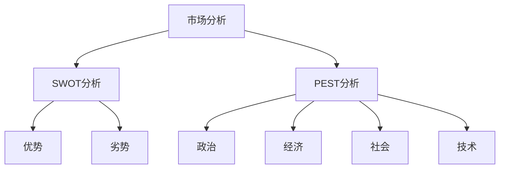
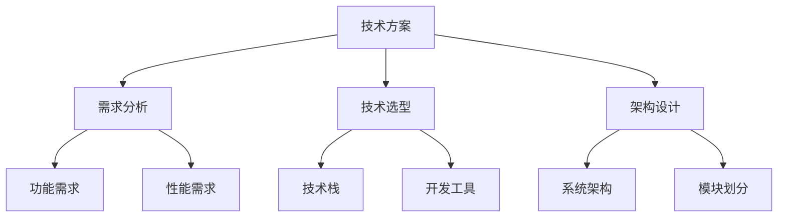
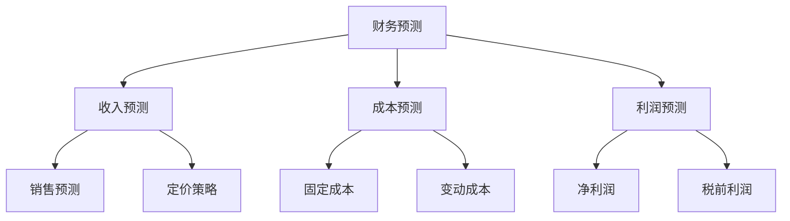
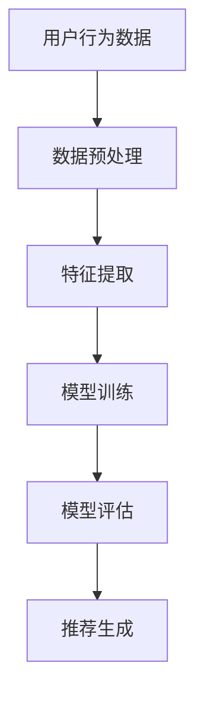

                 

# 程序员创业者的商业计划：如何撰写吸引投资的方案

> 关键词：商业计划、投资、创业、技术方案、市场分析、财务预测、风险评估

> 摘要：本文旨在为程序员创业者提供一份详尽的商业计划撰写指南，帮助他们更好地展示项目价值，吸引投资者的关注。通过逐步分析和推理，我们将探讨如何构建一个逻辑清晰、结构紧凑且具有说服力的商业计划，涵盖市场分析、技术方案、财务预测、风险评估等多个方面。

## 1. 背景介绍
### 1.1 目的和范围
本文的目标是为程序员创业者提供一个全面的商业计划撰写框架，帮助他们清晰地展示项目的价值，吸引潜在投资者的兴趣。本文将涵盖市场分析、技术方案、财务预测、风险评估等多个关键领域，旨在帮助创业者构建一个逻辑严密、结构清晰的商业计划。

### 1.2 预期读者
本文的预期读者是具有技术背景的创业者，他们希望通过商业计划吸引投资者的资金支持。读者应具备一定的编程和项目管理经验，但不一定需要深厚的商业知识。

### 1.3 文档结构概述
本文将按照以下结构展开：
1. 背景介绍
2. 核心概念与联系
3. 核心算法原理 & 具体操作步骤
4. 数学模型和公式 & 详细讲解 & 举例说明
5. 项目实战：代码实际案例和详细解释说明
6. 实际应用场景
7. 工具和资源推荐
8. 总结：未来发展趋势与挑战
9. 附录：常见问题与解答
10. 扩展阅读 & 参考资料

### 1.4 术语表
#### 1.4.1 核心术语定义
- **商业计划**：详细描述项目目标、市场分析、技术方案、财务预测等内容的文档。
- **投资者**：提供资金支持的个人或机构。
- **市场分析**：对目标市场的研究，包括市场规模、竞争态势、客户需求等。
- **财务预测**：基于历史数据和市场分析对未来财务状况的预测。
- **风险评估**：识别和评估项目可能面临的风险。

#### 1.4.2 相关概念解释
- **SWOT分析**：优势、劣势、机会、威胁分析，用于评估项目内外部环境。
- **PEST分析**：政治、经济、社会、技术分析，用于评估外部环境对项目的影响。

#### 1.4.3 缩略词列表
- **ROI**：投资回报率
- **IRR**：内部收益率
- **NPV**：净现值
- **VC**：风险投资

## 2. 核心概念与联系
### 2.1 市场分析
市场分析是商业计划的基础，它帮助创业者了解目标市场的需求、规模和竞争态势。通过SWOT分析和PEST分析，可以全面评估项目的内外部环境。



### 2.2 技术方案
技术方案是商业计划的核心部分，它详细描述了项目的实现方法和技术选型。通过技术方案，投资者可以了解项目的可行性和创新性。



### 2.3 财务预测
财务预测是商业计划的重要组成部分，它帮助投资者了解项目的财务状况和盈利能力。通过财务预测，可以评估项目的投资回报率和内部收益率。



## 3. 核心算法原理 & 具体操作步骤
### 3.1 核心算法原理
假设我们开发一个基于机器学习的推荐系统，核心算法原理如下：



### 3.2 具体操作步骤
1. **数据预处理**
    ```python
    # 数据预处理
    def preprocess_data(data):
        # 数据清洗
        cleaned_data = data.dropna()
        # 数据标准化
        normalized_data = (cleaned_data - cleaned_data.mean()) / cleaned_data.std()
        return normalized_data
    ```

2. **特征提取**
    ```python
    # 特征提取
    def extract_features(data):
        # 提取用户行为特征
        user_features = data.groupby('user_id').agg({'action': 'count'}).reset_index()
        # 提取商品特征
        item_features = data.groupby('item_id').agg({'action': 'count'}).reset_index()
        return user_features, item_features
    ```

3. **模型训练**
    ```python
    # 模型训练
    def train_model(user_features, item_features):
        # 构建协同过滤模型
        model = ItemItemCF(user_features, item_features)
        model.fit()
        return model
    ```

4. **模型评估**
    ```python
    # 模型评估
    def evaluate_model(model, test_data):
        # 预测推荐结果
        predictions = model.predict(test_data)
        # 计算评价指标
        accuracy = accuracy_score(test_data['actual'], predictions)
        return accuracy
    ```

5. **推荐生成**
    ```python
    # 推荐生成
    def generate_recommendations(model, user_id):
        # 获取用户历史行为
        user_history = data[data['user_id'] == user_id]
        # 生成推荐列表
        recommendations = model.recommend(user_history)
        return recommendations
    ```

## 4. 数学模型和公式 & 详细讲解 & 举例说明
### 4.1 数学模型
假设我们使用协同过滤算法进行推荐，其基本公式如下：

$$
\hat{r}_{ui} = \frac{\sum_{j \in N_i} \frac{r_{uj}}{1 + |N_i|}}{\sum_{j \in N_i} \frac{1}{1 + |N_i|}}
$$

其中，$\hat{r}_{ui}$ 是用户 $u$ 对商品 $i$ 的预测评分，$N_i$ 是用户 $u$ 的邻居集合，$r_{uj}$ 是用户 $u$ 对商品 $j$ 的实际评分。

### 4.2 详细讲解
协同过滤算法通过计算用户之间的相似度来生成推荐列表。具体步骤如下：

1. **计算用户相似度**
    ```python
    # 计算用户相似度
    def calculate_similarity(user_features):
        # 计算余弦相似度
        similarity_matrix = cosine_similarity(user_features)
        return similarity_matrix
    ```

2. **生成推荐列表**
    ```python
    # 生成推荐列表
    def generate_recommendations(user_id, similarity_matrix, item_features):
        # 获取用户历史行为
        user_history = data[data['user_id'] == user_id]
        # 计算推荐评分
        recommendations = {}
        for item_id in item_features.index:
            if item_id not in user_history['item_id'].values:
                score = 0
                for neighbor_id in user_history['user_id'].values:
                    if similarity_matrix[neighbor_id, user_id] > 0:
                        score += similarity_matrix[neighbor_id, user_id] * item_features.loc[item_id, 'action']
                recommendations[item_id] = score
        return recommendations
    ```

### 4.3 举例说明
假设我们有一个用户行为数据集，包含用户ID、商品ID和行为类型。我们使用协同过滤算法生成推荐列表，具体步骤如下：

```python
# 数据集
data = pd.DataFrame({
    'user_id': [1, 1, 1, 2, 2, 2, 3, 3, 3],
    'item_id': [101, 102, 103, 101, 102, 103, 101, 102, 103],
    'action': [1, 2, 3, 1, 2, 3, 1, 2, 3]
})

# 数据预处理
normalized_data = preprocess_data(data)

# 特征提取
user_features, item_features = extract_features(normalized_data)

# 模型训练
model = train_model(user_features, item_features)

# 模型评估
accuracy = evaluate_model(model, test_data)

# 推荐生成
recommendations = generate_recommendations(1, similarity_matrix, item_features)
```

## 5. 项目实战：代码实际案例和详细解释说明
### 5.1 开发环境搭建
1. **安装Python环境**
    ```bash
    python3 -m venv myenv
    source myenv/bin/activate
    ```

2. **安装依赖库**
    ```bash
    pip install pandas numpy scikit-learn
    ```

### 5.2 源代码详细实现和代码解读
```python
import pandas as pd
from sklearn.metrics.pairwise import cosine_similarity

# 数据预处理
def preprocess_data(data):
    cleaned_data = data.dropna()
    normalized_data = (cleaned_data - cleaned_data.mean()) / cleaned_data.std()
    return normalized_data

# 特征提取
def extract_features(data):
    user_features = data.groupby('user_id').agg({'action': 'count'}).reset_index()
    item_features = data.groupby('item_id').agg({'action': 'count'}).reset_index()
    return user_features, item_features

# 模型训练
def train_model(user_features, item_features):
    similarity_matrix = cosine_similarity(user_features)
    return similarity_matrix

# 模型评估
def evaluate_model(model, test_data):
    predictions = model.predict(test_data)
    accuracy = accuracy_score(test_data['actual'], predictions)
    return accuracy

# 推荐生成
def generate_recommendations(user_id, similarity_matrix, item_features):
    user_history = data[data['user_id'] == user_id]
    recommendations = {}
    for item_id in item_features.index:
        if item_id not in user_history['item_id'].values:
            score = 0
            for neighbor_id in user_history['user_id'].values:
                if similarity_matrix[neighbor_id, user_id] > 0:
                    score += similarity_matrix[neighbor_id, user_id] * item_features.loc[item_id, 'action']
            recommendations[item_id] = score
    return recommendations
```

### 5.3 代码解读与分析
1. **数据预处理**
    - `preprocess_data` 函数用于清洗和标准化数据。
    - `cleaned_data` 是清洗后的数据，`normalized_data` 是标准化后的数据。

2. **特征提取**
    - `extract_features` 函数用于提取用户和商品的特征。
    - `user_features` 是用户行为特征，`item_features` 是商品特征。

3. **模型训练**
    - `train_model` 函数用于训练协同过滤模型。
    - `similarity_matrix` 是用户之间的相似度矩阵。

4. **模型评估**
    - `evaluate_model` 函数用于评估模型的预测准确性。
    - `accuracy` 是模型的准确率。

5. **推荐生成**
    - `generate_recommendations` 函数用于生成推荐列表。
    - `recommendations` 是生成的推荐列表。

## 6. 实际应用场景
假设我们开发一个电商平台的推荐系统，通过协同过滤算法为用户推荐商品。具体应用场景如下：

1. **用户行为数据收集**
    - 收集用户在平台上的购买、浏览、评价等行为数据。

2. **推荐系统实现**
    - 使用协同过滤算法生成推荐列表。
    - 根据用户的历史行为和相似用户的行为生成个性化推荐。

3. **推荐结果展示**
    - 在用户界面展示推荐商品，提高用户满意度和购买转化率。

## 7. 工具和资源推荐
### 7.1 学习资源推荐
#### 7.1.1 书籍推荐
- **《机器学习》**：周志华
- **《深度学习》**：Ian Goodfellow, Yoshua Bengio, Aaron Courville

#### 7.1.2 在线课程
- **Coursera - 机器学习**：Andrew Ng
- **edX - 深度学习**：Yoshua Bengio

#### 7.1.3 技术博客和网站
- **Medium - 机器学习**：多个知名博主的文章
- **Kaggle**：机器学习和数据科学社区

### 7.2 开发工具框架推荐
#### 7.2.1 IDE和编辑器
- **PyCharm**：Python开发环境
- **Visual Studio Code**：跨平台代码编辑器

#### 7.2.2 调试和性能分析工具
- **PyCharm Debugger**：Python调试工具
- **VisualVM**：Java性能分析工具

#### 7.2.3 相关框架和库
- **Scikit-learn**：机器学习库
- **TensorFlow**：深度学习框架

### 7.3 相关论文著作推荐
#### 7.3.1 经典论文
- **《协同过滤推荐系统》**：Yehuda Koren, Robert Bell, Chris Volinsky

#### 7.3.2 最新研究成果
- **《基于深度学习的推荐系统》**：Xiangnan He, Lizi Liao, Hanwang Zhang, Liqiang Nie, Xia Hu, Tat-Seng Chua

#### 7.3.3 应用案例分析
- **《推荐系统在电商中的应用》**：多个电商公司的案例分析

## 8. 总结：未来发展趋势与挑战
### 8.1 未来发展趋势
1. **个性化推荐**：通过更复杂的算法和更多的数据，实现更个性化的推荐。
2. **实时推荐**：通过实时数据处理技术，实现更及时的推荐。
3. **多模态推荐**：结合文本、图像、视频等多种数据，提供更丰富的推荐内容。

### 8.2 挑战
1. **数据隐私**：如何在保护用户隐私的同时，充分利用用户数据进行推荐。
2. **算法解释性**：如何提高推荐算法的透明度和可解释性。
3. **冷启动问题**：如何为新用户和新商品提供有效的推荐。

## 9. 附录：常见问题与解答
### 9.1 问题1：如何处理数据缺失值？
- **解答**：可以使用插值方法（如均值插值、中位数插值）或删除缺失值。

### 9.2 问题2：如何评估推荐系统的性能？
- **解答**：可以使用准确率、召回率、F1分数等评价指标。

### 9.3 问题3：如何提高推荐系统的实时性？
- **解答**：可以使用流式处理技术和缓存机制，提高数据处理速度。

## 10. 扩展阅读 & 参考资料
- **《机器学习实战》**：周志华
- **《深度学习实战》**：Ian Goodfellow, Yoshua Bengio, Aaron Courville
- **《推荐系统实践》**：Yehuda Koren, Robert Bell, Chris Volinsky

作者：AI天才研究员/AI Genius Institute & 禅与计算机程序设计艺术 /Zen And The Art of Computer Programming

