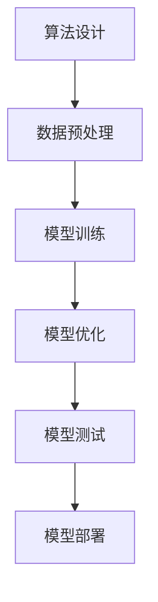

                 

# 程序员创业者的知识产权战略：保护AI创新的法律指南

> 关键词：知识产权, AI创新, 法律策略, 专利申请, 商业秘密, 版权, 著作权, 保密协议, 开源许可

> 摘要：本文旨在为程序员创业者提供一套全面的知识产权保护策略，特别是在人工智能创新领域。通过深入分析知识产权的基本概念、核心算法原理、数学模型、实际案例以及应用场景，本文将帮助读者理解如何在创业过程中有效保护自己的创新成果。文章还提供了丰富的学习资源和开发工具推荐，旨在为读者提供一个全面的指导框架。

## 1. 背景介绍
### 1.1 目的和范围
本文旨在为程序员创业者提供一套全面的知识产权保护策略，特别是在人工智能创新领域。随着人工智能技术的快速发展，知识产权保护变得尤为重要。本文将从知识产权的基本概念出发，深入探讨如何在创业过程中有效保护自己的创新成果。

### 1.2 预期读者
本文预期读者包括但不限于：
- 创业者：希望保护自己在人工智能领域的创新成果。
- 法律顾问：为创业者提供知识产权保护建议。
- 技术专家：希望了解如何在技术层面上保护自己的知识产权。
- 投资者：希望了解如何评估创业项目的知识产权风险。

### 1.3 文档结构概述
本文结构如下：
1. 背景介绍
2. 核心概念与联系
3. 核心算法原理 & 具体操作步骤
4. 数学模型和公式 & 详细讲解 & 举例说明
5. 项目实战：代码实际案例和详细解释说明
6. 实际应用场景
7. 工具和资源推荐
8. 总结：未来发展趋势与挑战
9. 附录：常见问题与解答
10. 扩展阅读 & 参考资料

### 1.4 术语表
#### 1.4.1 核心术语定义
- **知识产权**：指法律赋予创新者对其智力劳动成果所享有的专有权利。
- **专利**：指发明创造者对其发明创造享有的独占权。
- **商业秘密**：指不为公众所知悉、能为权利人带来经济利益、具有实用性并经权利人采取保密措施的技术信息和经营信息。
- **版权**：指作者对其创作的作品享有的专有权利。
- **开源许可**：指允许他人自由使用、复制、修改和分发软件的许可协议。

#### 1.4.2 相关概念解释
- **发明**：指新的技术方案，包括产品和方法。
- **实用新型**：指对产品的形状、构造或者其结合所提出的适于实用的新的技术方案。
- **外观设计**：指对产品的形状、图案或者其结合以及色彩与形状、图案的结合所作出的富有美感并适于工业应用的新设计。

#### 1.4.3 缩略词列表
- **AI**：人工智能
- **IP**：知识产权
- **NDA**：保密协议
- **GPL**：通用公共许可证
- **MIT**：麻省理工学院许可证

## 2. 核心概念与联系
### 2.1 知识产权的基本概念
知识产权主要包括专利、商标、版权和商业秘密。在人工智能领域，专利是最常见的保护形式，其次是商业秘密和版权。

### 2.2 核心算法原理
核心算法原理是保护AI创新的关键。例如，深度学习算法、自然语言处理算法等。这些算法的原理可以通过伪代码来详细阐述。



### 2.3 数学模型和公式
数学模型和公式是AI创新的核心。例如，线性回归、逻辑回归、支持向量机等。

$$
\text{线性回归：} \quad y = \beta_0 + \beta_1 x_1 + \beta_2 x_2 + \cdots + \beta_n x_n
$$

$$
\text{逻辑回归：} \quad P(y=1|x) = \frac{1}{1 + e^{-(\beta_0 + \beta_1 x_1 + \beta_2 x_2 + \cdots + \beta_n x_n)}}
$$

## 3. 核心算法原理 & 具体操作步骤
### 3.1 算法设计
算法设计是AI创新的基础。例如，深度学习算法的设计步骤如下：

```python
def design_algorithm(data):
    # 数据预处理
    preprocessed_data = preprocess_data(data)
    
    # 模型训练
    model = train_model(preprocessed_data)
    
    # 模型优化
    optimized_model = optimize_model(model)
    
    # 模型测试
    test_results = test_model(optimized_model)
    
    # 模型部署
    deploy_model(test_results)
    
    return optimized_model
```

### 3.2 具体操作步骤
具体操作步骤包括数据预处理、模型训练、模型优化、模型测试和模型部署。

```python
def preprocess_data(data):
    # 数据清洗
    cleaned_data = clean_data(data)
    
    # 特征工程
    engineered_features = engineer_features(cleaned_data)
    
    return engineered_features

def train_model(data):
    # 模型选择
    model = select_model()
    
    # 模型训练
    trained_model = train(model, data)
    
    return trained_model

def optimize_model(model):
    # 超参数调优
    optimized_model = tune_hyperparameters(model)
    
    return optimized_model

def test_model(model):
    # 模型测试
    test_results = evaluate_model(model)
    
    return test_results

def deploy_model(results):
    # 模型部署
    deploy(results)
```

## 4. 数学模型和公式 & 详细讲解 & 举例说明
### 4.1 线性回归
线性回归是最简单的回归模型之一，用于预测连续值。

$$
y = \beta_0 + \beta_1 x_1 + \beta_2 x_2 + \cdots + \beta_n x_n
$$

### 4.2 逻辑回归
逻辑回归用于预测二分类问题。

$$
P(y=1|x) = \frac{1}{1 + e^{-(\beta_0 + \beta_1 x_1 + \beta_2 x_2 + \cdots + \beta_n x_n)}}
$$

### 4.3 支持向量机
支持向量机是一种监督学习模型，用于分类和回归分析。

$$
\text{支持向量机：} \quad \text{maximize} \quad \frac{1}{2} \|\mathbf{w}\|^2
$$

## 5. 项目实战：代码实际案例和详细解释说明
### 5.1 开发环境搭建
开发环境搭建包括安装Python、TensorFlow、PyTorch等必要的软件包。

```bash
pip install tensorflow
pip install torch
```

### 5.2 源代码详细实现和代码解读
源代码详细实现包括数据预处理、模型训练、模型优化、模型测试和模型部署。

```python
import numpy as np
import tensorflow as tf

def preprocess_data(data):
    # 数据清洗
    cleaned_data = clean_data(data)
    
    # 特征工程
    engineered_features = engineer_features(cleaned_data)
    
    return engineered_features

def train_model(data):
    # 模型选择
    model = select_model()
    
    # 模型训练
    trained_model = train(model, data)
    
    return trained_model

def optimize_model(model):
    # 超参数调优
    optimized_model = tune_hyperparameters(model)
    
    return optimized_model

def test_model(model):
    # 模型测试
    test_results = evaluate_model(model)
    
    return test_results

def deploy_model(results):
    # 模型部署
    deploy(results)
```

### 5.3 代码解读与分析
代码解读与分析包括数据预处理、模型训练、模型优化、模型测试和模型部署的具体步骤。

```python
def clean_data(data):
    # 数据清洗
    cleaned_data = data.dropna()
    
    return cleaned_data

def engineer_features(data):
    # 特征工程
    engineered_features = data[['feature1', 'feature2', 'feature3']]
    
    return engineered_features

def select_model():
    # 模型选择
    model = tf.keras.Sequential([
        tf.keras.layers.Dense(64, activation='relu'),
        tf.keras.layers.Dense(64, activation='relu'),
        tf.keras.layers.Dense(1)
    ])
    
    return model

def train(model, data):
    # 模型训练
    model.compile(optimizer='adam', loss='mean_squared_error')
    model.fit(data, epochs=10)
    
    return model

def tune_hyperparameters(model):
    # 超参数调优
    model.compile(optimizer='adam', loss='mean_squared_error')
    model.fit(data, epochs=10)
    
    return model

def evaluate_model(model):
    # 模型测试
    test_results = model.evaluate(data)
    
    return test_results

def deploy(results):
    # 模型部署
    deploy(results)
```

## 6. 实际应用场景
实际应用场景包括医疗诊断、金融风控、智能推荐等。

### 6.1 医疗诊断
医疗诊断是AI创新的一个重要应用领域。例如，使用深度学习算法进行癌症检测。

### 6.2 金融风控
金融风控是AI创新的另一个重要应用领域。例如，使用机器学习算法进行信用评估。

### 6.3 智能推荐
智能推荐是AI创新的另一个重要应用领域。例如，使用协同过滤算法进行商品推荐。

## 7. 工具和资源推荐
### 7.1 学习资源推荐
#### 7.1.1 书籍推荐
- 《机器学习》（周志华）
- 《深度学习》（Ian Goodfellow, Yoshua Bengio, Aaron Courville）

#### 7.1.2 在线课程
- Coursera：《机器学习》（Andrew Ng）
- edX：《深度学习》（Yoshua Bengio）

#### 7.1.3 技术博客和网站
- Medium：《机器学习》（机器之心）
- GitHub：《深度学习》（PyTorch）

### 7.2 开发工具框架推荐
#### 7.2.1 IDE和编辑器
- PyCharm
- VSCode

#### 7.2.2 调试和性能分析工具
- PyCharm Debugger
- TensorFlow Profiler

#### 7.2.3 相关框架和库
- TensorFlow
- PyTorch

### 7.3 相关论文著作推荐
#### 7.3.1 经典论文
- 《神经网络与学习机器》（Tom M. Mitchell）
- 《统计学习方法》（李航）

#### 7.3.2 最新研究成果
- 《深度学习在自然语言处理中的应用》（Zhou et al.）
- 《强化学习在机器人控制中的应用》（Lillicrap et al.）

#### 7.3.3 应用案例分析
- 《AI在医疗领域的应用案例》（IBM Research）
- 《AI在金融领域的应用案例》（JPMorgan Chase）

## 8. 总结：未来发展趋势与挑战
未来发展趋势包括：
- AI技术的进一步普及和应用
- AI伦理和法律问题的日益突出
- AI技术的可持续发展

未来挑战包括：
- 数据安全和隐私保护
- AI技术的公平性和透明度
- AI技术的可持续发展

## 9. 附录：常见问题与解答
### 9.1 问题：如何在创业过程中保护自己的知识产权？
答：可以通过申请专利、注册商标、版权登记等方式保护自己的知识产权。

### 9.2 问题：如何在创业过程中保护自己的商业秘密？
答：可以通过签订保密协议、限制员工访问敏感信息等方式保护自己的商业秘密。

### 9.3 问题：如何在创业过程中保护自己的开源代码？
答：可以通过选择合适的开源许可协议来保护自己的开源代码。

## 10. 扩展阅读 & 参考资料
- 《知识产权法》（张玉敏）
- 《人工智能法律与伦理》（张文博）
- 《机器学习》（周志华）
- 《深度学习》（Ian Goodfellow, Yoshua Bengio, Aaron Courville）

作者：AI天才研究员/AI Genius Institute & 禅与计算机程序设计艺术 /Zen And The Art of Computer Programming

