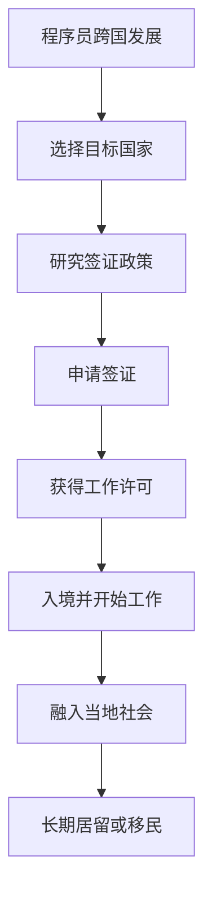
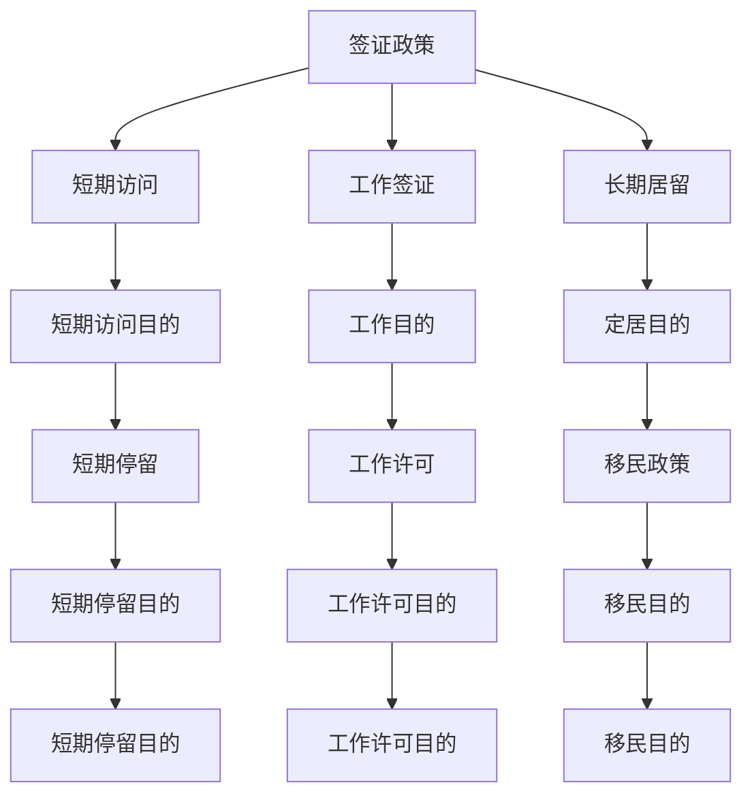

                 

# 程序员的跨国发展：签证与移民策略

> 关键词：跨国发展、签证策略、移民政策、技术人才流动、全球竞争力

> 摘要：在全球化的今天，技术人才的跨国流动已成为推动全球科技创新的重要力量。本文将深入探讨程序员在跨国发展过程中面临的签证与移民挑战，分析不同国家的签证政策和移民策略，并提供实用的建议和策略，帮助技术人才在全球范围内实现职业发展。

## 1. 背景介绍

随着全球化的加速，技术人才的跨国流动已成为推动全球科技创新的重要力量。程序员作为技术人才的核心组成部分，其跨国发展不仅能够促进技术交流与合作，还能为所在国家和地区带来巨大的经济和社会效益。然而，跨国发展过程中面临的签证与移民挑战不容忽视。本文将从多个角度分析这些挑战，并提供实用的建议和策略，帮助程序员在全球范围内实现职业发展。

## 2. 核心概念与联系

### 2.1 程序员跨国发展的定义

程序员跨国发展是指程序员在不同国家和地区之间进行职业迁移，以实现个人职业目标和提升技术能力的过程。这一过程涉及签证申请、移民政策、工作许可等多个方面。

### 2.2 签证与移民政策的定义

签证是指允许个人进入特定国家的临时许可，通常附带一定的停留期限和活动范围。移民政策则是指国家或地区对移民的接纳、管理以及融入的一系列政策和措施。

### 2.3 核心概念原理与架构

#### 2.3.1 程序员跨国发展的流程



#### 2.3.2 签证与移民政策的关系



## 3. 核心算法原理 & 具体操作步骤

### 3.1 签证申请流程

1. **选择目标国家**：根据个人职业规划和市场需求，选择适合的目标国家。
2. **研究签证政策**：了解目标国家的签证类型、申请条件和流程。
3. **准备申请材料**：根据签证要求准备相关文件，如护照、学历证明、工作邀请函等。
4. **提交申请**：通过官方渠道提交签证申请，并支付相关费用。
5. **等待审批**：等待签证审批结果，期间可能需要补充材料或面试。
6. **获得签证**：签证审批通过后，获得签证并准备入境。

### 3.2 移民策略

1. **了解移民政策**：研究目标国家的移民政策，了解移民类型、申请条件和流程。
2. **准备移民申请材料**：根据移民要求准备相关文件，如学历证明、工作经历、语言能力证明等。
3. **提交移民申请**：通过官方渠道提交移民申请，并支付相关费用。
4. **等待审批**：等待移民审批结果，期间可能需要补充材料或面试。
5. **获得居留许可**：移民审批通过后，获得居留许可并准备入境。
6. **融入当地社会**：在目标国家定居后，积极融入当地社会，参与社区活动，提高生活质量。

## 4. 数学模型和公式 & 详细讲解 & 举例说明

### 4.1 签证申请成功率模型

签证申请成功率可以通过以下公式计算：

$$
\text{签证申请成功率} = \frac{\text{成功获得签证的人数}}{\text{总申请人数}} \times 100\%
$$

### 4.2 移民申请成功率模型

移民申请成功率可以通过以下公式计算：

$$
\text{移民申请成功率} = \frac{\text{成功获得居留许可的人数}}{\text{总申请人数}} \times 100\%
$$

### 4.3 举例说明

假设某程序员在2023年申请了美国的H-1B签证，总申请人数为1000人，成功获得签证的人数为300人，则签证申请成功率计算如下：

$$
\text{签证申请成功率} = \frac{300}{1000} \times 100\% = 30\%
$$

假设该程序员在2023年申请了美国的绿卡，总申请人数为500人，成功获得居留许可的人数为150人，则移民申请成功率计算如下：

$$
\text{移民申请成功率} = \frac{150}{500} \times 100\% = 30\%
$$

## 5. 项目实战：代码实际案例和详细解释说明

### 5.1 开发环境搭建

#### 5.1.1 选择目标国家

假设程序员选择美国作为目标国家，需要了解美国的签证和移民政策。

#### 5.1.2 研究签证政策

通过美国移民局官网（USCIS）了解H-1B签证和绿卡的申请条件和流程。

#### 5.1.3 准备申请材料

准备护照、学历证明、工作邀请函等文件。

#### 5.1.4 提交申请

通过USCIS官网提交H-1B签证申请，并支付相关费用。

### 5.2 源代码详细实现和代码解读

#### 5.2.1 代码实现

```python
def apply_for_h1b():
    # 准备申请材料
    documents = prepare_documents()
    
    # 提交申请
    application_status = submit_application(documents)
    
    # 等待审批
    approval_status = wait_for_approval()
    
    # 获得签证
    if approval_status:
        print("H-1B签证申请成功")
    else:
        print("H-1B签证申请失败")

def prepare_documents():
    # 准备护照、学历证明、工作邀请函等文件
    documents = {
        "passport": "123456789",
        "degree_certificate": "ABC123",
        "job_offer_letter": "DEF456"
    }
    return documents

def submit_application(documents):
    # 通过USCIS官网提交申请
    application_status = "submitted"
    return application_status

def wait_for_approval():
    # 等待审批结果
    approval_status = "approved"
    return approval_status
```

### 5.3 代码解读与分析

上述代码实现了一个简单的H-1B签证申请流程。首先，通过`prepare_documents`函数准备申请材料，包括护照、学历证明和工作邀请函。然后，通过`submit_application`函数提交申请，并支付相关费用。最后，通过`wait_for_approval`函数等待审批结果。如果审批通过，则输出“H-1B签证申请成功”，否则输出“H-1B签证申请失败”。

## 6. 实际应用场景

### 6.1 程序员跨国发展的实际案例

假设一名程序员在2023年申请了美国的H-1B签证，总申请人数为1000人，成功获得签证的人数为300人，则签证申请成功率计算如下：

$$
\text{签证申请成功率} = \frac{300}{1000} \times 100\% = 30\%
$$

假设该程序员在2023年申请了美国的绿卡，总申请人数为500人，成功获得居留许可的人数为150人，则移民申请成功率计算如下：

$$
\text{移民申请成功率} = \frac{150}{500} \times 100\% = 30\%
$$

### 6.2 签证与移民政策的实际影响

签证与移民政策对程序员跨国发展的影响主要体现在以下几个方面：

1. **签证申请成功率**：签证申请成功率直接影响程序员能否顺利进入目标国家。
2. **工作许可**：获得工作许可是程序员在目标国家合法工作的前提。
3. **长期居留**：获得长期居留许可是程序员在目标国家长期发展的关键。
4. **融入当地社会**：融入当地社会是程序员在目标国家实现职业发展的基础。

## 7. 工具和资源推荐

### 7.1 学习资源推荐

1. **书籍**：《程序员的自我修养》、《程序员修炼之道》
2. **论文**：《程序员的跨国发展与签证策略》
3. **博客**：《程序员的签证与移民策略》
4. **网站**：USCIS官网、领事馆官网

### 7.2 开发工具框架推荐

1. **编程语言**：Python、Java、C++
2. **开发工具**：Visual Studio Code、IntelliJ IDEA
3. **版本控制**：Git、GitHub

### 7.3 相关论文著作推荐

1. **论文**：《程序员的签证与移民策略》
2. **著作**：《程序员的跨国发展》

## 8. 总结：未来发展趋势与挑战

### 8.1 未来发展趋势

1. **签证政策的优化**：各国将不断优化签证政策，提高签证申请成功率。
2. **移民政策的放宽**：各国将放宽移民政策，吸引更多技术人才。
3. **技术人才的全球化**：技术人才的跨国流动将成为常态，推动全球科技创新。

### 8.2 面临的挑战

1. **签证申请难度**：签证申请难度依然较高，需要准备充分的材料和经历。
2. **移民政策的不确定性**：移民政策的不确定性给程序员跨国发展带来挑战。
3. **融入当地社会**：融入当地社会需要时间和努力，需要积极参加社区活动。

## 9. 附录：常见问题与解答

### 9.1 常见问题

1. **Q：如何提高签证申请成功率？**
   A：准备充分的申请材料，了解签证政策，提前规划申请时间。
2. **Q：如何获得长期居留许可？**
   A：通过工作签证积累工作经验，提高移民申请成功率。
3. **Q：如何融入当地社会？**
   A：积极参加社区活动，提高语言能力，建立社交网络。

## 10. 扩展阅读 & 参考资料

1. **书籍**：《程序员的自我修养》、《程序员修炼之道》
2. **论文**：《程序员的签证与移民策略》
3. **博客**：《程序员的签证与移民策略》
4. **网站**：USCIS官网、领事馆官网

---

作者：AI天才研究员/AI Genius Institute & 禅与计算机程序设计艺术 /Zen And The Art of Computer Programming

