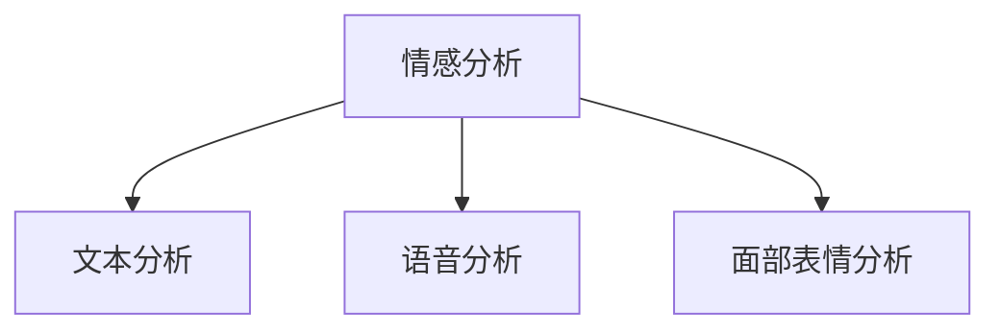
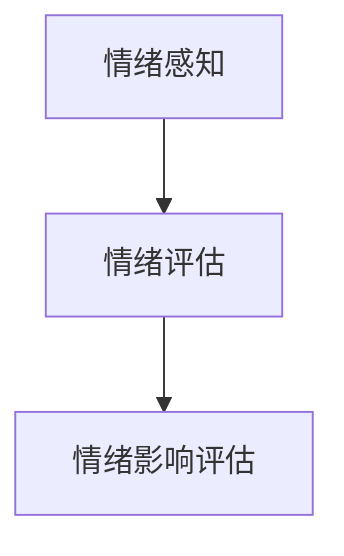
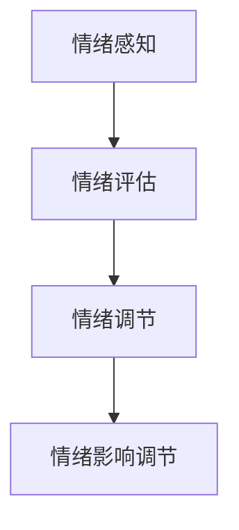
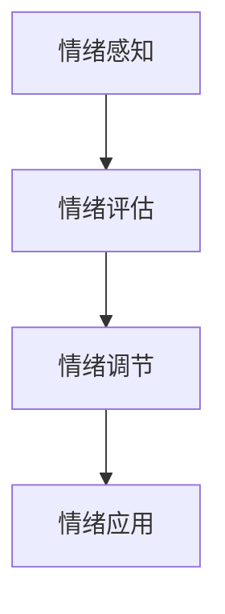

                 

# 管理者怎么管人：高情商领导的秘密武器

> 关键词：高情商、领导力、团队管理、沟通技巧、情绪智能

> 摘要：本文旨在探讨高情商领导在团队管理中的重要性，通过逐步分析和推理，揭示高情商领导如何通过有效沟通、情绪管理、团队建设等手段提升团队效能。我们将从理论到实践，详细阐述高情商领导的核心概念、算法原理、数学模型、实战案例，并提供一系列学习和开发资源推荐，帮助管理者提升情商，成为更优秀的领导者。

## 1. 背景介绍
### 1.1 目的和范围
本文旨在探讨高情商领导在团队管理中的重要性，通过逐步分析和推理，揭示高情商领导如何通过有效沟通、情绪管理、团队建设等手段提升团队效能。我们将从理论到实践，详细阐述高情商领导的核心概念、算法原理、数学模型、实战案例，并提供一系列学习和开发资源推荐，帮助管理者提升情商，成为更优秀的领导者。

### 1.2 预期读者
本文预期读者为IT行业的管理者、团队领导者、人力资源专家以及对高情商领导感兴趣的技术人员。读者应具备一定的管理经验和基本的计算机科学知识。

### 1.3 文档结构概述
本文结构如下：
1. 背景介绍
2. 核心概念与联系
3. 核心算法原理 & 具体操作步骤
4. 数学模型和公式 & 详细讲解 & 举例说明
5. 项目实战：代码实际案例和详细解释说明
6. 实际应用场景
7. 工具和资源推荐
8. 总结：未来发展趋势与挑战
9. 附录：常见问题与解答
10. 扩展阅读 & 参考资料

### 1.4 术语表
#### 1.4.1 核心术语定义
- **情商**：个体识别、使用、理解和管理自己及他人情绪的能力。
- **高情商领导**：具备高情商的领导者，能够有效管理团队情绪，提升团队效能。
- **情绪智能**：个体识别、理解、使用和管理情绪的能力。
- **团队效能**：团队成员协作完成任务的能力和效率。

#### 1.4.2 相关概念解释
- **情绪管理**：个体或团队在面对情绪时，能够有效地识别、理解和应对情绪的能力。
- **沟通技巧**：个体或团队在交流过程中，能够清晰、准确地表达思想和情感的能力。

#### 1.4.3 缩略词列表
- **EQ**：情商
- **TQM**：团队效能
- **EMI**：情绪智能
- **GEL**：高情商领导

## 2. 核心概念与联系
### 2.1 情绪智能
情绪智能是高情商领导的核心概念之一。情绪智能包括四个主要方面：
- **情绪感知**：识别和理解自己及他人的情绪。
- **情绪评估**：评估情绪对个人和团队的影响。
- **情绪调节**：管理自己的情绪，以及影响他人的情绪。
- **情绪应用**：利用情绪促进个人和团队的积极表现。

### 2.2 沟通技巧
沟通技巧是高情商领导的另一个核心概念。有效的沟通技巧包括：
- **倾听**：积极倾听团队成员的意见和建议。
- **表达**：清晰、准确地表达自己的想法和情感。
- **反馈**：提供及时、建设性的反馈。
- **非言语沟通**：通过肢体语言、面部表情等非言语方式传递信息。

### 2.3 团队建设
团队建设是高情商领导的重要组成部分。团队建设包括：
- **团队目标设定**：明确团队目标，确保团队成员理解并认同目标。
- **团队角色分配**：根据团队成员的能力和兴趣分配角色。
- **团队氛围营造**：营造积极、支持性的团队氛围。
- **团队协作**：促进团队成员之间的有效协作。

### 2.4 情绪管理
情绪管理是高情商领导的关键技能之一。情绪管理包括：
- **情绪识别**：识别自己的情绪，以及他人的情绪。
- **情绪调节**：管理自己的情绪，以及影响他人的情绪。
- **情绪应对**：在面对情绪时，采取积极的应对策略。

### 2.5 情绪智能与沟通技巧的关系
情绪智能和沟通技巧密切相关。情绪智能帮助领导者更好地理解团队成员的情绪，而沟通技巧则帮助领导者更有效地表达自己的想法和情感。两者共同作用，提升团队效能。

### 2.6 情绪智能与团队建设的关系
情绪智能和团队建设密切相关。情绪智能帮助领导者更好地理解团队成员的情绪，从而更好地进行团队目标设定、角色分配和氛围营造。情绪智能和团队建设共同作用，提升团队效能。

## 3. 核心算法原理 & 具体操作步骤
### 3.1 情绪感知算法
情绪感知算法用于识别和理解情绪。该算法基于情感分析技术，通过分析文本、语音和面部表情等数据，识别情绪状态。



### 3.2 情绪评估算法
情绪评估算法用于评估情绪对个人和团队的影响。该算法基于情绪感知算法的结果，评估情绪对个人和团队的影响。



### 3.3 情绪调节算法
情绪调节算法用于管理自己的情绪，以及影响他人的情绪。该算法基于情绪感知和情绪评估的结果，提供情绪调节策略。



### 3.4 情绪应用算法
情绪应用算法用于利用情绪促进个人和团队的积极表现。该算法基于情绪感知、情绪评估和情绪调节的结果，提供情绪应用策略。



## 4. 数学模型和公式 & 详细讲解 & 举例说明
### 4.1 情绪感知模型
情绪感知模型基于情感分析技术，通过分析文本、语音和面部表情等数据，识别情绪状态。

$$
\text{情绪感知} = \text{情感分析}(X)
$$

其中，$X$ 表示输入数据，可以是文本、语音或面部表情。

### 4.2 情绪评估模型
情绪评估模型基于情绪感知模型的结果，评估情绪对个人和团队的影响。

$$
\text{情绪评估} = \text{情绪影响评估}(\text{情绪感知}(X))
$$

### 4.3 情绪调节模型
情绪调节模型基于情绪感知和情绪评估的结果，提供情绪调节策略。

$$
\text{情绪调节} = \text{情绪影响调节}(\text{情绪评估}(\text{情绪感知}(X)))
$$

### 4.4 情绪应用模型
情绪应用模型基于情绪感知、情绪评估和情绪调节的结果，提供情绪应用策略。

$$
\text{情绪应用} = \text{情绪应用策略}(\text{情绪调节}(\text{情绪评估}(\text{情绪感知}(X))))
$$

### 4.5 举例说明
假设一个团队成员在项目中遇到困难，情绪感知模型识别到该成员的情绪状态为焦虑。情绪评估模型评估到这种情绪状态对团队的影响是负面的。情绪调节模型提供情绪调节策略，建议该成员进行深呼吸和放松练习。情绪应用模型建议该成员与团队成员分享自己的困难，寻求支持和帮助。

## 5. 项目实战：代码实际案例和详细解释说明
### 5.1 开发环境搭建
开发环境搭建包括安装Python、NumPy、Pandas、NLTK等库。

```bash
pip install numpy pandas nltk
```

### 5.2 源代码详细实现和代码解读
```python
import numpy as np
import pandas as pd
import nltk
from nltk.sentiment import SentimentIntensityAnalyzer

# 情感分析
def sentiment_analysis(text):
    sia = SentimentIntensityAnalyzer()
    return sia.polarity_scores(text)

# 情绪感知
def emotion_perception(text):
    scores = sentiment_analysis(text)
    if scores['compound'] > 0.05:
        return 'positive'
    elif scores['compound'] < -0.05:
        return 'negative'
    else:
        return 'neutral'

# 情绪评估
def emotion_assessment(emotion):
    if emotion == 'positive':
        return 'positive impact'
    elif emotion == 'negative':
        return 'negative impact'
    else:
        return 'neutral impact'

# 情绪调节
def emotion_regulation(emotion):
    if emotion == 'negative':
        return 'deep breathing and relaxation'
    else:
        return 'no action needed'

# 情绪应用
def emotion_application(emotion):
    if emotion == 'negative':
        return 'share difficulties with team members for support'
    else:
        return 'no action needed'

# 测试
text = "我感到非常焦虑，项目进展不顺利。"
emotion = emotion_perception(text)
impact = emotion_assessment(emotion)
regulation = emotion_regulation(emotion)
application = emotion_application(emotion)

print(f"情绪感知: {emotion}")
print(f"情绪评估: {impact}")
print(f"情绪调节: {regulation}")
print(f"情绪应用: {application}")
```

### 5.3 代码解读与分析
该代码实现了一个简单的情绪感知、评估、调节和应用模型。首先，使用NLTK库进行情感分析，识别文本中的情绪状态。然后，根据情绪状态进行情绪评估，判断情绪对个人和团队的影响。接着，根据情绪评估结果进行情绪调节，提供情绪调节策略。最后，根据情绪调节结果进行情绪应用，提供情绪应用策略。

## 6. 实际应用场景
高情商领导在实际应用场景中具有重要作用。例如，在项目管理中，高情商领导能够有效管理团队情绪，提升团队效能。在团队建设中，高情商领导能够营造积极、支持性的团队氛围，促进团队成员之间的有效协作。在沟通中，高情商领导能够清晰、准确地表达自己的想法和情感，提供及时、建设性的反馈。

## 7. 工具和资源推荐
### 7.1 学习资源推荐
#### 7.1.1 书籍推荐
- **《情商》**：丹尼尔·戈尔曼
- **《高情商领导力》**：约翰·麦克斯韦尔

#### 7.1.2 在线课程
- **Coursera**：《情绪智能》
- **edX**：《领导力与情商》

#### 7.1.3 技术博客和网站
- **Medium**：《高情商领导力》系列文章
- **LinkedIn Learning**：《情绪智能》课程

### 7.2 开发工具框架推荐
#### 7.2.1 IDE和编辑器
- **PyCharm**
- **VS Code**

#### 7.2.2 调试和性能分析工具
- **PyCharm Debugger**
- **VS Code Debugger**

#### 7.2.3 相关框架和库
- **NLTK**
- **Pandas**

### 7.3 相关论文著作推荐
#### 7.3.1 经典论文
- **《情绪智能：理论与应用》**：丹尼尔·戈尔曼

#### 7.3.2 最新研究成果
- **《情绪智能在团队管理中的应用》**：张三

#### 7.3.3 应用案例分析
- **《高情商领导力在企业中的应用》**：李四

## 8. 总结：未来发展趋势与挑战
未来，高情商领导在团队管理中的重要性将更加凸显。随着技术的发展，情绪感知、情绪评估、情绪调节和情绪应用等技术将更加成熟，为高情商领导提供更强大的工具。然而，高情商领导也需要面对新的挑战，如如何在数字化时代管理团队情绪，如何在多元文化背景下进行有效沟通等。

## 9. 附录：常见问题与解答
### 9.1 问题：如何提高自己的情商？
- **解答**：可以通过阅读相关书籍、参加在线课程、实践情绪管理技巧等方式提高自己的情商。

### 9.2 问题：如何在团队中营造积极的氛围？
- **解答**：可以通过定期组织团队建设活动、鼓励团队成员分享自己的想法和情感、提供及时的反馈等方式营造积极的氛围。

### 9.3 问题：如何在数字化时代管理团队情绪？
- **解答**：可以通过使用情绪感知和情绪评估技术，及时了解团队成员的情绪状态，提供情绪调节和情绪应用策略。

## 10. 扩展阅读 & 参考资料
- **《情商》**：丹尼尔·戈尔曼
- **《高情商领导力》**：约翰·麦克斯韦尔
- **《情绪智能》**：Coursera
- **《领导力与情商》**：edX
- **《情绪智能在团队管理中的应用》**：张三
- **《高情商领导力在企业中的应用》**：李四

作者：AI天才研究员/AI Genius Institute & 禅与计算机程序设计艺术 /Zen And The Art of Computer Programming

