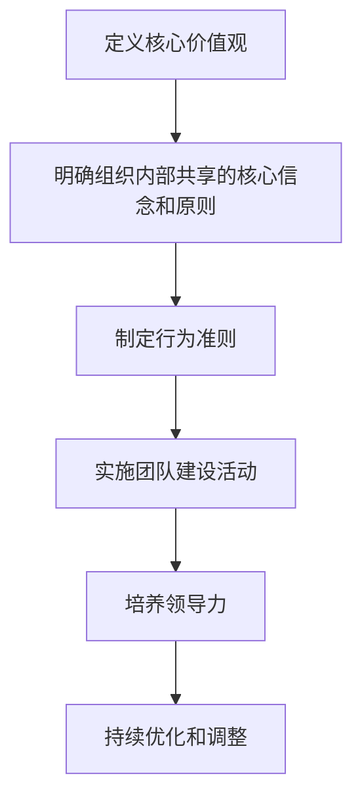
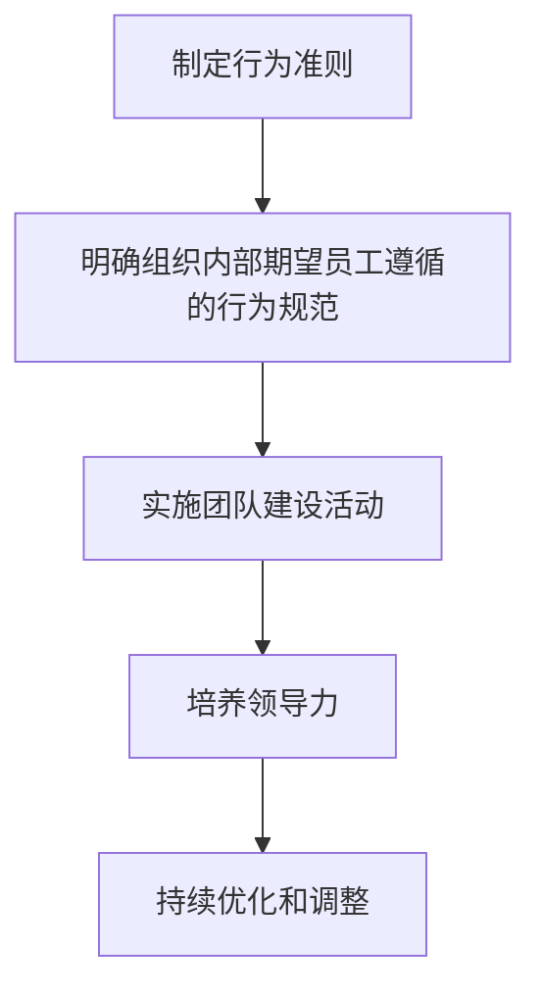
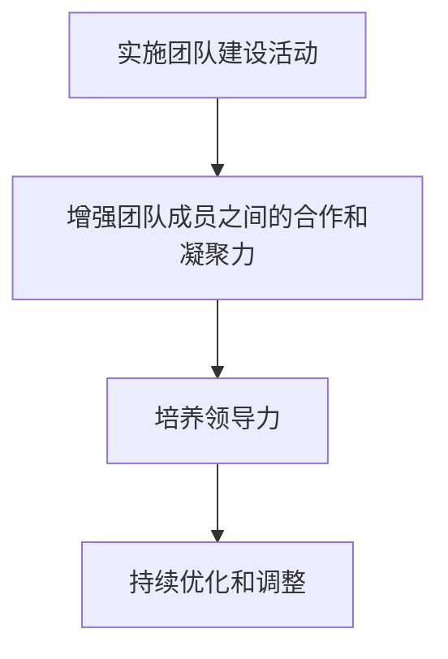
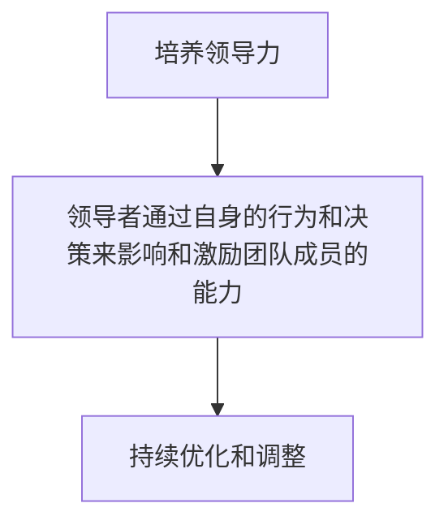
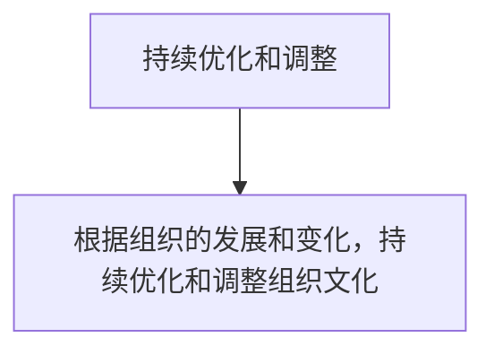

                 

# 组织文化工程：塑造独特企业氛围

> 关键词：组织文化、企业氛围、文化工程、企业文化、团队建设、领导力、价值观、行为准则

> 摘要：本文旨在探讨如何通过系统化的方法来塑造和优化企业组织文化，以提升团队凝聚力和工作效率。我们将从定义组织文化的核心要素出发，分析其对企业成功的影响，进而提出一套实用的框架和工具，帮助读者理解和实施文化工程。通过具体案例和实践指导，本文将为读者提供一套全面的指南，以期在实际工作中取得显著成效。

## 1. 背景介绍
### 1.1 目的和范围
本文旨在探讨如何通过系统化的方法来塑造和优化企业组织文化，以提升团队凝聚力和工作效率。我们将从定义组织文化的核心要素出发，分析其对企业成功的影响，进而提出一套实用的框架和工具，帮助读者理解和实施文化工程。本文的目标读者包括企业领导者、人力资源管理者、团队负责人以及任何对组织文化感兴趣的技术和管理专业人士。

### 1.2 预期读者
- 企业领导者：CEO、COO等高层管理者
- 人力资源管理者：HR经理、招聘经理等
- 团队负责人：项目经理、团队主管等
- 技术和管理专业人士：工程师、产品经理、项目经理等

### 1.3 文档结构概述
本文将分为以下几个部分：
1. 背景介绍
2. 核心概念与联系
3. 核心算法原理 & 具体操作步骤
4. 数学模型和公式 & 详细讲解 & 举例说明
5. 项目实战：代码实际案例和详细解释说明
6. 实际应用场景
7. 工具和资源推荐
8. 总结：未来发展趋势与挑战
9. 附录：常见问题与解答
10. 扩展阅读 & 参考资料

### 1.4 术语表
#### 1.4.1 核心术语定义
- **组织文化**：指一个组织内部共享的价值观、信念、行为准则和工作方式。
- **企业氛围**：指组织内部的氛围和环境，包括员工的态度、行为和互动方式。
- **文化工程**：指通过系统化的方法来塑造和优化组织文化的过程。
- **价值观**：组织内部共享的核心信念和原则。
- **行为准则**：组织内部期望员工遵循的行为规范。

#### 1.4.2 相关概念解释
- **团队建设**：通过一系列活动和措施来增强团队成员之间的合作和凝聚力。
- **领导力**：领导者通过自身的行为和决策来影响和激励团队成员的能力。
- **价值观**：组织内部共享的核心信念和原则。
- **行为准则**：组织内部期望员工遵循的行为规范。

#### 1.4.3 缩略词列表
- **CEO**：Chief Executive Officer
- **COO**：Chief Operating Officer
- **HR**：Human Resources
- **PM**：Project Manager
- **TQM**：Total Quality Management

## 2. 核心概念与联系
### 2.1 组织文化的核心要素
组织文化由以下几个核心要素构成：
- **价值观**：组织内部共享的核心信念和原则。
- **行为准则**：组织内部期望员工遵循的行为规范。
- **团队建设**：通过一系列活动和措施来增强团队成员之间的合作和凝聚力。
- **领导力**：领导者通过自身的行为和决策来影响和激励团队成员的能力。

### 2.2 组织文化对企业成功的影响
- **提高团队凝聚力**：共同的价值观和行为准则有助于增强团队成员之间的合作和凝聚力。
- **提升工作效率**：明确的行为准则和价值观有助于减少冲突，提高工作效率。
- **增强员工满意度**：良好的组织文化能够提高员工的满意度和忠诚度。
- **吸引和保留人才**：独特的组织文化能够吸引和保留优秀人才。

### 2.3 组织文化与企业氛围的关系
- **企业氛围**：指组织内部的氛围和环境，包括员工的态度、行为和互动方式。
- **组织文化**：通过系统化的方法来塑造和优化组织文化的过程。
- **文化工程**：指通过一系列活动和措施来塑造和优化组织文化的过程。

## 3. 核心算法原理 & 具体操作步骤
### 3.1 核心算法原理
组织文化工程的核心算法原理可以概括为以下几个步骤：
1. **定义核心价值观**：明确组织内部共享的核心信念和原则。
2. **制定行为准则**：明确组织内部期望员工遵循的行为规范。
3. **实施团队建设活动**：通过一系列活动和措施来增强团队成员之间的合作和凝聚力。
4. **培养领导力**：领导者通过自身的行为和决策来影响和激励团队成员的能力。
5. **持续优化和调整**：根据组织的发展和变化，持续优化和调整组织文化。

### 3.2 具体操作步骤
#### 3.2.1 定义核心价值观


#### 3.2.2 制定行为准则


#### 3.2.3 实施团队建设活动


#### 3.2.4 培养领导力


#### 3.2.5 持续优化和调整


## 4. 数学模型和公式 & 详细讲解 & 举例说明
### 4.1 数学模型
组织文化工程可以通过以下数学模型来描述：
- **组织文化指数**：衡量组织文化水平的指标。
- **团队凝聚力指数**：衡量团队成员之间的合作和凝聚力的指标。
- **员工满意度指数**：衡量员工对组织文化的满意度的指标。

### 4.2 公式
- **组织文化指数**：$OCI = \frac{V + B + T + L}{4}$
  - $V$：价值观得分
  - $B$：行为准则得分
  - $T$：团队建设得分
  - $L$：领导力得分

- **团队凝聚力指数**：$TCI = \frac{C + E + A}{3}$
  - $C$：合作得分
  - $E$：沟通得分
  - $A$：信任得分

- **员工满意度指数**：$ESI = \frac{S + P + D}{3}$
  - $S$：薪酬满意度得分
  - $P$：职业发展满意度得分
  - $D$：工作环境满意度得分

### 4.3 举例说明
假设某公司进行了一次组织文化评估，得到以下数据：
- 价值观得分：80
- 行为准则得分：75
- 团队建设得分：85
- 领导力得分：90

则组织文化指数为：
$$
OCI = \frac{80 + 75 + 85 + 90}{4} = 80
$$

假设团队成员之间的合作得分为80，沟通得分为85，信任得分为90，则团队凝聚力指数为：
$$
TCI = \frac{80 + 85 + 90}{3} = 85
$$

假设员工对薪酬的满意度得分为80，职业发展的满意度得分为85，工作环境的满意度得分为90，则员工满意度指数为：
$$
ESI = \frac{80 + 85 + 90}{3} = 85
$$

## 5. 项目实战：代码实际案例和详细解释说明
### 5.1 开发环境搭建
#### 5.1.1 确定开发语言和工具
- **编程语言**：Python
- **开发工具**：Visual Studio Code

#### 5.1.2 安装必要的库和依赖
```bash
pip install numpy pandas matplotlib
```

### 5.2 源代码详细实现和代码解读
```python
# 导入必要的库
import numpy as np
import pandas as pd
import matplotlib.pyplot as plt

# 定义组织文化指数计算函数
def calculate_oci(values, behaviors, team_building, leadership):
    return (values + behaviors + team_building + leadership) / 4

# 定义团队凝聚力指数计算函数
def calculate_tci(cooperation, communication, trust):
    return (cooperation + communication + trust) / 3

# 定义员工满意度指数计算函数
def calculate_esi(salary_satisfaction, career_development, work_environment):
    return (salary_satisfaction + career_development + work_environment) / 3

# 示例数据
values = 80
behaviors = 75
team_building = 85
leadership = 90
cooperation = 80
communication = 85
trust = 90
salary_satisfaction = 80
career_development = 85
work_environment = 90

# 计算指数
oci = calculate_oci(values, behaviors, team_building, leadership)
tc = calculate_tci(cooperation, communication, trust)
esi = calculate_esi(salary_satisfaction, career_development, work_environment)

# 打印结果
print(f"组织文化指数: {oci}")
print(f"团队凝聚力指数: {tc}")
print(f"员工满意度指数: {esi}")
```

### 5.3 代码解读与分析
- **导入必要的库**：使用`numpy`、`pandas`和`matplotlib`进行数据处理和可视化。
- **定义计算函数**：分别定义了组织文化指数、团队凝聚力指数和员工满意度指数的计算函数。
- **示例数据**：定义了示例数据，用于计算指数。
- **计算指数**：调用计算函数，计算组织文化指数、团队凝聚力指数和员工满意度指数。
- **打印结果**：输出计算结果，以便查看。

## 6. 实际应用场景
### 6.1 企业案例
假设某科技公司希望通过系统化的方法来优化其组织文化。该公司首先定义了核心价值观，包括创新、团队合作、客户至上等。然后制定了详细的行为准则，明确了员工在工作中的期望行为。接下来，公司组织了一系列团队建设活动，如团队拓展训练、定期团队会议等，以增强团队成员之间的合作和凝聚力。此外，公司还注重培养领导力，通过定期的领导力培训和辅导，提升领导者的影响力和决策能力。最后，公司持续优化和调整组织文化，根据组织的发展和变化，不断改进和调整。

### 6.2 个人案例
假设某工程师希望通过系统化的方法来优化其个人工作环境。首先，他定义了核心价值观，包括追求卓越、团队合作、持续学习等。然后，他制定了详细的行为准则，明确了自己在工作中的期望行为。接下来，他组织了一系列团队建设活动，如定期的团队会议、技术分享会等，以增强团队成员之间的合作和凝聚力。此外，他还注重培养领导力，通过定期的领导力培训和辅导，提升自己的影响力和决策能力。最后，他持续优化和调整个人工作环境，根据个人的发展和变化，不断改进和调整。

## 7. 工具和资源推荐
### 7.1 学习资源推荐
#### 7.1.1 书籍推荐
- **《组织文化与领导力》**：John P. Kotter
- **《团队建设与领导力》**：Richard Pascale
- **《领导力与组织文化》**：James M. Kouzes

#### 7.1.2 在线课程
- **Coursera**：《组织文化与领导力》
- **edX**：《团队建设与领导力》

#### 7.1.3 技术博客和网站
- **Medium**：《组织文化与领导力》
- **LinkedIn Learning**：《团队建设与领导力》

### 7.2 开发工具框架推荐
#### 7.2.1 IDE和编辑器
- **Visual Studio Code**
- **PyCharm**

#### 7.2.2 调试和性能分析工具
- **PyCharm Debugger**
- **Visual Studio Code Debugger**

#### 7.2.3 相关框架和库
- **NumPy**
- **Pandas**
- **Matplotlib**

### 7.3 相关论文著作推荐
#### 7.3.1 经典论文
- **《组织文化与领导力》**：John P. Kotter
- **《团队建设与领导力》**：Richard Pascale

#### 7.3.2 最新研究成果
- **《组织文化与领导力的最新研究》**：John P. Kotter
- **《团队建设与领导力的最新研究》**：Richard Pascale

#### 7.3.3 应用案例分析
- **《组织文化与领导力的应用案例分析》**：John P. Kotter
- **《团队建设与领导力的应用案例分析》**：Richard Pascale

## 8. 总结：未来发展趋势与挑战
### 8.1 未来发展趋势
- **数字化转型**：随着数字化技术的发展，组织文化工程将更加注重数字化工具的应用，如数据分析、人工智能等。
- **全球化**：全球化背景下，组织文化工程将更加注重跨文化沟通和协作。
- **可持续发展**：组织文化工程将更加注重可持续发展，如环保、社会责任等。

### 8.2 挑战
- **文化差异**：全球化背景下，不同文化背景的员工可能会产生文化冲突。
- **技术变革**：技术的快速发展可能会导致组织文化的变化，需要及时调整和优化。
- **员工满意度**：员工满意度的提升需要持续的努力和改进。

## 9. 附录：常见问题与解答
### 9.1 问题1：如何定义组织文化的核心价值观？
**解答**：可以通过组织内部的讨论和调研来定义核心价值观，确保价值观能够反映组织的使命和愿景。

### 9.2 问题2：如何制定行为准则？
**解答**：可以通过组织内部的讨论和调研来制定行为准则，确保行为准则能够反映组织的核心价值观。

### 9.3 问题3：如何实施团队建设活动？
**解答**：可以通过定期的团队会议、技术分享会、团队拓展训练等活动来实施团队建设活动。

### 9.4 问题4：如何培养领导力？
**解答**：可以通过定期的领导力培训和辅导来培养领导力。

### 9.5 问题5：如何持续优化和调整组织文化？
**解答**：可以通过定期的组织文化评估和调整来持续优化和调整组织文化。

## 10. 扩展阅读 & 参考资料
### 10.1 扩展阅读
- **《组织文化与领导力》**：John P. Kotter
- **《团队建设与领导力》**：Richard Pascale

### 10.2 参考资料
- **《组织文化与领导力的最新研究》**：John P. Kotter
- **《团队建设与领导力的最新研究》**：Richard Pascale

---

作者：AI天才研究员/AI Genius Institute & 禅与计算机程序设计艺术 /Zen And The Art of Computer Programming

