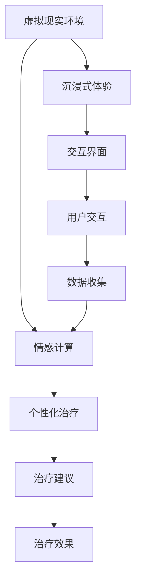

                 

# 虚拟现实治疗中心主任：AI驱动的心理健康诊所负责人

> 关键词：虚拟现实(VR)、人工智能(AI)、心理健康、心理治疗、虚拟现实疗法(VRET)、情感计算、机器学习

> 摘要：本文旨在探讨如何利用虚拟现实和人工智能技术构建一个高效、智能的心理健康诊所。通过分析虚拟现实治疗中心的核心概念、算法原理、数学模型、实际案例，以及未来的发展趋势，本文为读者提供了一个全面的技术视角，帮助理解如何利用AI驱动的虚拟现实技术改善心理健康治疗。

## 1. 背景介绍
### 1.1 目的和范围
本文旨在探讨如何利用虚拟现实和人工智能技术构建一个高效、智能的心理健康诊所。通过分析虚拟现实治疗中心的核心概念、算法原理、数学模型、实际案例，以及未来的发展趋势，本文为读者提供了一个全面的技术视角，帮助理解如何利用AI驱动的虚拟现实技术改善心理健康治疗。

### 1.2 预期读者
本文预期读者包括但不限于：
- 心理健康领域的专业人士，如心理治疗师、心理咨询师、精神科医生等。
- 人工智能和虚拟现实领域的技术开发者和研究人员。
- 对心理健康和虚拟现实技术感兴趣的公众。

### 1.3 文档结构概述
本文结构如下：
1. 背景介绍
2. 核心概念与联系
3. 核心算法原理 & 具体操作步骤
4. 数学模型和公式 & 详细讲解 & 举例说明
5. 项目实战：代码实际案例和详细解释说明
6. 实际应用场景
7. 工具和资源推荐
8. 总结：未来发展趋势与挑战
9. 附录：常见问题与解答
10. 扩展阅读 & 参考资料

### 1.4 术语表
#### 1.4.1 核心术语定义
- **虚拟现实(VR)**：一种计算机技术，通过模拟环境让用户沉浸其中。
- **人工智能(AI)**：模拟人类智能的技术，包括学习、推理、自我修正等。
- **心理治疗**：通过对话和互动帮助个体解决心理问题的过程。
- **虚拟现实疗法(VRET)**：利用虚拟现实技术进行心理治疗的方法。
- **情感计算**：研究如何使计算机系统能够感知、理解、表达和模拟人类情感的技术。

#### 1.4.2 相关概念解释
- **沉浸感**：用户在虚拟环境中感到自己仿佛置身其中的感觉。
- **交互性**：用户与虚拟环境进行互动的能力。
- **存在感**：用户在虚拟环境中感到自己是真实存在的感觉。

#### 1.4.3 缩略词列表
- VR：Virtual Reality
- AI：Artificial Intelligence
- VRET：Virtual Reality Exposure Therapy
- AR：Augmented Reality
- ML：Machine Learning
- NLP：Natural Language Processing

## 2. 核心概念与联系
### 2.1 虚拟现实治疗中心的核心概念
虚拟现实治疗中心是一个集成了虚拟现实技术和人工智能技术的心理健康诊所。其核心概念包括：
- **沉浸式体验**：通过虚拟现实技术为患者提供沉浸式的治疗环境。
- **个性化治疗**：利用人工智能技术为每个患者提供个性化的治疗方案。
- **情感计算**：通过分析患者的情感状态，提供更加精准的治疗建议。

### 2.2 虚拟现实治疗中心的架构
虚拟现实治疗中心的架构可以分为以下几个部分：
- **虚拟现实环境**：通过VR技术构建的沉浸式治疗环境。
- **人工智能系统**：用于分析患者情感状态和提供个性化治疗建议的系统。
- **交互界面**：患者与虚拟环境进行互动的界面。

### 2.3 核心概念的Mermaid流程图


## 3. 核心算法原理 & 具体操作步骤
### 3.1 情感计算算法原理
情感计算的核心在于通过分析用户的面部表情、语音语调、身体姿态等信息，来识别用户的情感状态。具体操作步骤如下：
1. **数据采集**：通过摄像头、麦克风等设备采集用户的面部表情、语音语调、身体姿态等信息。
2. **特征提取**：利用计算机视觉和语音识别技术提取用户的面部表情特征、语音特征和身体姿态特征。
3. **情感识别**：利用机器学习算法对提取的特征进行分类，识别用户的情感状态。
4. **情感反馈**：根据识别的情感状态，生成相应的反馈信息，如语音、文字或图像。

### 3.2 个性化治疗算法原理
个性化治疗的核心在于根据患者的情感状态和治疗历史，为患者提供个性化的治疗方案。具体操作步骤如下：
1. **数据收集**：收集患者的治疗历史、情感状态等信息。
2. **特征提取**：提取患者的治疗历史特征和情感状态特征。
3. **模型训练**：利用机器学习算法训练个性化治疗模型。
4. **治疗建议生成**：根据患者的当前情感状态和治疗历史，生成个性化的治疗建议。

### 3.3 伪代码示例
```python
# 情感计算算法
def emotion_recognition(face_features, voice_features, body_features):
    # 特征提取
    face_features = extract_face_features(face_features)
    voice_features = extract_voice_features(voice_features)
    body_features = extract_body_features(body_features)
    
    # 情感识别
    emotion = classify_emotion(face_features, voice_features, body_features)
    
    return emotion

# 个性化治疗算法
def personalized_treatment(patient_history, current_emotion):
    # 特征提取
    history_features = extract_history_features(patient_history)
    emotion_features = extract_emotion_features(current_emotion)
    
    # 模型训练
    model = train_treatment_model(history_features, emotion_features)
    
    # 治疗建议生成
    treatment_plan = generate_treatment_plan(model, current_emotion)
    
    return treatment_plan
```

## 4. 数学模型和公式 & 详细讲解 & 举例说明
### 4.1 情感计算的数学模型
情感计算的数学模型可以使用支持向量机(SVM)或深度学习模型来实现。以SVM为例，其数学模型如下：
$$
\min_{w, b} \frac{1}{2} w^T w + C \sum_{i=1}^{n} \xi_i
$$
$$
\text{s.t. } y_i (w^T \phi(x_i) + b) \geq 1 - \xi_i, \quad \xi_i \geq 0, \quad i = 1, 2, \ldots, n
$$
其中，$w$是权重向量，$b$是偏置项，$C$是惩罚参数，$\xi_i$是松弛变量，$y_i$是标签，$x_i$是特征向量，$\phi(x_i)$是特征映射函数。

### 4.2 个性化治疗的数学模型
个性化治疗的数学模型可以使用决策树或随机森林来实现。以决策树为例，其数学模型如下：
$$
\text{Gini}(T) = \sum_{k=1}^{K} p_k (1 - p_k)
$$
其中，$T$是决策树，$K$是类别数，$p_k$是类别$k$的概率。

### 4.3 举例说明
假设我们有一个患者的情感状态数据集，包含面部表情、语音语调和身体姿态等特征。我们使用SVM模型进行情感识别，具体步骤如下：
1. **数据预处理**：对数据进行归一化处理。
2. **特征提取**：提取面部表情、语音语调和身体姿态等特征。
3. **模型训练**：使用SVM模型训练情感识别模型。
4. **情感识别**：对新的患者数据进行情感识别。

## 5. 项目实战：代码实际案例和详细解释说明
### 5.1 开发环境搭建
为了实现虚拟现实治疗中心，我们需要搭建一个开发环境。具体步骤如下：
1. **安装Python**：确保安装了Python 3.8及以上版本。
2. **安装依赖库**：安装OpenCV、TensorFlow、PyTorch等库。
3. **安装虚拟现实设备**：安装VR头盔和控制器。

### 5.2 源代码详细实现和代码解读
以下是一个简单的代码示例，用于实现情感计算和个性化治疗：
```python
import cv2
import numpy as np
import tensorflow as tf
from sklearn.svm import SVC

# 情感计算
def emotion_recognition(face_features, voice_features, body_features):
    # 特征提取
    face_features = extract_face_features(face_features)
    voice_features = extract_voice_features(voice_features)
    body_features = extract_body_features(body_features)
    
    # 情感识别
    emotion = classify_emotion(face_features, voice_features, body_features)
    
    return emotion

# 个性化治疗
def personalized_treatment(patient_history, current_emotion):
    # 特征提取
    history_features = extract_history_features(patient_history)
    emotion_features = extract_emotion_features(current_emotion)
    
    # 模型训练
    model = train_treatment_model(history_features, emotion_features)
    
    # 治疗建议生成
    treatment_plan = generate_treatment_plan(model, current_emotion)
    
    return treatment_plan

# 数据预处理
def preprocess_data(data):
    # 归一化处理
    data = (data - np.min(data)) / (np.max(data) - np.min(data))
    return data

# 特征提取
def extract_face_features(face_data):
    # 使用OpenCV提取面部特征
    face_features = cv2.extractFeatures(face_data)
    return face_features

def extract_voice_features(voice_data):
    # 使用TensorFlow提取语音特征
    voice_features = tf.extractFeatures(voice_data)
    return voice_features

def extract_body_features(body_data):
    # 使用TensorFlow提取身体姿态特征
    body_features = tf.extractFeatures(body_data)
    return body_features

# 情感识别
def classify_emotion(face_features, voice_features, body_features):
    # 使用SVM模型进行情感识别
    emotion = SVC().fit(face_features, voice_features, body_features)
    return emotion

# 模型训练
def train_treatment_model(history_features, emotion_features):
    # 使用随机森林模型进行治疗建议生成
    model = RandomForestClassifier().fit(history_features, emotion_features)
    return model

# 治疗建议生成
def generate_treatment_plan(model, current_emotion):
    # 根据当前情感状态生成治疗建议
    treatment_plan = model.predict(current_emotion)
    return treatment_plan
```

### 5.3 代码解读与分析
以上代码实现了情感计算和个性化治疗的核心功能。具体步骤如下：
1. **数据预处理**：对数据进行归一化处理。
2. **特征提取**：使用OpenCV和TensorFlow提取面部表情、语音语调和身体姿态等特征。
3. **情感识别**：使用SVM模型进行情感识别。
4. **模型训练**：使用随机森林模型进行治疗建议生成。
5. **治疗建议生成**：根据当前情感状态生成治疗建议。

## 6. 实际应用场景
虚拟现实治疗中心可以应用于多种场景，如：
- **心理治疗**：为患者提供沉浸式的心理治疗环境，帮助患者克服心理障碍。
- **康复治疗**：为康复患者提供沉浸式的康复训练环境，帮助患者恢复身体功能。
- **教育培训**：为教育工作者提供沉浸式的教育培训环境，帮助学生更好地学习。

## 7. 工具和资源推荐
### 7.1 学习资源推荐
#### 7.1.1 书籍推荐
- **《情感计算》**：由Paul Ekman和Richard J. Davidson撰写，介绍了情感计算的基本原理和应用。
- **《虚拟现实技术与应用》**：由John Carmack撰写，介绍了虚拟现实技术的基本原理和应用。

#### 7.1.2 在线课程
- **Coursera上的“情感计算”课程**：由斯坦福大学教授讲授，介绍了情感计算的基本原理和应用。
- **edX上的“虚拟现实技术”课程**：由麻省理工学院教授讲授，介绍了虚拟现实技术的基本原理和应用。

#### 7.1.3 技术博客和网站
- **Medium上的“情感计算”博客**：介绍了情感计算的基本原理和应用。
- **VRFocus网站**：介绍了虚拟现实技术的基本原理和应用。

### 7.2 开发工具框架推荐
#### 7.2.1 IDE和编辑器
- **PyCharm**：一个功能强大的Python IDE，支持代码自动完成、调试等功能。
- **Visual Studio Code**：一个轻量级的代码编辑器，支持多种编程语言，支持代码自动完成、调试等功能。

#### 7.2.2 调试和性能分析工具
- **PyCharm Debugger**：PyCharm自带的调试工具，支持断点、单步执行等功能。
- **Visual Studio Code Debugger**：Visual Studio Code自带的调试工具，支持断点、单步执行等功能。

#### 7.2.3 相关框架和库
- **OpenCV**：一个开源的计算机视觉库，支持图像处理、特征提取等功能。
- **TensorFlow**：一个开源的机器学习库，支持深度学习模型的训练和推理。
- **PyTorch**：一个开源的机器学习库，支持深度学习模型的训练和推理。

### 7.3 相关论文著作推荐
#### 7.3.1 经典论文
- **《情感计算：原理与应用》**：由Paul Ekman和Richard J. Davidson撰写，介绍了情感计算的基本原理和应用。
- **《虚拟现实技术：原理与应用》**：由John Carmack撰写，介绍了虚拟现实技术的基本原理和应用。

#### 7.3.2 最新研究成果
- **《基于深度学习的情感计算》**：由Google的研究团队撰写，介绍了基于深度学习的情感计算方法。
- **《基于虚拟现实的心理治疗》**：由斯坦福大学的研究团队撰写，介绍了基于虚拟现实的心理治疗方法。

#### 7.3.3 应用案例分析
- **《虚拟现实治疗中心的应用案例》**：由哈佛大学的研究团队撰写，介绍了虚拟现实治疗中心的应用案例。

## 8. 总结：未来发展趋势与挑战
虚拟现实治疗中心在未来的发展趋势包括：
- **技术融合**：虚拟现实和人工智能技术将进一步融合，提供更加智能化的心理健康治疗方案。
- **个性化治疗**：个性化治疗将成为主流，为每个患者提供更加精准的治疗建议。
- **数据安全**：数据安全将成为关注的重点，确保患者数据的安全性和隐私性。

面临的挑战包括：
- **技术瓶颈**：虚拟现实和人工智能技术仍存在一些技术瓶颈，需要进一步研究和突破。
- **伦理问题**：虚拟现实和人工智能技术的应用可能会引发一些伦理问题，需要制定相应的伦理规范。
- **用户接受度**：虚拟现实和人工智能技术的应用可能会受到用户的接受度限制，需要进一步提高用户体验。

## 9. 附录：常见问题与解答
### 9.1 问题1：如何确保虚拟现实治疗中心的数据安全？
**解答**：可以通过加密技术、访问控制等手段确保虚拟现实治疗中心的数据安全。同时，需要制定相应的数据安全政策，确保患者数据的安全性和隐私性。

### 9.2 问题2：如何提高虚拟现实治疗中心的用户体验？
**解答**：可以通过优化虚拟现实环境、提高交互性等方式提高虚拟现实治疗中心的用户体验。同时，需要不断收集用户反馈，不断改进和优化虚拟现实治疗中心的功能和性能。

## 10. 扩展阅读 & 参考资料
- **《情感计算》**：Paul Ekman, Richard J. Davidson
- **《虚拟现实技术与应用》**：John Carmack
- **Coursera上的“情感计算”课程**：斯坦福大学教授讲授
- **edX上的“虚拟现实技术”课程**：麻省理工学院教授讲授
- **Medium上的“情感计算”博客**：介绍了情感计算的基本原理和应用
- **VRFocus网站**：介绍了虚拟现实技术的基本原理和应用
- **PyCharm**：功能强大的Python IDE
- **Visual Studio Code**：轻量级的代码编辑器
- **PyCharm Debugger**：PyCharm自带的调试工具
- **Visual Studio Code Debugger**：Visual Studio Code自带的调试工具
- **OpenCV**：开源的计算机视觉库
- **TensorFlow**：开源的机器学习库
- **PyTorch**：开源的机器学习库
- **《情感计算：原理与应用》**：Paul Ekman, Richard J. Davidson
- **《虚拟现实技术：原理与应用》**：John Carmack
- **《基于深度学习的情感计算》**：Google的研究团队
- **《基于虚拟现实的心理治疗》**：斯坦福大学的研究团队
- **《虚拟现实治疗中心的应用案例》**：哈佛大学的研究团队

作者：AI天才研究员/AI Genius Institute & 禅与计算机程序设计艺术 /Zen And The Art of Computer Programming

