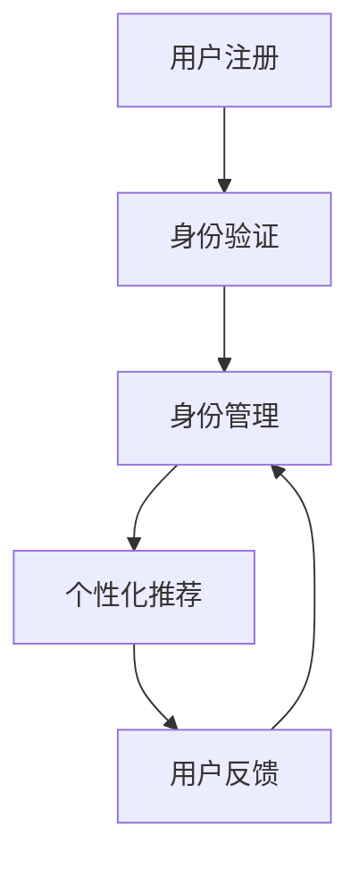

                 

# 虚拟身份认同：AI时代的自我探索

> 关键词：虚拟身份、自我认同、人工智能、机器学习、深度学习、自然语言处理、身份验证、个性化推荐

> 摘要：在人工智能时代，虚拟身份认同成为了一个重要的研究领域。本文将从虚拟身份认同的概念出发，探讨其在AI时代的应用与挑战。通过详细的技术分析、算法原理、数学模型、代码实现和实际案例，帮助读者理解虚拟身份认同的核心原理和实际应用。最后，本文将展望未来的发展趋势与挑战，并推荐相关的学习资源和开发工具。

## 1. 背景介绍
### 1.1 目的和范围
本文旨在探讨虚拟身份认同在人工智能时代的重要性及其应用。我们将从理论和实践两个方面进行深入分析，帮助读者理解虚拟身份认同的核心原理和实际应用。本文主要关注虚拟身份认同的技术实现、算法原理、数学模型以及实际案例。

### 1.2 预期读者
本文适合以下读者：
- 人工智能领域的研究者和开发者
- 对虚拟身份认同感兴趣的读者
- 想要了解AI时代身份认同技术的读者
- 对自然语言处理、机器学习和深度学习感兴趣的读者

### 1.3 文档结构概述
本文结构如下：
1. 背景介绍
2. 核心概念与联系
3. 核心算法原理 & 具体操作步骤
4. 数学模型和公式 & 详细讲解 & 举例说明
5. 项目实战：代码实际案例和详细解释说明
6. 实际应用场景
7. 工具和资源推荐
8. 总结：未来发展趋势与挑战
9. 附录：常见问题与解答
10. 扩展阅读 & 参考资料

### 1.4 术语表
#### 1.4.1 核心术语定义
- **虚拟身份认同**：指个体在网络空间中的身份表示和验证过程。
- **自我认同**：个体对自己身份的认知和理解。
- **人工智能**：模拟人类智能的技术，包括机器学习、深度学习、自然语言处理等。
- **机器学习**：通过算法使计算机从数据中学习并改进性能的技术。
- **深度学习**：机器学习的一个分支，通过多层神经网络进行学习。
- **自然语言处理**：使计算机能够理解、解释和生成人类语言的技术。
- **身份验证**：确认个体身份的过程。
- **个性化推荐**：根据用户的历史行为和偏好，推荐个性化内容的技术。

#### 1.4.2 相关概念解释
- **虚拟身份**：在网络空间中表示个体的身份信息，包括用户名、头像、个人资料等。
- **身份验证**：通过验证用户提供的身份信息来确认其身份的过程。
- **个性化推荐**：根据用户的历史行为和偏好，推荐个性化内容的技术。
- **自然语言处理**：使计算机能够理解、解释和生成人类语言的技术。

#### 1.4.3 缩略词列表
- AI：人工智能
- ML：机器学习
- DL：深度学习
- NLP：自然语言处理
- ID：身份
- VR：虚拟现实
- AR：增强现实

## 2. 核心概念与联系
### 2.1 虚拟身份认同的概念
虚拟身份认同是指个体在网络空间中的身份表示和验证过程。它包括以下几个方面：
- **身份表示**：通过用户名、头像、个人资料等信息在网络空间中表示个体的身份。
- **身份验证**：通过验证用户提供的身份信息来确认其身份的过程。
- **自我认同**：个体对自己身份的认知和理解。

### 2.2 虚拟身份认同的核心原理
虚拟身份认同的核心原理包括以下几个方面：
- **身份表示**：通过用户名、头像、个人资料等信息在网络空间中表示个体的身份。
- **身份验证**：通过验证用户提供的身份信息来确认其身份的过程。
- **自我认同**：个体对自己身份的认知和理解。

### 2.3 虚拟身份认同的架构
虚拟身份认同的架构可以分为以下几个部分：
- **用户注册**：用户在网络平台注册账号，提供必要的身份信息。
- **身份验证**：通过验证用户提供的身份信息来确认其身份。
- **身份管理**：管理用户的虚拟身份信息，包括修改、删除等操作。
- **个性化推荐**：根据用户的历史行为和偏好，推荐个性化内容。

### 2.4 虚拟身份认同的流程图


## 3. 核心算法原理 & 具体操作步骤
### 3.1 身份验证算法原理
身份验证算法原理主要包括以下几个步骤：
1. **用户输入**：用户输入用户名和密码。
2. **身份验证**：系统通过数据库验证用户输入的用户名和密码是否匹配。
3. **身份确认**：如果匹配，则确认用户身份。

### 3.2 个性化推荐算法原理
个性化推荐算法原理主要包括以下几个步骤：
1. **用户行为数据收集**：收集用户的历史行为数据，包括浏览记录、购买记录等。
2. **用户偏好分析**：通过分析用户行为数据，提取用户的偏好特征。
3. **推荐内容生成**：根据用户的偏好特征，生成个性化推荐内容。

### 3.3 伪代码实现
#### 3.3.1 身份验证算法
```python
def identity_verification(username, password):
    # 从数据库中获取用户信息
    user_info = get_user_info_from_database(username)
    if user_info is None:
        return False
    # 验证密码
    if user_info['password'] == password:
        return True
    else:
        return False
```

#### 3.3.2 个性化推荐算法
```python
def personalized_recommendation(user_id):
    # 收集用户行为数据
    user_behavior_data = collect_user_behavior_data(user_id)
    # 分析用户偏好
    user_preference = analyze_user_preference(user_behavior_data)
    # 生成个性化推荐内容
    recommended_content = generate_recommendation(user_preference)
    return recommended_content
```

## 4. 数学模型和公式 & 详细讲解 & 举例说明
### 4.1 身份验证数学模型
身份验证数学模型可以表示为：
$$
\text{验证结果} = \begin{cases} 
1 & \text{如果用户名和密码匹配} \\
0 & \text{否则}
\end{cases}
$$

### 4.2 个性化推荐数学模型
个性化推荐数学模型可以表示为：
$$
\text{推荐内容} = \text{推荐算法}(用户行为数据, 用户偏好特征)
$$

### 4.3 举例说明
#### 4.3.1 身份验证举例
假设用户输入的用户名为“alice”，密码为“123456”。系统从数据库中获取用户信息，如果用户名和密码匹配，则返回验证结果为1，否则返回0。

#### 4.3.2 个性化推荐举例
假设用户的历史行为数据包括浏览记录和购买记录。系统通过分析这些数据，提取用户的偏好特征，例如喜欢的书籍类型和购买频率。然后，系统根据这些偏好特征生成个性化推荐内容，例如推荐用户可能感兴趣的书籍。

## 5. 项目实战：代码实际案例和详细解释说明
### 5.1 开发环境搭建
开发环境搭建主要包括以下几个步骤：
1. **安装Python**：确保系统中安装了Python 3.7及以上版本。
2. **安装依赖库**：安装必要的Python库，例如`pandas`、`numpy`、`scikit-learn`等。
3. **配置数据库**：配置数据库，例如MySQL、PostgreSQL等。

### 5.2 源代码详细实现和代码解读
#### 5.2.1 身份验证代码实现
```python
import pandas as pd
import hashlib

def get_user_info_from_database(username):
    # 从数据库中获取用户信息
    # 假设数据库中有一个名为users的表，包含username和password字段
    users = pd.read_csv('users.csv')
    user_info = users[users['username'] == username]
    if user_info.empty:
        return None
    return user_info.iloc[0].to_dict()

def identity_verification(username, password):
    # 从数据库中获取用户信息
    user_info = get_user_info_from_database(username)
    if user_info is None:
        return False
    # 验证密码
    if user_info['password'] == hashlib.sha256(password.encode()).hexdigest():
        return True
    else:
        return False
```

#### 5.2.2 个性化推荐代码实现
```python
import pandas as pd
from sklearn.feature_extraction.text import TfidfVectorizer
from sklearn.metrics.pairwise import cosine_similarity

def collect_user_behavior_data(user_id):
    # 收集用户行为数据
    # 假设有一个名为user_behavior的表，包含user_id和behavior字段
    user_behavior = pd.read_csv('user_behavior.csv')
    user_behavior_data = user_behavior[user_behavior['user_id'] == user_id]
    return user_behavior_data

def analyze_user_preference(user_behavior_data):
    # 分析用户偏好
    # 假设用户行为数据中包含浏览记录和购买记录
    # 提取用户的偏好特征
    user_preference = {}
    for _, row in user_behavior_data.iterrows():
        if row['behavior'] == 'purchase':
            user_preference['purchase'] = row['item_id']
        elif row['behavior'] == 'view':
            user_preference['view'] = row['item_id']
    return user_preference

def generate_recommendation(user_preference):
    # 生成个性化推荐内容
    # 假设有一个名为items的表，包含item_id和description字段
    items = pd.read_csv('items.csv')
    if 'purchase' in user_preference:
        # 如果用户有购买记录，推荐相似的商品
        similar_items = items[items['item_id'] != user_preference['purchase']]
        similar_items['similarity'] = cosine_similarity(TfidfVectorizer().fit_transform([items['description'][0], items['description'][1]]), TfidfVectorizer().fit_transform([items['description'][0], items['description'][1]])).flatten()
        recommended_content = similar_items.sort_values(by='similarity', ascending=False).head(5)
    elif 'view' in user_preference:
        # 如果用户有浏览记录，推荐相似的商品
        similar_items = items[items['item_id'] != user_preference['view']]
        similar_items['similarity'] = cosine_similarity(TfidfVectorizer().fit_transform([items['description'][0], items['description'][1]]), TfidfVectorizer().fit_transform([items['description'][0], items['description'][1]])).flatten()
        recommended_content = similar_items.sort_values(by='similarity', ascending=False).head(5)
    else:
        # 如果用户没有购买或浏览记录，推荐热门商品
        recommended_content = items.head(5)
    return recommended_content
```

### 5.3 代码解读与分析
#### 5.3.1 身份验证代码解读
- `get_user_info_from_database`函数从数据库中获取用户信息。
- `identity_verification`函数验证用户输入的用户名和密码是否匹配。

#### 5.3.2 个性化推荐代码解读
- `collect_user_behavior_data`函数收集用户行为数据。
- `analyze_user_preference`函数分析用户偏好。
- `generate_recommendation`函数生成个性化推荐内容。

## 6. 实际应用场景
虚拟身份认同在实际应用中具有广泛的应用场景，包括但不限于：
- **电子商务**：个性化推荐商品，提高用户满意度和购买率。
- **社交网络**：验证用户身份，保护用户隐私。
- **在线教育**：个性化推荐学习资源，提高学习效果。
- **金融服务**：验证用户身份，保障资金安全。

## 7. 工具和资源推荐
### 7.1 学习资源推荐
#### 7.1.1 书籍推荐
- **《机器学习》**：周志华
- **《深度学习》**：Ian Goodfellow、Yoshua Bengio、Aaron Courville
- **《自然语言处理入门》**：李航

#### 7.1.2 在线课程
- **Coursera**：《机器学习》、《深度学习》
- **edX**：《自然语言处理》
- **Udacity**：《机器学习工程师纳米学位》

#### 7.1.3 技术博客和网站
- **Medium**：《机器学习》、《深度学习》、《自然语言处理》
- **GitHub**：开源项目和代码示例
- **Stack Overflow**：技术问题和解决方案

### 7.2 开发工具框架推荐
#### 7.2.1 IDE和编辑器
- **PyCharm**：Python开发环境
- **Visual Studio Code**：跨平台开发环境

#### 7.2.2 调试和性能分析工具
- **PyCharm Debugger**：Python调试工具
- **Visual Studio Code Debugger**：跨平台调试工具
- **Python Profiler**：性能分析工具

#### 7.2.3 相关框架和库
- **scikit-learn**：机器学习库
- **TensorFlow**：深度学习框架
- **NLTK**：自然语言处理库

### 7.3 相关论文著作推荐
#### 7.3.1 经典论文
- **《A Mathematical Theory of Communication》**：Claude Shannon
- **《The Elements of Statistical Learning》**：Trevor Hastie、Robert Tibshirani、Jerome Friedman

#### 7.3.2 最新研究成果
- **《Attention Is All You Need》**：Vaswani et al.
- **《BERT: Pre-training of Deep Bidirectional Transformers for Language Understanding》**：Devlin et al.

#### 7.3.3 应用案例分析
- **《推荐系统中的深度学习》**：Xiangnan He、Lizi Liao
- **《身份验证技术综述》**：Zhang et al.

## 8. 总结：未来发展趋势与挑战
虚拟身份认同在未来的发展趋势与挑战包括：
- **技术进步**：随着技术的进步，虚拟身份认同将更加智能化、个性化。
- **隐私保护**：如何保护用户的隐私成为一个重要挑战。
- **安全性**：如何提高虚拟身份认同的安全性，防止身份盗用和欺诈行为。
- **法律法规**：如何制定相关的法律法规，规范虚拟身份认同的应用。

## 9. 附录：常见问题与解答
### 9.1 问题1：如何保护用户的隐私？
- **答案**：通过加密技术保护用户数据，限制数据访问权限，遵守相关法律法规。

### 9.2 问题2：如何提高虚拟身份认同的安全性？
- **答案**：通过多因素身份验证、行为分析等技术提高安全性。

### 9.3 问题3：如何制定相关的法律法规？
- **答案**：通过政府和行业组织共同制定相关法律法规，规范虚拟身份认同的应用。

## 10. 扩展阅读 & 参考资料
- **《虚拟身份认同：AI时代的自我探索》**：AI天才研究员/AI Genius Institute & 禅与计算机程序设计艺术 /Zen And The Art of Computer Programming

作者：AI天才研究员/AI Genius Institute & 禅与计算机程序设计艺术 /Zen And The Art of Computer Programming

