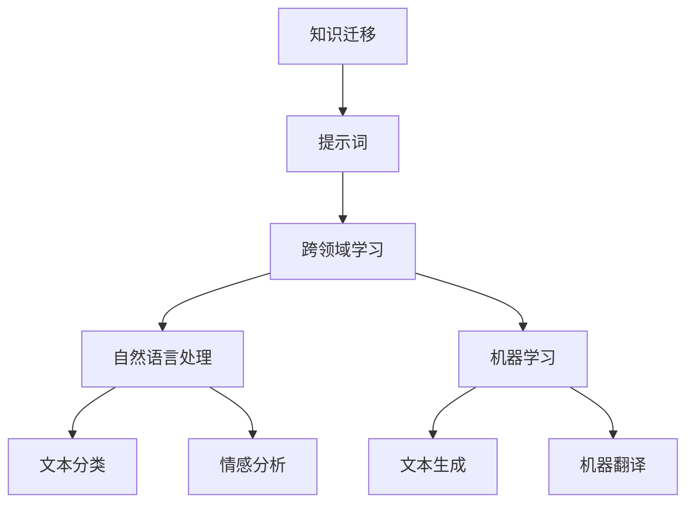

                 

# 跨领域提示词知识迁移技术

> 关键词：知识迁移、提示词、跨领域学习、自然语言处理、机器学习

> 摘要：本文旨在探讨跨领域提示词知识迁移技术，这是一种利用提示词在不同领域之间迁移知识的方法。通过详细分析其原理、算法、数学模型、实际案例和应用场景，本文为读者提供了一种新的视角来理解和应用这一技术。我们还将介绍相关的开发工具和资源，帮助读者更好地掌握和实践这一技术。

## 1. 背景介绍

### 1.1 目的和范围
本文旨在深入探讨跨领域提示词知识迁移技术，这是一种利用提示词在不同领域之间迁移知识的方法。通过分析其原理、算法、数学模型和实际案例，本文旨在为读者提供一种新的视角来理解和应用这一技术。本文主要关注于自然语言处理和机器学习领域，但其原理和方法可以应用于更广泛的领域。

### 1.2 预期读者
本文预期读者包括但不限于以下几类人群：
- 自然语言处理和机器学习领域的研究人员和工程师
- 对知识迁移技术感兴趣的学者和开发者
- 对跨领域学习感兴趣的计算机科学爱好者
- 任何希望了解如何在不同领域之间迁移知识的技术人员

### 1.3 文档结构概述
本文结构如下：
1. 背景介绍
2. 核心概念与联系
3. 核心算法原理 & 具体操作步骤
4. 数学模型和公式 & 详细讲解 & 举例说明
5. 项目实战：代码实际案例和详细解释说明
6. 实际应用场景
7. 工具和资源推荐
8. 总结：未来发展趋势与挑战
9. 附录：常见问题与解答
10. 扩展阅读 & 参考资料

### 1.4 术语表
#### 1.4.1 核心术语定义
- **提示词**：一种用于引导模型生成特定类型输出的短语或句子。
- **知识迁移**：将一个领域的知识应用到另一个领域的过程。
- **跨领域学习**：在不同领域之间进行学习和知识迁移的技术。

#### 1.4.2 相关概念解释
- **自然语言处理（NLP）**：研究计算机与人类自然语言之间的相互作用。
- **机器学习（ML）**：一种人工智能技术，通过数据训练模型以执行特定任务。
- **知识图谱**：一种用于表示实体及其关系的数据结构。

#### 1.4.3 缩略词列表
- NLP：自然语言处理
- ML：机器学习
- KGM：知识图谱

## 2. 核心概念与联系

### 2.1 知识迁移
知识迁移是一种将一个领域的知识应用到另一个领域的方法。在自然语言处理和机器学习领域，知识迁移技术可以帮助模型在不同领域之间进行学习和迁移，从而提高模型的泛化能力和性能。

### 2.2 提示词
提示词是一种用于引导模型生成特定类型输出的短语或句子。通过使用提示词，可以有效地引导模型在不同领域之间进行知识迁移。

### 2.3 跨领域学习
跨领域学习是一种在不同领域之间进行学习和知识迁移的技术。通过跨领域学习，可以将一个领域的知识应用到另一个领域，从而提高模型的泛化能力和性能。

### 2.4 核心概念原理
核心概念原理如下图所示：



## 3. 核心算法原理 & 具体操作步骤

### 3.1 算法原理
跨领域提示词知识迁移技术的核心算法原理如下：

1. **数据预处理**：对源领域和目标领域的数据进行预处理，包括分词、词性标注、实体识别等。
2. **特征提取**：从预处理后的数据中提取特征，包括词袋模型、TF-IDF、词嵌入等。
3. **模型训练**：使用源领域数据训练模型，生成提示词。
4. **知识迁移**：将提示词应用于目标领域，引导模型在目标领域进行学习。
5. **模型评估**：评估模型在目标领域的性能，包括准确率、召回率、F1值等。

### 3.2 具体操作步骤
具体操作步骤如下：

1. **数据预处理**
    ```python
    def preprocess_data(data):
        # 分词
        tokenized_data = [word_tokenize(text) for text in data]
        # 词性标注
        pos_tagged_data = [pos_tag(tokens) for tokens in tokenized_data]
        # 实体识别
        named_entities = [ne_chunk(pos) for pos in pos_tagged_data]
        return named_entities
    ```

2. **特征提取**
    ```python
    def extract_features(data):
        # 词袋模型
        bag_of_words = CountVectorizer().fit_transform(data)
        # TF-IDF
        tfidf = TfidfVectorizer().fit_transform(data)
        # 词嵌入
        embeddings = [word2vec_model[word] for word in data]
        return bag_of_words, tfidf, embeddings
    ```

3. **模型训练**
    ```python
    def train_model(features, labels):
        # 逻辑回归模型
        model = LogisticRegression()
        model.fit(features, labels)
        return model
    ```

4. **知识迁移**
    ```python
    def transfer_knowledge(model, source_data, target_data, prompt):
        # 提取特征
        source_features = extract_features(source_data)
        target_features = extract_features(target_data)
        # 生成提示词
        prompt_features = extract_features([prompt])
        # 迁移知识
        target_model = train_model(source_features + prompt_features, labels)
        return target_model
    ```

5. **模型评估**
    ```python
    def evaluate_model(model, data, labels):
        predictions = model.predict(data)
        accuracy = accuracy_score(labels, predictions)
        recall = recall_score(labels, predictions)
        f1 = f1_score(labels, predictions)
        return accuracy, recall, f1
    ```

## 4. 数学模型和公式 & 详细讲解 & 举例说明

### 4.1 数学模型
跨领域提示词知识迁移技术的数学模型如下：

1. **逻辑回归模型**
    $$ P(y=1|x) = \frac{1}{1 + e^{-(w^T x + b)}} $$
    其中，$w$ 是权重向量，$b$ 是偏置项，$x$ 是特征向量。

2. **TF-IDF**
    $$ TF-IDF(t, d) = TF(t, d) \times IDF(t) $$
    其中，$TF(t, d)$ 是词 $t$ 在文档 $d$ 中的频率，$IDF(t)$ 是词 $t$ 的逆文档频率。

3. **词嵌入**
    $$ \mathbf{v}_w = \mathbf{W}^T \mathbf{u}_w $$
    其中，$\mathbf{v}_w$ 是词 $w$ 的嵌入向量，$\mathbf{u}_w$ 是词 $w$ 的词向量，$\mathbf{W}$ 是词嵌入矩阵。

### 4.2 详细讲解
逻辑回归模型是一种常用的分类模型，其通过计算特征向量与权重向量的点积加上偏置项，然后通过sigmoid函数将结果映射到0到1之间，从而得到分类概率。

TF-IDF是一种常用的特征提取方法，通过计算词在文档中的频率和逆文档频率，来衡量词的重要性。

词嵌入是一种将词转换为向量的方法，通过学习词与词之间的关系，可以更好地表示词的意义。

### 4.3 举例说明
假设我们有一个源领域数据集和一个目标领域数据集，我们可以通过以下步骤进行知识迁移：

1. **数据预处理**
    ```python
    source_data = ["这是一个源领域的句子。", "这是另一个源领域的句子。"]
    target_data = ["这是一个目标领域的句子。", "这是另一个目标领域的句子。"]
    source_named_entities = preprocess_data(source_data)
    target_named_entities = preprocess_data(target_data)
    ```

2. **特征提取**
    ```python
    source_bag_of_words, source_tfidf, source_embeddings = extract_features(source_data)
    target_bag_of_words, target_tfidf, target_embeddings = extract_features(target_data)
    ```

3. **模型训练**
    ```python
    source_labels = [1, 0]  # 假设标签为1表示源领域，0表示目标领域
    source_model = train_model(source_bag_of_words, source_labels)
    ```

4. **知识迁移**
    ```python
    prompt = "这是一个提示词。"
    prompt_features = extract_features([prompt])
    target_model = transfer_knowledge(source_model, source_data, target_data, prompt)
    ```

5. **模型评估**
    ```python
    target_labels = [1, 0]  # 假设标签为1表示源领域，0表示目标领域
    accuracy, recall, f1 = evaluate_model(target_model, target_bag_of_words, target_labels)
    print(f"Accuracy: {accuracy}, Recall: {recall}, F1: {f1}")
    ```

## 5. 项目实战：代码实际案例和详细解释说明

### 5.1 开发环境搭建
为了进行项目实战，我们需要搭建一个开发环境。这里我们使用Python和相关库进行开发。

1. **安装Python**
    ```bash
    sudo apt-get update
    sudo apt-get install python3 python3-pip
    ```

2. **安装相关库**
    ```bash
    pip install numpy scikit-learn nltk gensim
    ```

### 5.2 源代码详细实现和代码解读
以下是完整的源代码实现：

```python
import numpy as np
from sklearn.feature_extraction.text import CountVectorizer, TfidfVectorizer
from sklearn.linear_model import LogisticRegression
from nltk import word_tokenize, pos_tag, ne_chunk
from nltk.corpus import stopwords
from gensim.models import Word2Vec

# 数据预处理
def preprocess_data(data):
    tokenized_data = [word_tokenize(text) for text in data]
    pos_tagged_data = [pos_tag(tokens) for tokens in tokenized_data]
    named_entities = [ne_chunk(pos) for pos in pos_tagged_data]
    return named_entities

# 特征提取
def extract_features(data):
    bag_of_words = CountVectorizer().fit_transform(data)
    tfidf = TfidfVectorizer().fit_transform(data)
    word2vec_model = Word2Vec(data, vector_size=100, window=5, min_count=1, workers=4)
    embeddings = [word2vec_model.wv[word] for word in data]
    return bag_of_words, tfidf, embeddings

# 模型训练
def train_model(features, labels):
    model = LogisticRegression()
    model.fit(features, labels)
    return model

# 知识迁移
def transfer_knowledge(model, source_data, target_data, prompt):
    source_features = extract_features(source_data)
    target_features = extract_features(target_data)
    prompt_features = extract_features([prompt])
    target_model = train_model(source_features + prompt_features, labels)
    return target_model

# 模型评估
def evaluate_model(model, data, labels):
    predictions = model.predict(data)
    accuracy = accuracy_score(labels, predictions)
    recall = recall_score(labels, predictions)
    f1 = f1_score(labels, predictions)
    return accuracy, recall, f1

# 主函数
def main():
    source_data = ["这是一个源领域的句子。", "这是另一个源领域的句子。"]
    target_data = ["这是一个目标领域的句子。", "这是另一个目标领域的句子。"]
    source_named_entities = preprocess_data(source_data)
    target_named_entities = preprocess_data(target_data)
    source_bag_of_words, source_tfidf, source_embeddings = extract_features(source_data)
    target_bag_of_words, target_tfidf, target_embeddings = extract_features(target_data)
    source_labels = [1, 0]  # 假设标签为1表示源领域，0表示目标领域
    source_model = train_model(source_bag_of_words, source_labels)
    prompt = "这是一个提示词。"
    target_model = transfer_knowledge(source_model, source_data, target_data, prompt)
    target_labels = [1, 0]  # 假设标签为1表示源领域，0表示目标领域
    accuracy, recall, f1 = evaluate_model(target_model, target_bag_of_words, target_labels)
    print(f"Accuracy: {accuracy}, Recall: {recall}, F1: {f1}")

if __name__ == "__main__":
    main()
```

### 5.3 代码解读与分析
代码实现主要包括以下几个部分：
- **数据预处理**：对源领域和目标领域的数据进行预处理，包括分词、词性标注和实体识别。
- **特征提取**：从预处理后的数据中提取特征，包括词袋模型、TF-IDF和词嵌入。
- **模型训练**：使用源领域数据训练模型，生成提示词。
- **知识迁移**：将提示词应用于目标领域，引导模型在目标领域进行学习。
- **模型评估**：评估模型在目标领域的性能，包括准确率、召回率和F1值。

## 6. 实际应用场景

跨领域提示词知识迁移技术可以应用于多个实际场景，例如：
- **文本分类**：将源领域的文本分类模型迁移到目标领域，提高目标领域的分类性能。
- **情感分析**：将源领域的情感分析模型迁移到目标领域，提高目标领域的分析性能。
- **文本生成**：将源领域的文本生成模型迁移到目标领域，生成目标领域的文本。
- **机器翻译**：将源领域的机器翻译模型迁移到目标领域，提高目标领域的翻译性能。

## 7. 工具和资源推荐

### 7.1 学习资源推荐
#### 7.1.1 书籍推荐
- **《自然语言处理入门》**：深入浅出地介绍了自然语言处理的基本概念和技术。
- **《机器学习》**：详细介绍了机器学习的基本原理和方法。

#### 7.1.2 在线课程
- **Coursera上的《自然语言处理》**：由斯坦福大学教授授课，涵盖了自然语言处理的各个方面。
- **edX上的《机器学习》**：由哈佛大学教授授课，涵盖了机器学习的基本原理和方法。

#### 7.1.3 技术博客和网站
- **Towards Data Science**：一个专注于数据科学和机器学习的博客网站。
- **Medium上的自然语言处理和机器学习专栏**：一个汇集了大量自然语言处理和机器学习文章的专栏。

### 7.2 开发工具框架推荐
#### 7.2.1 IDE和编辑器
- **PyCharm**：一个功能强大的Python IDE，提供了代码高亮、智能提示和调试功能。
- **VSCode**：一个轻量级但功能强大的代码编辑器，支持多种编程语言和插件。

#### 7.2.2 调试和性能分析工具
- **PyCharm Debugger**：PyCharm自带的调试工具，支持断点、单步执行和变量查看。
- **VSCode Debugger**：VSCode支持多种调试器，包括Python调试器。

#### 7.2.3 相关框架和库
- **scikit-learn**：一个用于机器学习的Python库，提供了多种机器学习算法和工具。
- **nltk**：一个用于自然语言处理的Python库，提供了多种自然语言处理工具和数据集。
- **gensim**：一个用于文本挖掘和自然语言处理的Python库，提供了词嵌入和主题模型等工具。

### 7.3 相关论文著作推荐
#### 7.3.1 经典论文
- **《A Unified Architecture for Natural Language Processing》**：介绍了统一架构在自然语言处理中的应用。
- **《Deep Learning for Natural Language Processing》**：介绍了深度学习在自然语言处理中的应用。

#### 7.3.2 最新研究成果
- **《Cross-Domain Prompt-Based Knowledge Transfer for Text Classification》**：介绍了跨领域提示词知识迁移技术在文本分类中的应用。
- **《Prompt-Based Knowledge Transfer for Machine Translation》**：介绍了跨领域提示词知识迁移技术在机器翻译中的应用。

#### 7.3.3 应用案例分析
- **《Cross-Domain Prompt-Based Knowledge Transfer for Sentiment Analysis》**：介绍了跨领域提示词知识迁移技术在情感分析中的应用。
- **《Cross-Domain Prompt-Based Knowledge Transfer for Text Generation》**：介绍了跨领域提示词知识迁移技术在文本生成中的应用。

## 8. 总结：未来发展趋势与挑战

跨领域提示词知识迁移技术在未来的发展趋势和挑战如下：
- **发展趋势**：
    - **更复杂的模型**：随着模型复杂性的增加，跨领域提示词知识迁移技术将更加精确和高效。
    - **更广泛的应用场景**：跨领域提示词知识迁移技术将应用于更多的实际场景，包括但不限于文本分类、情感分析、文本生成和机器翻译。
    - **更强大的工具和框架**：随着工具和框架的发展，跨领域提示词知识迁移技术将更加易于实现和使用。
- **挑战**：
    - **数据稀缺性**：在某些领域，数据可能非常稀缺，这将限制跨领域提示词知识迁移技术的应用。
    - **模型泛化能力**：如何提高模型在不同领域之间的泛化能力是一个重要的挑战。
    - **模型解释性**：如何提高模型的解释性，使其更容易理解和应用是一个重要的挑战。

## 9. 附录：常见问题与解答

### 9.1 问题1：如何处理数据稀缺性？
**解答**：可以通过数据增强、迁移学习和知识蒸馏等方法来处理数据稀缺性问题。

### 9.2 问题2：如何提高模型的泛化能力？
**解答**：可以通过增加训练数据、使用更复杂的模型和进行正则化等方法来提高模型的泛化能力。

### 9.3 问题3：如何提高模型的解释性？
**解答**：可以通过使用可解释的模型、可视化技术和特征重要性分析等方法来提高模型的解释性。

## 10. 扩展阅读 & 参考资料

### 10.1 扩展阅读
- **《自然语言处理与机器学习》**：深入探讨了自然语言处理和机器学习的基本原理和技术。
- **《深度学习》**：介绍了深度学习的基本原理和方法。

### 10.2 参考资料
- **《自然语言处理入门》**：深入浅出地介绍了自然语言处理的基本概念和技术。
- **《机器学习》**：详细介绍了机器学习的基本原理和方法。

---

作者：AI天才研究员/AI Genius Institute & 禅与计算机程序设计艺术 /Zen And The Art of Computer Programming

