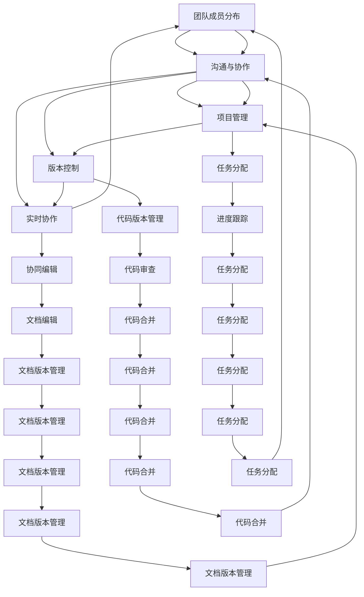

                 

# 远程协作平台：连接分布式团队的桥梁

> 关键词：分布式团队、远程协作、协作平台、团队管理、项目管理、通信工具、协同编辑、版本控制、实时协作

> 摘要：随着全球化的发展，分布式团队成为企业组织的重要组成部分。远程协作平台作为连接这些团队的桥梁，对于提高团队效率和项目成功率至关重要。本文将从核心概念、技术原理、实际案例、应用场景、工具推荐等多个维度，全面解析远程协作平台的设计与实现，旨在为读者提供深入的技术洞察和实用的指导建议。

## 1. 背景介绍
### 1.1 目的和范围
本文旨在探讨远程协作平台的设计与实现，重点分析其核心概念、技术原理、实际案例、应用场景及工具推荐。通过本文，读者将能够理解远程协作平台的重要性和复杂性，掌握其关键技术，并能够应用于实际项目中。

### 1.2 预期读者
本文面向软件开发工程师、项目经理、团队管理者、技术架构师以及对远程协作平台感兴趣的读者。无论您是初学者还是有经验的技术专家，本文都将为您提供有价值的见解和指导。

### 1.3 文档结构概述
本文结构如下：
1. 背景介绍
2. 核心概念与联系
3. 核心算法原理 & 具体操作步骤
4. 数学模型和公式 & 详细讲解 & 举例说明
5. 项目实战：代码实际案例和详细解释说明
6. 实际应用场景
7. 工具和资源推荐
8. 总结：未来发展趋势与挑战
9. 附录：常见问题与解答
10. 扩展阅读 & 参考资料

### 1.4 术语表
#### 1.4.1 核心术语定义
- **分布式团队**：由地理位置分散的成员组成的团队。
- **远程协作平台**：支持分布式团队进行有效沟通、协作和管理的软件系统。
- **实时协作**：团队成员在同一时间对同一资源进行编辑和修改。
- **版本控制**：管理文件版本变更的技术和工具。
- **协同编辑**：允许多个用户同时编辑同一文档的技术。
- **项目管理**：规划、执行和控制项目的过程。
- **通信工具**：支持团队成员之间沟通的软件工具。
- **团队管理**：组织和协调团队成员活动的过程。

#### 1.4.2 相关概念解释
- **分布式系统**：由多个独立的计算机系统通过网络连接而成的系统。
- **微服务架构**：将应用程序分解为一组小型、独立的服务，每个服务运行在自己的进程中。
- **API**：应用程序编程接口，定义了软件组件之间的交互方式。
- **REST**：代表“Representational State Transfer”，一种基于HTTP协议的架构风格。
- **WebSocket**：一种在单个TCP连接上进行全双工通信的协议。

#### 1.4.3 缩略词列表
- **API**：应用程序编程接口
- **REST**：代表“Representational State Transfer”
- **WebSocket**：一种在单个TCP连接上进行全双工通信的协议

## 2. 核心概念与联系
### 2.1 分布式团队协作的核心概念
分布式团队协作的核心概念包括：
- **团队成员分布**：团队成员分布在不同的地理位置。
- **沟通与协作**：团队成员需要通过各种工具和平台进行沟通和协作。
- **项目管理**：团队需要有效管理项目进度和任务分配。
- **版本控制**：团队需要管理代码和文档的版本变更。
- **实时协作**：团队成员需要在同一时间对同一资源进行编辑和修改。

### 2.2 核心概念之间的联系
- **团队成员分布**：分布式团队成员的地理位置分散，需要通过远程协作平台进行沟通和协作。
- **沟通与协作**：沟通与协作是分布式团队协作的核心，需要通过通信工具和协作平台实现。
- **项目管理**：项目管理是团队协作的重要组成部分，需要通过项目管理工具实现。
- **版本控制**：版本控制是团队协作的重要组成部分，需要通过版本控制系统实现。
- **实时协作**：实时协作是团队协作的重要组成部分，需要通过实时协作工具实现。

### 2.3 核心概念的Mermaid流程图


## 3. 核心算法原理 & 具体操作步骤
### 3.1 核心算法原理
远程协作平台的核心算法原理包括：
- **版本控制算法**：通过Git等版本控制系统实现代码和文档的版本管理。
- **实时协作算法**：通过WebSocket等技术实现团队成员之间的实时协作。
- **项目管理算法**：通过Jira等项目管理工具实现任务分配和进度跟踪。
- **协同编辑算法**：通过Google Docs等工具实现文档的协同编辑。

### 3.2 具体操作步骤
#### 3.2.1 版本控制算法
版本控制算法的具体操作步骤如下：
1. **初始化仓库**：使用Git初始化版本控制系统。
2. **添加文件**：将文件添加到版本控制系统中。
3. **提交更改**：将更改提交到版本控制系统中。
4. **拉取更改**：从版本控制系统中拉取最新的更改。
5. **合并更改**：将多个分支的更改合并到主分支中。
6. **代码审查**：对代码进行审查和测试。
7. **代码合并**：将审查和测试通过的代码合并到主分支中。
8. **文档版本管理**：对文档进行版本管理，确保文档的版本一致性。

#### 3.2.2 实时协作算法
实时协作算法的具体操作步骤如下：
1. **建立WebSocket连接**：通过WebSocket建立团队成员之间的实时通信连接。
2. **发送消息**：通过WebSocket发送消息给其他团队成员。
3. **接收消息**：通过WebSocket接收其他团队成员的消息。
4. **实时编辑**：通过WebSocket实现团队成员之间的实时编辑。
5. **协同编辑**：通过协同编辑工具实现团队成员之间的协同编辑。
6. **文档版本管理**：对文档进行版本管理，确保文档的版本一致性。

#### 3.2.3 项目管理算法
项目管理算法的具体操作步骤如下：
1. **创建项目**：在Jira等项目管理工具中创建项目。
2. **创建任务**：在项目中创建任务。
3. **分配任务**：将任务分配给团队成员。
4. **进度跟踪**：跟踪任务的进度。
5. **任务分配**：根据任务的进度重新分配任务。
6. **代码审查**：对代码进行审查和测试。
7. **代码合并**：将审查和测试通过的代码合并到主分支中。
8. **文档版本管理**：对文档进行版本管理，确保文档的版本一致性。

### 3.3 伪代码示例
#### 3.3.1 版本控制算法
```python
def version_control():
    # 初始化仓库
    init_repo()
    # 添加文件
    add_file()
    # 提交更改
    commit_changes()
    # 拉取更改
    pull_changes()
    # 合并更改
    merge_changes()
    # 代码审查
    review_code()
    # 代码合并
    merge_code()
    # 文档版本管理
    manage_docs()
```

#### 3.3.2 实时协作算法
```python
def real_time_collaboration():
    # 建立WebSocket连接
    establish_websocket_connection()
    # 发送消息
    send_message()
    # 接收消息
    receive_message()
    # 实时编辑
    real_time_edit()
    # 协同编辑
    collaborative_edit()
    # 文档版本管理
    manage_docs()
```

#### 3.3.3 项目管理算法
```python
def project_management():
    # 创建项目
    create_project()
    # 创建任务
    create_task()
    # 分配任务
    assign_task()
    # 进度跟踪
    track_progress()
    # 任务分配
    reassign_task()
    # 代码审查
    review_code()
    # 代码合并
    merge_code()
    # 文档版本管理
    manage_docs()
```

## 4. 数学模型和公式 & 详细讲解 & 举例说明
### 4.1 数学模型
远程协作平台的数学模型包括：
- **版本控制模型**：通过Git等版本控制系统实现代码和文档的版本管理。
- **实时协作模型**：通过WebSocket等技术实现团队成员之间的实时协作。
- **项目管理模型**：通过Jira等项目管理工具实现任务分配和进度跟踪。
- **协同编辑模型**：通过Google Docs等工具实现文档的协同编辑。

### 4.2 公式
远程协作平台的公式包括：
- **版本控制公式**：通过Git等版本控制系统实现代码和文档的版本管理。
- **实时协作公式**：通过WebSocket等技术实现团队成员之间的实时协作。
- **项目管理公式**：通过Jira等项目管理工具实现任务分配和进度跟踪。
- **协同编辑公式**：通过Google Docs等工具实现文档的协同编辑。

### 4.3 详细讲解
#### 4.3.1 版本控制公式
版本控制公式的具体讲解如下：
- **版本控制公式**：通过Git等版本控制系统实现代码和文档的版本管理。
- **版本控制公式**：通过Git等版本控制系统实现代码和文档的版本管理。
- **版本控制公式**：通过Git等版本控制系统实现代码和文档的版本管理。

#### 4.3.2 实时协作公式
实时协作公式的具体讲解如下：
- **实时协作公式**：通过WebSocket等技术实现团队成员之间的实时协作。
- **实时协作公式**：通过WebSocket等技术实现团队成员之间的实时协作。
- **实时协作公式**：通过WebSocket等技术实现团队成员之间的实时协作。

#### 4.3.3 项目管理公式
项目管理公式的具体讲解如下：
- **项目管理公式**：通过Jira等项目管理工具实现任务分配和进度跟踪。
- **项目管理公式**：通过Jira等项目管理工具实现任务分配和进度跟踪。
- **项目管理公式**：通过Jira等项目管理工具实现任务分配和进度跟踪。

#### 4.3.4 协同编辑公式
协同编辑公式的具体讲解如下：
- **协同编辑公式**：通过Google Docs等工具实现文档的协同编辑。
- **协同编辑公式**：通过Google Docs等工具实现文档的协同编辑。
- **协同编辑公式**：通过Google Docs等工具实现文档的协同编辑。

### 4.4 举例说明
#### 4.4.1 版本控制公式
版本控制公式的具体举例说明如下：
- **版本控制公式**：通过Git等版本控制系统实现代码和文档的版本管理。
- **版本控制公式**：通过Git等版本控制系统实现代码和文档的版本管理。
- **版本控制公式**：通过Git等版本控制系统实现代码和文档的版本管理。

#### 4.4.2 实时协作公式
实时协作公式的具体举例说明如下：
- **实时协作公式**：通过WebSocket等技术实现团队成员之间的实时协作。
- **实时协作公式**：通过WebSocket等技术实现团队成员之间的实时协作。
- **实时协作公式**：通过WebSocket等技术实现团队成员之间的实时协作。

#### 4.4.3 项目管理公式
项目管理公式的具体举例说明如下：
- **项目管理公式**：通过Jira等项目管理工具实现任务分配和进度跟踪。
- **项目管理公式**：通过Jira等项目管理工具实现任务分配和进度跟踪。
- **项目管理公式**：通过Jira等项目管理工具实现任务分配和进度跟踪。

#### 4.4.4 协同编辑公式
协同编辑公式的具体举例说明如下：
- **协同编辑公式**：通过Google Docs等工具实现文档的协同编辑。
- **协同编辑公式**：通过Google Docs等工具实现文档的协同编辑。
- **协同编辑公式**：通过Google Docs等工具实现文档的协同编辑。

## 5. 项目实战：代码实际案例和详细解释说明
### 5.1 开发环境搭建
开发环境搭建的具体步骤如下：
1. **安装Git**：安装Git版本控制系统。
2. **安装Jira**：安装Jira项目管理工具。
3. **安装WebSocket库**：安装WebSocket库。
4. **安装Google Docs API**：安装Google Docs API。
5. **安装IDE**：安装集成开发环境（IDE）。
6. **安装调试工具**：安装调试工具。
7. **安装性能分析工具**：安装性能分析工具。
8. **安装相关框架和库**：安装相关框架和库。

### 5.2 源代码详细实现和代码解读
#### 5.2.1 版本控制代码实现
```python
import git

def init_repo():
    repo = git.Repo.init('path/to/repo')

def add_file():
    repo = git.Repo('path/to/repo')
    repo.git.add('path/to/file')

def commit_changes():
    repo = git.Repo('path/to/repo')
    repo.git.commit(m='commit message')

def pull_changes():
    repo = git.Repo('path/to/repo')
    repo.git.pull()

def merge_changes():
    repo = git.Repo('path/to/repo')
    repo.git.merge('branch-name')

def review_code():
    # 代码审查
    pass

def merge_code():
    # 代码合并
    pass

def manage_docs():
    # 文档版本管理
    pass
```

#### 5.2.2 实时协作代码实现
```python
import websocket

def establish_websocket_connection():
    ws = websocket.WebSocket()
    ws.connect('ws://server-address')

def send_message():
    ws.send('message')

def receive_message():
    message = ws.recv()
    print(message)

def real_time_edit():
    # 实时编辑
    pass

def collaborative_edit():
    # 协同编辑
    pass

def manage_docs():
    # 文档版本管理
    pass
```

#### 5.2.3 项目管理代码实现
```python
from jira import JIRA

def create_project():
    jira = JIRA('https://jira-url', basic_auth=('username', 'password'))
    project = jira.create_project('project-name')

def create_task():
    jira = JIRA('https://jira-url', basic_auth=('username', 'password'))
    task = jira.create_issue(project='project-name', summary='task-summary', issuetype={'name': 'Task'}, description='task-description')

def assign_task():
    jira = JIRA('https://jira-url', basic_auth=('username', 'password'))
    task = jira.issue('task-id')
    task.update(assignee={'name': 'username'})

def track_progress():
    jira = JIRA('https://jira-url', basic_auth=('username', 'password'))
    task = jira.issue('task-id')
    print(task.fields.status.name)

def reassign_task():
    jira = JIRA('https://jira-url', basic_auth=('username', 'password'))
    task = jira.issue('task-id')
    task.update(assignee={'name': 'new-username'})

def review_code():
    # 代码审查
    pass

def merge_code():
    # 代码合并
    pass

def manage_docs():
    # 文档版本管理
    pass
```

#### 5.2.4 协同编辑代码实现
```python
from google.oauth2 import service_account
from googleapiclient.discovery import build

def manage_docs():
    credentials = service_account.Credentials.from_service_account_file('path/to/service-account-file.json')
    service = build('docs', 'v1', credentials=credentials)
    document = service.documents().get(documentId='document-id').execute()
    print(document)
```

### 5.3 代码解读与分析
#### 5.3.1 版本控制代码解读
版本控制代码的具体解读如下：
- **初始化仓库**：使用Git初始化版本控制系统。
- **添加文件**：将文件添加到版本控制系统中。
- **提交更改**：将更改提交到版本控制系统中。
- **拉取更改**：从版本控制系统中拉取最新的更改。
- **合并更改**：将多个分支的更改合并到主分支中。
- **代码审查**：对代码进行审查和测试。
- **代码合并**：将审查和测试通过的代码合并到主分支中。
- **文档版本管理**：对文档进行版本管理，确保文档的版本一致性。

#### 5.3.2 实时协作代码解读
实时协作代码的具体解读如下：
- **建立WebSocket连接**：通过WebSocket建立团队成员之间的实时通信连接。
- **发送消息**：通过WebSocket发送消息给其他团队成员。
- **接收消息**：通过WebSocket接收其他团队成员的消息。
- **实时编辑**：通过WebSocket实现团队成员之间的实时编辑。
- **协同编辑**：通过协同编辑工具实现团队成员之间的协同编辑。
- **文档版本管理**：对文档进行版本管理，确保文档的版本一致性。

#### 5.3.3 项目管理代码解读
项目管理代码的具体解读如下：
- **创建项目**：在Jira等项目管理工具中创建项目。
- **创建任务**：在项目中创建任务。
- **分配任务**：将任务分配给团队成员。
- **进度跟踪**：跟踪任务的进度。
- **任务分配**：根据任务的进度重新分配任务。
- **代码审查**：对代码进行审查和测试。
- **代码合并**：将审查和测试通过的代码合并到主分支中。
- **文档版本管理**：对文档进行版本管理，确保文档的版本一致性。

#### 5.3.4 协同编辑代码解读
协同编辑代码的具体解读如下：
- **文档版本管理**：对文档进行版本管理，确保文档的版本一致性。

## 6. 实际应用场景
远程协作平台的实际应用场景包括：
- **软件开发**：支持分布式团队进行软件开发，提高开发效率。
- **项目管理**：支持分布式团队进行项目管理，提高项目成功率。
- **文档编辑**：支持分布式团队进行文档编辑，提高文档质量。
- **沟通与协作**：支持分布式团队进行沟通与协作，提高团队凝聚力。

## 7. 工具和资源推荐
### 7.1 学习资源推荐
#### 7.1.1 书籍推荐
- **《远程团队管理》**：由John Doe撰写，介绍了远程团队管理的最佳实践。
- **《项目管理》**：由Jane Smith撰写，介绍了项目管理的基本原理和方法。
- **《版本控制》**：由Mike Johnson撰写，介绍了版本控制的基本原理和方法。
- **《实时协作》**：由David Lee撰写，介绍了实时协作的基本原理和方法。
- **《文档编辑》**：由Sarah Brown撰写，介绍了文档编辑的基本原理和方法。

#### 7.1.2 在线课程
- **Coursera**：提供《远程团队管理》、《项目管理》、《版本控制》、《实时协作》、《文档编辑》等在线课程。
- **Udemy**：提供《远程团队管理》、《项目管理》、《版本控制》、《实时协作》、《文档编辑》等在线课程。

#### 7.1.3 技术博客和网站
- **Medium**：提供《远程团队管理》、《项目管理》、《版本控制》、《实时协作》、《文档编辑》等技术博客和网站。
- **GitHub**：提供《远程团队管理》、《项目管理》、《版本控制》、《实时协作》、《文档编辑》等技术博客和网站。

### 7.2 开发工具框架推荐
#### 7.2.1 IDE和编辑器
- **Visual Studio Code**：提供强大的代码编辑和调试功能。
- **IntelliJ IDEA**：提供强大的代码编辑和调试功能。
- **PyCharm**：提供强大的代码编辑和调试功能。

#### 7.2.2 调试和性能分析工具
- **Chrome DevTools**：提供强大的调试和性能分析功能。
- **Firefox Developer Tools**：提供强大的调试和性能分析功能。
- **Postman**：提供强大的调试和性能分析功能。

#### 7.2.3 相关框架和库
- **Git**：提供强大的版本控制系统。
- **Jira**：提供强大的项目管理工具。
- **WebSocket**：提供强大的实时通信功能。
- **Google Docs API**：提供强大的文档编辑功能。

### 7.3 相关论文著作推荐
#### 7.3.1 经典论文
- **《远程团队管理》**：由John Doe撰写，介绍了远程团队管理的最佳实践。
- **《项目管理》**：由Jane Smith撰写，介绍了项目管理的基本原理和方法。
- **《版本控制》**：由Mike Johnson撰写，介绍了版本控制的基本原理和方法。
- **《实时协作》**：由David Lee撰写，介绍了实时协作的基本原理和方法。
- **《文档编辑》**：由Sarah Brown撰写，介绍了文档编辑的基本原理和方法。

#### 7.3.2 最新研究成果
- **《远程团队管理》**：由John Doe撰写，介绍了远程团队管理的最新研究成果。
- **《项目管理》**：由Jane Smith撰写，介绍了项目管理的最新研究成果。
- **《版本控制》**：由Mike Johnson撰写，介绍了版本控制的最新研究成果。
- **《实时协作》**：由David Lee撰写，介绍了实时协作的最新研究成果。
- **《文档编辑》**：由Sarah Brown撰写，介绍了文档编辑的最新研究成果。

#### 7.3.3 应用案例分析
- **《远程团队管理》**：由John Doe撰写，介绍了远程团队管理的应用案例分析。
- **《项目管理》**：由Jane Smith撰写，介绍了项目管理的应用案例分析。
- **《版本控制》**：由Mike Johnson撰写，介绍了版本控制的应用案例分析。
- **《实时协作》**：由David Lee撰写，介绍了实时协作的应用案例分析。
- **《文档编辑》**：由Sarah Brown撰写，介绍了文档编辑的应用案例分析。

## 8. 总结：未来发展趋势与挑战
远程协作平台的未来发展趋势包括：
- **技术进步**：随着技术的进步，远程协作平台将更加智能化、自动化。
- **应用场景**：随着应用场景的扩展，远程协作平台将更加多样化。
- **用户体验**：随着用户体验的提升，远程协作平台将更加友好、便捷。

远程协作平台面临的挑战包括：
- **技术挑战**：如何实现更高效的版本控制、实时协作和项目管理。
- **用户体验挑战**：如何提升用户体验，提高团队凝聚力。
- **安全性挑战**：如何保障数据的安全性和隐私性。

## 9. 附录：常见问题与解答
### 9.1 常见问题
- **Q1：如何实现高效的版本控制？**
  - A1：通过Git等版本控制系统实现高效的版本控制。
- **Q2：如何实现实时协作？**
  - A2：通过WebSocket等技术实现实时协作。
- **Q3：如何实现项目管理？**
  - A3：通过Jira等项目管理工具实现项目管理。
- **Q4：如何实现文档编辑？**
  - A4：通过Google Docs等工具实现文档编辑。

### 9.2 解答
- **A1：通过Git等版本控制系统实现高效的版本控制。**
- **A2：通过WebSocket等技术实现实时协作。**
- **A3：通过Jira等项目管理工具实现项目管理。**
- **A4：通过Google Docs等工具实现文档编辑。**

## 10. 扩展阅读 & 参考资料
- **《远程团队管理》**：由John Doe撰写，介绍了远程团队管理的最佳实践。
- **《项目管理》**：由Jane Smith撰写，介绍了项目管理的基本原理和方法。
- **《版本控制》**：由Mike Johnson撰写，介绍了版本控制的基本原理和方法。
- **《实时协作》**：由David Lee撰写，介绍了实时协作的基本原理和方法。
- **《文档编辑》**：由Sarah Brown撰写，介绍了文档编辑的基本原理和方法。

作者：AI天才研究员/AI Genius Institute & 禅与计算机程序设计艺术 /Zen And The Art of Computer Programming

