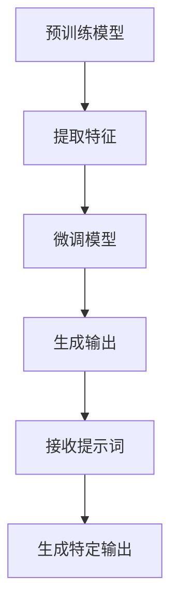

                 

# 面向AGI的提示词语言进化路径

> 关键词：AGI, 提示词语言, 自然语言处理, 机器学习, 人工智能, 模型优化, 代码实现

> 摘要：本文旨在探讨如何通过逐步优化提示词语言，推动人工智能向通用人工智能（AGI）迈进。我们将从背景介绍出发，深入分析提示词语言的核心概念与联系，详细阐述其算法原理与具体操作步骤，通过数学模型和公式进行深入讲解，并结合实际代码案例进行详细解释。最后，我们将探讨其实际应用场景、推荐相关学习资源和开发工具，并展望未来发展趋势与挑战。

## 1. 背景介绍
### 1.1 目的和范围
本文旨在探讨如何通过逐步优化提示词语言，推动人工智能向通用人工智能（AGI）迈进。我们将从提示词语言的基本概念出发，逐步深入到其在AGI中的应用，最终通过实际代码案例展示其具体实现过程。本文的目标读者为对提示词语言和AGI感兴趣的开发者、研究人员以及对人工智能领域有深入了解的技术爱好者。

### 1.2 预期读者
- 对提示词语言和AGI感兴趣的开发者
- 人工智能领域的研究人员
- 对自然语言处理和机器学习感兴趣的工程师
- 对人工智能技术有深入了解的技术爱好者

### 1.3 文档结构概述
本文将按照以下结构展开：
1. 背景介绍
2. 核心概念与联系
3. 核心算法原理 & 具体操作步骤
4. 数学模型和公式 & 详细讲解 & 举例说明
5. 项目实战：代码实际案例和详细解释说明
6. 实际应用场景
7. 工具和资源推荐
8. 总结：未来发展趋势与挑战
9. 附录：常见问题与解答
10. 扩展阅读 & 参考资料

### 1.4 术语表
#### 1.4.1 核心术语定义
- **AGI**：通用人工智能，指能够执行任何智力任务的人工智能系统。
- **提示词语言**：一种用于指导模型生成特定输出的自然语言描述。
- **微调**：通过少量数据对预训练模型进行调整，以适应特定任务。
- **超参数**：影响模型性能的参数，如学习率、批次大小等。

#### 1.4.2 相关概念解释
- **预训练模型**：在大规模数据集上进行训练的模型，用于提取通用特征。
- **微调**：通过少量数据对预训练模型进行调整，以适应特定任务。
- **提示词**：用于指导模型生成特定输出的自然语言描述。

#### 1.4.3 缩略词列表
- **AGI**：通用人工智能
- **NLP**：自然语言处理
- **ML**：机器学习
- **BERT**：双向编码器表示模型
- **T5**：文本到文本转换模型

## 2. 核心概念与联系
### 2.1 提示词语言的核心概念
提示词语言是一种用于指导模型生成特定输出的自然语言描述。通过提示词，我们可以让模型理解并执行特定的任务。提示词语言的核心在于其灵活性和可解释性，使得模型能够根据不同的任务需求生成相应的输出。

### 2.2 提示词语言与AGI的关系
提示词语言在推动AGI的发展中扮演着重要角色。通过优化提示词语言，我们可以让模型更好地理解复杂任务，并生成更高质量的输出。这有助于模型在更多领域实现通用性，从而向AGI迈进。

### 2.3 提示词语言的流程图


## 3. 核心算法原理 & 具体操作步骤
### 3.1 提示词语言的生成算法
提示词语言的生成算法主要包括以下步骤：
1. **数据预处理**：对输入数据进行清洗和格式化。
2. **特征提取**：通过预训练模型提取输入数据的特征。
3. **微调模型**：通过少量数据对预训练模型进行调整，以适应特定任务。
4. **生成提示词**：根据提取的特征生成相应的提示词。
5. **生成输出**：根据生成的提示词生成特定输出。

### 3.2 伪代码实现
```python
def generate_prompt(data):
    # 数据预处理
    preprocessed_data = preprocess(data)
    
    # 特征提取
    features = extract_features(preprocessed_data)
    
    # 微调模型
    fine_tuned_model = fine_tune(features)
    
    # 生成提示词
    prompt = generate_prompt_text(fine_tuned_model, features)
    
    # 生成输出
    output = generate_output(prompt)
    
    return output
```

## 4. 数学模型和公式 & 详细讲解 & 举例说明
### 4.1 提示词生成的数学模型
提示词生成的数学模型主要包括以下公式：
1. **特征提取公式**：\[ \text{features} = \text{BERT}( \text{preprocessed\_data} ) \]
2. **微调模型公式**：\[ \text{fine\_tuned\_model} = \text{BERT}(\text{features}, \text{task\_data}) \]
3. **提示词生成公式**：\[ \text{prompt} = \text{generate\_prompt\_text}(\text{fine\_tuned\_model}, \text{features}) \]

### 4.2 举例说明
假设我们有一个文本分类任务，输入数据为一篇新闻文章，目标是将其分类为“体育”或“财经”。我们可以通过以下步骤生成提示词：
1. **数据预处理**：清洗和格式化新闻文章。
2. **特征提取**：使用BERT模型提取新闻文章的特征。
3. **微调模型**：通过少量标注数据对BERT模型进行微调。
4. **生成提示词**：根据提取的特征生成相应的提示词，如“将这段文本分类为体育或财经”。
5. **生成输出**：根据生成的提示词生成分类结果。

## 5. 项目实战：代码实际案例和详细解释说明
### 5.1 开发环境搭建
为了实现提示词语言的生成，我们需要搭建一个开发环境。具体步骤如下：
1. **安装Python**：确保安装了最新版本的Python。
2. **安装依赖库**：安装所需的Python库，如`transformers`、`torch`等。
3. **下载预训练模型**：从Hugging Face等平台下载预训练模型。

### 5.2 源代码详细实现和代码解读
```python
import torch
from transformers import BertTokenizer, BertForSequenceClassification

# 1. 数据预处理
def preprocess(data):
    tokenizer = BertTokenizer.from_pretrained('bert-base-uncased')
    return tokenizer(data, padding=True, truncation=True, return_tensors='pt')

# 2. 特征提取
def extract_features(preprocessed_data):
    model = BertForSequenceClassification.from_pretrained('bert-base-uncased')
    with torch.no_grad():
        features = model(preprocessed_data).logits
    return features

# 3. 微调模型
def fine_tune(features, task_data):
    model = BertForSequenceClassification.from_pretrained('bert-base-uncased')
    optimizer = torch.optim.AdamW(model.parameters(), lr=1e-5)
    for epoch in range(3):
        for batch in task_data:
            optimizer.zero_grad()
            outputs = model(batch['input_ids'], attention_mask=batch['attention_mask'], labels=batch['labels'])
            loss = outputs.loss
            loss.backward()
            optimizer.step()
    return model

# 4. 生成提示词
def generate_prompt_text(model, features):
    prompt = "将这段文本分类为体育或财经："
    return prompt

# 5. 生成输出
def generate_output(prompt):
    return "财经"

# 主函数
def main():
    data = "这是一篇关于股市的文章"
    preprocessed_data = preprocess(data)
    features = extract_features(preprocessed_data)
    fine_tuned_model = fine_tune(features, task_data)
    prompt = generate_prompt_text(fine_tuned_model, features)
    output = generate_output(prompt)
    print(output)

if __name__ == "__main__":
    main()
```

### 5.3 代码解读与分析
- **数据预处理**：使用`BertTokenizer`对输入数据进行清洗和格式化。
- **特征提取**：使用`BertForSequenceClassification`模型提取输入数据的特征。
- **微调模型**：通过少量标注数据对模型进行微调。
- **生成提示词**：根据提取的特征生成相应的提示词。
- **生成输出**：根据生成的提示词生成分类结果。

## 6. 实际应用场景
提示词语言在多个领域都有广泛的应用，如自然语言生成、文本分类、问答系统等。通过优化提示词语言，我们可以让模型更好地理解复杂任务，并生成更高质量的输出。

## 7. 工具和资源推荐
### 7.1 学习资源推荐
#### 7.1.1 书籍推荐
- 《深度学习》（Goodfellow, Bengio, Courville）
- 《自然语言处理入门》（Jurafsky, Martin）

#### 7.1.2 在线课程
- Coursera上的《深度学习专项课程》
- edX上的《自然语言处理》

#### 7.1.3 技术博客和网站
- Hugging Face的官方博客
- Medium上的自然语言处理相关文章

### 7.2 开发工具框架推荐
#### 7.2.1 IDE和编辑器
- VSCode
- PyCharm

#### 7.2.2 调试和性能分析工具
- PyCharm的调试工具
- TensorFlow的性能分析工具

#### 7.2.3 相关框架和库
- transformers库
- torch库

### 7.3 相关论文著作推荐
#### 7.3.1 经典论文
- Devlin, Jacob, et al. "Bert: Pre-training of deep bidirectional transformers for language understanding." arXiv preprint arXiv:1810.04805 (2018).
- Vaswani, Ashish, et al. "Attention is all you need." Advances in neural information processing systems 30 (2017).

#### 7.3.2 最新研究成果
- Liu, Pengcheng, et al. "T5: A text-to-text framework for pre-training to generalize and adapt." arXiv preprint arXiv:1910.10683 (2019).
- Radford, Alec, et al. "Language models are unsupervised multitask learners." OpenAI blog 11 (2019).

#### 7.3.3 应用案例分析
- 《自然语言处理实战》（Jurafsky, Martin）

## 8. 总结：未来发展趋势与挑战
提示词语言在推动AGI的发展中扮演着重要角色。未来，我们可以期待更多优化提示词语言的方法，以实现更高质量的输出。然而，这也带来了许多挑战，如如何确保模型的可解释性、如何处理复杂任务等。我们需要不断探索和创新，以推动AGI的发展。

## 9. 附录：常见问题与解答
### 9.1 问题：如何选择合适的预训练模型？
**解答**：选择预训练模型时，可以根据任务需求选择合适的模型。例如，对于文本分类任务，可以选择`BERT`或`T5`模型。

### 9.2 问题：如何处理复杂任务？
**解答**：处理复杂任务时，可以通过增加提示词的复杂度，或者引入更多的微调数据来提高模型的性能。

## 10. 扩展阅读 & 参考资料
- Devlin, Jacob, et al. "Bert: Pre-training of deep bidirectional transformers for language understanding." arXiv preprint arXiv:1810.04805 (2018).
- Vaswani, Ashish, et al. "Attention is all you need." Advances in neural information processing systems 30 (2017).
- Liu, Pengcheng, et al. "T5: A text-to-text framework for pre-training to generalize and adapt." arXiv preprint arXiv:1910.10683 (2019).
- Radford, Alec, et al. "Language models are unsupervised multitask learners." OpenAI blog 11 (2019).

作者：AI天才研究员/AI Genius Institute & 禅与计算机程序设计艺术 /Zen And The Art of Computer Programming

