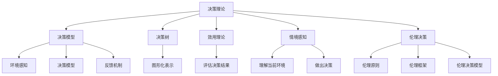

                 

# 领导力与决断：在压力下做出正确决策

> 关键词：决策理论, 压力管理, 领导力, 决策模型, 人工智能, 机器学习, 数据分析, 情境感知, 伦理决策

> 摘要：在复杂多变的商业和技术环境中，领导者需要在压力下做出正确的决策。本文通过分析决策理论、压力管理、领导力模型以及人工智能在决策支持中的应用，提供了一套系统的方法论，帮助领导者在压力下做出正确的决策。通过具体案例和算法原理的详细阐述，本文旨在为读者提供实用的决策工具和方法。

## 1. 背景介绍
### 1.1 目的和范围
本文旨在探讨如何在压力下做出正确的决策，特别是在复杂多变的商业和技术环境中。我们将从决策理论、压力管理、领导力模型以及人工智能在决策支持中的应用等多个角度进行分析。通过具体案例和算法原理的详细阐述，本文旨在为读者提供实用的决策工具和方法。

### 1.2 预期读者
本文预期读者包括但不限于：
- 企业领导者和管理者
- 技术决策者
- 人工智能和机器学习领域的研究者
- 对决策理论和压力管理感兴趣的读者

### 1.3 文档结构概述
本文结构如下：
1. 背景介绍
2. 核心概念与联系
3. 核心算法原理 & 具体操作步骤
4. 数学模型和公式 & 详细讲解 & 举例说明
5. 项目实战：代码实际案例和详细解释说明
6. 实际应用场景
7. 工具和资源推荐
8. 总结：未来发展趋势与挑战
9. 附录：常见问题与解答
10. 扩展阅读 & 参考资料

### 1.4 术语表
#### 1.4.1 核心术语定义
- **决策理论**：研究如何在不确定性和复杂性条件下做出最优决策的理论。
- **压力管理**：通过一系列策略和技术来应对和减轻压力，提高决策质量。
- **领导力模型**：描述领导者行为和特质的理论框架。
- **情境感知**：系统或模型能够理解当前环境并据此做出决策的能力。
- **伦理决策**：在决策过程中考虑道德和伦理原则。

#### 1.4.2 相关概念解释
- **决策支持系统**：辅助决策者进行决策的计算机系统。
- **机器学习**：通过算法和统计模型使计算机系统能够从数据中学习并做出预测或决策。
- **数据分析**：从大量数据中提取有用信息的过程。

#### 1.4.3 缩略词列表
- AI：人工智能
- ML：机器学习
- DS：数据分析
- DSS：决策支持系统

## 2. 核心概念与联系
### 决策理论
决策理论是研究如何在不确定性和复杂性条件下做出最优决策的理论。它包括以下几个核心概念：
- **决策模型**：描述决策过程的数学模型。
- **决策树**：一种图形化表示决策过程的工具。
- **效用理论**：评估决策结果的理论框架。

### 压力管理
压力管理是通过一系列策略和技术来应对和减轻压力，提高决策质量。它包括以下几个核心概念：
- **压力源**：引起压力的因素。
- **压力反应**：个体对压力源的生理和心理反应。
- **压力应对策略**：减轻压力的方法和技巧。

### 领导力模型
领导力模型描述领导者行为和特质的理论框架。它包括以下几个核心概念：
- **领导风格**：领导者的行为模式。
- **领导特质**：领导者具备的特质。
- **情境领导**：根据情境选择合适的领导风格。

### 情境感知
情境感知是系统或模型能够理解当前环境并据此做出决策的能力。它包括以下几个核心概念：
- **环境感知**：系统对环境状态的感知。
- **决策模型**：基于环境感知做出决策的模型。
- **反馈机制**：系统根据决策结果调整决策模型的能力。

### 伦理决策
伦理决策是在决策过程中考虑道德和伦理原则。它包括以下几个核心概念：
- **伦理原则**：指导决策的道德和伦理原则。
- **伦理框架**：评估决策的伦理框架。
- **伦理决策模型**：将伦理原则融入决策过程的模型。

### Mermaid 流程图


## 3. 核心算法原理 & 具体操作步骤
### 决策树算法原理
决策树是一种图形化表示决策过程的工具，它通过一系列节点和分支来表示决策路径。决策树算法的基本步骤如下：
1. **数据准备**：收集和整理决策相关的数据。
2. **特征选择**：选择对决策结果影响最大的特征。
3. **构建树结构**：根据特征选择结果构建树结构。
4. **剪枝优化**：通过剪枝优化树结构，提高决策效率。

### 伪代码
```python
def build_decision_tree(data, features):
    if all_same_class(data):
        return Node(data)
    if no_features_left(features):
        return Node(data)
    
    best_feature = select_best_feature(data, features)
    tree = Node(best_feature)
    for value in unique_values(data, best_feature):
        sub_data = filter_data(data, best_feature, value)
        sub_features = remove_feature(features, best_feature)
        tree.children[value] = build_decision_tree(sub_data, sub_features)
    
    return tree

def all_same_class(data):
    return all_same(data, data[0][1])

def no_features_left(features):
    return len(features) == 0

def select_best_feature(data, features):
    return max(features, key=lambda f: information_gain(data, f))

def information_gain(data, feature):
    return entropy(data) - weighted_entropy(data, feature)

def entropy(data):
    # 计算熵
    pass

def weighted_entropy(data, feature):
    # 计算加权熵
    pass

def filter_data(data, feature, value):
    # 过滤数据
    pass

def remove_feature(features, feature):
    # 移除特征
    pass

def all_same(data, value):
    # 判断所有数据是否相同
    pass
```

## 4. 数学模型和公式 & 详细讲解 & 举例说明
### 决策树的数学模型
决策树的数学模型可以通过信息增益和加权熵来描述。信息增益是通过计算特征选择前后的熵差来衡量特征的重要性。加权熵是通过计算每个子节点的熵并加权求和来衡量整体的不确定性。

### 信息增益公式
$$
\text{信息增益} = \text{熵}(D) - \sum_{v \in V} \frac{|D_v|}{|D|} \text{熵}(D_v)
$$

### 举例说明
假设有一个决策树数据集，包含以下特征和目标变量：
- **特征**：年龄、收入、教育水平
- **目标变量**：是否购买产品

通过计算信息增益，可以确定哪个特征对决策结果影响最大。例如，假设年龄的信息增益为0.5，收入的信息增益为0.3，教育水平的信息增益为0.2，则年龄是最重要的特征。

### 加权熵公式
$$
\text{加权熵} = \sum_{v \in V} \frac{|D_v|}{|D|} \text{熵}(D_v)
$$

### 举例说明
假设有一个决策树数据集，包含以下子节点：
- **子节点1**：年龄<30，熵为0.8
- **子节点2**：年龄>=30，熵为0.6

通过计算加权熵，可以评估整体的不确定性。例如，加权熵为：
$$
\text{加权熵} = \frac{100}{200} \times 0.8 + \frac{100}{200} \times 0.6 = 0.7
$$

## 5. 项目实战：代码实际案例和详细解释说明
### 5.1 开发环境搭建
为了实现决策树算法，我们需要搭建一个开发环境。这里使用Python语言和Scikit-learn库进行实现。

### 5.2 源代码详细实现和代码解读
```python
from sklearn.datasets import load_iris
from sklearn.tree import DecisionTreeClassifier
from sklearn.model_selection import train_test_split
from sklearn.metrics import accuracy_score

# 加载数据集
data = load_iris()
X = data.data
y = data.target

# 划分训练集和测试集
X_train, X_test, y_train, y_test = train_test_split(X, y, test_size=0.2, random_state=42)

# 构建决策树模型
model = DecisionTreeClassifier()
model.fit(X_train, y_train)

# 预测测试集
y_pred = model.predict(X_test)

# 计算准确率
accuracy = accuracy_score(y_test, y_pred)
print(f"准确率: {accuracy}")
```

### 5.3 代码解读与分析
- **加载数据集**：使用Scikit-learn库加载Iris数据集。
- **划分训练集和测试集**：使用`train_test_split`函数将数据集划分为训练集和测试集。
- **构建决策树模型**：使用`DecisionTreeClassifier`类构建决策树模型。
- **训练模型**：使用训练集数据训练模型。
- **预测测试集**：使用测试集数据进行预测。
- **计算准确率**：使用`accuracy_score`函数计算模型的准确率。

## 6. 实际应用场景
### 决策树在商业中的应用
决策树在商业中有着广泛的应用，例如：
- **客户细分**：通过决策树分析客户特征，进行客户细分。
- **产品推荐**：通过决策树分析用户行为，进行产品推荐。
- **风险评估**：通过决策树分析客户信息，进行风险评估。

### 决策树在技术中的应用
决策树在技术中也有着广泛的应用，例如：
- **故障诊断**：通过决策树分析故障特征，进行故障诊断。
- **性能优化**：通过决策树分析系统性能，进行性能优化。
- **资源分配**：通过决策树分析资源需求，进行资源分配。

## 7. 工具和资源推荐
### 7.1 学习资源推荐
#### 7.1.1 书籍推荐
- **《决策树算法原理与应用》**：深入讲解决策树算法原理和应用。
- **《机器学习实战》**：通过实战案例讲解机器学习算法。

#### 7.1.2 在线课程
- **Coursera - 机器学习**：由Andrew Ng教授主讲的机器学习课程。
- **edX - 数据科学与机器学习**：由哈佛大学和麻省理工学院联合开设的数据科学与机器学习课程。

#### 7.1.3 技术博客和网站
- **Medium - 机器学习**：众多技术博客和文章，涵盖机器学习各个方面的内容。
- **Kaggle**：机器学习竞赛和数据集平台。

### 7.2 开发工具框架推荐
#### 7.2.1 IDE和编辑器
- **PyCharm**：功能强大的Python IDE。
- **Jupyter Notebook**：交互式编程环境，适合数据科学和机器学习项目。

#### 7.2.2 调试和性能分析工具
- **PyCharm Debugger**：PyCharm内置的调试工具。
- **VS Code Debugger**：VS Code内置的调试工具。

#### 7.2.3 相关框架和库
- **Scikit-learn**：机器学习库，包含多种机器学习算法。
- **Pandas**：数据处理库，用于数据清洗和分析。

### 7.3 相关论文著作推荐
#### 7.3.1 经典论文
- **《决策树算法的理论与应用》**：深入探讨决策树算法的理论基础和应用。
- **《机器学习中的决策树算法》**：系统介绍决策树算法在机器学习中的应用。

#### 7.3.2 最新研究成果
- **《基于深度学习的决策树算法改进》**：最新研究成果，探讨深度学习在决策树算法中的应用。
- **《决策树算法在大数据中的应用》**：最新研究成果，探讨决策树算法在大数据环境中的应用。

#### 7.3.3 应用案例分析
- **《决策树算法在金融领域的应用案例分析》**：通过具体案例分析决策树算法在金融领域的应用。
- **《决策树算法在医疗领域的应用案例分析》**：通过具体案例分析决策树算法在医疗领域的应用。

## 8. 总结：未来发展趋势与挑战
### 未来发展趋势
- **深度学习**：深度学习在决策树算法中的应用将进一步发展。
- **大数据**：大数据技术的发展将推动决策树算法在更广泛领域的应用。
- **自动化**：自动化工具和平台将进一步简化决策树算法的实现和应用。

### 面临的挑战
- **数据质量**：数据质量和完整性对决策树算法的影响较大。
- **解释性**：决策树算法的解释性较差，需要进一步改进。
- **计算效率**：大规模数据集下的计算效率问题需要解决。

## 9. 附录：常见问题与解答
### 常见问题
- **Q1：决策树算法如何处理缺失数据？**
  - A1：可以通过删除缺失数据或使用插值方法来处理缺失数据。
- **Q2：决策树算法如何处理高维度数据？**
  - A2：可以通过特征选择和降维方法来处理高维度数据。
- **Q3：决策树算法如何处理不平衡数据集？**
  - A3：可以通过过采样、欠采样或调整权重的方法来处理不平衡数据集。

## 10. 扩展阅读 & 参考资料
### 扩展阅读
- **《决策树算法原理与应用》**：深入讲解决策树算法原理和应用。
- **《机器学习实战》**：通过实战案例讲解机器学习算法。

### 参考资料
- **Scikit-learn官方文档**：https://scikit-learn.org/stable/
- **Pandas官方文档**：https://pandas.pydata.org/docs/

---

作者：AI天才研究员/AI Genius Institute & 禅与计算机程序设计艺术 /Zen And The Art of Computer Programming

