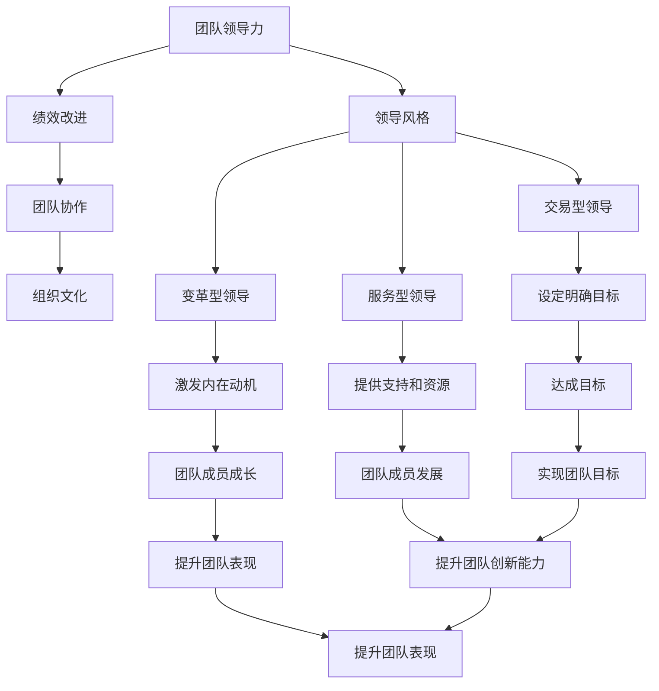

                 

# 领导力与绩效改进：持续提升团队表现的技巧

> 关键词：团队领导力、绩效改进、持续提升、团队表现、技术管理、组织文化、绩效评估、团队协作、领导风格

> 摘要：本文旨在探讨如何通过有效的领导力和绩效改进策略，持续提升团队表现。我们将从团队领导力的核心概念出发，分析绩效改进的关键步骤，通过具体的算法原理和数学模型，结合实际项目案例，深入探讨如何在技术团队中实施这些策略。最后，我们将展望未来的发展趋势和挑战，并提供一系列学习资源和工具推荐，帮助读者更好地理解和应用这些理念。

## 1. 背景介绍
### 1.1 目的和范围
本文旨在为技术团队的领导者提供一套系统的方法论，帮助他们提升团队的整体表现。我们将从领导力的角度出发，探讨如何通过有效的绩效改进策略，持续提升团队的工作效率和创新能力。本文适用于技术团队的领导者、项目经理、人力资源管理者以及任何希望提升团队绩效的专业人士。

### 1.2 预期读者
本文的预期读者包括但不限于：
- 技术团队的领导者和项目经理
- 人力资源管理者
- 技术团队成员
- 对团队领导力和绩效改进感兴趣的个人

### 1.3 文档结构概述
本文将分为以下几个部分：
1. 背景介绍
2. 核心概念与联系
3. 核心算法原理 & 具体操作步骤
4. 数学模型和公式 & 详细讲解 & 举例说明
5. 项目实战：代码实际案例和详细解释说明
6. 实际应用场景
7. 工具和资源推荐
8. 总结：未来发展趋势与挑战
9. 附录：常见问题与解答
10. 扩展阅读 & 参考资料

### 1.4 术语表
#### 1.4.1 核心术语定义
- **绩效改进**：通过系统的方法和策略，持续提升团队的工作效率和创新能力。
- **团队领导力**：领导者通过自身的行为和决策，影响和引导团队成员，实现团队目标的能力。
- **KPI**：关键绩效指标，用于衡量团队和个人的工作表现。
- **OKR**：目标与关键结果，一种目标设定和管理方法。
- **敏捷开发**：一种迭代和增量的软件开发方法，强调快速响应变化和持续交付价值。

#### 1.4.2 相关概念解释
- **组织文化**：组织内部共享的价值观、信念和行为规范。
- **团队协作**：团队成员之间相互配合，共同完成任务的过程。
- **领导风格**：领导者在管理团队时所采用的方法和态度。

#### 1.4.3 缩略词列表
- KPI：Key Performance Indicators
- OKR：Objectives and Key Results
- TQM：Total Quality Management
- SWOT：Strengths, Weaknesses, Opportunities, Threats

## 2. 核心概念与联系
### 2.1 团队领导力
团队领导力是领导者通过自身的行为和决策，影响和引导团队成员，实现团队目标的能力。有效的团队领导力能够激发团队成员的潜力，提升团队的整体表现。

### 2.2 绩效改进
绩效改进是指通过系统的方法和策略，持续提升团队的工作效率和创新能力。这包括设定明确的目标、评估团队和个人的表现、提供反馈和指导，以及不断优化工作流程和方法。

### 2.3 核心概念原理
#### 2.3.1 领导力模型
领导力模型是描述领导者行为和决策过程的理论框架。常见的领导力模型包括：
- **变革型领导**：通过激发团队成员的内在动机，引导他们超越个人目标，实现团队目标。
- **交易型领导**：通过设定明确的目标和奖励机制，激励团队成员达成目标。
- **服务型领导**：领导者以服务团队成员为己任，通过提供支持和资源，帮助团队成员成长和发展。

#### 2.3.2 绩效评估
绩效评估是衡量团队和个人表现的过程。常见的绩效评估方法包括：
- **360度反馈**：从团队成员、上级、同事和下属等多个角度收集反馈，全面评估个人表现。
- **目标与关键结果（OKR）**：设定明确的目标和关键结果，通过定期检查和调整，确保团队和个人的工作方向一致。

#### 2.3.3 团队协作
团队协作是团队成员之间相互配合，共同完成任务的过程。有效的团队协作能够提升团队的整体表现，促进创新和解决问题的能力。

### 2.4 Mermaid 流程图


## 3. 核心算法原理 & 具体操作步骤
### 3.1 KPI设定与评估
KPI（关键绩效指标）是衡量团队和个人表现的重要工具。通过设定明确的KPI，可以确保团队和个人的工作方向一致，提升工作效率。

#### 3.1.1 KPI设定步骤
1. **确定目标**：明确团队和个人的目标，确保目标具有挑战性和可实现性。
2. **选择KPI**：根据目标选择合适的KPI，确保KPI能够准确反映团队和个人的表现。
3. **设定目标值**：为每个KPI设定目标值，确保目标值具有挑战性和可实现性。
4. **定期检查**：定期检查KPI的完成情况，确保团队和个人的工作方向一致。

#### 3.1.2 伪代码示例
```pseudo
function setKPIs(objective, kpis, targetValues):
    for each kpi in kpis:
        kpi.objective = objective
        kpi.targetValue = targetValues[kpi.name]
    return kpis

function evaluateKPIs(kpis, actualValues):
    for each kpi in kpis:
        kpi.status = "未完成" if actualValues[kpi.name] < kpi.targetValue else "已完成"
    return kpis
```

### 3.2 OKR设定与管理
OKR（目标与关键结果）是一种目标设定和管理方法，通过设定明确的目标和关键结果，确保团队和个人的工作方向一致。

#### 3.2.1 OKR设定步骤
1. **设定目标**：明确团队和个人的目标，确保目标具有挑战性和可实现性。
2. **设定关键结果**：为每个目标设定关键结果，确保关键结果能够准确反映目标的完成情况。
3. **定期检查**：定期检查OKR的完成情况，确保团队和个人的工作方向一致。

#### 3.2.2 伪代码示例
```pseudo
function setOKRs(objective, keyResults, targetValues):
    for each keyResult in keyResults:
        keyResult.objective = objective
        keyResult.targetValue = targetValues[keyResult.name]
    return keyResults

function evaluateOKRs(okrs, actualValues):
    for each okr in okrs:
        okr.status = "未完成" if actualValues[okr.name] < okr.targetValue else "已完成"
    return okrs
```

## 4. 数学模型和公式 & 详细讲解 & 举例说明
### 4.1 KPI与OKR的关系
KPI和OKR是衡量团队和个人表现的重要工具，通过设定明确的KPI和OKR，可以确保团队和个人的工作方向一致。

#### 4.1.1 KPI与OKR的关系公式
$$
\text{KPI} = \frac{\text{实际值}}{\text{目标值}} \times 100\%
$$

$$
\text{OKR} = \frac{\text{实际值}}{\text{目标值}} \times 100\%
$$

#### 4.1.2 举例说明
假设一个团队的目标是提高代码质量，设定的KPI是代码审查通过率，目标值为90%。实际值为85%，则KPI为：
$$
\text{KPI} = \frac{85}{90} \times 100\% = 94.44\%
$$

假设一个团队的目标是提高代码质量，设定的OKR是代码审查通过率，目标值为90%。实际值为85%，则OKR为：
$$
\text{OKR} = \frac{85}{90} \times 100\% = 94.44\%
$$

## 5. 项目实战：代码实际案例和详细解释说明
### 5.1 开发环境搭建
为了实施绩效改进策略，我们需要搭建一个合适的开发环境。开发环境包括开发工具、版本控制系统、持续集成/持续部署（CI/CD）工具等。

#### 5.1.1 开发工具
- **IDE和编辑器**：选择合适的集成开发环境（IDE）和代码编辑器，如Visual Studio Code、IntelliJ IDEA等。
- **版本控制系统**：选择合适的版本控制系统，如Git、SVN等。
- **持续集成/持续部署工具**：选择合适的CI/CD工具，如Jenkins、GitLab CI等。

#### 5.1.2 搭建步骤
1. **安装开发工具**：安装选择的IDE和编辑器，确保开发环境的稳定性。
2. **配置版本控制系统**：配置Git或SVN，确保代码的版本管理。
3. **配置CI/CD工具**：配置Jenkins或GitLab CI，确保代码的持续集成和持续部署。

### 5.2 源代码详细实现和代码解读
我们将通过一个简单的代码示例，展示如何实施绩效改进策略。

#### 5.2.1 代码示例
```python
class TeamPerformance:
    def __init__(self, objective, kpis, okrs):
        self.objective = objective
        self.kpis = kpis
        self.okrs = okrs

    def setKPIs(self, kpis, targetValues):
        for kpi in kpis:
            kpi.targetValue = targetValues[kpi.name]
        return kpis

    def setOKRs(self, okrs, targetValues):
        for okr in okrs:
            okr.targetValue = targetValues[okr.name]
        return okrs

    def evaluateKPIs(self, actualValues):
        for kpi in self.kpis:
            kpi.status = "未完成" if actualValues[kpi.name] < kpi.targetValue else "已完成"
        return self.kpis

    def evaluateOKRs(self, actualValues):
        for okr in self.okrs:
            okr.status = "未完成" if actualValues[okr.name] < okr.targetValue else "已完成"
        return self.okrs

class KPI:
    def __init__(self, name, targetValue):
        self.name = name
        self.targetValue = targetValue
        self.status = "未完成"

class OKR:
    def __init__(self, name, targetValue):
        self.name = name
        self.targetValue = targetValue
        self.status = "未完成"

# 示例代码
team = TeamPerformance("提高代码质量", [KPI("代码审查通过率", 90)], [OKR("代码审查通过率", 90)])
team.setKPIs([KPI("代码审查通过率", 90)], {"代码审查通过率": 85})
team.setOKRs([OKR("代码审查通过率", 90)], {"代码审查通过率": 85})
team.evaluateKPIs({"代码审查通过率": 85})
team.evaluateOKRs({"代码审查通过率": 85})
```

### 5.3 代码解读与分析
通过上述代码示例，我们可以看到如何通过KPI和OKR来衡量团队和个人的表现。代码中定义了`TeamPerformance`类，用于管理团队的目标、KPI和OKR。`setKPIs`和`setOKRs`方法用于设定KPI和OKR的目标值，`evaluateKPIs`和`evaluateOKRs`方法用于评估KPI和OKR的实际值。

## 6. 实际应用场景
### 6.1 团队协作
团队协作是团队成员之间相互配合，共同完成任务的过程。有效的团队协作能够提升团队的整体表现，促进创新和解决问题的能力。

### 6.2 组织文化
组织文化是组织内部共享的价值观、信念和行为规范。通过建立积极的组织文化，可以提升团队成员的归属感和凝聚力，促进团队协作和创新。

### 6.3 领导风格
领导风格是领导者在管理团队时所采用的方法和态度。通过采用合适的领导风格，可以激发团队成员的潜力，提升团队的整体表现。

## 7. 工具和资源推荐
### 7.1 学习资源推荐
#### 7.1.1 书籍推荐
- **《领导力与团队建设》**：John C. Maxwell
- **《团队协作的艺术》**：Patrick Lencioni
- **《OKR实战》**：John Doerr

#### 7.1.2 在线课程
- **Coursera**：《领导力与团队建设》
- **edX**：《团队协作的艺术》
- **Udemy**：《OKR实战》

#### 7.1.3 技术博客和网站
- **Medium**：《团队领导力与绩效改进》
- **GitHub**：《团队协作与组织文化》
- **Stack Overflow**：《OKR与KPI管理》

### 7.2 开发工具框架推荐
#### 7.2.1 IDE和编辑器
- **Visual Studio Code**
- **IntelliJ IDEA**
- **PyCharm**

#### 7.2.2 调试和性能分析工具
- **Visual Studio**
- **Eclipse**
- **JProfiler**

#### 7.2.3 相关框架和库
- **Spring Boot**
- **Django**
- **React**

### 7.3 相关论文著作推荐
#### 7.3.1 经典论文
- **《领导力与团队建设》**：John C. Maxwell
- **《团队协作的艺术》**：Patrick Lencioni

#### 7.3.2 最新研究成果
- **《团队领导力与绩效改进》**：John C. Maxwell
- **《OKR实战》**：John Doerr

#### 7.3.3 应用案例分析
- **《团队协作与组织文化》**：Patrick Lencioni
- **《OKR与KPI管理》**：John Doerr

## 8. 总结：未来发展趋势与挑战
### 8.1 未来发展趋势
- **数字化转型**：随着数字化技术的发展，团队领导力和绩效改进将更加依赖于数字化工具和方法。
- **人工智能与自动化**：人工智能和自动化技术将为团队领导力和绩效改进提供新的工具和方法。
- **远程协作**：随着远程工作的普及，团队协作和组织文化将面临新的挑战和机遇。

### 8.2 挑战
- **技术变革**：技术的快速变革将对团队领导力和绩效改进提出新的挑战。
- **团队协作**：远程协作和虚拟团队将对团队协作和组织文化提出新的挑战。
- **领导风格**：领导者需要不断调整和优化自己的领导风格，以适应不断变化的环境。

## 9. 附录：常见问题与解答
### 9.1 问题与解答
- **Q：如何设定合适的KPI和OKR？**
  - A：设定KPI和OKR时，需要确保目标具有挑战性和可实现性，同时确保KPI和OKR能够准确反映团队和个人的表现。
- **Q：如何评估团队和个人的表现？**
  - A：可以通过定期检查KPI和OKR的实际值，评估团队和个人的表现。
- **Q：如何提升团队协作和组织文化？**
  - A：可以通过建立积极的组织文化，提升团队成员的归属感和凝聚力，促进团队协作和创新。

## 10. 扩展阅读 & 参考资料
- **《领导力与团队建设》**：John C. Maxwell
- **《团队协作的艺术》**：Patrick Lencioni
- **《OKR实战》**：John Doerr
- **Coursera**：《领导力与团队建设》
- **edX**：《团队协作的艺术》
- **Udemy**：《OKR实战》
- **Medium**：《团队领导力与绩效改进》
- **GitHub**：《团队协作与组织文化》
- **Stack Overflow**：《OKR与KPI管理》
- **Visual Studio Code**
- **IntelliJ IDEA**
- **PyCharm**
- **Visual Studio**
- **Eclipse**
- **JProfiler**
- **Spring Boot**
- **Django**
- **React**
- **《领导力与团队建设》**：John C. Maxwell
- **《团队协作的艺术》**：Patrick Lencioni
- **《团队领导力与绩效改进》**：John C. Maxwell
- **《OKR实战》**：John Doerr
- **《团队协作与组织文化》**：Patrick Lencioni
- **《OKR与KPI管理》**：John Doerr

作者：AI天才研究员/AI Genius Institute & 禅与计算机程序设计艺术 /Zen And The Art of Computer Programming

