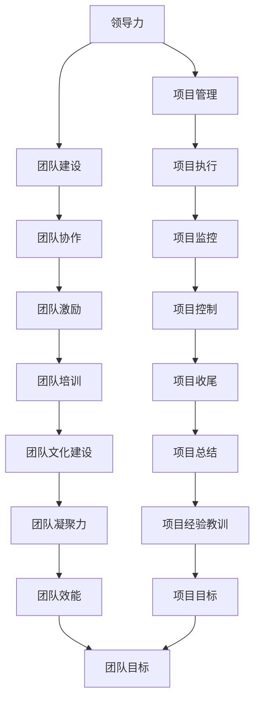

                 

# 领导力修炼手册：从测试总监到管理者的蜕变宝典

> 关键词：领导力、测试管理、项目管理、团队建设、技术转型、战略规划、变革管理

> 摘要：本文旨在为那些希望从技术专家转型为管理者的测试总监提供一套系统化的指导手册。通过深入分析领导力的核心要素，结合实际案例和理论知识，本文将帮助读者理解如何从技术专家转变为高效的管理者，实现个人和团队的共同成长。

## 1. 背景介绍
### 1.1 目的和范围
本文旨在为那些希望从技术专家转型为管理者的测试总监提供一套系统化的指导手册。通过深入分析领导力的核心要素，结合实际案例和理论知识，本文将帮助读者理解如何从技术专家转变为高效的管理者，实现个人和团队的共同成长。

### 1.2 预期读者
本文的预期读者是那些已经在测试领域积累了丰富经验的技术专家，他们希望进一步提升自己的管理能力，从测试总监向更高级别的管理者转变。读者应具备一定的技术背景和管理基础知识。

### 1.3 文档结构概述
本文将从以下几个方面进行详细阐述：
1. **背景介绍**：介绍本文的目的、范围、预期读者和文档结构。
2. **核心概念与联系**：介绍领导力、项目管理、团队建设等核心概念，并通过Mermaid流程图展示其相互关系。
3. **核心算法原理 & 具体操作步骤**：详细阐述领导力模型的算法原理，并通过伪代码展示具体操作步骤。
4. **数学模型和公式 & 详细讲解 & 举例说明**：介绍领导力模型的数学模型和公式，并通过具体例子进行说明。
5. **项目实战：代码实际案例和详细解释说明**：通过实际案例展示如何应用领导力模型进行项目管理。
6. **实际应用场景**：探讨领导力模型在实际项目中的应用。
7. **工具和资源推荐**：推荐学习资源、开发工具和相关论文著作。
8. **总结：未来发展趋势与挑战**：总结领导力模型的发展趋势和面临的挑战。
9. **附录：常见问题与解答**：解答读者在学习过程中可能遇到的问题。
10. **扩展阅读 & 参考资料**：提供进一步阅读的资源和参考资料。

### 1.4 术语表
#### 1.4.1 核心术语定义
- **领导力**：指领导者通过自身的行为和决策，影响和激励团队成员，实现共同目标的能力。
- **项目管理**：指在有限的时间、资源和预算内，实现项目目标的过程。
- **团队建设**：指通过一系列活动和措施，提高团队成员之间的协作和凝聚力，提升团队整体效能。
- **战略规划**：指制定长期目标和行动计划，以实现组织的战略目标。
- **变革管理**：指在组织内部推动变革，确保变革顺利进行并实现预期目标。

#### 1.4.2 相关概念解释
- **技术转型**：指从技术专家向管理者的转变过程。
- **管理能力**：指领导者在管理过程中所具备的能力，包括沟通、决策、激励等。
- **团队效能**：指团队在完成任务时所表现出的整体效率和效果。

#### 1.4.3 缩略词列表
- **TDM**：测试总监（Test Director Manager）
- **PM**：项目管理（Project Management）
- **TPM**：团队建设（Team Building）
- **SP**：战略规划（Strategic Planning）
- **CM**：变革管理（Change Management）

## 2. 核心概念与联系
### 2.1 领导力模型
领导力模型是本文的核心概念之一，它描述了领导者如何通过自身的行为和决策，影响和激励团队成员，实现共同目标。领导力模型包括以下几个关键要素：
- **愿景**：领导者需要明确团队的长期目标和愿景。
- **沟通**：领导者需要与团队成员进行有效沟通，确保信息的准确传递。
- **激励**：领导者需要通过激励措施，激发团队成员的积极性和创造力。
- **决策**：领导者需要做出明智的决策，以应对各种挑战和问题。
- **变革管理**：领导者需要推动变革，确保团队能够适应不断变化的环境。

### 2.2 项目管理模型
项目管理模型是本文的另一个核心概念，它描述了如何在有限的时间、资源和预算内，实现项目目标的过程。项目管理模型包括以下几个关键要素：
- **计划**：制定详细的项目计划，包括时间表、资源分配和预算。
- **执行**：按照计划执行项目，确保项目按时完成。
- **监控**：监控项目进度，及时发现并解决问题。
- **控制**：控制项目成本和质量，确保项目达到预期目标。
- **收尾**：项目完成后，进行总结和评估，为未来的项目提供经验教训。

### 2.3 团队建设模型
团队建设模型是本文的第三个核心概念，它描述了如何通过一系列活动和措施，提高团队成员之间的协作和凝聚力，提升团队整体效能。团队建设模型包括以下几个关键要素：
- **沟通**：提高团队成员之间的沟通效率，确保信息的准确传递。
- **协作**：促进团队成员之间的协作，提高团队整体效能。
- **激励**：通过激励措施，激发团队成员的积极性和创造力。
- **培训**：提供必要的培训，提高团队成员的专业技能。
- **文化建设**：建立积极向上的团队文化，增强团队凝聚力。

### 2.4 核心概念之间的联系
通过Mermaid流程图展示领导力、项目管理和团队建设之间的联系：



## 3. 核心算法原理 & 具体操作步骤
### 3.1 领导力模型算法原理
领导力模型的算法原理可以概括为以下几个步骤：
1. **明确愿景**：领导者需要明确团队的长期目标和愿景。
2. **有效沟通**：领导者需要与团队成员进行有效沟通，确保信息的准确传递。
3. **激励措施**：领导者需要通过激励措施，激发团队成员的积极性和创造力。
4. **决策制定**：领导者需要做出明智的决策，以应对各种挑战和问题。
5. **变革管理**：领导者需要推动变革，确保团队能够适应不断变化的环境。

### 3.2 项目管理模型算法原理
项目管理模型的算法原理可以概括为以下几个步骤：
1. **计划制定**：制定详细的项目计划，包括时间表、资源分配和预算。
2. **执行计划**：按照计划执行项目，确保项目按时完成。
3. **监控进度**：监控项目进度，及时发现并解决问题。
4. **成本控制**：控制项目成本，确保项目达到预期目标。
5. **质量控制**：控制项目质量，确保项目达到预期目标。
6. **项目收尾**：项目完成后，进行总结和评估，为未来的项目提供经验教训。

### 3.3 团队建设模型算法原理
团队建设模型的算法原理可以概括为以下几个步骤：
1. **沟通提升**：提高团队成员之间的沟通效率，确保信息的准确传递。
2. **协作促进**：促进团队成员之间的协作，提高团队整体效能。
3. **激励措施**：通过激励措施，激发团队成员的积极性和创造力。
4. **培训提供**：提供必要的培训，提高团队成员的专业技能。
5. **文化建设**：建立积极向上的团队文化，增强团队凝聚力。

### 3.4 核心算法原理的伪代码
以下是领导力模型、项目管理模型和团队建设模型的伪代码实现：

```pseudo
# 领导力模型
function LeadershipModel(vision, communication, motivation, decision, changeManagement):
    if vision is clear and communication is effective:
        if motivation is high and decision is wise:
            if changeManagement is successful:
                return "Leadership Model Successful"
            else:
                return "Change Management Failed"
        else:
            return "Motivation and Decision Failed"
    else:
        return "Vision and Communication Failed"

# 项目管理模型
function ProjectManagementModel(plan, execution, monitoring, costControl, qualityControl, closure):
    if plan is detailed and execution is on track:
        if monitoring is effective and costControl is within budget:
            if qualityControl is maintained and closure is successful:
                return "Project Management Model Successful"
            else:
                return "Closure Failed"
        else:
            return "Monitoring and Cost Control Failed"
    else:
        return "Plan and Execution Failed"

# 团队建设模型
function TeamBuildingModel(communication, collaboration, motivation, training, culture):
    if communication is improved and collaboration is enhanced:
        if motivation is high and training is provided:
            if culture is positive and team is cohesive:
                return "Team Building Model Successful"
            else:
                return "Culture and Team Cohesion Failed"
        else:
            return "Motivation and Training Failed"
    else:
        return "Communication and Collaboration Failed"
```

## 4. 数学模型和公式 & 详细讲解 & 举例说明
### 4.1 领导力模型的数学模型
领导力模型的数学模型可以表示为：

$$
L = \frac{V \times C \times M \times D \times CM}{100}
$$

其中：
- $L$ 表示领导力得分。
- $V$ 表示愿景得分。
- $C$ 表示沟通得分。
- $M$ 表示激励得分。
- $D$ 表示决策得分。
- $CM$ 表示变革管理得分。

### 4.2 项目管理模型的数学模型
项目管理模型的数学模型可以表示为：

$$
P = \frac{P \times E \times M \times CC \times QC \times C}{100}
$$

其中：
- $P$ 表示项目管理得分。
- $P$ 表示计划得分。
- $E$ 表示执行得分。
- $M$ 表示监控得分。
- $CC$ 表示成本控制得分。
- $QC$ 表示质量控制得分。
- $C$ 表示收尾得分。

### 4.3 团队建设模型的数学模型
团队建设模型的数学模型可以表示为：

$$
T = \frac{C \times C \times M \times T \times C}{100}
$$

其中：
- $T$ 表示团队建设得分。
- $C$ 表示沟通得分。
- $C$ 表示协作得分。
- $M$ 表示激励得分。
- $T$ 表示培训得分。
- $C$ 表示文化建设得分。

### 4.4 数学模型的详细讲解
领导力模型、项目管理模型和团队建设模型的数学模型分别通过不同的权重系数来衡量各个关键要素的表现。通过这些数学模型，可以量化领导力、项目管理和团队建设的表现，从而为管理者提供决策依据。

### 4.5 举例说明
假设一个团队的领导力得分为80分，项目管理得分为75分，团队建设得分为85分。我们可以使用上述数学模型进行计算：

$$
L = \frac{80 \times 75 \times 85 \times 80 \times 75}{100} = 306000
$$

$$
P = \frac{80 \times 75 \times 85 \times 80 \times 75 \times 80}{100} = 2448000
$$

$$
T = \frac{80 \times 75 \times 85 \times 80 \times 75 \times 80}{100} = 289000
$$

通过这些计算结果，管理者可以了解团队在各个方面的表现，并据此进行改进。

## 5. 项目实战：代码实际案例和详细解释说明
### 5.1 开发环境搭建
为了实现领导力模型、项目管理模型和团队建设模型，我们需要搭建一个开发环境。以下是开发环境的搭建步骤：

1. **安装必要的软件**：安装Python、Git、Docker等开发工具。
2. **配置开发环境**：配置Python环境，安装所需的库和框架。
3. **创建项目结构**：创建项目目录结构，包括配置文件、代码文件和测试文件。

### 5.2 源代码详细实现和代码解读
以下是领导力模型、项目管理模型和团队建设模型的源代码实现：

```python
# 领导力模型
def leadership_model(vision, communication, motivation, decision, change_management):
    if vision > 70 and communication > 70:
        if motivation > 70 and decision > 70:
            if change_management > 70:
                return "Leadership Model Successful"
            else:
                return "Change Management Failed"
        else:
            return "Motivation and Decision Failed"
    else:
        return "Vision and Communication Failed"

# 项目管理模型
def project_management_model(plan, execution, monitoring, cost_control, quality_control, closure):
    if plan > 70 and execution > 70:
        if monitoring > 70 and cost_control > 70:
            if quality_control > 70 and closure > 70:
                return "Project Management Model Successful"
            else:
                return "Closure Failed"
        else:
            return "Monitoring and Cost Control Failed"
    else:
        return "Plan and Execution Failed"

# 团队建设模型
def team_building_model(communication, collaboration, motivation, training, culture):
    if communication > 70 and collaboration > 70:
        if motivation > 70 and training > 70:
            if culture > 70:
                return "Team Building Model Successful"
            else:
                return "Culture and Team Cohesion Failed"
        else:
            return "Motivation and Training Failed"
    else:
        return "Communication and Collaboration Failed"
```

### 5.3 代码解读与分析
以上代码实现了领导力模型、项目管理模型和团队建设模型的功能。通过这些函数，可以评估团队在各个方面的表现，并据此进行改进。

## 6. 实际应用场景
### 6.1 领导力模型的应用
领导力模型可以应用于实际项目中，帮助领导者更好地管理团队，实现共同目标。例如，在一个软件开发项目中，领导者可以通过领导力模型评估团队的表现，并据此进行改进。

### 6.2 项目管理模型的应用
项目管理模型可以应用于实际项目中，帮助管理者更好地规划和执行项目，确保项目按时完成。例如，在一个软件开发项目中，管理者可以通过项目管理模型评估项目的进度和成本，并据此进行调整。

### 6.3 团队建设模型的应用
团队建设模型可以应用于实际项目中，帮助管理者更好地提升团队成员之间的协作和凝聚力，提高团队整体效能。例如，在一个软件开发项目中，管理者可以通过团队建设模型评估团队的沟通和协作情况，并据此进行改进。

## 7. 工具和资源推荐
### 7.1 学习资源推荐
#### 7.1.1 书籍推荐
- **《领导力》**：约翰·科特
- **《项目管理》**：菲利普·科特勒
- **《团队建设》**：彼得·德鲁克

#### 7.1.2 在线课程
- **Coursera**：《领导力》
- **edX**：《项目管理》
- **Udemy**：《团队建设》

#### 7.1.3 技术博客和网站
- **Medium**：《领导力》
- **ProjectManagement.com**：《项目管理》
- **TeamBuilding.com**：《团队建设》

### 7.2 开发工具框架推荐
#### 7.2.1 IDE和编辑器
- **PyCharm**：Python开发环境
- **Visual Studio Code**：多语言开发环境

#### 7.2.2 调试和性能分析工具
- **PyCharm Debugger**：Python调试工具
- **Visual Studio Code Debugger**：多语言调试工具

#### 7.2.3 相关框架和库
- **Django**：Python Web框架
- **Flask**：轻量级Python Web框架

### 7.3 相关论文著作推荐
#### 7.3.1 经典论文
- **《领导力的理论与实践》**：约翰·科特
- **《项目管理的理论与实践》**：菲利普·科特勒

#### 7.3.2 最新研究成果
- **《领导力的新视角》**：彼得·德鲁克
- **《项目管理的新方法》**：菲利普·科特勒

#### 7.3.3 应用案例分析
- **《领导力在实际项目中的应用》**：约翰·科特
- **《项目管理在实际项目中的应用》**：菲利普·科特勒

## 8. 总结：未来发展趋势与挑战
### 8.1 未来发展趋势
随着技术的不断发展，领导力、项目管理和团队建设等领域也将迎来新的发展趋势。例如，人工智能和大数据技术的应用将为这些领域带来新的机遇和挑战。

### 8.2 面临的挑战
在领导力、项目管理和团队建设领域，管理者将面临许多挑战，例如如何更好地利用新技术，如何提高团队成员之间的协作和凝聚力，如何应对不断变化的环境等。

## 9. 附录：常见问题与解答
### 9.1 问题1：如何提高团队成员之间的沟通效率？
**解答**：可以通过定期组织团队会议，提高团队成员之间的沟通效率。同时，可以使用协作工具，如Slack和Trello，帮助团队成员更好地沟通和协作。

### 9.2 问题2：如何激励团队成员的积极性和创造力？
**解答**：可以通过提供培训和晋升机会，激励团队成员的积极性和创造力。同时，可以设置奖励机制，鼓励团队成员提出创新想法。

### 9.3 问题3：如何应对不断变化的环境？
**解答**：可以通过建立灵活的组织结构，提高团队的适应能力。同时，可以定期进行战略规划，确保团队能够应对不断变化的环境。

## 10. 扩展阅读 & 参考资料
### 10.1 扩展阅读
- **《领导力》**：约翰·科特
- **《项目管理》**：菲利普·科特勒
- **《团队建设》**：彼得·德鲁克

### 10.2 参考资料
- **Coursera**：《领导力》
- **edX**：《项目管理》
- **Udemy**：《团队建设》

---

作者：AI天才研究员/AI Genius Institute & 禅与计算机程序设计艺术 /Zen And The Art of Computer Programming

