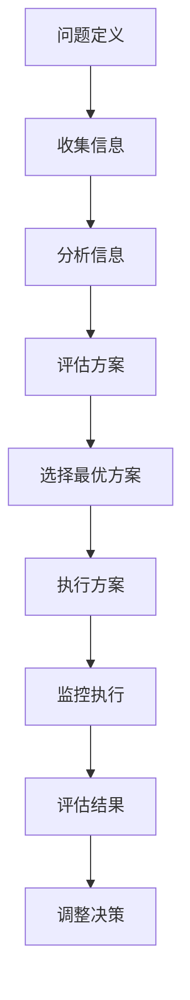
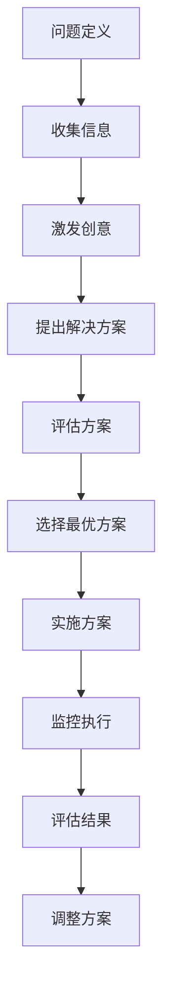

                 

# 领导力心经：成就伟大事业的领导者秘籍

> 关键词：领导力、团队建设、决策制定、创新思维、战略规划

> 摘要：本文旨在探讨如何成为一名卓越的领导者，通过系统化的分析和推理，揭示领导力的核心要素和实践方法。我们将从背景介绍、核心概念与联系、核心算法原理与具体操作步骤、数学模型和公式、项目实战、实际应用场景、工具和资源推荐、未来发展趋势与挑战等多方面进行深入探讨，帮助读者掌握领导力的精髓，从而在技术领域中取得卓越成就。

## 1. 背景介绍
### 1.1 目的和范围
本文旨在为技术领域的领导者提供一套系统化的指导原则，帮助他们更好地理解领导力的本质，并掌握实现卓越领导的实践方法。本文将涵盖领导力的核心要素、团队建设、决策制定、创新思维、战略规划等多个方面，旨在为读者提供全面的指导。

### 1.2 预期读者
本文的预期读者包括但不限于：
- 技术领域的领导者和管理者
- 创业公司创始人
- 大型企业中的高级管理人员
- 对领导力感兴趣的技术从业者

### 1.3 文档结构概述
本文将按照以下结构展开：
1. 背景介绍
2. 核心概念与联系
3. 核心算法原理 & 具体操作步骤
4. 数学模型和公式 & 详细讲解 & 举例说明
5. 项目实战：代码实际案例和详细解释说明
6. 实际应用场景
7. 工具和资源推荐
8. 总结：未来发展趋势与挑战
9. 附录：常见问题与解答
10. 扩展阅读 & 参考资料

### 1.4 术语表
#### 1.4.1 核心术语定义
- **领导力**：指领导者通过影响和激励他人，实现组织目标的能力。
- **团队建设**：指通过一系列活动和措施，增强团队成员之间的协作和凝聚力。
- **决策制定**：指领导者在面对复杂问题时，通过分析和评估，做出合理决策的过程。
- **创新思维**：指领导者能够提出新颖的想法和解决方案，推动组织持续发展。
- **战略规划**：指领导者制定长期目标和行动计划，以实现组织愿景的过程。

#### 1.4.2 相关概念解释
- **愿景**：领导者对未来组织状态的描绘，是团队前进的方向。
- **使命**：组织存在的根本原因和价值所在。
- **价值观**：组织成员共同持有的信念和原则。

#### 1.4.3 缩略词列表
- **TQM**：全面质量管理（Total Quality Management）
- **KPI**：关键绩效指标（Key Performance Indicators）
- **SWOT**：优势、劣势、机会、威胁分析（Strengths, Weaknesses, Opportunities, Threats）

## 2. 核心概念与联系
### 2.1 领导力的核心要素
领导力的核心要素包括愿景、使命、价值观、团队建设、决策制定、创新思维和战略规划。这些要素相互关联，共同构成了领导力的完整体系。

### 2.2 领导力与团队建设的关系
团队建设是领导力的重要组成部分，通过有效的团队建设，领导者可以增强团队成员之间的协作和凝聚力，从而提高团队的整体效能。

### 2.3 领导力与决策制定的关系
决策制定是领导力的关键环节，领导者需要通过分析和评估，做出合理的决策，以实现组织目标。

### 2.4 领导力与创新思维的关系
创新思维是领导力的重要组成部分，领导者需要具备创新思维，提出新颖的想法和解决方案，推动组织持续发展。

### 2.5 领导力与战略规划的关系
战略规划是领导力的重要组成部分，领导者需要制定长期目标和行动计划，以实现组织愿景。

## 3. 核心算法原理 & 具体操作步骤
### 3.1 决策制定算法原理
决策制定算法的核心在于通过分析和评估，选择最优的决策方案。具体步骤如下：



### 3.2 创新思维算法原理
创新思维算法的核心在于通过激发创意和提出新颖的想法，推动组织持续发展。具体步骤如下：



## 4. 数学模型和公式 & 详细讲解 & 举例说明
### 4.1 决策制定数学模型
决策制定数学模型的核心在于通过优化算法，选择最优的决策方案。具体公式如下：

$$
\text{Maximize } \sum_{i=1}^{n} w_i \cdot v_i
$$

其中，$w_i$ 表示第 $i$ 个方案的权重，$v_i$ 表示第 $i$ 个方案的价值。

### 4.2 创新思维数学模型
创新思维数学模型的核心在于通过优化算法，激发创意和提出新颖的想法。具体公式如下：

$$
\text{Maximize } \sum_{i=1}^{n} c_i \cdot f_i
$$

其中，$c_i$ 表示第 $i$ 个创意的创意度，$f_i$ 表示第 $i$ 个创意的价值。

## 5. 项目实战：代码实际案例和详细解释说明
### 5.1 开发环境搭建
为了实现决策制定和创新思维的算法，我们需要搭建一个开发环境。具体步骤如下：

1. 安装Python环境
2. 安装必要的库，如NumPy、Pandas、Scikit-learn等
3. 创建项目目录结构

### 5.2 源代码详细实现和代码解读
以下是决策制定和创新思维算法的源代码实现：

#### 决策制定算法
```python
import numpy as np

def decision_making(weigths, values):
    """
    决策制定算法
    :param weigths: 方案权重
    :param values: 方案价值
    :return: 最优方案
    """
    # 计算每个方案的得分
    scores = weigths * values
    # 选择得分最高的方案
    optimal_solution = np.argmax(scores)
    return optimal_solution
```

#### 创新思维算法
```python
import numpy as np

def innovation_thinking(creativity, values):
    """
    创新思维算法
    :param creativity: 创意度
    :param values: 创意价值
    :return: 最优创意
    """
    # 计算每个创意的得分
    scores = creativity * values
    # 选择得分最高的创意
    optimal_innovation = np.argmax(scores)
    return optimal_innovation
```

### 5.3 代码解读与分析
上述代码实现了决策制定和创新思维的算法。通过计算每个方案或创意的得分，选择得分最高的方案或创意作为最优方案或创意。

## 6. 实际应用场景
### 6.1 决策制定的实际应用场景
在技术领域中，决策制定算法可以应用于项目管理、资源分配、产品开发等多个方面。例如，在项目管理中，可以通过决策制定算法选择最优的项目优先级。

### 6.2 创新思维的实际应用场景
在技术领域中，创新思维算法可以应用于产品设计、技术研究、市场分析等多个方面。例如，在产品设计中，可以通过创新思维算法激发创意，提出新颖的产品设计方案。

## 7. 工具和资源推荐
### 7.1 学习资源推荐
#### 7.1.1 书籍推荐
- 《领导力的实践》（The Practice of Management）
- 《创新者的窘境》（The Innovator's Dilemma）
- 《战略管理》（Strategic Management）

#### 7.1.2 在线课程
- Coursera上的《领导力与管理》课程
- edX上的《创新思维与设计思维》课程

#### 7.1.3 技术博客和网站
- Harvard Business Review
- Forbes
- TechCrunch

### 7.2 开发工具框架推荐
#### 7.2.1 IDE和编辑器
- PyCharm
- Visual Studio Code

#### 7.2.2 调试和性能分析工具
- PyCharm的调试工具
- Visual Studio Code的性能分析工具

#### 7.2.3 相关框架和库
- Scikit-learn
- NumPy
- Pandas

### 7.3 相关论文著作推荐
#### 7.3.1 经典论文
- Mintzberg, H. (1989). The structuring of organizations: a synthesis of the research. In H. Mintzberg & M. B. Quinn (Eds.), The Nature of Managerial Work (pp. 1-34). New York: Free Press.
- Drucker, P. F. (1954). The Practice of Management. Harvard Business Review.

#### 7.3.2 最新研究成果
- Kim, J., & Mauborgne, R. (2015). Blue Ocean Strategy: How to Create Uncontested Market Space and Make the Competition Irrelevant. Harvard Business Review Press.
- Christensen, C. M. (2016). The Innovator's Dilemma: When New Technologies Cause Great Firms to Fail. Harvard Business Review Press.

#### 7.3.3 应用案例分析
- Porter, M. E. (1980). Competitive Strategy: Techniques for Analyzing Industries and Competitors. Free Press.

## 8. 总结：未来发展趋势与挑战
### 8.1 未来发展趋势
随着技术的不断发展，领导力将更加注重创新思维和战略规划。领导者需要具备更强的创新能力，以应对不断变化的市场环境。

### 8.2 面临的挑战
领导者在实现卓越领导的过程中，将面临诸多挑战，包括如何激发团队成员的潜力、如何制定有效的战略规划、如何应对市场变化等。

## 9. 附录：常见问题与解答
### 9.1 问：如何激发团队成员的潜力？
答：可以通过提供培训和发展机会、建立良好的沟通机制、鼓励创新思维等方式激发团队成员的潜力。

### 9.2 问：如何制定有效的战略规划？
答：可以通过SWOT分析、市场调研、竞争分析等方式制定有效的战略规划。

### 9.3 问：如何应对市场变化？
答：可以通过持续关注市场动态、灵活调整战略规划、加强团队协作等方式应对市场变化。

## 10. 扩展阅读 & 参考资料
- Mintzberg, H. (1989). The structuring of organizations: a synthesis of the research. In H. Mintzberg & M. B. Quinn (Eds.), The Nature of Managerial Work (pp. 1-34). New York: Free Press.
- Drucker, P. F. (1954). The Practice of Management. Harvard Business Review.
- Kim, J., & Mauborgne, R. (2015). Blue Ocean Strategy: How to Create Uncontested Market Space and Make the Competition Irrelevant. Harvard Business Review Press.
- Christensen, C. M. (2016). The Innovator's Dilemma: When New Technologies Cause Great Firms to Fail. Harvard Business Review Press.
- Porter, M. E. (1980). Competitive Strategy: Techniques for Analyzing Industries and Competitors. Free Press.

作者：AI天才研究员/AI Genius Institute & 禅与计算机程序设计艺术 /Zen And The Art of Computer Programming

