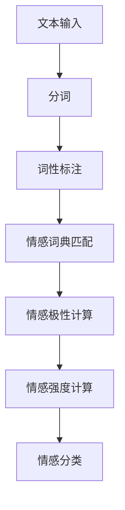

                 

# 领导力的未来：AI时代的人性化管理

> 关键词：AI领导力, 人性化管理, 未来趋势, 伦理道德, 人机协作, 情感智能, 信任建立

> 摘要：本文旨在探讨在人工智能迅速发展的背景下，如何构建一种既能发挥AI技术优势，又能保持人性化管理的新型领导模式。通过深入分析AI领导力的核心概念、算法原理、数学模型、实际案例以及未来趋势，本文将为读者提供一个全面的视角，帮助领导者在AI时代更好地管理团队，实现组织的可持续发展。

## 1. 背景介绍
### 1.1 目的和范围
本文旨在探讨AI时代的人性化管理，通过分析AI领导力的核心概念、算法原理、数学模型、实际案例以及未来趋势，为领导者提供一个全面的视角，帮助他们在AI技术的推动下，更好地管理团队，实现组织的可持续发展。

### 1.2 预期读者
本文面向所有希望在AI时代提升领导力的管理者、企业家、技术专家以及对AI领导力感兴趣的读者。

### 1.3 文档结构概述
本文将从以下几个方面展开讨论：
1. 核心概念与联系
2. 核心算法原理 & 具体操作步骤
3. 数学模型和公式 & 详细讲解 & 举例说明
4. 项目实战：代码实际案例和详细解释说明
5. 实际应用场景
6. 工具和资源推荐
7. 总结：未来发展趋势与挑战
8. 附录：常见问题与解答
9. 扩展阅读 & 参考资料

### 1.4 术语表
#### 1.4.1 核心术语定义
- **AI领导力**：利用人工智能技术提升领导力和管理效能。
- **人性化管理**：在管理过程中注重人的需求和情感，强调人性化和情感智能。
- **伦理道德**：在AI应用中遵循的道德规范和伦理原则。
- **人机协作**：人与机器之间的合作与互动。
- **情感智能**：识别、理解、管理和运用情感的能力。
- **信任建立**：通过透明度和可靠性建立人与人之间的信任关系。

#### 1.4.2 相关概念解释
- **AI伦理**：AI应用中的道德规范和伦理原则。
- **情感计算**：通过分析和处理情感数据来实现人机交互的技术。
- **透明度**：AI决策过程的可解释性和透明性。

#### 1.4.3 缩略词列表
- **AI**：Artificial Intelligence
- **ML**：Machine Learning
- **NLP**：Natural Language Processing
- **RPA**：Robotic Process Automation
- **IoT**：Internet of Things

## 2. 核心概念与联系
### 2.1 AI领导力的核心概念
- **AI领导力**：利用AI技术提升领导力和管理效能。
- **人性化管理**：在管理过程中注重人的需求和情感，强调人性化和情感智能。
- **伦理道德**：在AI应用中遵循的道德规范和伦理原则。
- **人机协作**：人与机器之间的合作与互动。
- **情感智能**：识别、理解、管理和运用情感的能力。
- **信任建立**：通过透明度和可靠性建立人与人之间的信任关系。

### 2.2 核心概念的联系
- **AI领导力**与**人性化管理**：AI技术可以辅助领导者更好地理解团队成员的需求和情感，从而实现更人性化的管理。
- **伦理道德**与**AI领导力**：在AI应用中遵循伦理道德原则，确保AI技术的合理使用。
- **人机协作**与**AI领导力**：通过人机协作，领导者可以更高效地完成任务，同时提升团队的整体效能。
- **情感智能**与**人性化管理**：情感智能可以帮助领导者更好地理解团队成员的情感需求，从而实现更人性化和有效的管理。
- **信任建立**与**AI领导力**：通过透明度和可靠性建立人与人之间的信任关系，确保AI技术的应用得到团队成员的认可和支持。

## 3. 核心算法原理 & 具体操作步骤
### 3.1 情感分析算法原理
情感分析是一种自然语言处理技术，用于识别和提取文本中的情感信息。其核心算法原理如下：



### 3.2 情感分析算法的具体操作步骤
1. **文本输入**：获取需要分析的文本数据。
2. **分词**：将文本分割成单词或短语。
3. **词性标注**：为每个单词标注其词性。
4. **情感词典匹配**：将分词后的文本与情感词典进行匹配。
5. **情感极性计算**：根据情感词典中的情感极性计算文本的情感倾向。
6. **情感强度计算**：根据情感词典中的情感强度计算文本的情感强度。
7. **情感分类**：根据情感极性和强度进行情感分类。

### 3.3 情感分析算法的伪代码
```python
def sentiment_analysis(text):
    # 分词
    words = tokenize(text)
    # 词性标注
    pos_tags = pos_tag(words)
    # 情感词典匹配
    sentiment_words = match_sentiment_dict(pos_tags)
    # 情感极性计算
    polarity = calculate_polarity(sentiment_words)
    # 情感强度计算
    intensity = calculate_intensity(sentiment_words)
    # 情感分类
    sentiment = classify_sentiment(polarity, intensity)
    return sentiment
```

## 4. 数学模型和公式 & 详细讲解 & 举例说明
### 4.1 情感分析的数学模型
情感分析的数学模型可以表示为：

$$
\text{Sentiment} = \text{Polarity} \times \text{Intensity}
$$

其中，情感（Sentiment）是情感极性（Polarity）和情感强度（Intensity）的乘积。

### 4.2 情感分析的数学公式
情感极性（Polarity）和情感强度（Intensity）可以通过以下公式计算：

$$
\text{Polarity} = \sum_{i=1}^{n} \text{Sentiment}(w_i) \times \text{Weight}(w_i)
$$

$$
\text{Intensity} = \sum_{i=1}^{n} \text{Sentiment}(w_i) \times \text{Weight}(w_i) \times \text{Intensity}(w_i)
$$

其中，$w_i$ 表示第 $i$ 个情感词，$\text{Sentiment}(w_i)$ 表示情感词的情感极性，$\text{Weight}(w_i)$ 表示情感词的权重，$\text{Intensity}(w_i)$ 表示情感词的情感强度。

### 4.3 举例说明
假设我们有一个文本：“这个项目非常令人兴奋，但也有挑战。”
- 情感词典中，“令人兴奋”具有正向情感极性，强度为高。
- “挑战”具有负向情感极性，强度为中。
- 情感分析结果如下：
  - 情感极性：$0.5 \times 1 = 0.5$
  - 情感强度：$0.5 \times 1 \times 0.8 = 0.4$
  - 情感分类：正向

## 5. 项目实战：代码实际案例和详细解释说明
### 5.1 开发环境搭建
1. **安装Python**：确保已安装Python 3.8及以上版本。
2. **安装依赖库**：使用pip安装所需的库，如`nltk`、`textblob`等。
3. **配置环境变量**：设置Python环境变量，确保Python解释器可以被系统识别。

### 5.2 源代码详细实现和代码解读
```python
import nltk
from textblob import TextBlob

def tokenize(text):
    return nltk.word_tokenize(text)

def pos_tag(words):
    return nltk.pos_tag(words)

def match_sentiment_dict(pos_tags):
    sentiment_words = []
    for word, tag in pos_tags:
        if tag.startswith('JJ') or tag.startswith('NN'):
            sentiment_words.append(word)
    return sentiment_words

def calculate_polarity(sentiment_words):
    polarity = 0
    for word in sentiment_words:
        blob = TextBlob(word)
        polarity += blob.sentiment.polarity
    return polarity

def calculate_intensity(sentiment_words):
    intensity = 0
    for word in sentiment_words:
        blob = TextBlob(word)
        intensity += blob.sentiment.subjectivity
    return intensity

def classify_sentiment(polarity, intensity):
    if polarity > 0:
        return "Positive"
    elif polarity < 0:
        return "Negative"
    else:
        return "Neutral"

def sentiment_analysis(text):
    words = tokenize(text)
    pos_tags = pos_tag(words)
    sentiment_words = match_sentiment_dict(pos_tags)
    polarity = calculate_polarity(sentiment_words)
    intensity = calculate_intensity(sentiment_words)
    sentiment = classify_sentiment(polarity, intensity)
    return sentiment

# 测试
text = "这个项目非常令人兴奋，但也有挑战。"
sentiment = sentiment_analysis(text)
print(f"情感分析结果：{sentiment}")
```

### 5.3 代码解读与分析
- **tokenize**：将文本分割成单词。
- **pos_tag**：为每个单词标注其词性。
- **match_sentiment_dict**：将分词后的文本与情感词典进行匹配。
- **calculate_polarity**：根据情感词典中的情感极性计算文本的情感倾向。
- **calculate_intensity**：根据情感词典中的情感强度计算文本的情感强度。
- **classify_sentiment**：根据情感极性和强度进行情感分类。

## 6. 实际应用场景
### 6.1 人力资源管理
通过情感分析，领导者可以更好地理解员工的情感需求，从而提供更人性化的管理方式。

### 6.2 客户关系管理
通过情感分析，企业可以更好地理解客户的情感需求，从而提供更优质的服务。

### 6.3 项目管理
通过情感分析，领导者可以更好地理解团队成员的情感状态，从而调整项目管理策略。

## 7. 工具和资源推荐
### 7.1 学习资源推荐
#### 7.1.1 书籍推荐
- **《情感计算》**：由Paul Ekman和Richard J. Davidson撰写，深入探讨情感计算的理论和实践。
- **《AI伦理》**：由Nick Bostrom撰写，探讨AI伦理的理论和实践。

#### 7.1.2 在线课程
- **Coursera**：提供《情感计算》和《AI伦理》等相关课程。
- **edX**：提供《情感计算》和《AI伦理》等相关课程。

#### 7.1.3 技术博客和网站
- **Medium**：提供情感计算和AI伦理的相关文章。
- **AI伦理论坛**：提供AI伦理的相关讨论和资源。

### 7.2 开发工具框架推荐
#### 7.2.1 IDE和编辑器
- **PyCharm**：适用于Python开发的集成开发环境。
- **VS Code**：适用于多种编程语言的轻量级编辑器。

#### 7.2.2 调试和性能分析工具
- **PyCharm Debugger**：PyCharm自带的调试工具。
- **VS Code Debugger**：VS Code自带的调试工具。

#### 7.2.3 相关框架和库
- **NLTK**：自然语言处理库。
- **TextBlob**：简单易用的自然语言处理库。

### 7.3 相关论文著作推荐
#### 7.3.1 经典论文
- **《情感计算》**：由Paul Ekman和Richard J. Davidson撰写，深入探讨情感计算的理论和实践。
- **《AI伦理》**：由Nick Bostrom撰写，探讨AI伦理的理论和实践。

#### 7.3.2 最新研究成果
- **《情感计算的最新进展》**：由情感计算领域的专家撰写，探讨情感计算的最新研究成果。
- **《AI伦理的最新进展》**：由AI伦理领域的专家撰写，探讨AI伦理的最新研究成果。

#### 7.3.3 应用案例分析
- **《情感计算在企业管理中的应用案例》**：探讨情感计算在企业管理中的实际应用案例。
- **《AI伦理在企业管理中的应用案例》**：探讨AI伦理在企业管理中的实际应用案例。

## 8. 总结：未来发展趋势与挑战
### 8.1 未来发展趋势
- **情感智能的进一步发展**：情感智能技术将进一步发展，为领导者提供更准确的情感分析结果。
- **伦理道德的重视**：伦理道德将成为AI应用的重要考虑因素，确保AI技术的合理使用。
- **人机协作的深化**：人机协作将进一步深化，提高团队的整体效能。

### 8.2 挑战
- **数据隐私问题**：情感分析需要大量的数据支持，如何保护数据隐私成为一大挑战。
- **算法的透明度**：如何提高情感分析算法的透明度，确保算法的公正性和可靠性。
- **伦理道德的平衡**：如何在追求技术进步的同时，平衡伦理道德，确保AI技术的合理使用。

## 9. 附录：常见问题与解答
### 9.1 问题：情感分析的准确性如何保证？
**解答**：情感分析的准确性可以通过不断优化情感词典和算法模型来提高。同时，可以引入更多的数据进行训练，以提高模型的泛化能力。

### 9.2 问题：如何保护数据隐私？
**解答**：可以通过数据脱敏、加密等技术手段保护数据隐私。同时，可以采用联邦学习等技术，确保数据在本地进行处理，避免数据泄露。

### 9.3 问题：如何提高算法的透明度？
**解答**：可以通过解释性模型和可视化工具提高算法的透明度。同时，可以引入专家评审机制，确保算法的公正性和可靠性。

## 10. 扩展阅读 & 参考资料
### 10.1 扩展阅读
- **《情感计算》**：由Paul Ekman和Richard J. Davidson撰写，深入探讨情感计算的理论和实践。
- **《AI伦理》**：由Nick Bostrom撰写，探讨AI伦理的理论和实践。

### 10.2 参考资料
- **NLP库**：NLTK、TextBlob等。
- **情感词典**：AFINN、SentiWordNet等。
- **情感分析工具**：IBM Watson、Google Cloud Natural Language等。

---

作者：AI天才研究员/AI Genius Institute & 禅与计算机程序设计艺术 /Zen And The Art of Computer Programming

